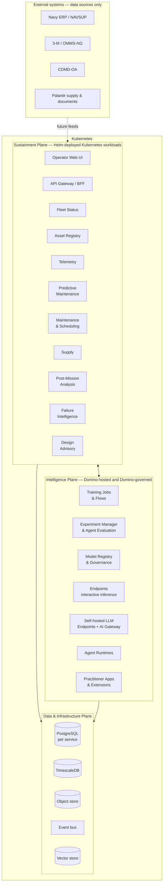
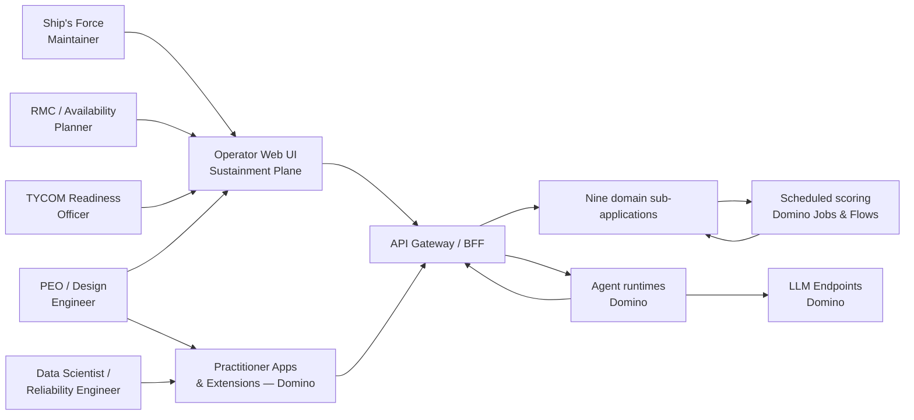
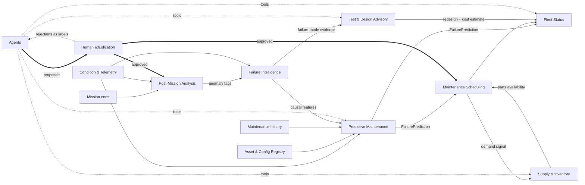

# Phase 1 — High-Level System Architecture

| | |
|---|---|
| **Status** | Approved at rev 3. Rev 4 is a non-structural amendment elevating an existing property |
| **Scope** | Top-level architecture. Sub-application internals are Phase 2; detailed per-sub-app design is Phase 3 |
| **Working name** | FATHOM — Fleet Asset Tracking, Health & Operational Maintenance |
| **Companion document** | [02 — Domino Platform Assessment](02-domino-platform-assessment.md), which supplies the evidence for every platform-boundary decision made here |
| **Classification** | Internal. Cites unreleased Domino roadmap material |

## Revision history

| Rev | Change |
|---|---|
| 1 | Initial decomposition, shared kernel, tiered modeling contract |
| 2 | Domino repositioned from external system to platform substrate; Kubernetes-native microservices; agentic layer added |
| 3 | Platform boundaries re-derived from primary-source research into Domino capability (see companion document). Three material corrections: the operator-facing user interface moves to the Sustainment Plane; inference becomes batch-first rather than endpoint-first; the afloat/edge off-ramp is redesigned around model export rather than a Nexus data plane |
| 4 | MCP tool-surface readiness elevated to a first-class architectural property (new §8.0), with the dual-payoff clause added to principle 1 (§2). No structural change: the property was already present but understated as a single sentence. The one-to-many manifest model it introduces necessitates the two-level eligibility-and-selection correction in document 03 §10 |

---

## 0. Glossary

### Terms introduced by this architecture

| Term | Meaning |
|---|---|
| **PdM** — Predictive Maintenance | The sub-application that predicts component failure. Also the standard industry term for the discipline |
| **PMA** — Post-Mission Analysis | The sub-application and workflow in which a human reviews a completed mission and tags anomalous behavior |
| **Failure Intelligence** | The causal-analysis sub-application. Determines *why* components failed, as distinct from PdM predicting *when* they will |
| **Proposal** | Any agent output that would alter domain state. Requires human adjudication before execution (§8.4) |
| **Tier 0–3** | The complexity level of a failure model, assigned by component criticality (§7) |
| **Plane** | One of three deployment tiers: Intelligence, Sustainment, or Data & Infrastructure (§3) |
| **Sustainment Plane** | The domain microservices, their datastores, and the operator-facing user interface. Deployed by Helm as ordinary Kubernetes workloads |
| **Intelligence Plane** | Model training, registry, governance, inference, agents, and practitioner-facing analytical applications. Hosted by Domino |

### Navy and Department of Defense

| Acronym | Meaning |
|---|---|
| **APL / AEL** | Allowance Parts List / Allowance Equipage List — authorized parts and equipage for an installed system |
| **CASREP** | Casualty Report — formal report of equipment failure degrading mission capability. Categories 2–4 by severity |
| **CBM+** | Condition-Based Maintenance Plus — DoD policy favoring condition-driven over calendar-driven maintenance |
| **CDMD-OA** | Configuration Data Managers Database–Open Architecture — Navy configuration system of record |
| **COSAL** | Coordinated Shipboard Allowance List — authorized onboard spares and equipage load |
| **DDIL** | Denied, Degraded, Intermittent, or Limited-bandwidth — the connectivity condition afloat and forward-deployed |
| **DSRA / EDSRA** | Docking / Extended Docking Selected Restricted Availability — scheduled depot maintenance periods |
| **EIC** | Equipment Identification Code — identifies a specific piece of installed equipment |
| **ESWBS** | Expanded Ship Work Breakdown Structure — hierarchical decomposition of ship systems |
| **HM&E** | Hull, Mechanical & Electrical — the non-combat-systems engineering plant |
| **ICAS** | Integrated Condition Assessment System — existing Navy shipboard condition monitoring |
| **IETM** | Interactive Electronic Technical Manual — the digital technical manual used by maintainers |
| **IL4 / IL5 / IL6** | DoD Impact Levels — cloud security categorizations governing where data may be hosted |
| **NIIN / NSN** | National Item Identification Number / National Stock Number — the part identifier |
| **OFRP** | Optimized Fleet Response Plan — the Navy deployment, maintenance, and training cycle |
| **PEO** | Program Executive Office — holds acquisition and design authority for a platform |
| **PMS** | Planned Maintenance System — the scheduled preventive maintenance regime under 3-M |
| **RMC** | Regional Maintenance Center — executes intermediate and depot-level maintenance |
| **RUL** | Remaining Useful Life — time or usage remaining before component failure |
| **TYCOM / ISIC** | Type Commander / Immediate Superior In Command — the operational chain above a hull |
| **UIC** | Unit Identification Code — identifies a Navy command or unit |
| **3-M** | Maintenance and Material Management — the Navy maintenance data and documentation system |

### Technology

| Acronym | Meaning |
|---|---|
| **ABAC** | Attribute-Based Access Control — authorization derived from user and resource attributes rather than static roles |
| **BFF** | Backend For Frontend — an API layer shaped to a specific client's view requirements |
| **HPA / KEDA** | Horizontal Pod Autoscaler / Kubernetes Event-Driven Autoscaling |
| **MCP** | Model Context Protocol — a standard for exposing tools to language models |
| **OIDC** | OpenID Connect — identity and authentication protocol |
| **PAT** | Personal Access Token — long-lived bearer credential for programmatic API access |
| **SPA** | Single-Page Application — a browser application served as static assets, e.g. compiled React |
| **UQ** | Uncertainty Quantification — reporting confidence bounds rather than point estimates |

---

## 1. Framing decisions

| Decision | Selection | Architectural consequence |
|---|---|---|
| Deployment target | Cloud-only for the demonstration | No edge tier is constructed in this phase. The off-ramp seams in §12 are nonetheless treated as build-now constraints |
| External systems (NAVSUP, Navy ERP, 3-M, CDMD-OA, Palantir) | All domain data owned internally for the demonstration | Modularity is enforced at the **sub-application boundary** rather than through per-table adapters. An entire sub-application can be replaced by a partner system |
| Platform substrate | **Domino Data Lab on Kubernetes** | Domino is the foundational layer for models, agents, and practitioner-facing analytics. Boundaries are set by documented platform capability (§3, companion document) |
| Runtime topology | **Kubernetes-native microservices**, Helm-deployed | No Compose-to-Kubernetes migration is incurred later |
| Intelligence layer | Models and agents, both Domino-hosted and Domino-governed | The agentic layer is a plane, not a feature (§8) |
| Fleet domain | Navy multi-domain: surface, subsurface, unmanned | The canonical model must span hulls, boats, and unmanned vehicles with substantially different sensor density and mission cadence |

---

## 2. Architectural principles

1. **A sub-application is a discipline, deployed independently, owning its own REST API and its own database.** No cross-service database access. The public contract is the REST API plus published events. This is the mechanism by which a partner system can assume ownership of an entire discipline, and on Kubernetes it is enforceable through NetworkPolicy rather than merely agreed (§11). The decomposition carries a dual payoff: the same properties that make a discipline substitutable — a bounded scope, a coherent vocabulary, and an explicit contract — make it correctly shaped as a language-model tool surface (§8).
2. **One shared kernel, deliberately small** (§6). An expansive shared kernel is the mechanism by which modular systems revert to monoliths.
3. **Uniform output contracts across heterogeneous internals** (§7). Consumers of a prediction must not be able to determine whether it originated from a Weibull fit or a physics-informed ensemble.
4. **Events for propagation, REST for queries.** The event log additionally serves as the store-and-forward substrate for the afloat off-ramp.
5. **No runtime dependency on public-internet services.** Every dependency must be vendorable into a private registry. This constraint is inexpensive to honor at design time and expensive to retrofit. It applies to language models as well as packages (§8.6), and it extends to a prohibition on installing dependencies at container start (§12).
6. **Human-in-the-loop workflows are first-class.** Anomaly tagging, prediction adjudication, and redesign triage each carry their own data model and provenance.
7. **Agents propose, humans approve, systems execute.** No agent alters domain state directly. Every state-changing agent output is a `Proposal` subject to human adjudication (§8.4). This constraint is prerequisite to accreditation and to operator trust.
8. **Every generated assertion is traceable to source records.** Predictions cite features and model versions; agent responses cite the records and documents on which they rely. Output that cannot be cited is treated as a defect.
9. **Platform boundaries follow documented capability, not aspiration.** Each allocation of a component to a plane in §3 rests on a cited, verified platform capability. Where a required capability is unshipped, the architecture routes around it and the gap is recorded as a platform request (companion document, §5).

---

## 3. Three planes on one Kubernetes substrate

Domino is not a peer system alongside this application; it is the substrate beneath a defined portion of it. The allocation below is derived from primary-source research into current Domino capability, documented in the companion assessment.



### Plane responsibilities

| Plane | Contents | Deployment | Rationale |
|---|---|---|---|
| **Intelligence** | Training jobs and pipelines, experiment tracking, model registry, governance gates, interactive inference endpoints, self-hosted language models, agent runtimes, practitioner-facing analytical applications and Extensions | Domino | These workloads require reproducibility, versioning, GPU scheduling, evaluation tooling, and governed publication. Domino is purpose-built for them and provides materially better outcomes than a bespoke implementation |
| **Sustainment** | Nine domain sub-applications, platform services, API gateway, and the operator-facing web interface | Helm | Stateful, transactional, event-driven, continuously available workloads requiring service-to-service networking, per-service databases, custom ingress, and fleet-scale unauthenticated-to-authenticated request volumes. These are ordinary Kubernetes workloads and are outside Domino's documented hosting surface |
| **Data & Infrastructure** | PostgreSQL, TimescaleDB, object storage, event bus, vector store | Operators plus Helm | Shared substrate consumed by both planes above |

### Basis for the boundary

The allocation is not a stylistic preference. Domino's own product documentation states that Apps "are not intended for persistent workflows or large-scale back-end processing" and directs persistence to external databases. Domino's installer requires exclusive ownership of its namespaces; a Domino-deployed Istio is documented as "for Domino use only"; Kubernetes service-discovery environment variables are explicitly disabled in the compute namespace; and no customer-facing event bus, managed production database, multi-container workload, or declarative multi-service deployment mechanism exists in the shipped product. Full citations, including internal engineering positions and the specific platform changes that would move this boundary, appear in the companion assessment.

The two planes occupy the same Kubernetes cluster in separate namespaces. The system therefore runs on Domino infrastructure in its entirety while confining Domino-managed workloads to those Domino is designed to manage.

### Three corrections introduced in rev 3

**Correction 1 — the operator-facing user interface moves to the Sustainment Plane.** Rev 2 proposed publishing the primary web interface as a Domino App. Three findings reverse that decision:

- **Licensing at fleet scale.** Domino is removing support for anonymous application access, and the intended direction is that every application viewer holds a licensed Domino account. A maintainer-facing interface intended for ships' force across a fleet implies user counts inconsistent with that model.
- **Serving constraints.** Domino Apps are served through a rewriting reverse proxy at a URL sub-path, are rendered in an iframe by default, require the base path be read at runtime from an environment variable rather than baked at build time, and have documented cases of sub-path asset requests failing for stock single-page-application builds. Server-side-rendered frameworks are unsupported.
- **Availability.** Application pods are restarted by platform maintenance and evicted by node consolidation. The relevant service-level agreement is 99%, and no serving-path objective exists for the inference path.

Practitioner-facing surfaces — model exploration, evaluation dashboards, causal-analysis tooling, redesign case review by engineering staff — remain in Domino, where the audience already holds accounts and the governance integration is valuable. Domino Extensions are the appropriate mechanism for surfacing those views inside the Domino interface.

**Correction 2 — inference becomes batch-first.** Rev 2 assumed Domino Endpoints as the principal inference vehicle. Endpoints have no horizontal autoscaling, a fixed payload ceiling, a practical request timeout near sixty seconds, no cancellation of timed-out requests, and no serving-path service-level objective. Fleet-wide scoring is therefore executed as scheduled Domino Jobs and Flows writing predictions into the PdM sub-application's datastore, which is both a stronger fit for Domino's strengths and a better fit for the problem: fleet risk does not change second to second. Endpoints are reserved for genuinely interactive inference, principally tier-3 what-if analysis. Telemetry ingest never traverses Domino.

**Correction 3 — the afloat off-ramp is redesigned.** Rev 2 implied Domino Nexus could provide a disconnected afloat data plane. It cannot: a Nexus data plane requires continuous control-plane connectivity over persistent messaging, and `Disconnected` is documented as an error state warranting vendor support rather than an operating mode. The redesigned approach appears in §12 and rests on model artifact export, which is a supported pattern with Navy precedent.

---

## 4. System context



External systems are data sources only. Domino occupies the Intelligence Plane beneath the application rather than a position beside it.

---

## 5. Sub-application decomposition

Nine domain sub-applications. Each constitutes a Phase 2 design target.

| # | Sub-application | Owns | Anticipated long-term owner |
|---|---|---|---|
| 1 | **Fleet Status & Readiness** | Readiness scoring, fleet-to-hull-to-system rollups, CASREP risk surfacing | Program |
| 2 | **Asset & Configuration Registry** | Classes, hulls, boats and vehicles, ESWBS hierarchy, EIC, APL/AEL, NIIN catalog, as-maintained configuration, usage counters | Program, with eventual federation to CDMD-OA |
| 3 | **Condition & Telemetry** | Sensor and ICAS-style ingest, health indicators, usage counters, mission records, time-series storage | Program |
| 4 | **Predictive Maintenance (PdM)** | Criticality tiering, tiered failure models, RUL, prediction lifecycle | Program — core |
| 5 | **Maintenance Execution & Scheduling** | Work candidates, PMS periodicity, deferred actions, availability work-package planning, schedule optimization | Program, with eventual federation to 3-M / OMMS-NG |
| 6 | **Supply Chain & Inventory** | Onboard and ashore stock, COSAL/APL allowances, requisitions, reservations, purchase orders, in-transit visibility, document status | Anticipated partner (e.g. Palantir) |
| 7 | **Post-Mission Analysis (PMA)** | Post-underway and post-sortie review, human anomaly tagging, label store with provenance | Program — core |
| 8 | **Failure Intelligence (Causal)** | Causal discovery from tags and mission data, failure-mode attribution, causal features published to PdM | Program — core |
| 9 | **System Test & Design Advisory** | Test and qualification data, failure-mode dossiers, redesign candidates, dependency impact, cost estimates | Program — core |

### Platform layer — Sustainment Plane, cross-cutting

- **API Gateway / BFF** — single ingress for the operator interface and for agent tool calls; view-model shaping
- **Identity & Authorization** — OIDC, CAC/PIV-ready, ABAC incorporating classification and need-to-know attributes. Federated with Domino's Keycloak so that agent activity carries the requesting user's authority rather than a service account's (§8.5)
- **Reference Data** — enumerations, ESWBS and EIC code sets, unit hierarchy; distributed as a versioned schema package
- **Event Bus** — Kafka-API broker, with a transactional outbox in every producing service
- **Knowledge & Retrieval** — chunking, embedding, and retrieval across technical manuals and IETMs, 3-M maintenance narratives, CASREP text, test reports, and engineering change documents. Provides agent grounding (§8.3)
- **Audit & Provenance** — immutable lineage for every prediction, tag, agent proposal, and recommendation
- **Sync Gateway** — inert in the demonstration; the seam for afloat and forward-deployed operation (§12)

---

## 6. The shared kernel

The sole vocabulary shared across sub-applications. Distributed as a versioned package (`packages/canonical-schemas`) and served read-only by the Asset & Configuration Registry.

```
Fleet
 └── TYCOM / ISIC
      └── Class            (DDG-51 Flt IIA, VIRGINIA Blk IV, MQ-25, LDUUV)
           └── Asset       hull number / boat / tail / vehicle ID, UIC,
                           domain = surface | subsurface | unmanned
                └── System         ESWBS-aligned (e.g. 233 propulsion, 300 electrical)
                     └── Equipment EIC, nomenclature, criticality class
                          └── Part NIIN / NSN, APL reference, position and location
```

Three cross-cutting concepts complete the kernel:

- **UsageCounter** — steaming hours, engine operating hours, sortie hours, cycles, dives. Domain-specific units under a common shape.
- **MissionEvent** — underway period, patrol, or sortie. The unit of post-mission analysis.
- **ConfigurationBaseline** — as-designed against as-maintained, effective-dated. Predictions carry no meaning absent knowledge of what is actually installed.

All other entities — work orders, requisitions, predictions, anomaly tags, agent proposals — belong to exactly one sub-application and are reachable only through that sub-application's API.

---

## 7. The tiered modeling contract

The program requirement is that critical NIINs receive proportionally complex modeling while random-failure NIINs rely on historical rates. This is achievable only if tier selection is data-driven policy and output shape is tier-invariant.

### Tier assignment

The PdM sub-application computes a criticality score from the mission-criticality of the parent equipment, CASREP history, consequence of failure, sensor availability, and fleet-wide population of the NIIN.

| Tier | Population | Method | Data required | Execution vehicle |
|---|---|---|---|---|
| 0 | Long tail; low criticality; random failure | Fleet historical failure rate; Weibull and MTBF fits | Maintenance history | Scheduled Domino Job |
| 1 | Moderate criticality; usage-correlated | Survival models with usage and environmental covariates | Plus usage counters | Scheduled Domino Job |
| 2 | High criticality; instrumented | Degradation trending and anomaly detection yielding RUL | Plus condition and sensor data | Scheduled Domino Flow; GPU hardware tier where warranted |
| 3 | Mission-critical | Hybrid physics-informed models with causal features, ensembled, with uncertainty quantification | Plus causal findings from Failure Intelligence | Scheduled Flow for fleet scoring; dedicated Endpoint for interactive what-if analysis |

Tier additionally sets governance weight. Promotion of a tier-3 model warrants review gates; promotion of a tier-0 model does not.

All tiers write predictions into the PdM datastore on the Sustainment Plane. Consuming sub-applications read predictions from PdM, never from Domino. This keeps the inference path off the request path of the operator interface and confines Domino's serving constraints to a batch context where they are immaterial.

### Tier-invariant output

```
FailurePrediction {
  asset_id, eic, niin, position
  horizon_days
  p_failure            # calibrated probability of failure within horizon
  rul                  # distribution, not a point estimate
  confidence           # comparable across tiers
  tier                 # 0..3, exposed for transparency only
  drivers[]            # ranked contributing factors; may be empty at tier 0
  model_version        # resolvable in the Domino model registry
  computed_at
}
```

Fleet Status, Scheduling, Supply, and every agent consume this single shape. A NIIN promoted from tier 0 to tier 2 following sensor installation produces no downstream change. Consumers must not branch on `tier`.

---

## 8. The agentic layer

Agent runtimes are hosted and governed in Domino's Intelligence Plane.

### 8.0 Sub-applications are tool surfaces by construction

The decomposition in §5 was adopted to permit a partner to assume an entire discipline. It produces a second payoff of equal value: each sub-application is a bounded discipline with a coherent vocabulary and a published contract, which is precisely the shape a language-model tool surface requires. No additional data plane, adapter layer, or agent-specific API is needed — the sub-application APIs *are* the tool surface.

The granularity is correct for a non-obvious reason. Tool surfaces fail in two directions. A monolithic service exposes either one enormous undifferentiated surface — too many operations, ambiguous tool selection, and measurably degraded agent performance — or an arbitrary internal carve-up whose boundaries correspond to nothing semantic. Nine discipline-bounded services with published contracts land on the granularity that tool selection requires, without anyone having designed for it.

The relationship between sub-application and tool surface is **one-to-many rather than one-to-one**, and that is where the value concentrates. A single sub-application backs several tool manifests, each scoped to a task or persona rather than mirroring the API's resource structure. Predictive Maintenance alone plausibly backs three: fleet-risk triage, which is broad, ranked, and read-heavy; single-equipment deep dive, which is narrow and provenance-rich; and what-if scenario analysis, which is interactive and tier-3 bound. One API, one contract, three manifests differing in operation subset, descriptions, and parameter defaults.

This matters because tool descriptions occupy prompt space. A manifest tuned to a task outperforms a generic one, and the one-to-many relationship means agent tuning never requires an API change. That decoupling is the substantive benefit.

Because manifests are generated from contracts rather than from implementations, **substitution-safety and tool-safety are the same property**. A conformant partner implementation preserves every manifest written against the discipline it assumes: if Palantir assumes Supply, every agent continues to function, because the manifest is unchanged because the contract is unchanged. The conformance suite certifying the substitution simultaneously certifies the tool surface.

A consequence worth stating explicitly: **third parties can develop tools against these sub-applications without program involvement.** A partner, another program, or a customer's own agents can build against the published OpenAPI contracts. Given that document 02 establishes MCP is not a Domino capability and the program therefore hosts its own tool servers on the Sustainment Plane, this readiness is program intellectual property rather than platform-provided function.

The manifest model, its versioning, and its conformance requirements are specified in document 03 §10.

### 8.1 Agent inventory

| Agent | Primary user | Function |
|---|---|---|
| **Maintainer Copilot** | Ship's force | Answers equipment-status questions with grounded citations to prediction drivers, maintenance history, and the applicable technical-manual procedure |
| **PMA Pre-Screener** | Ship's force | Reviews mission telemetry and proposes candidate anomalies for human tagging (§8.2) |
| **Diagnostic Assistant** | Maintainer | Fault-isolation guidance drawn from failure-mode dossiers, causal findings, and comparable historical cases |
| **Work-Package Planner** | RMC planner | Assembles candidate availability work packages from predictions, parts availability, and window constraints, with articulated tradeoffs |
| **Supply Expediter** | Planner and supply officer | Traces requisition state, identifies APL-authorized substitutes, drafts expedite justification |
| **Redesign Case Builder** | PEO and design engineer | Assembles the evidence dossier — failure history, causal attribution, test data, dependency impact, cost estimate — and drafts the business case |
| **Readiness Narrative** | TYCOM staff | Converts fleet rollups into written readiness assessments with drill-down citations |

### 8.2 The pre-screener as critical path

The design depends on maintainers tagging anomalies, and that labeling burden represents the most probable single point of failure in the concept. Voluntary annotation of telemetry by crews following an extended underway period is not a reliable assumption. An agent that pre-screens a completed mission and presents a bounded set of candidate anomalies for confirmation or rejection converts an open-ended authoring task into a bounded review task. Human confirmation remains the label of record; the agent only proposes. This mechanism is what renders the causal pipeline feasible at fleet scale, and it therefore belongs in the demonstration scope.

### 8.3 Grounding

Two retrieval sources, both required:

- **Structured** — live sub-application APIs invoked as tools. Authoritative for current state. Agents must not answer state questions from parametric memory or from the vector store.
- **Unstructured** — the Knowledge & Retrieval service: IETMs and technical manuals, 3-M narrative text, CASREP narratives, test reports, and engineering change proposals.

Retrieval is filtered by the asset's as-maintained configuration, so that a maintainer is never presented a procedure applicable to a variant not installed. Configuration-aware retrieval is a hard requirement rather than a refinement.

### 8.4 Proposal and adjudication model

Principle 7, rendered concrete. Agents emit proposals and never write domain state.

```
Proposal {
  id, kind                  # anomaly_tag | work_candidate | requisition |
                            # interval_change | redesign_case
  target_sub_app            # the sub-application that executes on approval
  payload                   # the domain object, schema-validated by the owning sub-app
  evidence[]                # citations: record IDs, document chunks, model versions
  rationale                 # natural-language justification
  confidence
  agent_id, agent_version, llm_version
  status                    # proposed | approved | rejected | superseded
  adjudicated_by, adjudicated_at, adjudication_note
}
```

**Ownership.** Each proposal is owned by the sub-application that would execute it, so that domain validation and authorization remain with the domain. The schema is shared through the contracts package, and the operator interface presents a single unified adjudication queue spanning sub-applications.

**Rejections constitute training data.** A rejected proposal accompanied by a reason is a labeled negative. Rejections feed agent evaluation and, for anomaly proposals, the causal models. They are retained rather than discarded.

### 8.5 Authority and safety

- Agents act **as the requesting user** by delegated token, never under a privileged service account. A maintainer's copilot cannot read what the maintainer cannot read. This property follows from federating identity across the two planes and is prerequisite to accreditation.
- Tool invocations are recorded to the platform Audit & Provenance service with full inputs and outputs.
- Tools are **read-only by default**. Write-capable tools exist solely to create proposals, never to commit domain state.
- Classification and need-to-know labels propagate through retrieval. The vector store enforces them at query time rather than by filtering results after retrieval.

### 8.6 Language model serving

An `LLMPort` abstraction preserves principle 5:

- **Demonstration** — Domino AI Gateway fronting a hosted frontier model.
- **Production path** — Claude via AWS Bedrock in GovCloud represents the realistic accredited route at IL4 and IL5.
- **Air-gapped** — self-hosted open-weight models on in-cluster GPU, served through Domino's vLLM-based LLM Endpoints with OpenAI-compatible APIs. This capability is generally available, deploys within the customer VPC or on premises, and is one of the strongest arguments for Domino in this program.

Agents are versioned Domino artifacts. Prompts, tool manifests, and model pins are promoted together as a single registered unit; an agent whose prompt changed without a version record is not auditable.

### 8.7 Dependency: machine-to-machine authentication

Agent runtimes hosted as Domino applications must be invocable programmatically by the Sustainment Plane API gateway. Domino's application authorization model currently offers public access or interactive session authentication, with no documented token-based intermediate suitable for programmatic callers. Personal access tokens shipped recently, but their applicability to application and endpoint invocation is unconfirmed.

This is the single open dependency capable of altering the agentic design, and it is the first question in the companion document's list for Domino product management. A contingency exists and is architecturally acceptable: relocate the agent orchestration runtime to the Sustainment Plane while continuing to consume Domino LLM Endpoints and AI Gateway for inference and continuing to emit MLflow traces to Domino for evaluation and governance. Under the contingency the program retains governed inference, tracing, and evaluation, and forgoes only Domino-managed agent hosting.

### 8.8 Evaluation

Agents receive the governance treatment applied to models: golden question sets per agent, groundedness and citation-accuracy scoring, proposal precision measured against human adjudication outcomes, and regression gates preceding promotion. All are tracked in Domino's Experiment Manager alongside model experiments, using the agent tracing SDK and trace-diff tooling.

Proposal precision is the governing metric. An agent whose proposals are rejected at high rates conditions maintainers to reject without review, which terminates the labeling pipeline the design depends upon.

---

## 9. Domino platform mapping

| Domino capability | Application in this architecture | Status |
|---|---|---|
| Workspaces | Model development, synthetic-data authoring, causal-analysis exploration | GA |
| Jobs and Flows | Tier 0–3 fleet scoring, feature pipelines, retraining, causal discovery | GA; Flows execute on remote data planes by default |
| Experiment Manager | Model and agent evaluation history, trace diffs, agent versions | GA |
| Model Registry and Governance | Versioning and tier-weighted promotion gates | GA; gate expressiveness limited (companion document §4) |
| Endpoints | Interactive tier-3 what-if inference only | GA; no autoscaling, fixed payload ceiling |
| LLM Endpoints (vLLM) | Self-hosted language models in VPC or on premises, OpenAI-compatible | GA; GPU required; no autoscaling |
| AI Gateway | Governed access to external model providers, with centralized key custody and six-month audit retention | GA |
| Agent tracing and evaluation SDK | Agent observability, evaluation, and versioning | GA |
| Apps | Practitioner-facing analytical applications | GA; constraints per §3 |
| Extensions | Surfacing program-specific views natively within the Domino interface | GA, Domino Cloud only |
| Datasets and Data Sources | Mission data, telemetry snapshots, test data, training corpora | GA |
| Environments | Reproducible images; the vendoring mechanism for air-gapped operation | GA |
| Hardware tiers | GPU allocation for tier-3 models and self-hosted language models | GA |
| Model Monitor | Prediction drift; agent quality monitoring | GA; unsupported on remote data planes |
| Model export | Artifact export to SageMaker, NVIDIA Fleet Command, and other targets — the mechanism underpinning the edge off-ramp (§12) | GA |
| Nexus | Multi-data-plane placement for training and scoring within connected enclaves | GA; requires continuous control-plane connectivity |

The port abstractions — `TrainingJobPort`, `ModelRegistryPort`, `InferencePort`, `FeatureStorePort`, `LLMPort` — are retained so that a partner-operated or air-gapped environment can substitute implementations.

`FeatureStorePort` mandates point-in-time correctness. Training on features containing post-failure information is the most common mechanism by which predictive-maintenance programs produce strong offline metrics and unusable field performance.

---

## 10. Principal data flows



Three closed loops carry the program's value, and all three should be demonstrable:

1. **Sustainment** — condition to prediction to schedule, reconciled against parts availability, to executed maintenance, to history, to improved predictions.
2. **Design** — mission anomaly to human tag to causal attribution, yielding either a revised maintenance interval or a costed redesign recommendation.
3. **Agentic** — agent proposal to human adjudication to domain state, with rejections feeding agent and model improvement.

---

## 11. Kubernetes deployment architecture

| Concern | Approach |
|---|---|
| Packaging | One Helm chart per service; an umbrella chart per plane. Containers built once and promoted across environments |
| Namespaces | `fathom-sustainment` and `fathom-data`, distinct from Domino's `domino-platform`, `domino-compute`, and `domino-system`. Domino's installer requires exclusive ownership of its namespaces; program workloads never co-tenant them |
| Boundary enforcement | NetworkPolicy default-deny. Each service may reach only its own database and the event bus. This converts principle 1 from convention into an invariant testable in continuous integration. The cluster requires a NetworkPolicy-capable network plugin, which Domino mandates in any case |
| Service mesh | None in the demonstration. A Domino-deployed Istio is documented as reserved for Domino's own use and cannot serve as the application mesh. Should mutual TLS become an accreditation requirement, the program deploys its own mesh in its own namespaces |
| Ingress | Domino's installer optionally yields ingress ownership (`ingress_controller.install = false`), which is the documented coexistence seam. The program operates its own ingress for the operator interface and gateway, with a NetworkPolicy admitting traffic from the ingress namespace into Domino's namespaces |
| Service discovery | Native Kubernetes DNS within program namespaces. Kubernetes service-link environment variables are disabled in Domino's compute namespace, so cross-plane calls use explicit configured URLs |
| Databases | CloudNativePG operator, database-per-service rather than schema-per-service. Inexpensive under an operator and a materially harder boundary |
| Time series | TimescaleDB under the same operator |
| Event bus | Redpanda operator, Kafka API. Single-binary operation suits the demonstration and remains air-gap-friendly |
| Object store | MinIO in the demonstration, S3 API throughout, so cloud substitution is configuration |
| Vector store | pgvector on the existing PostgreSQL operator, deferring an additional datastore until scale requires one |
| Node pools | Program workloads on their own labeled pool, distinct from Domino's `platform` and compute pools, so that autoscaling and consolidation behavior in one plane does not disturb the other |
| Scaling | HPA on request rate for the gateway and read-heavy services; KEDA on consumer lag for event workers. Domino manages scaling within the Intelligence Plane |
| Configuration and secrets | External Secrets Operator. No secrets in charts |
| GitOps | Argo CD, declarative from the monorepo. Also supplies the record of what was deployed and when, which is relevant to accreditation |
| Migrations | Per-service, executed as pre-upgrade Helm hooks. No shared migration path exists, by construction |
| Distribution support | Domino validates EKS, AKS, GKE, and OpenShift. OpenShift support is material to on-premises and air-gapped Navy enclaves |

### Monorepo layout

```
apps/web                          # React SPA, Sustainment Plane
apps/practitioner                 # Domino Apps and Extensions
services/{fleet-status,asset-registry,telemetry,pdm,maintenance,
          supply,pma,failure-intel,design-advisory}
platform/{gateway,auth,reference-data,knowledge-retrieval,sync-gateway}
agents/{copilot,pma-prescreener,diagnostic,work-package-planner,
        supply-expediter,redesign-case-builder,readiness-narrative}
  # each: prompt, tool manifest, evaluation set, Domino deployment spec
models/{tier0-historical,tier1-survival,tier2-degradation,tier3-hybrid,causal}
packages/{canonical-schemas,contracts,agent-tooling,py-common,ts-common}
data/synthetic
deploy/{helm,argocd,terraform}
docs/{architecture,adr}
```

`agents/` and `models/` are versioned alongside services deliberately. An agent is a versioned artifact with source, tests, and a deployment specification rather than a prompt held in configuration.

---

## 12. Off-ramp seams

The demonstration is cloud-only. The following seams are structural, inexpensive at design time, and expensive to retrofit.

### Air-gapped enclave

Domino's credentials in this area are strong and constitute a primary argument for the platform: production operation at IL5 in AWS GovCloud, two operational IL6 environments, an operational air-gapped deployment at a national intelligence agency, an active Top Secret facility clearance, and OpenShift support for on-premises Kubernetes.

Program obligations follow:

- No runtime calls to public-internet services. All images and packages vendorable to a private registry.
- **All dependencies baked into container images at build time.** Nothing is retrieved or installed at container start. Domino's own engineering has documented that runtime source retrieval and package installation is categorically incompatible with air-gapped operation, and the remediation is a draft proposal rather than shipped capability. Program services and Domino Compute Environments alike must be self-contained images.
- `LLMPort` substitutes a self-hosted open-weight model on in-cluster GPU for any hosted provider.
- No external DNS, telemetry, or license callouts at runtime.

### Afloat and forward-deployed operation

Ships, and submarines in particular, are genuinely DDIL. **A Nexus data plane is not the mechanism.** Nexus data planes require continuous control-plane connectivity — the Domino API must be routable, Vault reachable, and the primary control channel is remote procedure call over persistent messaging — and Domino documents `Disconnected` as an error state warranting vendor support rather than as an operating mode. No offline data plane, store-and-forward behavior, or conflict-resolution semantics exist in the product or its roadmap.

The supported approach separates the training and governance plane from the execution plane at the edge:

- **Ashore** — Domino trains, evaluates, governs, and registers models. Domino's model-export capability emits promotable artifacts, and Domino has demonstrated compression for size, weight, and power-constrained hardware with Navy unmanned-vehicle precedent.
- **Afloat** — a program-operated lightweight Kubernetes deployment runs a subset of Sustainment Plane services: Condition & Telemetry, cached predictions, PMA tagging, and a small local inference runtime consuming exported artifacts. No Domino component is required to be resident or reachable.
- **Reconciliation** — a transactional outbox and inbox in every service from the outset. This is the load-bearing seam; absent it, offline synchronization becomes a rewrite rather than a feature.
- **Conflict policy declared per aggregate** — append-only for anomaly tags and proposals; last-writer-wins for telemetry; server-authoritative for work orders and requisitions.
- **Graceful agent degradation** — a small local model serves on-station work, escalating to enterprise inference when connectivity is restored.

This division has the additional merit of matching the Navy AMMO and Project Overmatch precedent, in which Domino served as the model factory within a larger system rather than as the entire system.

### Mobile

The BFF returns view-model-shaped payloads so that a progressive web application reuses them without a second gateway.

---

## 13. Navy domain grounding

The demonstration models, and does not integrate with, the following constructs. Each warrants validation by program subject-matter experts.

- **Configuration** — ESWBS work breakdown, EIC equipment identification, APL and AEL allowance lists, COSAL onboard allowance, NIIN and NSN parts identity, UIC.
- **Failure and casualty** — CASREP categories 2 through 4 and deferred maintenance actions. CASREPs constitute the natural ground-truth label for catastrophic field failure and the natural headline metric: predicted CASREPs avoided.
- **Maintenance** — 3-M and PMS periodicity, work candidates, RMC-executed availabilities including DSRA and EDSRA, and OFRP cycle phase.
- **Condition data** — ICAS-style HM&E monitoring aboard surface ships, dense sortie telemetry from unmanned vehicles, and constrained data egress from submarines.
- **Scheduling reality** — Navy maintenance is planned around availability windows and deployment cycles rather than arbitrary dates. A recommendation expressed as a replacement date is materially less useful than one answering whether a component survives deployment or must enter the next availability work package. This should shape the Scheduling sub-application in Phase 2.

The three-domain span constitutes a genuine test of the canonical model: an unmanned vehicle generates more telemetry per operating hour than a destroyer, and a submarine may remain out of contact for weeks.

No Domino predictive-maintenance or CBM+ solution accelerator, reference architecture, or reusable asset was located during platform research. Existing Domino defense accelerators address automatic target recognition and computer vision, document intelligence, geospatial analysis, and requirements triage. This program would therefore establish the predictive-maintenance accelerator rather than adapt one, which is consistent with Domino's stated build-once-deliver-many and forward-deployed-engineering delivery model but should not be represented as existing intellectual property.

---

## 14. Stack summary

| Layer | Selection |
|---|---|
| Domain services | Python 3.12 with FastAPI |
| Operator interface | React and TypeScript, Vite-built, served from the Sustainment Plane |
| Practitioner interfaces | Domino Apps and Extensions |
| Relational storage | PostgreSQL via CloudNativePG, database-per-service |
| Time series | TimescaleDB |
| Vector | pgvector |
| Object storage | S3 API, MinIO in the demonstration |
| Events | Kafka API via Redpanda |
| Identity | OIDC via Keycloak, federated with Domino; OPA or Cedar for ABAC |
| Contracts | OpenAPI 3.1 per service, AsyncAPI for events, MCP-style tool manifests generated from OpenAPI |
| Orchestration | Kubernetes, Helm, Argo CD |
| Models and agents | Domino, behind the §9 port abstractions |

---

## 15. Decisions requiring approval before Phase 2

1. **The three-plane split** (§3), and specifically the three rev-3 corrections: the operator interface hosted on the Sustainment Plane, batch-first inference, and the model-export-based edge off-ramp.
2. **The nine-sub-application decomposition and boundaries** (§5), including Knowledge & Retrieval as a platform service.
3. **The shared kernel scope** (§6), and its constraint to the entities listed.
4. **The tier-invariant `FailurePrediction` contract** (§7), including the requirement that consumers not branch on tier.
5. **The tool-surface property** (§8.0) — that sub-application APIs are the tool surface with no agent-specific API layer; that the sub-application-to-manifest relationship is one-to-many; and that third-party tool development against published contracts is a deliberate platform property of the program rather than a side effect.
6. **The agentic layer** (§8) — the agent inventory, the propose-and-adjudicate constraint as inviolable, and the §8.7 contingency should machine-to-machine authentication remain unresolved.
7. **The Kubernetes approach** (§11), particularly NetworkPolicy-enforced boundaries, database-per-service, and separate node pools per plane.
8. **The off-ramp seams** (§12) as build-now constraints, particularly the transactional outbox and the prohibition on installing dependencies at container start.
9. **The platform requests** in the companion document (§5), and whether the program pursues design-partner status with Domino product management on the six blocking items.

---

## 16. Open questions for Phase 2

- **Personas.** Which of the four user types in §4 the demonstration targets. This drives the operator interface and the readiness-scoring model more than any other decision.
- **Instantiated fleet.** One surface class, one submarine class, and one unmanned type are recommended in order to exercise the three-domain span.
- **Agent scope.** Seven agents exceeds what can be built well in a demonstration. Maintainer Copilot, PMA Pre-Screener, and Redesign Case Builder are recommended, as that set exercises all three closed loops in §10.
- **Scheduling horizon.** Whether the first version schedules against availability windows and OFRP phase or emits date-based recommendations.
- **Data classification.** Unclassified synthetic data is assumed throughout and requires confirmation.
- **Redesign cost model.** Whether a parametric estimate suffices or a should-cost model with dependency-tree rollup is required.
- **Licensing model for operator users.** Fleet-scale maintainer access has commercial implications that interact with the §3 hosting decision and warrant early resolution.
- **Phase 3 sequence.** Asset & Configuration Registry first, as all other sub-applications depend upon it, followed by Predictive Maintenance and then Post-Mission Analysis.
