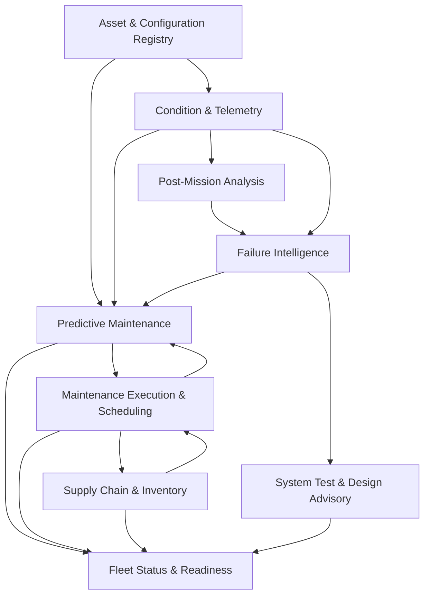

# Phase 2 — Sub-Application Architectures

| | |
|---|---|
| **Status** | Draft — pending approval to proceed to Phase 3 |
| **Scope** | High-level architecture for each of the nine domain sub-applications and the platform layer. Detailed design is Phase 3, one sub-application at a time |
| **Companion documents** | [01 — System Architecture](01-system-architecture.md) · [03 — Integration Contracts](03-integration-contracts.md) |
| **Classification** | Internal |

---

## 1. How to read this document

Each sub-application is described against a fixed template: purpose, ownership boundary, core aggregates, key design decisions with rationale, API surface, events published and consumed, internal components, data stores, plane placement, substitution posture, and the questions Phase 3 must resolve.

**Four conventions apply throughout, and document 03 governs each of them.**

- **API operations are shown relative to the sub-application base path** `/api/v{major}/{slug}/`, with slugs from document 03 §3.1. The prefix is omitted here for readability and is not optional in implementation.
- **The "Substitution" column** abbreviates the `x-substitution` annotation: "Required" is `required`, "Internal" is `internal` (document 03 §4.1).
- **Every operation additionally carries `x-side-effects`** (`none`, `proposal-only`, or `state-changing`), which is what determines agent eligibility. Compute-only `POST` operations such as scenario analysis and package planning are `none` and are agent-eligible.
- **Naming.** Where an operation below appears singular or action-shaped, it falls under the singleton and sub-resource-action carve-outs in document 03 §4 and must be enumerated in the sub-application's specification.

The contracts in document 03 are binding. Where this document describes an API operation or event, document 03 governs its form. Where the two conflict, document 03 prevails and this document is in error.

Sub-applications are presented in dependency order. **The recommended Phase 3 sequence in §12 differs**, because it weights de-risking value as well as dependency — Post-Mission Analysis is advanced to fourth to test the labeling assumption early. Document 01 §5 carries the only stable numeric identifiers; the ordering in this document and in §12 are sequences, not identities.

### Dependency structure

Two cycles are present and both are intentional: Scheduling and Supply negotiate work against parts availability, and Scheduling returns executed-maintenance labels to PdM. Both are event-mediated, so neither creates a synchronous dependency.

---

## 2. Asset & Configuration Registry

**Purpose.** Serve as the authoritative record of what exists in the fleet, how it is configured, and what is presently installed in each position. Every other sub-application depends on this one, and no other sub-application may define asset or configuration identity.

### Ownership boundary

**Owns:** class definitions, assets, the ESWBS system hierarchy, equipment and installed-item records, position definitions, part catalog entries, configuration baselines, allowance documents (COSAL, APL, AEL), and the class-to-hull deviation record.

**Does not own:** telemetry, usage counter *values* (Condition & Telemetry), maintenance history (Scheduling), inventory positions (Supply), or predictions.

### Core aggregates

| Aggregate | Notes |
|---|---|
| `Class` | Ship, boat, or vehicle class with its as-designed configuration template |
| `Asset` | A specific hull, boat, or vehicle. Carries UIC, domain, operational status, OFRP phase |
| `SystemNode` | ESWBS-aligned hierarchy node within an asset |
| `Position` | A named, persistent installation location within a system. **Positions outlive the items installed in them** |
| `InstalledItem` | A physical item currently or formerly occupying a position. Carries NIIN, serial or lot where tracked, install date, and cumulative usage at installation |
| `ConfigurationBaseline` | A bitemporal snapshot of an asset's installed configuration |
| `AllowanceDocument` | COSAL, APL, or AEL revision applicable to an asset |

### Key design decisions

**Positions and installed items are separate concepts, and remaining useful life attaches to the installed item.** This is the most consequential modeling decision in the sub-application. A pump at position `233-04-A` may be replaced five times over a hull's life. Predictions, usage accumulation, and failure history attach to the physical item occupying the position, not to the position. Conflating them produces the failure mode in which a newly installed component inherits its predecessor's degradation, which is both wrong and confidence-destroying the first time an operator notices it.

**Configuration is bitemporal — valid time and record time are tracked separately.** The system must be able to answer both "what was installed on 14 March" and "what did we believe on 14 March was installed." Predictions are audited against the latter. A configuration correction entered three weeks late changes valid time without rewriting record time, so a prediction computed on stale information remains explicable rather than appearing to have been computed from data that contradicts it.

**Class template with per-asset deviation.** Ships of one class diverge substantially over their service lives through modernization availabilities and field changes. Configuration is modeled as a class template plus an explicit ordered deviation set per asset, which keeps the common case compact and makes divergence a first-class, queryable fact rather than an inconsistency.

**Read-heavy, served aggressively.** Every sub-application reads this one. It exposes a versioned, cacheable read surface with `ETag` support, and consumers maintain local read models from events rather than querying on compute paths.

### API surface

| Operation | Substitution |
|---|---|
| `GET /assets`, `GET /assets/{id}` | Required |
| `GET /assets/{id}/configuration?as_of=&as_known_at=` | Required |
| `GET /assets/{id}/systems`, `.../positions`, `.../installed-items` | Required |
| `GET /classes/{id}`, `GET /classes/{id}/template` | Required |
| `GET /parts/{niin}`, `GET /parts?apl=` | Required |
| `GET /assets/{id}/allowances` | Required |
| `POST /assets/{id}/configuration-changes` | Required |
| `POST /assets`, `PATCH /assets/{id}`, class and template administration | Internal |

**Events published:** `asset.registered`, `asset.status_changed`, `configuration.baseline_changed`, `installed_item.installed`, `installed_item.removed`, `allowance.updated`.
**Events consumed:** `work_order.opened`, `maintenance_action.recorded`, `work_package.approved`. Executed maintenance is what causes configuration change, so the Registry consumes rather than polls it.

**Internal components:** configuration resolver (template plus deviations plus bitemporal query), baseline snapshot generator, allowance importer, hierarchy validator, read-model publisher.

**Data stores:** PostgreSQL. Bitemporal tables with exclusion constraints on overlapping validity. No time-series or object storage.

**Plane placement:** Sustainment Plane in full. No Domino workloads.

### Substitution posture

Long-term candidate for federation with CDMD-OA. The substitution boundary is favourable because the required surface is read-dominated: a CDMD-OA adapter must serve configuration queries and emit `configuration.baseline_changed`, and need not replicate the deviation model internally. The bitemporal requirement is the likely friction point, as external configuration systems frequently track valid time only.

### Phase 3 questions

- Serial-number tracking scope: which NIINs warrant item-level serialization against lot-level tracking, and what drives that determination
- Whether ESWBS is sufficient for unmanned vehicles, or a parallel breakdown structure is required
- Allowance document import: format, cadence, and reconciliation against observed configuration
- How field changes and modernization alterations are represented as deviations
- Cardinality expectations, which set the read-model strategy: number of assets, positions per asset, and configuration change rate

---

## 3. Condition & Telemetry

**Purpose.** Ingest, store, and serve condition data, usage counters, and mission records across three operating domains with radically different data profiles, and produce versioned health indicators suitable for modeling.

### Ownership boundary

**Owns:** raw telemetry samples, the channel registry and semantic mapping, health indicator definitions and computed values, usage counter values, mission records, data quality assessments, and automated anomaly detections.

**Does not own:** configuration (Registry), human anomaly tags (Post-Mission Analysis), predictions (PdM), or causal interpretation (Failure Intelligence).

### Core aggregates

| Aggregate | Notes |
|---|---|
| `Channel` | A canonical measurement channel bound to an equipment type. Maps one-to-many onto source sensor tags |
| `TelemetryBatch` | An ingested unit of samples with provenance, time range, and quality assessment |
| `HealthIndicator` | A versioned derived feature definition and its computed values |
| `UsageCounter` | Cumulative usage per installed item, monotonic |
| `MissionRecord` | An underway period, patrol, or sortie, with boundaries and data completeness |
| `DetectedAnomaly` | An automated, unsupervised detection. Distinct from a human tag |

### Key design decisions

**Three ingest profiles, one storage model.** Surface assets deliver near-continuous HM&E monitoring in the manner of ICAS. Submarines deliver bursts on reconnection with constrained egress and possible gaps of weeks. Unmanned vehicles deliver dense per-sortie dumps at sortie end. The design accommodates these as three ingest adapters over one canonical channel and sample model, rather than three storage designs. Data completeness is recorded per batch and per mission so that downstream consumers can distinguish "no fault observed" from "not observed."

**The channel registry is the integration surface, and it is the hard part.** Mapping raw sensor tags to canonical channels per equipment type is where real deployments consume their schedule. The registry is therefore an explicit, versioned, reviewable artifact with its own lifecycle rather than configuration embedded in ingest code. A mapping change is a versioned event, because it changes the meaning of historical data.

**Health indicators are deterministic, versioned, and replayable — not models.** Indicator computation is feature engineering: filtering, aggregation, spectral features, thermodynamic derivations. Keeping it deterministic and versioned means indicators can be recomputed over history when a definition improves, which is a routine need and impossible if indicator logic lives inside model code.

**Point-in-time correct feature serving.** The feature read API accepts an as-of timestamp and returns only what was knowable at that instant. This is the single mechanism preventing target leakage, which is the most common cause of predictive-maintenance programs that report strong offline metrics and fail in the field. The obligation is enforced in the API rather than trusted to modelers.

**Automated detection is separated from human tagging.** `DetectedAnomaly` seeds the Post-Mission Analysis candidate queue but is never itself a label. Only human confirmation produces a label.

### API surface

| Operation | Substitution |
|---|---|
| `GET /assets/{id}/channels`, `GET /channels/{id}` | Required |
| `GET /health-indicators?equipment_id=&from=&to=&as_of=` | Required |
| `GET /features?installed_item_id=&feature_set=&as_of=&as_known_at=` | Required |
| `GET /usage-counters?equipment_id=` | Required |
| `GET /missions`, `GET /missions/{id}`, `GET /missions/{id}/telemetry` | Required |
| `POST /ingest/telemetry`, `POST /ingest/usage` | Required |
| `POST /ingest/indicators`, `POST /ingest/detections` (Domino Job write-back) | Required |
| `GET /anomalies?mission_id=` | Required |
| Channel registry administration, indicator definition management | Internal |

**Events published:** `telemetry.batch_ingested`, `health_indicator.computed`, `usage_counter.updated`, `usage_counter.reset`, `mission.completed`, `anomaly.detected`.
**Events consumed:** `asset.registered`, `installed_item.installed`, `installed_item.removed`, `configuration.baseline_changed`. Counters and indicators attach to installed items, so item lifecycle events are a correctness dependency: a replacement opens a new counter epoch rather than continuing the prior item's accumulation.

**Internal components:** ingest adapters per domain profile, channel mapper, quality assessor, indicator computation engine, counter accumulator, mission boundary detector, unsupervised detector ensemble, retention and rollup manager, point-in-time feature server.

**Data stores:** TimescaleDB for samples and indicator values with tiered rollups; PostgreSQL for the channel registry, mission records, and metadata; object storage for raw mission payloads retained for replay and for Post-Mission Analysis evidence.

**Plane placement:** ingest, storage, and serving on the Sustainment Plane. Indicator definition development and unsupervised detector training occur in Domino; the detectors execute as scheduled Domino Jobs writing results back through the ingest API. Telemetry never transits a Domino Endpoint, per document 02 §4.3.

### Substitution posture

Unlikely to be substituted, as it is tightly coupled to program-specific channel semantics. The plausible partial substitution is an external historian or platform-provided data lake supplying raw samples, in which case this sub-application retains the channel registry, indicators, and feature serving while delegating sample storage.

### Phase 3 questions

- Expected data volumes and rates per domain, which determine the storage tier design and the retention economics
- Retention policy: how long raw samples are held against rollups, and whether retention differs by criticality tier
- Whether submarine data egress constraints permit useful indicator computation ashore, or require shipboard computation with indicator-only transmission
- Mission boundary determination: reported, inferred from telemetry, or both with reconciliation
- Synthetic data generation strategy, which for the demonstration is a substantial work item in its own right and must produce failure signatures realistic enough that models trained on it are meaningful

---

## 4. Predictive Maintenance

**Purpose.** Assign a modeling tier to every installed item by criticality, produce calibrated failure predictions and remaining-useful-life distributions at that tier, and expose them through one tier-invariant contract.

### Ownership boundary

**Owns:** criticality scoring and tier assignment, model inventory and tier bindings, label construction, scoring orchestration, prediction storage and lifecycle, calibration, and prediction provenance.

**Does not own:** features (Condition & Telemetry), configuration (Registry), maintenance history (Scheduling), causal findings (Failure Intelligence), model artifacts or the registry (Domino), or scheduling decisions.

### Core aggregates

| Aggregate | Notes |
|---|---|
| `CriticalityAssessment` | Per NIIN and equipment context: score, contributing factors, assigned tier, effective date |
| `ModelBinding` | Which registered model serves which tier for which equipment family |
| `LabelSet` | Constructed training labels with censoring status and provenance |
| `ScoringRun` | An executed scoring pass: scope, model versions, inputs, outcomes |
| `Prediction` | The stored `FailurePrediction`, with lifecycle status |
| `CalibrationRecord` | Observed against predicted, per tier and per equipment family |

### Key design decisions

**Tier assignment is policy, and it is separate from the models.** Criticality scoring combines mission-criticality of the parent system, CASREP history for the NIIN across the fleet, consequence of failure, sensor availability, and fleet-wide population. It is a reviewable, versioned rule set that produces an auditable score, not a model output. Tier assignment must be explicable to a reliability engineer, and it changes when sensors are installed or when failure history accumulates. Separating it from the models is what allows a NIIN to migrate between tiers without any model change.

**Censoring is explicit and central.** Most installed items have not failed. Treating "has not failed yet" as a negative example is the most common statistical error in this domain and biases every resulting model toward optimism. Label construction therefore produces right-censored observations, and every tier — including tier 0 Weibull fits — uses methods that handle censoring correctly. The `failure_indicator` on `maintenance_action.recorded` distinguishing corrective from preventive action is the determinative input, which is why document 03 identifies its capture as a first-order design problem.

**Calibration is a first-class obligation, not a metric.** The contract promises that `p_failure` and `confidence` are comparable across tiers. That promise is only kept if predictions are explicitly calibrated and calibration is monitored in production. A tier-0 Weibull probability and a tier-3 ensemble probability are not natively comparable, and downstream consumers — particularly the Scheduling optimizer, which trades them off against one another — will silently produce wrong answers if they are treated as though they were. Calibration is applied per tier and per equipment family, and drift in calibration is an alerting condition.

**Batch-first scoring, with local read models.** Fleet scoring runs as scheduled Domino Jobs and Flows. PdM maintains local read models of configuration, usage, and maintenance history built from events, so scoring depends on no synchronous call. Predictions are written to PdM's own store and published; no consumer reads a prediction from Domino.

**Configuration change invalidates predictions, loudly.** On `configuration.baseline_changed`, affected predictions transition to invalidated, `prediction.invalidated` is published, and re-scoring is queued. Consumers display invalidated predictions as such. Silent staleness after a component replacement is the failure mode most likely to destroy operator trust permanently.

**Cold start is designed, not deferred.** A newly introduced NIIN, a new class, or a hull with no history must produce something defensible. The fallback hierarchy is explicit: item history, then NIIN fleet history, then equipment-family history, then class-level engineering estimate, with the fallback level exposed in `confidence` and in `drivers`.

### API surface

| Operation | Substitution |
|---|---|
| `GET /predictions?asset_id=&equipment_id=&min_probability=&horizon_days=` | Required |
| `GET /predictions/{id}`, `GET /predictions/{id}/provenance` | Required |
| `GET /criticality?niin=&equipment_id=` | Required |
| `GET /scoring-runs`, `GET /scoring-runs/{id}` | Required |
| `POST /scoring-runs` (on-demand re-score; `x-side-effects: none`) | Required |
| `POST /scoring-runs/{id}/predictions` (bulk, idempotent, baseline-epoch fenced) | Required |
| `POST /what-if` (interactive tier-3 scenario) | Required |
| `GET /calibration?tier=&family=` | Required |
| Model binding administration, label set inspection, tier policy management | Internal |

**Events published:** `prediction.updated`, `prediction.invalidated`, `criticality_tier.assigned`, `model_binding.activated`.
**Events consumed:** `asset.registered`, `asset.status_changed`, `configuration.baseline_changed`, `installed_item.installed`, `installed_item.removed`, `telemetry.batch_ingested`, `health_indicator.computed`, `usage_counter.updated`, `usage_counter.reset`, `maintenance_action.recorded`, `deferral.recorded`, `anomaly_tag.confirmed`, `causal_finding.published`, `failure_mode.attributed`, `causal_feature_set.updated`, `design_change.projected`.

Enumerated rather than wildcarded. Rev 1 subscribed to "all Registry events, all Telemetry events," which cannot be conformance-tested and silently auto-subscribes to any future event a producer adds.

**Internal components:** criticality scorer, tier assignment engine, label constructor with censoring, scoring orchestrator, calibration engine, prediction store with lifecycle management, invalidation processor, provenance recorder, local read models.

**Data stores:** PostgreSQL for predictions, criticality assessments, bindings, calibration records, and read models. Object storage for label sets and scoring run artifacts.

**Plane placement:** the service, prediction store, and orchestration on the Sustainment Plane. Model development, training, evaluation, registry, governance, and all scoring execution in Domino. Interactive what-if inference calls a Domino Endpoint; every other path is batch.

### Substitution posture

Core program capability. Not a substitution candidate. The contract is nonetheless defined as though it were, because doing so is what keeps the tier abstraction honest and prevents consumers from reaching into modeling internals.

### Phase 3 questions

- Criticality scoring formulation and the weights, which are a program judgment requiring subject-matter validation rather than an analytic choice
- Horizon set: which prediction horizons are produced, and whether they vary by tier or by OFRP phase
- Calibration method per tier and the monitoring thresholds that constitute drift
- Which equipment families anchor tiers 2 and 3 in the demonstration, and whether synthetic data can support them credibly
- Retraining triggers and cadence, and the governance gate weighting per tier
- How `design_change.projected` scenarios are represented without contaminating operational predictions

---

## 5. Fleet Status & Readiness

**Purpose.** Compose the fleet-wide operational picture: readiness rollups from installed item to fleet, predicted casualty risk, and the explanation of both.

### Ownership boundary

**Owns:** readiness scoring methodology, rollup computation, risk thresholds and hysteresis, the fleet read model, and the explanation graph behind every displayed figure.

**Does not own:** any *observed* fact. This sub-application is derived-data only. It is authoritative for its own methodology and for the `RiskFlag` assertions that methodology produces, and for nothing else.

### Core aggregates

| Aggregate | Notes |
|---|---|
| `ReadinessAssessment` | Scoped to an asset, system, or fleet grouping, with score components and effective time |
| `RiskFlag` | A predicted casualty risk with severity, horizon, and evidence |
| `DegradationContributor` | A single traceable contribution to a readiness reduction |

### Key design decisions

**Advisory overlay, not a readiness system of record.** Navy readiness reporting has authoritative systems and formal definitions. This sub-application produces a *predictive* readiness view intended to inform action ahead of formal reporting. It must not present itself as, or be mistaken for, authoritative readiness reporting. Terminology, labelling, and interface language are constrained accordingly, and this is an accreditation and acceptance concern rather than a stylistic one.

**Every score decomposes to source records.** A readiness figure that cannot be decomposed into contributing degradations, each traceable to a prediction, a casualty, a deferral, or a parts shortfall, will be dismissed by operators — correctly. The explanation graph is a primary output, not a diagnostic feature. This constraint substantially shapes the scoring methodology: aggregations must be decomposable, which rules out several otherwise attractive formulations.

**CQRS read model built entirely from events.** No synchronous fan-out to other sub-applications. The read model is rebuildable from event history, which is also what makes the retention guarantees in document 03 §5.1 load-bearing.

**Hysteresis on risk flags.** A flag that raises and clears as a probability oscillates around a threshold trains operators to ignore flags. Raise and clear thresholds differ, and a minimum dwell time applies before either transition.

### API surface

| Operation | Substitution |
|---|---|
| `GET /readiness?scope=fleet\|tycom\|asset&id=` | Required |
| `GET /readiness/{id}/explanation` | Required |
| `GET /risk-flags?severity=&horizon_days=` | Required |
| `GET /assets/{id}/status-summary` | Required |
| Methodology configuration | Internal |

**Events published:** `readiness.recomputed`, `casrep_risk.raised`, `casrep_risk.cleared`.
**Events consumed:** `asset.registered`, `asset.status_changed`, `configuration.baseline_changed`, `health_indicator.computed`, `anomaly.detected`, `prediction.updated`, `prediction.invalidated`, `criticality_tier.assigned`, `model_binding.activated`, `work_candidate.created`, `work_order.opened`, `deferral.recorded`, `work_package.proposed`, `work_package.approved`, `part_availability.changed`, `requisition.status_changed`, `allowance_shortfall.detected`, `mission_review.completed`, `causal_finding.published`, `redesign_candidate.created`, `redesign_case.published`.

This is the largest consumed set in the system, which follows from Fleet Status being derived-data only. Rev 1 expressed it as prose categories, which made it impossible to determine whether a declared dependency in document 03 §6 was satisfied.

**Internal components:** rollup engine, scoring methodology evaluator, explanation graph builder, threshold and hysteresis manager, read-model projector.

**Data stores:** PostgreSQL, holding a read model and no source-of-truth data. Fully rebuildable.

**Plane placement:** Sustainment Plane entirely. The Readiness Narrative agent, which consumes this sub-application's API, runs in Domino subject to the machine-to-machine authentication dependency in document 01 §8.7.

### Substitution posture

Not a substitution candidate, though it is the sub-application most likely to be *duplicated* by a customer's existing dashboard. The API is designed to be consumed by an external presentation layer for exactly that reason.

### Phase 3 questions

- Readiness scoring methodology and its validation against operator judgment, which is the acceptance risk for this sub-application
- Whether rollups must align to specific Navy readiness constructs and reporting categories, and the terminology constraints that follow
- Threshold and hysteresis values, and whether they vary by class or OFRP phase
- Notification routing and escalation: who is informed of a raised flag, through what channel, and with what acknowledgement expectation

---

## 6. Maintenance Execution & Scheduling

**Purpose.** Convert predictions, planned maintenance requirements, and actual casualties into work candidates; plan those candidates into availability windows subject to real constraints; and capture executed maintenance as the label stream on which the entire predictive capability depends.

### Ownership boundary

**Owns:** work candidates, work orders, deferrals, PMS periodicity records, availability definitions, work packages, the scheduling optimizer, executed maintenance history, and proposals targeting this sub-application.

**Does not own:** predictions, parts availability, or configuration — though it triggers configuration change on completion.

### Core aggregates

| Aggregate | Notes |
|---|---|
| `WorkCandidate` | Proposed work with a driver: prediction, PMS periodicity, or casualty |
| `WorkOrder` | Authorized work with a window, package assignment, and status |
| `MaintenanceAction` | Executed work: findings, parts consumed, and the corrective-versus-preventive determination |
| `Deferral` | Deliberate postponement with accepted risk and revised window |
| `Availability` | A maintenance period with dates, executing activity, and capacity |
| `WorkPackage` | A candidate set planned into one availability, with constraint satisfaction evidence |
| `MaintenanceActionRecord` | **Edge-authoritative, append-only.** What the ship did, separable from what was authorized (document 03 §11) |
| `ReservationSet` | A transactional multi-NIIN reservation held against Supply, with expiry |
| `Proposal` | Agent-originated work candidates and interval changes awaiting adjudication. Schema fixed by document 03 §7.2 |

### Key design decisions

**Output is framed against deployment and availability, not dates.** The primary question the sub-application answers is whether an item survives the deployment or must enter the next availability work package. Date-based recommendations are a degraded presentation of that answer. This framing is what makes the output actionable to an RMC planner and is the single most important domain-fit decision in the sub-application.

**The optimizer is a constraint model, and it must explain itself.** Decision variables assign candidates to windows. Constraints include parts availability and lead time, executing-activity capacity, OFRP phase, deployment dates, system criticality, and prerequisite relationships between work items. The objective trades predicted casualty risk against cost and capacity. Critically, every included and every excluded candidate carries a reason. A planner presented with an unexplained schedule will discard it and plan manually, which is the observed failure mode for optimization tools in this domain.

**Three candidate drivers, one lifecycle.** Predictions, PMS periodicity, and actual casualties produce candidates that then follow identical handling. This lets the system express, and a planner evaluate, the interaction that matters most: a predicted failure and a scheduled preventive task on the same item should merge rather than compete.

**Maintenance capture is designed as a labeling problem.** `maintenance_action.recorded` is the label stream for every model in the system. Capture design therefore optimizes for label quality — particularly the corrective-versus-preventive determination, findings coding against a controlled failure-mode vocabulary shared with Failure Intelligence, and the linkage from action back to the prediction or candidate that prompted it. Treating this as a data-entry form rather than as the system's primary training input is the most likely way for the program to produce a predictive capability that cannot improve.

**Deferrals are first-class and are signal.** A deferral with accepted risk is a human judgment that the prediction overstated urgency, and it is informative to both the models and to calibration monitoring.

### API surface

| Operation | Substitution |
|---|---|
| `GET /work-candidates?asset_id=&driver=&status=` | Required |
| `POST /work-candidates` | Required |
| `GET /work-orders`, `GET /work-orders/{id}` | Required |
| `POST /work-orders`, `PATCH /work-orders/{id}` | Required |
| `POST /work-orders/{id}/actions` | Required |
| `POST /deferrals` | Required |
| `GET /availabilities`, `GET /availabilities/{id}/work-package` | Required |
| `POST /work-packages/plan` | Required |
| `GET /work-packages/{id}/explanation` | Required |
| `GET /maintenance-history?equipment_id=` | Required |
| `POST /proposals` (agent-originated candidates and interval changes) | Required |
| Optimizer configuration, PMS catalog administration | Internal |

**Events published:** `work_candidate.created`, `work_order.opened`, `maintenance_action.recorded`, `deferral.recorded`, `work_package.proposed`, `work_package.approved`, plus proposal events.
**Events consumed:** `prediction.updated`, `prediction.invalidated`, `criticality_tier.assigned`, `casrep_risk.raised`, `casrep_risk.cleared`, `part_availability.changed`, `requisition.status_changed`, `allowance_shortfall.detected`, `allowance.updated`, `reservation_set.confirmed`, `reservation_set.released`, `asset.status_changed`, `configuration.baseline_changed`, `usage_counter.updated`, `usage_counter.reset`, `causal_finding.published`.

**Internal components:** candidate generator per driver, candidate merger, scheduling optimizer, constraint evaluator, explanation generator, work order state machine, action capture with findings coding, deferral manager, proposal handler.

**Data stores:** PostgreSQL. Optimizer runs persist inputs, solution, and explanation for audit and reproducibility.

**Plane placement:** service and optimizer on the Sustainment Plane. The optimizer is a constraint solver rather than a model, and belongs with the domain service. The Work-Package Planner agent runs in Domino, subject to document 01 §8.7, and calls this sub-application's API. Its planning operation is `x-side-effects: none` and therefore agent-eligible.

### Substitution posture

Medium-term candidate for federation with 3-M and OMMS-NG, which are authoritative for Navy maintenance documentation. The substitution boundary is more difficult than Supply's because the optimizer and the label-quality requirements are program-specific. The likely division is that an external system becomes authoritative for work orders and executed actions while this sub-application retains candidate generation and planning, consuming action records rather than owning them.

### Phase 3 questions

- Optimizer formulation and solver selection, and whether the problem size at fleet scale admits exact solution or requires heuristics
- Availability and OFRP data model fidelity: how much real planning structure the demonstration represents
- Findings vocabulary: adopt an existing Navy failure-mode coding scheme or define one, and how it reconciles with Failure Intelligence's taxonomy
- Whether the demonstration includes RMC capacity modeling or treats capacity as unconstrained
- How prediction-driven and PMS-driven candidates merge, and who adjudicates when they disagree

---

## 7. Supply Chain & Inventory

**Purpose.** Represent parts availability, allowance position, and the documentary state of materiel in motion, at sufficient fidelity to constrain maintenance planning and to surface shortfalls.

### Ownership boundary

**Owns:** stock positions, allowance positions against COSAL and APL, requisitions and their documentary lifecycle, reservations and reservation sets, in-transit visibility, predicted demand, and proposals targeting this sub-application.

**Does not own:** the parts catalog or allowance documents themselves (Registry), work orders, or predictions.

### Core aggregates

| Aggregate | Notes |
|---|---|
| `StockPosition` | On-hand quantity by NIIN and location, with condition code |
| `AllowancePosition` | Authorized against actual for an asset, by NIIN |
| `Requisition` | A demand document with status, priority, and projected availability |
| `Reservation` | Stock committed to a work order or work package |
| `InTransitItem` | Materiel in motion with location and estimated arrival |
| `DemandForecast` | Predicted consumption derived from predictions and planned work |
| `ReservationSet` | A transactional multi-NIIN reservation with expiry and explicit release. Per-NIIN reservation without atomicity leaves orphans when one line fails |
| `Proposal` | Agent-originated requisitions and expedites awaiting adjudication. Schema fixed by document 03 §7.2 |

### Key design decisions

**Designed for substitution from the outset — the required surface is deliberately minimal.** This is the sub-application most likely to be assumed by a partner platform, and the design objective is that the substitution be uneventful. The required-for-substitution surface is confined to what Scheduling and Fleet Status genuinely need: availability by NIIN and location, allowance position, requisition status, and shortfall notification. Everything else is internal. A partner adapter is consequently a small and testable artifact.

**Documentary state is modeled as an explicit lifecycle, at two levels.** Requisition, purchase requisition, purchase order, sales order, and in-transit states are represented as a state machine with tactical and strategic views, because the program's stated interest is in where materiel sits both physically and documentarily. A planner needs to know that a part is theoretically available but held behind an unfunded requisition, which is a documentary fact rather than a physical one.

**Predicted demand is a published output.** The forward-looking demand signal derived from predictions and planned work is one of the more valuable products of the whole system and is exposed as a first-class resource rather than remaining an optimizer input. It is what connects predictive maintenance to provisioning.

**Allowance position is distinguished from availability.** An item on hand but not authorized, and an item authorized but absent, are different conditions with different remedies, and conflating them produces unactionable output.

### API surface

| Operation | Substitution |
|---|---|
| `GET /availability?niin=&location=&asset_id=` | Required |
| `GET /allowance-position?asset_id=&niin=` | Required |
| `GET /requisitions?asset_id=&niin=&status=` | Required |
| `GET /requisitions/{id}` | Required |
| `POST /reservation-sets` (transactional multi-NIIN, TTL), `DELETE /reservation-sets/{id}` | Required |
| `GET /lead-times?niin=&location=` | Required |
| `GET /interchangeable-groups?niin=` | Required |
| `GET /shortfalls?asset_id=` | Required |
| `GET /demand-forecast?niin=&horizon_days=` | Required |
| `POST /proposals` (agent-originated requisitions and expedites) | Required |
| Stock adjustment, document creation, catalog synchronization | Internal |

**Events published:** `part_availability.changed`, `requisition.status_changed`, `allowance_shortfall.detected`, `reservation_set.confirmed`, `reservation_set.released`, plus proposal events.
**Events consumed:** `work_candidate.created`, `work_order.opened`, `work_package.proposed`, `work_package.approved`, `maintenance_action.recorded`, `prediction.updated`, `prediction.invalidated`, `casrep_risk.raised`, `installed_item.installed`, `installed_item.removed`, `allowance.updated`, `configuration.baseline_changed`.

**Internal components:** stock ledger, allowance evaluator, requisition state machine, reservation manager, in-transit tracker, demand forecaster, shortfall detector, proposal handler.

**Data stores:** PostgreSQL.

**Plane placement:** Sustainment Plane. Demand forecasting executes as a scheduled Domino Job, since it is a modeling activity, writing results back through this sub-application's API. The Supply Expediter agent runs in Domino, subject to document 01 §8.7.

### Substitution posture

The primary substitution candidate and the reference case for the protocol in document 03 §8. The demonstration should exercise the shadow-mode step of the migration sequence against a mock partner adapter, which validates the substitution machinery at low cost and materially strengthens the platform narrative.

### Phase 3 questions

- Document lifecycle fidelity: which states the demonstration represents, and whether real Navy document types and formats are modeled
- Whether demand forecasting is in demonstration scope or deferred
- Condition codes, substitute and interchangeable relationships, and whether APL cross-reference logic is required
- Location model granularity: onboard storerooms, ashore activity, depot, in transit
- Which subset a Palantir-style adapter would realistically serve, informing the required surface

---

## 8. Post-Mission Analysis

**Purpose.** Convert completed missions into human-confirmed anomaly labels through a bounded review workflow, producing the supervised signal on which causal analysis depends.

### Ownership boundary

**Owns:** the review workflow and its state, candidate anomaly queues, **taxonomy assignments** against the Reference Data vocabulary, confirmed and rejected tags with reviewer provenance, evidence packages, and proposals targeting this sub-application.

**Does not own the taxonomy itself.** Reference Data is the single owner of the unified vocabulary (document 03 §14); this sub-application owns the assignment of terms to observations.

**Does not own:** telemetry, automated detections (Condition & Telemetry), causal interpretation (Failure Intelligence), or predictions.

### Core aggregates

| Aggregate | Notes |
|---|---|
| `MissionReview` | A review instance: mission, assigned reviewer, state, time budget |
| `AnomalyCandidate` | A proposed anomaly awaiting adjudication, from a detector or an agent |
| `AnomalyTag` | A confirmed anomaly: window, taxonomy classification, reviewer, evidence |
| `TagRejection` | A rejected candidate with reason. Retained as a negative label |
| `EvidencePackage` | The immutable telemetry window and context supporting a candidate. Materialised into PMA's own object store at review open, from Telemetry's replay source via its API |
| `Proposal` | Agent-originated anomaly candidates awaiting adjudication. Schema fixed by document 03 §7.2 |

### Key design decisions

**The workflow is bounded review, not open authoring.** Reviewers are presented a finite candidate set to confirm or reject rather than an interface for discovering anomalies in raw telemetry. This is the design decision that makes the labeling pipeline viable, for the reason set out in document 01 §8.2: voluntary annotation by crews after an extended underway period is not a reliable assumption. Candidates come from unsupervised detectors and from the PMA Pre-Screener agent.

**Review time budget is a design constraint with a hard target.** If a review takes longer than a few minutes, it will not be completed, and the entire causal capability depends on completion. The candidate count per review is capped, candidates are ranked by expected informativeness, and review duration is instrumented as a primary product metric. A review workflow that is thorough and unused is worthless.

**The anomaly taxonomy is a controlled vocabulary, reconciled with maintenance findings coding.** Free-text tags produce labels unusable for supervised learning. The taxonomy is versioned, and it must reconcile with the findings vocabulary used in maintenance capture and with Failure Intelligence's failure-mode taxonomy — three vocabularies describing the same physical reality, which must be one vocabulary with three points of capture.

**Rejections are retained and are valuable.** A rejected candidate with a reason is a labeled negative, feeding detector improvement, agent evaluation, and — because a rejection often means "this is normal for this equipment in this condition" — the models themselves.

**Reviewer provenance and qualification are recorded.** Label quality varies by reviewer. Recording who tagged what, with what qualification, permits label weighting and disagreement analysis, and is necessary for any defensible claim about training data quality.

**Edge-capable by construction.** This is one of the few sub-applications with a genuine afloat deployment profile, since review naturally occurs at or near mission end. Append-only tags with server-authoritative adjudication (document 03 §9) make offline operation tractable.

### API surface

| Operation | Substitution |
|---|---|
| `GET /reviews?asset_id=&status=&reviewer=` | Required |
| `GET /reviews/{id}`, `GET /reviews/{id}/candidates` | Required |
| `POST /reviews/{id}/candidates/{cid}/confirm` | Required |
| `POST /reviews/{id}/candidates/{cid}/reject` | Required |
| `POST /reviews/{id}/complete` | Required |
| `GET /tags?equipment_id=&mission_id=&taxonomy=` | Required |
| `GET /taxonomy` | Required |
| `POST /proposals` (agent-originated candidates) | Required |
| Taxonomy administration, reviewer qualification management | Internal |

**Events published:** `mission_review.opened`, `anomaly_tag.confirmed`, `anomaly_tag.rejected`, `mission_review.completed`, plus proposal events.
**Events consumed:** `mission.completed`, `anomaly.detected`, `telemetry.batch_ingested`, `configuration.baseline_changed`, `maintenance_action.recorded`.

`maintenance_action.recorded` is consumed so that a review can present what was subsequently found and repaired alongside the candidate window — the single most useful context a reviewer can have, and the basis for retrospective tag quality assessment.

**Internal components:** review orchestrator, candidate ranker, evidence package assembler, taxonomy service, tag store with provenance, proposal handler, edge sync adapter.

**Data stores:** PostgreSQL for reviews, tags, and taxonomy. Object storage for evidence packages, which are immutable once a review opens so that a tag's basis cannot change after the fact.

**Plane placement:** service and workflow on the Sustainment Plane, including the afloat profile. The PMA Pre-Screener agent runs in Domino for enterprise candidate generation, subject to document 01 §8.7, and submits candidates as proposals. **A reduced pre-screener and the detector ensemble are additionally edge-resident**, because afloat there would otherwise be no candidate source and review would degrade to the open-ended authoring this design rejects.

### Substitution posture

Core program capability, not a substitution candidate. The tag stream is the program's most distinctive data asset.

### Phase 3 questions

- Anomaly taxonomy definition, and its reconciliation with maintenance findings coding and failure-mode taxonomy — a single vocabulary question spanning three sub-applications, and one that should be resolved once rather than three times
- Candidate cap per review and the ranking function
- Reviewer assignment: by billet, by qualification, or by asset
- Whether ship's force or shore-based analysts perform review in the demonstration, which changes the interface substantially
- Evidence package composition and size, particularly for unmanned vehicles with dense telemetry
- Target review duration, and how it is validated

---

## 9. Failure Intelligence

**Purpose.** Determine why components fail, using confirmed anomaly tags, mission data, and maintenance findings, and publish adjudicated causal findings to Predictive Maintenance and Design Advisory.

### Ownership boundary

**Owns:** causal hypotheses and their evidence, the failure-mode taxonomy and attribution, engineering adjudication of findings, and the causal feature definitions published to PdM.

**Does not own:** tags (Post-Mission Analysis), telemetry (Condition & Telemetry), predictions (PdM), or redesign recommendations (Design Advisory).

### Core aggregates

| Aggregate | Notes |
|---|---|
| `FailureMode` | A taxonomy entry: physical mechanism, observable signature, affected populations |
| `CausalHypothesis` | A proposed causal relationship with method, evidence, strength, and adjudication state |
| `Attribution` | A binding of an observed failure to a failure mode, with confidence |
| `CausalFeatureSet` | Versioned feature definitions derived from adjudicated findings, consumed by tier-3 models |

### Key design decisions

**Outputs are adjudicated hypotheses, not automated conclusions.** This is the most important framing decision in the sub-application and it should be stated plainly in program material. Causal inference from observational data, without designed interventions, yields hypotheses of varying strength — not established causes. The sub-application therefore produces candidate findings with explicit evidence and strength, which an engineer adjudicates before publication. Presenting algorithmically derived causes as established fact to a design authority would be both wrong and, on first contradiction, fatal to the program's credibility.

**Method portfolio rather than a single technique.** Causal discovery over observational data constrained by domain-supplied structure, survival analysis with covariates, comparative population analysis across hulls and classes, and signature matching against known failure modes. Each carries different assumptions and different failure modes, and agreement across methods is itself evidence. Phase 3 selects the specific portfolio.

**Evidence strength is explicit and standardized.** Every hypothesis carries what supports it, how many independent observations, across how many hulls and classes, by what method, and what confounders remain unaddressed. Downstream consumers — PdM deciding whether to admit a causal feature, and Design Advisory building a business case — make different decisions at different strength levels, and can only do so if strength is expressed consistently.

**Causal features are versioned and admitted deliberately.** A causal finding becomes a tier-3 model feature only after adjudication and only as a versioned feature-set entry. This prevents a weak hypothesis from silently propagating into operational predictions, and it keeps the PdM contract's `drivers` field meaningful.

**Rejections and negative findings are retained.** A hypothesis examined and found unsupported is valuable knowledge and prevents rediscovery.

### API surface

| Operation | Substitution |
|---|---|
| `GET /failure-modes`, `GET /failure-modes/{id}` | Required |
| `GET /hypotheses?niin=&equipment_id=&status=&min_strength=` | Required |
| `GET /hypotheses/{id}/evidence` | Required |
| `GET /attributions?equipment_id=&mission_id=` | Required |
| `GET /causal-feature-sets`, `GET /causal-feature-sets/{version}` | Required |
| `POST /hypotheses/{id}/adjudicate` | Required |
| Discovery run management, taxonomy administration | Internal |

**Events published:** `causal_finding.published`, `failure_mode.attributed`, `causal_feature_set.updated`.
**Events consumed:** `anomaly_tag.confirmed`, `anomaly_tag.rejected`, `mission.completed`, `maintenance_action.recorded`, `telemetry.batch_ingested`, `installed_item.removed`, `configuration.baseline_changed`, `prediction.updated`.

`prediction.updated` is consumed for one purpose only: to record which population received model-assigned intervention, so that comparative population analysis can condition on treatment assignment. It is never used as evidence for a causal finding.

**Internal components:** discovery orchestrator, method adapters, evidence assembler, strength scorer, adjudication workflow, taxonomy service, feature-set publisher.

**Data stores:** PostgreSQL for hypotheses, attributions, taxonomy, and adjudications. Object storage for discovery run artifacts and evidence.

**Plane placement:** service and adjudication workflow on the Sustainment Plane. All causal discovery executes in Domino as Jobs and Flows, with exploratory analysis in Workspaces. Practitioner-facing causal exploration is a Domino App, since its audience is reliability engineers who hold Domino accounts.

### Substitution posture

Core program capability. Not a substitution candidate.

### Phase 3 questions

- Method portfolio selection, and what each method can legitimately claim given the available data
- Whether synthetic demonstration data can support credible causal discovery, and if not, how the capability is demonstrated honestly
- Failure-mode taxonomy source: an existing standard, a Navy scheme, or program-defined
- Evidence strength scale definition, which must be interpretable by engineers who are not statisticians
- Adjudication authority: who is qualified to publish a finding
- Minimum population thresholds below which discovery is not attempted

---

## 10. System Test & Design Advisory

**Purpose.** Assemble the engineering case for component redesign from field failure evidence, causal findings, and test data, including dependency impact and cost, for a design authority to act upon.

### Ownership boundary

**Owns:** test and qualification data, component failure-mode dossiers, the design dependency graph, redesign candidates and cases, cost estimates, and proposals targeting this sub-application.

**Does not own:** causal findings (Failure Intelligence), maintenance history (Scheduling), predictions (PdM), or design authority itself.

### Core aggregates

| Aggregate | Notes |
|---|---|
| `TestRecord` | Qualification or developmental test data for a component, with conditions and outcomes |
| `FailureDossier` | The consolidated evidence for one NIIN: field failures, causal findings, test results, affected population |
| `DesignDependency` | An interface or fit relationship between components, forming the impact graph |
| `RedesignCandidate` | A component flagged for redesign consideration, with driver evidence and priority |
| `RedesignCase` | The complete business case: scope, dependency impact, cost estimate, projected benefit, recommendation |
| `CostEstimate` | A costed redesign scope with method, assumptions, and confidence |
| `Proposal` | Agent-assembled redesign cases awaiting adjudication. Schema fixed by document 03 §7.2 |

### Key design decisions

**The output is a decision package for a human authority, not a decision.** Redesign is an acquisition action with programmatic, contractual, and airworthiness or seaworthiness implications far exceeding this system's scope. The sub-application assembles evidence and estimates to a standard that a design engineer can evaluate and defend, and stops there.

**Dependency impact requires an explicit graph, and its absence is the usual reason redesign estimates are wrong.** Redesigning a component affects its interfaces, its fit, its supported and supporting items, its technical documentation, its allowance lists, and its training. The dependency graph makes that blast radius computable rather than a matter of recollection, and dependency completeness is itself reported so a reader knows how much of the impact is known.

**Two-stage costing.** A fast parametric estimate qualifies candidates; a detailed dependency-rollup estimate is produced for candidates that survive qualification. Producing detailed estimates for every candidate is wasted effort, and producing only parametric estimates yields business cases that do not withstand review. Whether the demonstration implements the second stage is a Phase 3 scope question.

**Projected design changes feed back to Predictive Maintenance.** A `design_change.projected` event permits PdM to model the forward reliability effect of a proposed change, which is what converts a redesign case from an assertion about cost into an assertion about readiness. It must be strictly segregated from operational predictions.

**Test data is treated as sparse and heterogeneous.** Qualification data for legacy components is frequently incomplete, inconsistently formatted, and decades old. The design assumes partial coverage and represents absence explicitly rather than treating missing test data as absence of concern.

### API surface

| Operation | Substitution |
|---|---|
| `GET /dossiers?niin=`, `GET /dossiers/{id}` | Required |
| `GET /redesign-candidates?status=&min_priority=` | Required |
| `GET /redesign-cases/{id}` | Required |
| `POST /redesign-cases/{id}/estimate` | Required |
| `GET /dependencies?niin=&depth=` | Required |
| `GET /dependencies/{niin}/impact` | Required |
| `GET /test-records?niin=` | Required |
| `POST /proposals` (agent-assembled redesign cases) | Required |
| Test data ingest, dependency graph administration, cost model configuration | Internal |

**Events published:** `redesign_candidate.created`, `redesign_case.published`, `design_change.projected`, plus proposal events.
**Events consumed:** `causal_finding.published`, `failure_mode.attributed`, `maintenance_action.recorded`, `installed_item.removed`, `prediction.updated`, `prediction.invalidated`, `part_availability.changed`.

**Internal components:** dossier assembler, candidate identifier, dependency graph service, impact analyzer, parametric cost estimator, detailed cost roll-up engine, case builder, proposal handler.

**Data stores:** PostgreSQL for dossiers, candidates, cases, estimates, and the dependency graph. Object storage for test data and case artifacts. Graph traversal is served from PostgreSQL recursive queries unless Phase 3 establishes depth requirements exceeding what that supports.

**Plane placement:** service on the Sustainment Plane. Cost model development and any learned components execute in Domino. Engineer-facing case review is a Domino App, since the audience holds Domino accounts and the workflow benefits from proximity to the causal analysis.

### Substitution posture

Core program capability. Test data ingest may in practice federate to program-specific engineering data systems, which is an adapter concern within this sub-application rather than a substitution of it.

### Phase 3 questions

- Cost model depth: parametric only, or two-stage with dependency roll-up — carried forward from Phase 1 and now requiring resolution
- Dependency graph population: how relationships are sourced, and how completeness is assessed and reported
- Test data model and formats, given heterogeneous and incomplete legacy sources
- Whether the demonstration represents an actual redesign decision workflow with a named authority
- Priority scoring for candidates, and how it reconciles with PdM criticality scoring

---

## 11. Platform layer

Cross-cutting services on the Sustainment Plane. Each requires Phase 3 design; the two carrying substantial domain complexity are noted.

### API Gateway / BFF

Single ingress for the operator interface and for agent tool calls. Responsibilities: authentication, token exchange for delegated authority, rate limiting per caller identity, view-model composition across sub-applications, and construction of the unified proposal adjudication queue by consuming the `fathom.*.proposal.v1` topic pattern. Composition happens here, which is what keeps sub-applications from calling one another synchronously.

### Identity & Authorization

OIDC provider, Keycloak in the demonstration, federated with Domino's Keycloak so that a single identity spans both planes — the prerequisite for delegated agent authority. ABAC policy evaluation via OPA or Cedar, with attributes including classification, caveats, compartments, unit, billet, and qualification. CAC and PIV substitution is an identity-provider change rather than an application change.

### Reference Data

Versioned enumerations, ESWBS and EIC code sets, unit hierarchy, and the shared taxonomies. Distributed as a versioned package and served for runtime resolution. The taxonomy reconciliation question raised in §8 and §9 resolves here: one vocabulary, three points of capture.

### Knowledge & Retrieval

**Substantial Phase 3 design required.** Corpus ingest and chunking across IETMs and technical manuals, 3-M maintenance narratives, CASREP text, test reports, and engineering change proposals. Embedding and vector storage on pgvector.

Two requirements dominate the design:

- **Configuration-aware retrieval.** Results are filtered by the target asset's as-maintained configuration baseline, so a maintainer is never presented a procedure for a variant not installed. This requires that corpus documents carry applicability metadata — class, configuration, and effective date — which for legacy technical documentation is a substantial data-preparation problem rather than an indexing detail.
- **Classification enforcement at query time.** Filtering must occur within the query rather than by removing results afterward, because post-filtering leaks the existence of records the requester is not cleared to know about.

Structured facts are never served from this component. Agents obtain current state from sub-application APIs and obtain procedural and narrative knowledge here, and the distinction is enforced in the tool manifests.

### Identity & Authorization

**Substantial Phase 3 design required.** OIDC federated with Domino's Keycloak so one identity spans both planes, which is the prerequisite for delegated agent authority. ABAC over classification, caveats, compartments, unit, billet, and qualification. Two authority classes per document 03 §8.3: delegated for interactive agents, accountable-autonomous for event-triggered and scheduled ones. CAC and PIV substitution is an identity-provider change, not an application change.

**Agent runtime placement.** Agents are Domino-hosted per document 01 §8.7, subject to the machine-to-machine authentication dependency. Under the contingency the orchestration runtime relocates to this plane and only inference, tracing, and evaluation remain in Domino.

### Audit & Provenance

Immutable, append-only record of predictions, tags, proposals, adjudications, agent tool invocations with full request and response, and model and agent version promotions. Correlated by `X-Correlation-Id` and by `trace_ref` to Domino agent traces. This is an accreditation artifact and its retention and integrity requirements should be treated as external obligations rather than internal preferences.

### Notification

Routing and escalation for raised risk flags, opened reviews, shortfalls, and adjudication requests. Delivery-channel abstraction, since afloat notification will not resemble shore notification.

### Sync Gateway

Inert in the demonstration. The seam implementing document 03 §9: outbox drain, inbox apply, per-aggregate conflict policy enforcement, and divergence budget tracking. Built as a library consumed by every sub-application plus a coordinating service, so that the outbox obligation is satisfied uniformly rather than nine times.

---

## 12. Recommended Phase 3 sequence

Detailed design proceeds one sub-application at a time. The recommended order follows dependency structure and front-loads the decisions that constrain everything downstream.

| Order | Sub-application | Rationale |
|---|---|---|
| 1 | Asset & Configuration Registry | Every other sub-application depends on it. The position-versus-installed-item and bitemporal decisions constrain all downstream modeling |
| 2 | Condition & Telemetry | Supplies features and mission records. The channel registry and point-in-time feature contract gate PdM |
| 3 | Predictive Maintenance | The program's core capability, and the consumer of the two above |
| 4 | Post-Mission Analysis | Independent of Scheduling and Supply, and produces the label stream Failure Intelligence requires. Early design de-risks the labeling assumption on which the concept depends |
| 5 | Maintenance Execution & Scheduling | Larger and more constraint-heavy than the preceding items, and its label capture design benefits from PdM being settled |
| 6 | Failure Intelligence | Requires Post-Mission Analysis and a settled taxonomy |
| 7 | Supply Chain & Inventory | Deliberately thin, and the reference case for the substitution protocol |
| 8 | Fleet Status & Readiness | Derived-data only. Best designed once its sources are settled |
| 9 | System Test & Design Advisory | Terminal consumer, dependent on Failure Intelligence |

Four cross-cutting items should be designed before or alongside item 1, because they cannot be retrofitted and because several sub-application designs will otherwise encode conflicting assumptions:

- **The unified taxonomy** spanning anomaly classification, maintenance findings coding, and failure modes (§8, §9, §11)
- **The outbox and sync library**, since document 03 makes it a universal obligation
- **The tool manifest model** (document 03 §10). The two-level eligibility-and-selection model changes every sub-application's OpenAPI conventions, since `x-agent-eligible` must be asserted per operation and validated in continuous integration. Establishing it once avoids nine inconsistent conventions and a later migration. Per-sub-application manifest inventories remain Phase 3 detail
- **The synthetic data generation strategy**, which determines whether tiers 2 and 3 and causal discovery can be demonstrated credibly at all, and which is a substantial work item independent of any sub-application

---

## 13. Decisions requiring approval before Phase 3

1. The nine sub-application ownership boundaries and aggregate models as specified.
2. The integration contracts in document 03, which bind all Phase 3 design — in particular the prohibition on synchronous cross-sub-application calls on compute paths, and the universal outbox obligation.
3. The substitution protocol and the commitment to ship executable conformance suites per sub-application (document 03 §8).
4. The edge reconciliation policies per aggregate (document 03 §9).
5. The framing decisions that constrain downstream design: predictions attach to installed items rather than positions (§2); scheduling output is framed against deployment and availability rather than dates (§6); Post-Mission Analysis is bounded review rather than open authoring (§7); Failure Intelligence publishes adjudicated hypotheses rather than automated conclusions (§9); Design Advisory produces decision packages rather than decisions (§10).
6. The tool manifest model in document 03 §10 — the two-level eligibility-and-selection split, manifests as versioned owned artifacts, independent manifest and API versioning with agents pinning both, and manifest conformance as part of each sub-application's conformance suite.
7. The Phase 3 sequence in §12, including the four cross-cutting items that precede it.
