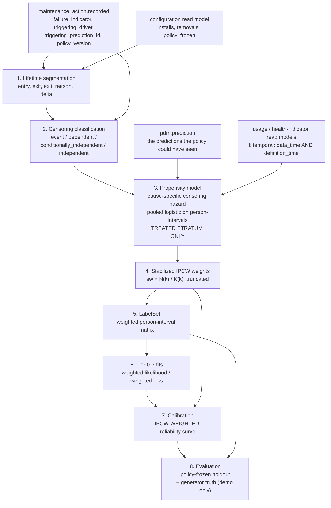

# Build Framework 22 — Predictive Maintenance (`pdm`)

| | |
|---|---|
| **Purpose** | Build specification for the Predictive Maintenance sub-application: criticality scoring and tier assignment, label construction with informative-censoring correction, four-tier model execution, calibration, prediction storage and lifecycle, and the decision-theoretic conversion the scheduling optimizer consumes |
| **Slug** | `pdm` (03 §3.1). Directory `services/pdm/`, package `fathom_pdm`. Model source `models/tier0-historical/`, `models/tier1-survival/`, `models/tier2-degradation/`, `models/tier3-hybrid/`, `models/causal/` (09 §3.1) |
| **Resolves** | **D1** (informative censoring — the highest-consequence finding in [05](../architecture/05-architecture-review-findings.md)), **D7** (cross-tier comparability), **D19** (tier-0 memorylessness), **D21** (confounded causal loop), **D23** (`contributing_factors` honesty), **D36** (tier-migration level shift), and the D34 deferral-signal defect |
| **Binding upstream** | [03 §7.1](../architecture/03-integration-contracts.md) is the authoritative `FailurePrediction` wire contract, **as corrected**. [04 §4](../architecture/04-subapplication-architectures.md) is the architecture. [06 §2, §3, §7](../architecture/06-demo-decisions-and-assumptions.md) are the decisions and the quantities. [09](09-monorepo-and-conventions.md) §4/§5/§8/§9 are the scaffold, the API rules, the Definition of Done, and the prohibitions |
| **Classification** | Internal |

---

## 0. How to read this document, and the one thing to read twice

This is the program's core capability. It is also the place where a statistical shortcut destroys the platform's credibility without producing a single error message.

**Read [§4](#4-label-construction-and-the-informative-censoring-correction-d1) twice.** Finding D1 is not a modelling refinement. It says that this service's own published predictions, once acted upon, corrupt the training data used to produce the next generation of predictions, *and that every feedback signal in the naive design points the wrong way*:

> *"Prediction-driven preventive replacement censors exactly the items about to fail. Every stated method (Weibull MLE, Cox, calibration) assumes non-informative censoring. Over time observed failures become a biased low-hazard subsample, fitted MTBF rises, `p_failure` decays, and the fleet drifts back to run-to-failure. **The calibration monitor accelerates this**, because a prevented failure reads as over-prediction and the correction pushes probabilities down. Every feedback signal points the wrong way and nothing detects it."* — [05 §2.1, D1](../architecture/05-architecture-review-findings.md)

Two consequences govern this whole document:

1. Every estimator in this service — tier-0 Weibull, tier-1 survival, tier-2 degradation, tier-3 ensemble, **and the calibration monitor itself** — is fitted on IPCW-weighted person-time, never on raw observed intervals. There is no exception and no "naive first, corrected later" path, because the naive path produces better-looking offline metrics and is therefore the one that survives schedule pressure.
2. The policy-frozen holdout stratum is isolated by **PostgreSQL row-level security under a distinct database role plus a distinct API route and a distinct Kafka topic**, not by a documented rule. §4.5 specifies the mechanism. A rule that says "the optimizer must not request holdout predictions" is worth nothing; a serving role that physically cannot `SELECT` them is worth everything.

### Reading order before writing code

1. [09](09-monorepo-and-conventions.md) §3 (layout), §4 (skeleton), §5 (API rules), §8 (DoD), §9 (DO-NOT).
2. [03](../architecture/03-integration-contracts.md) §3.3 (identity), §4 (conventions), §5.4 (envelope, baseline epoch, clock), **§6 `pdm` rows**, **§7.1 in full**, §14 (model-binding authority), §15 (obligations).
3. [04 §4](../architecture/04-subapplication-architectures.md) — but see §16 of this document: **04 §4 contains one statement that 03 §7.1 has superseded**, and following it would reintroduce D7.
4. [06 §2](../architecture/06-demo-decisions-and-assumptions.md) (causal validity), [06 §3](../architecture/06-demo-decisions-and-assumptions.md) (prediction contract), [06 §7](../architecture/06-demo-decisions-and-assumptions.md) (every quantity).
5. [10 §4.6](10-shared-packages.md) — the executable `FailurePrediction`. **It requires the change in §16 item 1 before it matches the corrected 03 §7.1.**
6. [11](11-outbox-sync-library.md) before writing anything in `events/`. [13 §8, §10, §16](13-synthetic-data-generator.md) before writing anything in `models/`.

### Convention for unsettled parameters

Every numeric threshold in this document is one of:

- **[FIXED]** — supplied by a binding upstream document, cited inline. Not revisable here.
- **[PLACEHOLDER]** — proposed by this document because no upstream document supplies a value, **requiring validation before the demonstration is presented as methodologically sound.** Every one is collected in §17. A placeholder is never to be quoted downstream as a settled figure. 09 §9.5 item 31 forbids inventing quantities; a marked placeholder with a stated derivation basis is the sanctioned alternative to silence, not an exemption.

---

## 1. Purpose and scope

**Purpose** ([04 §4](../architecture/04-subapplication-architectures.md)). Assign a modelling tier to every installed item by criticality, produce calibrated failure predictions and remaining-useful-life distributions at that tier, and expose them through one **shape-invariant** contract.

The word "shape" is load-bearing and is the correction 03 §7.1 embeds: *"Tier invariance survives as shape invariance: consumers must not branch on `tier`. They may, and must, branch on `reference_class`."*

### 1.1 Owns

| Capability | Section |
|---|---|
| Criticality scoring and tier assignment (versioned policy, not a model) | §3 |
| Label construction with explicit right-censoring and the informative-censoring correction | §4 |
| Model inventory and **tier bindings** (03 §14: *"PdM owns which registry version serves which tier and family; Domino owns the model artifacts and the registry"*) | §5.6 |
| Scoring orchestration and the baseline-fenced bulk ingest of results | §5, §10 |
| Prediction storage and lifecycle (active / invalidated / superseded) | §2.5 |
| Calibration per tier and equipment family, and the n ≥ 50 publication gate | §6 |
| The decision-theoretic conversion to expected consequence | §7 |
| Drift detection — **PdM-owned, not delegated to Domino Model Monitor**, which is unsupported on the remote data planes where all scoring runs ([01 §9](../architecture/01-system-architecture.md)) | §6.5 |
| Prediction provenance | §9.4, §10 |
| Holdout isolation enforcement | §4.5 |

### 1.2 Does not own

Features (Telemetry). Configuration and criticality *consequence weights* (Registry). Maintenance history (Scheduling). Causal findings (Failure Intelligence). `equipment_family` definition and NIIN→family assignment (Reference Data, [12 §2.7](12-reference-data-taxonomy.md)). Model artifacts, the registry, and promotion (Domino). Scheduling decisions and the optimizer's cost units (Scheduling).

Two boundaries are easy to violate:

- **PdM does not own consequence weights.** §7's conversion takes them as an *input*. 06 §3 marks them LOW confidence and a Phase 3 workshop item; a weight table hard-coded in `services/pdm` would make a program judgment into a code constant.
- **PdM does not promote models.** `model_binding.activated` **replaces** the earlier `model_version.promoted` precisely because promotion happens in Domino's registry, which is not PdM's domain, whereas the *binding* is (03 §6, `[C32]`). There is no operation, event, or column in this service named `promote`.

### 1.3 Plane placement and execution vehicles

Service, prediction store, orchestration, calibration, and invalidation on the **Sustainment Plane**. Model development, training, evaluation, registry, governance, and **all scoring execution in Domino** ([04 §4](../architecture/04-subapplication-architectures.md), [01 §9](../architecture/01-system-architecture.md)).

PdM has **no edge profile**. Every event it publishes carries `producer_node = "enterprise"` (03 §5.4). This is asserted at startup, not assumed: a PdM instance that finds an edge profile configured refuses to start, because a second instance minting its own `monotonic_seq` under the same slug is exactly the collision `producer_node` was added to prevent.

### 1.4 Demonstration envelope [FIXED — 06 §7]

| Quantity | Value |
|---|---|
| Assets | 12 (5 surface, 3 subsurface, 4 unmanned) |
| Installed items | ~8,400 |
| Distinct NIINs | ~2,500; equipment families ~120; **spotlight families 6**, ~250 items |
| Horizons per item | 3 — **30, 90, 180 days** |
| Predictions per scoring run | **~25,000** |
| Target scoring window | < 60 minutes, full fleet |
| Cadence | Daily, tiers 0–1. Per-mission-completion, tiers 2–3 |
| Policy-frozen holdout | 10% of installed items, ~840, selected **by position** ([13 §10.1](13-synthetic-data-generator.md)) |

At ~25,000 predictions per run, D27's scale objection does not bind the demonstration. It binds production (~3×10⁶ per run), which is why `prediction.updated` references the run artifact and never inlines result sets.

---

## 2. Data model

One logical PostgreSQL database, schema `pdm` (09 §8.4, obligation 13). Object storage for label sets and scoring-run artifacts. Two database **roles** over that one database — `fathom_pdm_serving` and `fathom_pdm_research` — which is the holdout mechanism of §4.5 and is not a second database.

Every aggregate below is exposed through a `changed_since` read (03 §4, obligation 5) except `LabelSet`, whose consumers are internal and whose rows are training data rather than a projected read model.

### 2.1 `criticality_assessment`

```sql
CREATE TABLE pdm.criticality_assessment (
    assessment_id        uuid PRIMARY KEY,
    niin                 char(9) NOT NULL,                 -- 03 §3.3 join key
    equipment_family     text    NOT NULL,                 -- Reference Data, versioned [D35]
    taxonomy_version     text    NOT NULL,                 -- 03 §14: every label carries it
    -- scoring context: an assessment is per NIIN *in an equipment context*, 04 §4
    system_id            uuid,                             -- parent system, where the context is narrower than the NIIN
    class_id             text,                             -- null = fleet-wide assessment
    -- the five inputs, retained as scored values so the score is reconstructible
    input_mission_criticality   numeric(5,2) NOT NULL,
    input_consequence_of_failure numeric(5,2) NOT NULL,
    input_casrep_history        numeric(5,2) NOT NULL,
    input_sensor_availability   numeric(5,2) NOT NULL,
    input_fleet_population      numeric(5,2) NOT NULL,
    input_provenance     jsonb   NOT NULL,   -- per input: source event/read model, as_of, definition_time
    score                numeric(5,2) NOT NULL CHECK (score BETWEEN 0 AND 100),
    proposed_tier        smallint NOT NULL CHECK (proposed_tier BETWEEN 0 AND 3),
    data_availability_ceiling smallint NOT NULL CHECK (data_availability_ceiling BETWEEN 0 AND 3),
    assigned_tier        smallint NOT NULL CHECK (assigned_tier BETWEEN 0 AND 3),
    tier_policy_version  text    NOT NULL REFERENCES pdm.tier_policy(policy_version),
    -- transition annotation [D36] — §8
    previous_tier        smallint CHECK (previous_tier BETWEEN 0 AND 3),
    transition_id        uuid,
    transition_reason    text,
    rescore_scoring_run_id uuid REFERENCES pdm.scoring_run(scoring_run_id),
    attributable_level_shift jsonb,          -- §8.4 dual-binding shadow score difference
    effective_at         timestamptz NOT NULL,
    superseded_at        timestamptz,
    classification       jsonb   NOT NULL,   -- 03 §7.3, with inherited_from
    CONSTRAINT tier_is_capped
        CHECK (assigned_tier = LEAST(proposed_tier, data_availability_ceiling)),
    CONSTRAINT migration_requires_rescore                  -- §8.3, [D36]
        CHECK (previous_tier IS NULL OR rescore_scoring_run_id IS NOT NULL)
);
```

`tier_is_capped` and `migration_requires_rescore` are the two invariants of §3 and §8 expressed where they cannot be bypassed. A tier assignment that exceeds what the available data supports, or a tier *migration* published without a completed re-score, is rejected by the database and not by a code review.

### 2.2 `tier_policy` and `model_binding`

```sql
CREATE TABLE pdm.tier_policy (
    policy_version   text PRIMARY KEY,           -- semver; reviewable, versioned rule set (04 §4)
    weights          jsonb NOT NULL,             -- §3.2; PLACEHOLDER values, marked in the row
    band_thresholds  jsonb NOT NULL,             -- §3.3
    hysteresis       jsonb NOT NULL,             -- §3.4
    sme_validated    boolean NOT NULL DEFAULT false,   -- §3.2; false = illustrative, and it says so on the wire
    approved_by      text, approved_at timestamptz,
    activated_at     timestamptz, retired_at timestamptz
);

CREATE TABLE pdm.model_binding (
    binding_id        uuid PRIMARY KEY,
    tier              smallint NOT NULL CHECK (tier BETWEEN 0 AND 3),
    equipment_family  text     NOT NULL,
    taxonomy_version  text     NOT NULL,         -- 12 §2.7: pinning the taxonomy pins the reference class
    registry_model_version text NOT NULL,        -- Domino registry version. PdM does not mint it
    registry_model_uri     text NOT NULL,
    approval_ref      text NOT NULL,             -- the Domino governance record; PdM records, never gates
    -- the label set and correction the model was fitted on, so a prediction is traceable to its bias posture
    label_set_id      uuid NOT NULL REFERENCES pdm.label_set(label_set_id),
    censoring_correction text NOT NULL
        CHECK (censoring_correction IN ('ipcw_stabilized')),   -- §4; the only legal value. See §14 item 3
    activated_at      timestamptz, deactivated_at timestamptz,
    UNIQUE (tier, equipment_family, taxonomy_version, activated_at)
);
```

`censoring_correction` is a `CHECK`-constrained single-value column rather than a free field on purpose. A binding fitted on uncorrected labels is not a configuration choice; it is D1 reintroduced, and the database refuses to store it. Widening this enum requires an ADR and a change to this document.

### 2.3 `label_set` and `label_observation` — censoring is explicit

[04 §4](../architecture/04-subapplication-architectures.md): *"Most installed items have not failed. Treating 'has not failed yet' as a negative example is the most common statistical error in this domain and biases every resulting model toward optimism."*

```sql
CREATE TABLE pdm.label_set (
    label_set_id       uuid PRIMARY KEY,
    equipment_family   text NOT NULL,
    taxonomy_version   text NOT NULL,
    window_start       timestamptz NOT NULL,
    window_end         timestamptz NOT NULL,     -- the administrative censoring boundary
    grid               text NOT NULL DEFAULT 'weekly',   -- §4.2 [PLACEHOLDER P-1]
    stratum            text NOT NULL
        CHECK (stratum IN ('treated', 'policy_frozen', 'combined')),
    propensity_model_id uuid REFERENCES pdm.propensity_model(propensity_model_id),
    artifact_uri       text NOT NULL,            -- object storage; the person-interval matrix
    feature_definition_time timestamptz NOT NULL, -- bitemporal bound [D22]; NOT NULL, no default
    feature_data_time_max   timestamptz NOT NULL,
    ipcw_summary       jsonb NOT NULL,           -- mean/max/ESS/truncation, per §4.3. Required
    built_at           timestamptz NOT NULL,
    classification     jsonb NOT NULL
);

CREATE TABLE pdm.label_observation (
    label_set_id       uuid NOT NULL REFERENCES pdm.label_set(label_set_id),
    installed_item_id  uuid NOT NULL,            -- the PHYSICAL item [C10]. Never position_id
    position_id        uuid NOT NULL,
    asset_id           uuid NOT NULL,
    niin               char(9) NOT NULL,
    -- lifetime segment
    entry_time         timestamptz NOT NULL,     -- install date
    usage_at_install   numeric,                  -- left-truncation offset (installed_item.installed payload)
    exit_time          timestamptz NOT NULL,
    exit_reason        text NOT NULL CHECK (exit_reason IN (
                          'failure',                  -- corrective; failure_indicator = true
                          'preventive_replacement',
                          'admin_censor',             -- window_end
                          'mission_end_censor',       -- unmanned per-sortie
                          'config_censor',            -- baseline change made the segment incomparable
                          'still_installed')),
    event_indicator    boolean NOT NULL,         -- delta. TRUE iff exit_reason = 'failure'
    -- the treatment record, verbatim from maintenance_action.recorded [D1, D21]
    triggering_driver  text CHECK (triggering_driver IN (
                          'pms_periodicity','casualty','prediction',
                          'opportunistic','opportunistic_pms')),
    triggering_prediction_id uuid,               -- FK-shaped; resolved to pdm.prediction where present
    policy_version     text,                     -- the intervention policy's version, a REQUIRED covariate
    -- the censoring classification this service derives, §4.2
    censoring_class    text NOT NULL CHECK (censoring_class IN (
                          'event',                    -- not censored
                          'dependent',                -- prediction-driven. THE D1 case
                          'conditionally_independent', -- PMS periodicity / opportunistic_pms
                          'independent')),            -- admin / mission_end / config
    -- the correction
    ipcw_weight        numeric NOT NULL,         -- stabilized weight at exit, §4.3
    ipcw_weight_truncated boolean NOT NULL,
    censoring_survival_k numeric NOT NULL CHECK (censoring_survival_k > 0),
    -- holdout marking, projected from configuration
    policy_frozen      boolean NOT NULL,
    holdout_stratum    text,
    -- deferral signal, D34
    deferral_reason_class text[],
    PRIMARY KEY (label_set_id, installed_item_id),
    CONSTRAINT dependent_censoring_has_a_driver
        CHECK (censoring_class <> 'dependent'
               OR triggering_driver IN ('prediction','opportunistic')),
    CONSTRAINT holdout_has_no_dependent_censoring          -- 13 §10.3 consequence 3, gate G-7
        CHECK (NOT policy_frozen OR censoring_class <> 'dependent'),
    CONSTRAINT frozen_items_are_unweighted                 -- §4.4
        CHECK (NOT policy_frozen OR ipcw_weight = 1.0)
);
```

Three `CHECK` constraints carry statistical content:

- `dependent_censoring_has_a_driver` makes the D1 classification derivable only from the recorded treatment fields, never from a heuristic.
- `holdout_has_no_dependent_censoring` is [13 §10.3](13-synthetic-data-generator.md)'s post-generation audit assertion, enforced a second time at the point where the label is *consumed*. If the generator's gate G-7 ever regressed, PdM's insert would fail rather than quietly fit on a contaminated holdout.
- `frozen_items_are_unweighted` prevents the subtle error §4.4 describes: a policy-frozen item has a structurally zero prediction-driven censoring hazard, so including it in the propensity fit produces separation and a degenerate weight.

### 2.4 `propensity_model` and `scoring_run`

```sql
CREATE TABLE pdm.propensity_model (
    propensity_model_id uuid PRIMARY KEY,
    spec_version       text NOT NULL,           -- §4.4's feature list, versioned
    fitted_on_label_set uuid,                    -- the treated stratum only
    grid               text NOT NULL,
    policy_version_strata text[] NOT NULL,       -- fitted stratified by policy_version. Required
    fit_artifact_uri   text NOT NULL,
    -- diagnostics that are refusal gates, not reports (§4.4)
    positivity_min_k   numeric NOT NULL,
    ess                numeric NOT NULL,
    max_stabilized_weight numeric NOT NULL,
    mean_stabilized_weight numeric NOT NULL,
    calibration_of_propensity jsonb NOT NULL,    -- the censoring model's own reliability curve
    pms_sensitivity    jsonb NOT NULL,           -- §4.3's stated-assumption sensitivity analysis
    accepted           boolean NOT NULL,
    rejection_reason   text,
    fitted_at          timestamptz NOT NULL
);

CREATE TABLE pdm.scoring_run (
    scoring_run_id     uuid PRIMARY KEY,
    stratum            text NOT NULL
        CHECK (stratum IN ('operational','holdout_research')),   -- §4.5. Runs are separated
    trigger            text NOT NULL CHECK (trigger IN (
                          'scheduled','mission_completed','on_demand',
                          'tier_migration','invalidation_rescore',
                          'binding_activation','design_change_projection')),
    scope              jsonb NOT NULL,          -- asset/family/item set
    -- baseline fencing [D3] — read at start, re-read at publish
    baseline_epoch_at_start jsonb NOT NULL,     -- per asset_id
    baseline_epoch_at_publish jsonb,
    model_bindings     uuid[] NOT NULL,
    label_set_ids      uuid[] NOT NULL,
    feature_definition_time timestamptz NOT NULL,
    domino_execution_ref text NOT NULL,          -- Job / Flow / Endpoint run id
    predictions_written int,
    predictions_rejected int,
    rejection_summary  jsonb,
    read_model_lag_at_start jsonb NOT NULL,      -- per read model; §13.3
    status             text NOT NULL CHECK (status IN (
                          'queued','running','ingesting','published','fenced_out','failed')),
    started_at timestamptz, completed_at timestamptz,
    classification     jsonb NOT NULL
);
```

`stratum` on the run — rather than only on the prediction — is what makes holdout isolation a *single* structural check instead of a per-row filter that a refactor can drop. A holdout item is scored by a run whose `stratum = 'holdout_research'`, and that run's results are the only ones the research projection can contain.

`fenced_out` is a first-class terminal status, not a failure. It is the D3 outcome: the run completed, the baseline moved underneath it, and the result was correctly refused at publication.

### 2.5 `prediction` — the stored `FailurePrediction`, with lifecycle

```sql
CREATE TYPE pdm.prediction_status AS ENUM ('active','invalidated','superseded');
CREATE TYPE pdm.serving_class    AS ENUM ('actionable','research_only');
CREATE TYPE pdm.reference_class  AS ENUM ('item','niin_fleet','equipment_family','class_estimate');

CREATE TABLE pdm.prediction (
    prediction_id      uuid PRIMARY KEY,
    scoring_run_id     uuid NOT NULL REFERENCES pdm.scoring_run(scoring_run_id),
    -- 03 §7.1, transcribed. The Pydantic model in 10 §4.6 is the executable copy.
    asset_id           uuid NOT NULL,
    installed_item_id  uuid NOT NULL,
    position_id        uuid NOT NULL,
    niin               char(9) NOT NULL,
    equipment_family   text NOT NULL,
    baseline_id        uuid NOT NULL,
    baseline_epoch     bigint NOT NULL,
    horizon_days       int NOT NULL CHECK (horizon_days > 0),
    p_failure          numeric CHECK (p_failure BETWEEN 0 AND 1),   -- NULLABLE. 03 §7.1 as corrected
    reference_class    pdm.reference_class NOT NULL,
    sharpness          numeric NOT NULL,
    calibration_population int NOT NULL,        -- PdM always populates it; see note below
    rul                jsonb,                   -- {p10,p50,p90,unit} or NULL
    population_hazard_rate numeric CHECK (population_hazard_rate >= 0),
    confidence         numeric NOT NULL CHECK (confidence BETWEEN 0 AND 1),
    fallback_level     smallint NOT NULL CHECK (fallback_level BETWEEN 0 AND 4),
    tier               smallint NOT NULL CHECK (tier BETWEEN 0 AND 3),
    contributing_factors jsonb NOT NULL DEFAULT '[]'::jsonb,
    model_version      text NOT NULL,
    computed_at        timestamptz NOT NULL,
    -- PdM-internal lifecycle and serving control. NOT on the wire contract.
    status             pdm.prediction_status NOT NULL DEFAULT 'active',
    serving_class      pdm.serving_class NOT NULL,      -- §4.5. Set by the server, never by the caller
    invalidated_at     timestamptz,
    invalidation_cause text CHECK (invalidation_cause IN (
                          'baseline_changed','tier_migration','binding_deactivated',
                          'calibration_withdrawn','item_removed','label_set_retracted')),
    superseded_by      uuid REFERENCES pdm.prediction(prediction_id),
    provenance_id      uuid NOT NULL REFERENCES pdm.prediction_provenance(provenance_id),
    classification     jsonb NOT NULL,
    UNIQUE (installed_item_id, horizon_days, scoring_run_id),

    -- ---- the corrected 03 §7.1 conditionals, enforced in the database ----
    CONSTRAINT rul_only_when_item_conditional CHECK (            -- [D19]
        (reference_class = 'item'     AND rul IS NOT NULL AND population_hazard_rate IS NULL)
     OR (reference_class <> 'item'    AND rul IS NULL     AND population_hazard_rate IS NOT NULL)),
    CONSTRAINT calibration_gate CHECK (                          -- 03 §7.1, 06 §3
        (calibration_population >= 50)
     OR (reference_class = 'class_estimate'
         AND p_failure IS NULL
         AND population_hazard_rate IS NOT NULL)),
    CONSTRAINT p_failure_requires_a_calibrated_cell CHECK (
        p_failure IS NULL OR calibration_population >= 50),
    CONSTRAINT sub_gate_is_deep_fallback CHECK (                 -- §6.3
        calibration_population >= 50 OR fallback_level >= 3)
);

-- §4.5: the holdout isolation mechanism. Two roles, two policies, one table.
ALTER TABLE pdm.prediction ENABLE ROW LEVEL SECURITY;
ALTER TABLE pdm.prediction FORCE ROW LEVEL SECURITY;
CREATE POLICY actionable_only ON pdm.prediction
    FOR ALL TO fathom_pdm_serving  USING (serving_class = 'actionable');
CREATE POLICY research_only  ON pdm.prediction
    FOR SELECT TO fathom_pdm_research USING (serving_class = 'research_only');
```

Four notes on the transcription, each of which is a defect if varied:

- **`p_failure` is nullable.** 03 §7.1 as corrected: *"NULL when `calibration_population` < 50 … A predicted probability that cannot be calibrated must not be emitted merely because the field exists; omission is the honest signal."* The Pydantic model in [10 §4.6](10-shared-packages.md) currently types it `float` and required, and records the contradiction as OQ-10. **OQ-10 is now resolved by 03's correction, in favour of 06 §3's reading.** See §16 item 1: `packages/canonical-schemas` must change before this service can be conformant.
- **`calibration_population` is `NOT NULL` here** although the wire type permits null ("null if ungated"). PdM always knows the cell count, including when it is 7. Publishing `null` would hide *why* `p_failure` was suppressed, and the honest signal 03 §7.1 asks for is the small number, not its absence.
- **`p_failure_requires_a_calibrated_cell`** is the converse of `calibration_gate` and is not redundant with it. Without it, a row with `reference_class = 'class_estimate'`, `n = 12`, and a populated `p_failure` satisfies the first constraint's second branch only if `p_failure IS NULL` — which it does enforce — but the explicit converse documents the rule for a reader and survives any future weakening of the disjunction.
- **`sub_gate_is_deep_fallback`** ties §6.3's two consequences together: a cell below the gate is, by definition, a cell where item and NIIN-fleet history were insufficient, so `fallback_level` cannot be 0–2.

`serving_class` is written by the ingest operation from PdM's own configuration read model. The bulk ingest schema **does not contain the field**; a caller cannot set it, cannot override it, and cannot observe what it was set to except through the projection its credential permits.

### 2.6 `prediction_provenance`

Obligation 9 requires provenance *"sufficient to trace any operator-visible figure to its sources."* For a prediction that means:

```sql
CREATE TABLE pdm.prediction_provenance (
    provenance_id      uuid PRIMARY KEY,
    scoring_run_id     uuid NOT NULL,
    model_binding_id   uuid NOT NULL,
    label_set_id       uuid NOT NULL,
    propensity_model_id uuid,                    -- null only for a first-generation fit with no treated history
    calibration_record_id uuid,                  -- null below the gate; the reason is then in gate_decision
    gate_decision      jsonb NOT NULL,           -- {cell_key, n, gate_passed, forced_reference_class, reason}
    feature_observations jsonb NOT NULL,         -- every observation_ref used, with (data_time, definition_time)
    feature_definition_time timestamptz NOT NULL,
    fallback_path      jsonb NOT NULL,           -- the hierarchy walk that produced fallback_level, §5.7
    -- D23 honesty accounting, §9
    attribution_method text,
    stability_threshold_applied numeric,
    suppressed_factor_count int NOT NULL DEFAULT 0,
    suppressed_factors jsonb NOT NULL DEFAULT '[]'::jsonb,   -- retained, not displayed
    -- D36 transition annotation, §8
    transition_annotation jsonb,
    -- staleness posture at computation, §13.3
    read_model_lag     jsonb NOT NULL,
    per_asset_label_lag_days numeric,
    classification     jsonb NOT NULL
);
```

`suppressed_factors` is retained rather than discarded: D23's defect is *displaying* an unidentified attribution, not computing one. An auditor asking "what did the model think, and why was it not shown" must be answerable.

### 2.7 `calibration_record`

```sql
CREATE TABLE pdm.calibration_record (
    calibration_record_id uuid PRIMARY KEY,
    -- the cell key. §6.1
    tier              smallint NOT NULL CHECK (tier BETWEEN 0 AND 3),
    equipment_family  text NOT NULL,
    horizon_days      int NOT NULL,
    reference_class   pdm.reference_class NOT NULL,
    taxonomy_version  text NOT NULL,
    stratum           text NOT NULL CHECK (stratum IN ('treated','policy_frozen')),
    -- population and power
    calibration_population int NOT NULL,          -- resolved item-horizon observations. THE gate input
    effective_sample_size  numeric NOT NULL,      -- IPCW ESS. Recorded, alarmed, NOT a second gate (§6.2)
    events_observed        numeric NOT NULL,      -- IPCW-weighted event count
    powered                boolean NOT NULL,
    gate_passed            boolean NOT NULL,      -- calibration_population >= 50
    -- the fit
    method            text NOT NULL CHECK (method IN ('isotonic','beta','identity_suppressed')),
    fit_artifact_uri  text,
    -- observed against predicted, IPCW-weighted (§6.4). This is the D1-critical part.
    reliability_curve jsonb NOT NULL,             -- bins: predicted, weighted_observed, n, ess, ci
    weighted_calibration_error numeric NOT NULL,  -- weighted ECE
    unweighted_calibration_error numeric NOT NULL, -- retained SOLELY to show the bias, never to act on
    picp_rul          numeric,                    -- p10/p90 interval coverage, item-conditional cells only
    -- drift
    drift_state       text NOT NULL CHECK (drift_state IN ('stable','warning','drifting','withdrawn')),
    drift_evidence    jsonb NOT NULL,
    computed_at       timestamptz NOT NULL,
    window_start timestamptz NOT NULL, window_end timestamptz NOT NULL,
    classification    jsonb NOT NULL,
    UNIQUE (tier, equipment_family, horizon_days, reference_class, taxonomy_version, stratum, window_end)
);
```

`unweighted_calibration_error` exists for exactly one purpose: it is the number the naive design would have acted on, retained alongside the number this design does act on, so that the divergence between them is visible in the demonstration and monitorable in production. It is never an input to a recalibration decision. A `WHERE` clause selecting it for that purpose is a defect and the D1 failure mode in one line of SQL.

---

## 3. The criticality scorer and the tier assignment engine

[04 §4](../architecture/04-subapplication-architectures.md): *"Tier assignment is policy, and it is separate from the models… a reviewable, versioned rule set that produces an auditable score, not a model output."*

### 3.1 The five inputs, and where each comes from

| Input | Source | Read as | Normalization to 0–100 |
|---|---|---|---|
| Mission-criticality of the parent system | Registry configuration read model (`configuration.baseline_changed`, `asset.registered`) | Registry-carried criticality attribute on the parent `system_id` | Registry's band mapped to {0, 33, 67, 100} |
| Consequence of failure | Registry criticality attribute on the NIIN in context | Consequence band | Same three-band map, **06 §3: LOW confidence, "a program judgment requiring subject-matter validation"** |
| CASREP history for the NIIN, fleet-wide | Scheduling read model of `maintenance_action.recorded` where `failure_indicator = true` and severity is CASREP-class | **IPCW-weighted** fleet failure count per operating-year per item, percentile-ranked within the domain | Percentile × 100 |
| Sensor availability | Telemetry read model of `health_indicator.computed` channel coverage for the item's `position_id` | Fraction of the family's declared diagnostic channel set that is mapped and reporting | Fraction × 100 |
| Fleet-wide population of the NIIN | Registry configuration read model | Installed count, **inverted** — a large population supports a population fit and needs no per-item model; a small population is where per-item modelling earns its cost | (1 − population percentile) × 100 |

The CASREP-history input is IPCW-weighted for the same reason everything else is: an unweighted fleet failure rate falls as the platform intervenes more, which would silently *de-tier* exactly the NIINs the platform is successfully managing. This is D1 reaching into the criticality policy, and it is the least obvious place it appears.

### 3.2 The scoring formula — **[PLACEHOLDER P-2], requiring SME validation**

[04 §4](../architecture/04-subapplication-architectures.md)'s own Phase 3 question list opens with: *"Criticality scoring formulation and the weights, which are a program judgment requiring subject-matter validation rather than an analytic choice."* No upstream document supplies weights. This document therefore proposes a formula and marks it, and the marking is carried onto the wire.

```
score = 100 × Σ_j w_j × x_j / Σ_j w_j            over the five normalized inputs

PROPOSED weights [PLACEHOLDER P-2]:
    w_mission_criticality    = 0.30
    w_consequence_of_failure = 0.25
    w_casrep_history         = 0.20
    w_sensor_availability    = 0.15
    w_fleet_population       = 0.10
```

Rationale for the *shape*, which is defensible independent of the weights: a linear weighted sum over five bounded, separately-auditable inputs is explicable to a reliability engineer, which [04 §4](../architecture/04-subapplication-architectures.md) requires (*"Tier assignment must be explicable to a reliability engineer"*). A learned scorer, an interaction term, or a rule tree would each be more expressive and none would be explicable in a review meeting.

Rationale for the *ordering*, offered as the basis SMEs should argue with: mission-criticality and consequence-of-failure dominate because they are the reasons the Navy cares; CASREP history is evidence rather than consequence; sensor availability and population are *feasibility* inputs and are deliberately the smallest weights, because feasibility belongs in the ceiling of §3.3, not in the score. Putting sensor availability into the score at all is arguably double-counting — it is retained at a small weight only because 01 §7 and 04 §4 both name it as a scoring input.

**Enforcement of the placeholder marking.** `tier_policy.sme_validated` defaults false. Every `criticality_tier.assigned` event and every `GET /criticality` response carries `sme_validated` and `tier_policy_version`. The operator UI renders an unvalidated tier as *provisional*. A policy row cannot be activated with `sme_validated = false` in a namespace whose `values.yaml` declares `environment: production`; the migration hook asserts it. The demonstration runs with `sme_validated = false` and says so, which is stronger than a silent number.

### 3.3 Tier assignment — the score proposes, data availability caps

```
proposed_tier  = 3  if score >= 80        [PLACEHOLDER P-3: band edges]
                 2  if 60 <= score < 80
                 1  if 35 <= score < 60
                 0  if score < 35

data_availability_ceiling =
    3  if  the item's family has spotlight-grade channel coverage mapped at this position
           AND at least one adjudicated causal_finding.published exists for the family
           AND a causal_feature_set.updated definition set is available and definition-time pinned
    2  if  condition/sensor channels are mapped and reporting for this position
    1  if  a usage counter exists for this item with an unbroken counter_epoch since install
    0  otherwise

assigned_tier = min(proposed_tier, data_availability_ceiling)
```

The ceiling is the mechanic that makes tier assignment honest. A mission-critical NIIN with no instrumentation is a **tier-0 item with a criticality score of 92**, not a tier-3 item with fabricated inputs — and that pairing is itself the most useful output of the scorer, because it is a directly actionable instrumentation-investment list. `GET /criticality?ceiling_limited=true` returns exactly that list, and 06 §9.3 describes this as the tiering model's use as an investment prioritization tool.

The tier-1 ceiling condition names `counter_epoch` deliberately. D9's usage-counter defect means a reset or a replaced meter breaks the item's usage clock; an item whose `counter_epoch` has advanced without a corresponding `usage_counter.reset` reconciliation does not have a usable usage covariate and drops to the tier-0 ceiling until it does.

### 3.4 Hysteresis, and what hysteresis does not fix

A tier change requires the score to cross a band edge by **≥ 5 points** and to persist across **2 consecutive assessments** — **[PLACEHOLDER P-4]**.

State plainly what this achieves and what it does not, because D36 makes the distinction: *"Hysteresis damps oscillation around a threshold, not a level shift."* Hysteresis stops a NIIN flapping between tier 1 and tier 2 as its CASREP percentile jitters. It does nothing whatsoever about the discontinuity in *published value* when a sensor-installation campaign moves 300 NIINs from a population rate to an item-conditional estimate. That is §8's problem and it needs a different mechanism.

### 3.5 Dry-run before activation

`POST /tier-policies/{version}/dry-run` (`x-side-effects: none`) scores the entire fleet under a candidate policy and returns the tier delta — counts by (previous_tier → new_tier), the affected item set, the predictions that would be invalidated, and the estimated re-scoring cost. A policy activation without a retained dry-run artifact is rejected: `tier_policy.activated_at` cannot be set unless a dry-run for that `policy_version` exists within **[PLACEHOLDER P-5] 30 days**. This is what makes §8's "re-score before publication" plannable rather than an emergency.

---

## 4. Label construction and the informative-censoring correction (D1)

**This is the core algorithm of the service and the section a Sonnet-tier implementer must not be able to skip.** Every specification below is a mechanism, a named method, or an enforced constraint. Where a value is unsettled it is marked; where a *method* is unsettled, it is not — the method is chosen here.

### 4.1 The pipeline



Step 8 reads the holdout stratum, which steps 3–7 never do. That asymmetry is the whole design.

### 4.2 Steps 1 and 2 — segmentation and censoring classification

**Lifetime segmentation.** One segment per `(installed_item_id, install → exit)`. Segments attach to the **installed item**, never the position (`[C10]`, 03 §3.3 rule 3): a replacement pump starts a new segment with `usage_at_install` as its left-truncation offset, and inheriting the predecessor's age is the inherited-degradation defect the identity model exists to prevent.

A `configuration.baseline_changed` that alters the item's parent configuration in a way that changes its operating context terminates the segment with `exit_reason = 'config_censor'`. This is independent censoring: the baseline change is a configuration decision, not a response to the item's condition.

**Censoring classification** is a total function of three recorded fields — `failure_indicator`, `triggering_driver`, and `exit_reason` — and of nothing else:

| `exit_reason` | `failure_indicator` | `triggering_driver` | `censoring_class` | δ | In the IPCW weight? |
|---|---|---|---|---|---|
| `failure` | true | `casualty` | `event` | 1 | Contributes as an event |
| `preventive_replacement` | false | **`prediction`** | **`dependent`** | 0 | **Yes — this is D1** |
| `preventive_replacement` | false | **`opportunistic`** | **`dependent`** | 0 | **Yes** |
| `preventive_replacement` | false | `pms_periodicity` | `conditionally_independent` | 0 | No, subject to §4.3's stated assumption and its sensitivity test |
| `preventive_replacement` | false | `opportunistic_pms` | `conditionally_independent` | 0 | No, same assumption |
| `admin_censor` | — | — | `independent` | 0 | No |
| `mission_end_censor` | — | — | `independent` | 0 | No |
| `config_censor` | — | — | `independent` | 0 | No |
| `still_installed` | — | — | `independent` | 0 | No |

`triggering_driver = 'opportunistic'` is classified as dependent because [13 §8.4](13-synthetic-data-generator.md) defines it as *"an availability or another work item opened access, **and a prediction contributed to the decision**"* — a prediction contributed, therefore the censoring is prediction-driven. `opportunistic_pms` is the case where *only* periodicity contributed. Collapsing these two into one "opportunistic" bucket loses the distinction the correction depends on, and is the most likely implementation error in this table.

**The `triggering_prediction_id` is not decorative.** Where present it resolves to a row in `pdm.prediction`, which gives the propensity model the *exact* prediction the policy acted on — its `p_failure` (or `population_hazard_rate`), `reference_class`, `rul.p50`, `confidence`, `fallback_level`, `horizon_days`, and `computed_at`. Those are the policy's own decision inputs. Without them the propensity model is guessing at the treatment-assignment mechanism; with them it is *modelling the recorded mechanism*, which is why 03 §6 says the three fields are *"the treatment-assignment mechanism, without which neither calibration nor causal analysis can condition on the intervention policy."*

A `triggering_driver = 'prediction'` whose `triggering_prediction_id` does not resolve is a **data-quality defect, recorded and counted**, not silently downgraded to `conditionally_independent`. `label_set.ipcw_summary.unresolved_treatment_refs` carries the count, and the label set is marked `powered = false` for any family where it exceeds **[PLACEHOLDER P-6] 5%** of dependent-censoring events.

**Grid.** Person-time is discretized to **weekly** intervals — **[PLACEHOLDER P-1]**. Basis for the proposal: maintenance opportunity is the unit of treatment assignment and it does not arrive at daily resolution; weekly keeps the pooled-logistic design matrix at ~8,400 items × ~104 weeks ≈ 8.7×10⁵ person-intervals, which fits comfortably in one Domino Job. Daily is the alternative and is affordable at demonstration scale; the choice must be made once and recorded on `label_set.grid`, because a weight computed on one grid is not comparable to one computed on another.

### 4.3 Step 4 — the IPCW weight computation, exactly

This is stated as arithmetic so there is no judgment left open.

**Notation.** For item *i* and interval *k* (weekly), let `R_ik = 1` if *i* is at risk at the start of *k* (installed, not yet exited). Let `D_ik = 1` if *i* exits in interval *k* with `censoring_class = 'dependent'`. Let `X_ik` be the time-varying covariate vector of §4.4 and `V_i` the baseline-only subvector.

**1. Cause-specific dependent-censoring hazard**, fitted as a pooled logistic regression over all at-risk person-intervals of the **treated stratum**:

```
logit P(D_ik = 1 | R_ik = 1, X_ik)  =  a(k) + b' X_ik
```

where `a(k)` is a restricted cubic spline in the interval index with **4 knots at the 5th, 35th, 65th and 95th percentiles** of observed interval indices — a flexible baseline censoring hazard, because assuming a constant one would attribute the policy's own capacity cycle to the covariates. The model is **fitted stratified by `policy_version`**: [13 §8.4](13-synthetic-data-generator.md) guarantees the policy changes at least once in the window, and *"a single frozen policy makes propensity modeling trivially easy and hides the versioning requirement."* One pooled fit across a policy change estimates neither policy.

**2. Censoring survival**, the cumulative probability of remaining uncensored-by-the-policy through interval *k*:

```
K_i(k)  =  Π_{j = 1..k}  ( 1 − p̂_ij )        where p̂_ij = fitted P(D_ij = 1 | R_ij = 1, X_ij)
```

**3. Stabilized weights.** Fit a second, *numerator* model with baseline covariates only (`V_i` = equipment family, domain, criticality tier at install, `policy_version`, asset class), giving `q̂_ij`, and

```
N_i(k)  =  Π_{j = 1..k} ( 1 − q̂_ij )

sw_i(k) =  N_i(k) / K_i(k)                    ← the stabilized weight. THIS is what estimators use.
w_i(k)  =  1 / K_i(k)                         ← unstabilized; computed and reported, never used to fit
```

Stabilized weights are used because their mean is ≈ 1 and their variance is materially lower, which matters acutely at ~8,400 items where an unstabilized weight of 40 on one item dominates a family's fit. The unstabilized weight is retained per observation so that the stabilization can be audited.

**4. Truncation.** `sw` is truncated at the **99th percentile within `(equipment_family, policy_version)`** — **[PLACEHOLDER P-7]** — and `label_observation.ipcw_weight_truncated` records whether truncation bound that row. Truncation trades a little bias for a lot of variance and the trade must be visible: `label_set.ipcw_summary` reports the fitted parameter with and without truncation, and a family whose fitted MTBF moves by more than **[PLACEHOLDER P-8] 10%** under truncation is flagged `truncation_sensitive` in the V&V record.

**5. Refusal gates on the weights themselves.** `pdm.propensity_model.accepted` is set false, and no fit may consume the label set, if any of the following holds:

| Gate | Condition | Why |
|---|---|---|
| Positivity | `min_i,k K_i(k) < 0.05` **[PLACEHOLDER P-9]** | A stratum with near-certain intervention has no untreated counterfactual. The weight is unbounded and the estimate is an extrapolation, not a correction |
| Effective sample size | `ESS = (Σ sw)² / Σ sw² < 50` within a family | Below the same floor 06 §3 sets for calibration. A "corrected" estimate on an ESS of 9 is worse than an honest uncorrected one, because it looks corrected |
| Weight magnitude | `max sw > 20` **[PLACEHOLDER P-10]** without truncation applied | A single item carrying 20 items' worth of the likelihood |
| Propensity calibration | the censoring model's own weighted ECE > **[PLACEHOLDER P-11] 0.05** | IPCW is only as good as `K`. A miscalibrated censoring model produces confidently wrong weights, which is D1 with extra steps |
| Discrimination floor | censoring-model AUC < 0.55 | A propensity model with no signal means the treatment mechanism was not captured; the weights are noise and the "correction" is cosmetic |

A rejected propensity model does not silently fall back to unweighted fitting. The scoring run fails with `status = 'failed'`, `fathom_pdm_propensity_rejections_total` increments, and the previous accepted binding continues to serve. **Failing to produce a new model is always preferable to producing one on uncorrectable labels**, because the second is undetectable downstream.

**6. Variance.** All interval estimates come from a **nonparametric bootstrap over items, B = 1000**, in which the propensity model is **refitted inside each replicate**. Refitting inside the bootstrap is not optional: treating `sw` as fixed known constants ignores the weights' own estimation uncertainty and produces confidence intervals that are too narrow by a margin that grows with the propensity model's complexity.

**7. The stated assumption, and its sensitivity test.** PMS-periodicity censoring is treated as *conditionally* independent — independent of `T*` given calendar age, cumulative usage, and periodicity-remaining, all of which are in `X_ik`. This is an assumption, not a fact. `propensity_model.pms_sensitivity` therefore holds a second complete fit in which `pms_periodicity` and `opportunistic_pms` are *also* treated as dependent causes and weighted. If the corrected parameter moves by more than the bootstrap CI half-width between the two specifications, the assumption is not supportable for that family and the family's `label_set` is marked `pms_dependent = true`, after which the weighted specification is the one that serves. Running only the primary specification and asserting the assumption in prose is the failure mode this gate exists to prevent.

**8. How the weights enter each estimator.**

| Estimator | Where `sw` enters |
|---|---|
| Non-parametric reference (all tiers) | Inverse-probability-weighted product-limit (weighted Kaplan–Meier): `Ŝ(t) = Π_{t_j ≤ t} (1 − d_j^w / n_j^w)` with `d_j^w = Σ_i sw_i(t_j)·1{event at t_j}` and `n_j^w = Σ_i sw_i(t_j)·1{at risk at t_j}` |
| Tier 0 Weibull | Each item's contribution to the right-censored Weibull log-likelihood is multiplied by `sw_i` at exit |
| Tier 1 AFT / Cox | `sw` as observation weights in the (partial) likelihood |
| Tier 2 / 3 | `sw` as per-observation sample weights in the training loss; and as the covariate-shift weights in **weighted split-conformal** interval calibration (§5.4) |
| **Calibration monitor** | `sw` as the weight on the observed frequency in every reliability bin (§6.4). **This is the D1 corollary and the single most consequential place the weights appear** |

### 4.4 Step 3 — the propensity model's features

The outcome is "a prediction-driven preventive removal occurs in this interval." The features are what a real maintenance system observes at that moment, which is the same set the intervention policy in [13 §8.4](13-synthetic-data-generator.md) is permitted to consume through the veil. Every feature is read through `FeatureStorePort` with **both** a data-time and a definition-time bound (01 §9, `[D22]`); a feature read with only `as_of` is a defect, because indicator definitions are recomputed over history and a 2026-authored definition applied to a 2025 interval encodes the outcome.

| Group | Features |
|---|---|
| **Prediction exposure — the primary treatment-assignment signal** | Most recent published prediction for the item at each horizon: `p_failure` (with an explicit missing-indicator when null), `population_hazard_rate`, `reference_class` (categorical), `rul.p50` and `rul.p10` where present, `confidence`, `sharpness`, `fallback_level`, `tier`, `horizon_days`, days since `computed_at`; whether the item was above the policy's action threshold; count of consecutive intervals above threshold |
| **Policy** | `policy_version` (stratification variable, not a coefficient) |
| **Criticality** | `criticality_assessment.score`, `assigned_tier`, `data_availability_ceiling`, `equipment_family`, `niin` (as a family-nested random effect or target-encoded within fold, never as a raw high-cardinality dummy set) |
| **Usage and age** | Calendar days since install, cumulative usage counter and its `counter_epoch`, usage rate over the trailing 4 intervals, days since last maintenance action of any kind, PMS periodicity remaining |
| **Opportunity and capacity — the confounder a naive analysis misses** | Asset OFRP phase and `asset.status_changed` operational status, in-port vs. underway, availability window open, count of open work orders on the asset, asset maintenance backlog, **interventions already performed on this asset in the current in-port period** ([13 §8.4](13-synthetic-data-generator.md): *"Interventions therefore queue, and the queue is a confounder that a naive analysis will miss — which is the point"*) |
| **Supply** | NIIN on-hand at the item's location, `lead_time`, `condition_code`, interchangeable-group availability (from the `part_availability.changed` read model). Awaiting-parts time is inside MDT ([13 §11.3](13-synthetic-data-generator.md)), so parts availability gates intervention and is a genuine confounder |
| **Condition** (spotlight items) | Latest health-indicator values and their trailing slopes, confirmed `anomaly_tag.confirmed` count in the trailing window, definition-time pinned |
| **Deferral** | Counts by `deferral_reason_class`. **Only `risk_disagreement` is evidence about prediction quality** **[AMENDMENT — this row previously spelled it `disagreement_with_risk`, a literal 24-scheduling.md's own enum does not produce; the mismatch meant every genuine risk-disagreement deferral fell through to the opportunity-covariate branch, inverting D34's whole point]** — 03 §6 and D34: *"A deferral is a capacity or operational-tempo decision at least as often as a disagreement with the risk estimate; feeding it back as the latter biases models toward under-prediction."* Capacity, tempo, and parts-unavailability deferrals enter the propensity model as *opportunity* covariates, which is what they are, and enter no label as evidence |
| **Context** | Domain, `class_id`, month index, interval index (via the spline) |

**Fitting sample: the treated stratum only.** Policy-frozen items are **excluded from the propensity fit** and assigned `sw = 1` (enforced by `frozen_items_are_unweighted`). Their prediction-driven censoring hazard is structurally zero, so including them produces perfect separation on `policy_frozen`, an infinite coefficient, and a degenerate model. This is a subtle enough error to be worth its own conformance test (§12.4).

**Specification.** Pooled logistic regression is the primary specification: it is interpretable, its coefficients are inspectable by a reliability engineer, and its calibration is directly checkable. A gradient-boosted alternative is fitted as a **sensitivity specification only**, with monotone constraints on the prediction-exposure features, and is compared on the propensity model's own calibration and on the resulting corrected parameter. Where the two disagree by more than the bootstrap CI half-width, the disagreement is reported in the V&V record rather than resolved by preference. `propensity_model.spec_version` names which specification served.

### 4.5 Step 8 and the holdout — the policy-frozen stratum, and how it is isolated

[06 §2](../architecture/06-demo-decisions-and-assumptions.md): 10% of installed items, stratified across equipment families and all three domains, *"maintained on unmodified PMS periodicity and excluded from prediction-driven intervention."* [13 §10](13-synthetic-data-generator.md) implements it, selected **by position** so a replacement cannot leave the stratum mid-window, and marks it in three places that must agree.

#### 4.5.1 How PdM learns which items are frozen — and what it does if nobody tells it

`policy_frozen` belongs on the installed item in configuration, exactly as [13 §10.2](13-synthetic-data-generator.md) places it (*"So every consumer of configuration knows, without a join to an evaluation artifact"*). PdM projects `policy_frozen` and `holdout_stratum` into its configuration read model from `installed_item.installed` and `configuration.baseline_changed`, and rebuilds them from `GET /api/v1/registry/installed-items?changed_since=`.

**The field does not currently appear in 03's Registry payloads or in `InstalledItemRef`.** That is a genuine gap, raised as §16 item 4. Until it is closed, PdM **fails closed**: if the configuration read model cannot supply `policy_frozen` for every installed item in a scoring run's scope, **every prediction in that run is written with `serving_class = 'research_only'`** and the run's `status` is `published` with a `holdout_source_unavailable` provenance flag. The operator sees an empty actionable prediction set and an explicit alarm.

Failing closed is deliberate and is the correct direction of error. The alternative — defaulting `policy_frozen` to false — silently serves holdout predictions to the optimizer, destroys the unconfounded stratum permanently and invisibly, and cannot be detected after the fact because the contamination is in the maintenance record rather than in any log.

#### 4.5.2 Predictions for frozen items are computed, and are unreachable by the optimizer

Holdout items **are** scored. [13 §10.4](13-synthetic-data-generator.md) requires it: the stratum's value is that its failure-time distribution is uninfluenced, and measuring warning lead-time coverage against it requires predictions to exist. What must be impossible is that those predictions reach the scheduling optimizer, or any surface that leads to a work candidate.

Five mechanisms, in order of how hard each is to circumvent:

**1. Separate scoring runs.** A holdout item is scored by a run with `stratum = 'holdout_research'`. The ingest operation rejects, with 422, any prediction whose item's `policy_frozen` disagrees with the run's stratum. One check, at one place, on one column.

**2. `serving_class` is server-assigned.** The bulk ingest request schema has no `serving_class` field. The server derives it from its own read model:
`serving_class = 'research_only' if installed_item.policy_frozen else 'actionable'`. A Domino Job cannot set it, cannot see it, and cannot infer from the response what was set.

**3. PostgreSQL row-level security under two roles — the mechanism that survives a refactor.**

```sql
-- Serving path: the API's normal connection. RLS makes research rows non-existent.
CREATE ROLE fathom_pdm_serving;
GRANT SELECT, INSERT, UPDATE ON pdm.prediction TO fathom_pdm_serving;
CREATE POLICY actionable_only ON pdm.prediction FOR ALL TO fathom_pdm_serving
    USING (serving_class = 'actionable');

-- Research path: a distinct role, distinct connection pool, SELECT only.
CREATE ROLE fathom_pdm_research;
GRANT SELECT ON pdm.prediction TO fathom_pdm_research;
CREATE POLICY research_only ON pdm.prediction FOR SELECT TO fathom_pdm_research
    USING (serving_class = 'research_only');

ALTER TABLE pdm.prediction ENABLE ROW LEVEL SECURITY;
ALTER TABLE pdm.prediction FORCE ROW LEVEL SECURITY;   -- applies to the table owner too
```

This is the load-bearing control and the reason it is not merely a `WHERE` clause. A `WHERE serving_class = 'actionable'` predicate in a repository method is one careless refactor, one new query path, one debugging session, or one "just for this report" join away from being absent — and its absence produces *no error*, only a silently contaminated fleet. Under RLS, an ad-hoc query, a new endpoint, a hurried join, a migration script, and an admin console session on the serving role all return zero rows for holdout items, because those rows are not visible to that role at all. `FORCE ROW LEVEL SECURITY` closes the table-owner bypass. The research role holds no `INSERT`, `UPDATE`, or `DELETE` on any table, mirroring [13 §8.6](13-synthetic-data-generator.md)'s credential separation for the truth partition.

**4. Two API routes, with different annotations and different authorization.**

| Route | `x-substitution` | `x-side-effects` | `x-agent-eligible` | DB role | Returns |
|---|---|---|---|---|---|
| `GET /api/v1/pdm/predictions` | `required` | `none` | yes | `fathom_pdm_serving` | Actionable only. A frozen item is **absent**, not zeroed, not flagged |
| `GET /api/v1/pdm/predictions/{id}` | `required` | `none` | yes | `fathom_pdm_serving` | **404** with problem type `urn:fathom:problem:pdm:prediction-not-actionable`, whose `detail` names the research route. Distinguishable from a genuine 404 by the `type` URI, which is what RFC 9457 `type` is for and `detail` is not (03 §4: *"`detail` is never used for control flow"*) |
| `GET /api/v1/pdm/research/predictions` | `internal` | `none` | **no — agents cannot reach it** | `fathom_pdm_research` | Research projection. Every item carries `serving_class: "research_only"` and `actionable: false`; every response carries `X-Fathom-Prediction-Use: research-only`. Requires ABAC role `research_analyst`, which no agent identity and no Scheduling workload identity holds |
| `POST /api/v1/pdm/what-if` | `required` | `none` | yes | `fathom_pdm_serving` | **422** `urn:fathom:problem:pdm:policy-frozen-item` for a frozen item. A what-if is an intervention-planning act |
| `POST /api/v1/pdm/expected-consequence` | `required` | `none` | yes | `fathom_pdm_serving` | **422** for a `research_only` prediction id. §7's conversion is the optimizer's input and must refuse to produce one |

Holdout membership is deliberately *visible* — [13 §10.2](13-synthetic-data-generator.md): *"A hidden holdout is not implementable in production."* So `GET /criticality` and the configuration projection may state that an item is policy-frozen. What is unavailable through the actionable surface is the *prediction*, because that is what an optimizer acts on.

**5. Topic separation with a broker ACL.** `prediction.updated` for a `holdout_research` run publishes to `fathom.pdm.research_prediction.v1`, a topic on which the `maintenance` and `fleet-status` consumer principals hold **no read ACL**. The actionable topic `fathom.pdm.prediction.v1` never carries a holdout run: the publisher asserts `scoring_run.stratum = 'operational'` before emitting, and since `prediction.updated` references the run artifact rather than inlining results (`[D27]`), the artifact fetch is itself subject to mechanisms 3 and 4. A Scheduling bug that subscribes to the research topic gets an authorization failure, not data.

#### 4.5.3 What the holdout is used for

| Use | Sample | Mechanism |
|---|---|---|
| Unconfounded validation of every fit | `stratum = 'policy_frozen'` label set | Fits are trained on `treated`, evaluated on `policy_frozen`. A fit evaluated on the stratum it was trained on is not a validation |
| Primary metric — warning lead-time coverage ([06 §2](../architecture/06-demo-decisions-and-assumptions.md)) | `policy_frozen`, **unweighted** | The stratum needs no correction; that is its point. Weighting it would be an error |
| Bias of the naive estimator | `θ_naive(treated) − θ(policy_frozen)` | The demonstration's headline number |
| Residual bias after correction | `θ_ipcw(treated) − θ(policy_frozen)` | What the correction bought |
| Reference calibration curve | `policy_frozen`, unweighted reliability diagram | The check that §6.4's weighted curve on the treated stratum is recovering the right thing |
| Estimated CASREPs avoided | `policy_frozen` only, with a CI, **labelled an estimate** | 06 §2 makes this explicitly secondary for exactly this reason |
| Exact recovery against truth — **demonstration only** | Generator `truth/`, read under `EvaluationContext` | [13 §8.6](13-synthetic-data-generator.md)'s separate credential. Unavailable in production by construction, which 06 §2 gives as the reason the holdout exists at all |

**The holdout is never a training set and never a calibration set.** Conformal interval calibration (§5.4) uses a weighted split of the *treated* stratum, not the holdout. Using the holdout to calibrate and then to evaluate would produce the same over-optimism the whole apparatus exists to detect, and would be undetectable because the generator's truth would agree with it.

**Thinness, stated plainly.** [13 §10.1](13-synthetic-data-generator.md): 10% of ~250 spotlight items is ~25 items, below the n ≥ 50 gate for most per-family cells. So the spotlight holdout supports the **aggregate** bias-and-correction demonstration and **not** per-family calibrated estimates. Per-family holdout cells are reported `powered = false` and the aggregate is reported as the primary evidence. This is a limitation to publish, not to work around; [13 §21](13-synthetic-data-generator.md) OPD-5 records the available re-weighting move as a program decision.

---

## 5. The four-tier model execution

[01 §7](../architecture/01-system-architecture.md) sets the tier table. This section names the method, the execution vehicle, and the exact `reference_class` produced, and states what each tier may not emit.

**All tiers write through PdM's bulk ingest API** (01 §7, 09 §9.1 item 1). A Domino Job holds a workload identity and is an API client, never a database client.

### 5.1 Tier 0 — population fits, `population_hazard_rate` only

| | |
|---|---|
| **Population** | Long tail; low criticality; random failure. ~114 of ~120 families |
| **Method** | **Two-parameter Weibull maximum likelihood on the right-censored likelihood, IPCW-weighted**, per `(equipment_family, niin)` cell. **Inverse-probability-weighted Kaplan–Meier (weighted product-limit)** as the non-parametric reference and goodness-of-fit check, with Greenwood variance from the item bootstrap. The Navy MTBF formula `MTBF = 1/(Failures/(30.44 × 0.667 × Population))` ([13 §11.1](13-synthetic-data-generator.md), [07 §5.5](../architecture/07-navy-data-systems.md)) is computed alongside as a cross-check and published in provenance — a fit that disagrees with the Navy formula by more than the Poisson interval is a defect signal, and `Population` uses the family's declared `population_basis` (`equipment_count` or `platform_count`), because using the wrong basis disagrees with the seeded MTBF by the average per-platform quantity and looks exactly like a modelling error |
| **Execution** | Scheduled **Domino Job**, daily |
| **`reference_class`** | **`niin_fleet`** where the NIIN's cell clears n ≥ 50; **`equipment_family`** where it does not but the family's cell does; **`class_estimate`** below both |
| **`p_failure`** | The class-level horizon probability: `E_a[1 − S(a+h)/S(a)]` over the reference class's *age distribution*, IPCW-weighted. This is a genuine class quantity, calibrated within the class it declares |
| **`population_hazard_rate`** | The IPCW-weighted average hazard over the horizon, per **operating** day. Calendar-to-operating conversion uses the mission calendar where available and the documented `0.667` sea-going tempo factor otherwise, and `provenance.rate_basis` says which |
| **`rul`** | **NULL. Always. No exception.** |
| **`contributing_factors`** | **Empty tuple. Always.** See §9.3 |

D19 in full: *"Tier 0 is defined as the random-failure population, i.e. Weibull β ≈ 1, i.e. memoryless — so conditional residual life is identical for a new and a nine-year-old item. The UI renders it indistinguishably from a tier-3 distribution. Tier 0 also has no usage counters, so its only clock is calendar time."*

Tier 0 therefore emits **no per-item RUL at any confidence and under any circumstance**. This is a shape constraint, not a quality threshold, and the `rul_only_when_item_conditional` database constraint enforces it independently of the modelling code.

### 5.2 Tier 1 — survival with covariates, and the β test that governs its reference class

| | |
|---|---|
| **Population** | Moderate criticality; usage-correlated |
| **Method** | **Weibull accelerated-failure-time (AFT) regression on the right-censored likelihood with IPCW observation weights**, covariates being cumulative usage, usage rate, environmental and operating-condition covariates, domain, and asset class. **Cox proportional hazards with time-varying covariates fitted as a sensitivity specification**, with a Schoenfeld-residual test of proportionality (α = 0.05); where proportionality fails, the AFT fit is the one that serves and the failure is recorded |
| **Execution** | Scheduled **Domino Job**, daily |
| **`reference_class`** | **`item`** only when *both* hold: (a) the item has a usage counter with an unbroken `counter_epoch` since install, and (b) the fitted shape parameter β is distinguishable from 1 by a likelihood-ratio test against the nested exponential model at α = 0.05. Otherwise **`niin_fleet`** |
| **`rul`** | Present **iff** `reference_class = 'item'`; `p10/p50/p90` of the conditional residual-life distribution given the item's current age and usage, in the family's declared unit |
| **`population_hazard_rate`** | Present iff `reference_class ≠ 'item'` |

Condition (b) extends D19's logic where D19 stops. D19 is stated about tier 0, but its *argument* is about memorylessness, not about tier: a tier-1 fit whose β is indistinguishable from 1 is also memoryless, and its "per-item RUL" is also identical for a new and a nine-year-old item. Emitting one would reintroduce exactly the defect at one tier up. The likelihood-ratio test is the mechanical form of the argument.

### 5.3 Tier 2 — degradation trending with anomaly-informed RUL

| | |
|---|---|
| **Population** | High criticality; instrumented. Spotlight families |
| **Method** | Three stages. **(a) Regime normalization** — operating-condition confounding ([13 §9.5](13-synthetic-data-generator.md)) is removed by regressing each channel on the operating-condition covariates and modelling the residual, because the alternative is a model that has learned the duty cycle. **(b) A hierarchical Bayesian degradation model**: a family-level prior over growth parameters with item-level random effects, fitted on the regime-normalized degradation index; RUL is the **first-passage-time distribution to the family's declared failure threshold**, giving `p10/p50/p90` directly as posterior quantiles. **(c) A censoring-aware survival head** with IPCW weights producing the horizon `p_failure`, so the probability and the RUL come from one coherent fit rather than two disagreeing ones. Confirmed `anomaly_tag.confirmed` events enter as covariates, never as labels |
| **Execution** | Scheduled **Domino Flow**, per-mission-completion; **GPU hardware tier where warranted** (01 §7) |
| **`reference_class`** | **`item`** where the cell clears n ≥ 50, else forced to `class_estimate` per §6.3 |
| **`rul.unit`** | The family's clock: `eoh`, `steaming_hours`, `cycles`, `sorties`, `dives`, or `days`. Never `days` for an item with a usage clock, because a calendar RUL on a duty-cycled machine is wrong in the direction that reads as safe |

The families' shapes are specified in [13 §7.2](13-synthetic-data-generator.md) and each names *"the specific naive method the family must defeat."* SF-03's sawtooth fouling with incomplete cleaning resets and SF-05's partially self-resolving stiction are why the degradation index must be a fitted state rather than a running trend: linear trend extrapolation (baseline B2-a) is precisely what those families exist to defeat.

### 5.4 Tier 3 — hybrid physics-informed with causal features

| | |
|---|---|
| **Population** | Mission-critical |
| **Method** | An ensemble of (a) the tier-2 degradation model, (b) a **physics-informed residual model** per family — the family's physical relation as a constraint, with the learned component modelling the residual — and (c) a **survival model conditioned on adjudicated causal features** from `causal_feature_set.updated`, with **every feature definition-time pinned** to the set's declared `definition_time`. Ensemble weights fitted on a weighted, time-split validation fold of the treated stratum. Uncertainty quantification by **weighted split-conformal prediction**, the covariate-shift weights being the §4.3 stabilized IPCW weights — this is the technically apt method precisely because censoring-induced shift is what the weights already describe, and it gives finite-sample interval coverage without assuming the degradation model is correctly specified |
| **Execution** | **Scheduled Domino Flow** for fleet scoring, per-mission-completion. **A dedicated Domino Endpoint for interactive what-if only** (01 §9). Endpoint constraints are real and bind the design: no autoscaling, 10 MB payload ceiling, ~60 s practical timeout, timed-out requests not cancelled, no serving SLO. `POST /what-if` therefore accepts **one item and at most 3 horizons per call**, enforces a **45 s** budget with a monotonic deadline, and returns 503 with `urn:fathom:problem:pdm:whatif-capacity` rather than queueing |
| **`reference_class`** | **`item`** where the cell clears n ≥ 50, else forced to `class_estimate` |
| **Causal features** | Only from adjudicated `causal_finding.published` / `causal_feature_set.updated`. A tier-3 model may not derive its own causal features from correlational analysis: D21's confounded loop is closed only if the causal step is adjudicated, and `causal_finding.published` carries *"treatment-assignment handling"* (03 §6) which PdM records in provenance and which must state that the finding conditioned on treatment assignment. **A causal finding whose treatment-assignment handling is absent or `none` is not admitted as a tier-3 feature.** That is D21's fix at PdM's boundary |

`design_change.projected` scenarios (04 §4's Phase 3 question) are scored by runs with `trigger = 'design_change_projection'` whose predictions are written with `serving_class = 'research_only'`, reusing the §4.5 isolation apparatus unchanged. A projected-configuration prediction must never be actionable, and the mechanism to guarantee that already exists.

### 5.5 The reference-class and shape matrix — the one table to check an implementation against

| Tier | Condition | `reference_class` | `p_failure` | `rul` | `population_hazard_rate` | `fallback_level` |
|---|---|---|---|---|---|---|
| 0 | NIIN cell n ≥ 50 | `niin_fleet` | calibrated | **null** | required | 1 |
| 0 | family cell n ≥ 50, NIIN cell short | `equipment_family` | calibrated | **null** | required | 2 |
| 0 | both short | `class_estimate` | **null** | **null** | required | 3–4 |
| 1 | usage clock intact, β ≠ 1, cell n ≥ 50 | `item` | calibrated | **required** | **null** | 0 |
| 1 | usage clock broken **or** β ≈ 1 | `niin_fleet` | calibrated if n ≥ 50 | **null** | required | 1–2 |
| 1 | cell n < 50 | `class_estimate` | **null** | **null** | required | 3–4 |
| 2 | cell n ≥ 50 | `item` | calibrated | **required** | **null** | 0 |
| 2 | cell n < 50 | `class_estimate` | **null** | **null** | required | 3–4 |
| 3 | cell n ≥ 50 | `item` | calibrated | **required** | **null** | 0 |
| 3 | cell n < 50 | `class_estimate` | **null** | **null** | required | 3–4 |

Read the last row twice. **A tier-3 prediction in a calibration cell below n = 50 publishes `class_estimate`, a population hazard rate, no `p_failure`, and no `rul`.** That is the plain and intended reading of the corrected 03 §7.1 — *"below the gate the cell publishes `population_hazard_rate` only, with `reference_class` forced to `class_estimate`"* — combined with *"`rul` is OMITTED where the reference class is not item-conditional."* Consumers must not branch on `tier` (they may not even notice this was tier 3), and the honest output of a mission-critical model with an unidentifiable calibration cell is a population rate, not a confident distribution.

The demonstration clears the gate for spotlight families anyway, and the arithmetic is worth stating because it dissolves an apparent contradiction with [13 §10.1](13-synthetic-data-generator.md)'s thinness note. A calibration cell counts **resolved item-horizon observations over the window**, not items: SF-01's 76 items at monthly `as_of` over 24 months at 3 horizons is on the order of 5,000 item-horizons per family cell. It is the **holdout subsets** that are thin (~25 items), not the treated calibration cells. The gate binds the *research* cells and the long tail's rare NIINs, which is where it should bind.

### 5.6 Model bindings and `model_binding.activated`

PdM binds a Domino registry model version to a `(tier, equipment_family, taxonomy_version)` triple, records the Domino governance `approval_ref`, and publishes `model_binding.activated` with the binding, the approval reference, and the `label_set_id` and `propensity_model_id` the model was fitted on. Consumers are `audit` and `fleet-status` (03 §6).

PdM does not promote, does not gate promotion, and does not host a `promote` operation. 01 §7 notes that Domino's gate expressiveness cannot express promotion gating by lifecycle stage today, and 01 §9 records the fallback: *"Pin enforcement is implemented in the program's own promotion pipeline, with the Domino registry as the record rather than the gate."* PdM's contribution to that pipeline is the **binding refusal**: a binding cannot be activated unless its `propensity_model.accepted` is true, its label set's `powered` is true for the family, and a calibration record exists for at least one cell of the triple. Those are checks on PdM's own aggregates and are enforceable here.

Activating a binding invalidates the predictions the previous binding produced (`invalidation_cause = 'binding_deactivated'`) and queues a re-score with `trigger = 'binding_activation'`.

### 5.7 Cold start and `fallback_level`

[04 §4](../architecture/04-subapplication-architectures.md)'s hierarchy, walked in order, with the first level whose evidence is sufficient winning, and the whole walk recorded in `provenance.fallback_path`:

| `fallback_level` | Basis | Sufficiency test |
|---|---|---|
| 0 | Item history | Item-conditional fit available and its calibration cell clears the gate |
| 1 | NIIN fleet history | NIIN cell has ≥ 50 item-horizons and ≥ **[PLACEHOLDER P-12] 5** IPCW-weighted events |
| 2 | Equipment-family history | Family cell clears the same test |
| 3 | Class-level engineering estimate | A seeded or SME-supplied family reliability parameter exists |
| 4 | No basis | Nothing above holds. `reference_class = class_estimate`, `population_hazard_rate` from the family's engineering prior, `confidence` at its floor |

`fallback_level` is separate from `confidence` and is never folded into it (`[D7]`: *"one scalar cannot carry both and stay orderable"*). `confidence` carries sharpness and fit only. A level-4 prediction can carry a moderate `confidence` — the fit of an engineering prior can be perfectly sharp about a wide interval — and conflating the two is what made the original single scalar unorderable.

---

## 6. Calibration

### 6.1 The cell

A calibration cell is `(tier, equipment_family, horizon_days, reference_class, taxonomy_version, stratum)`. Per tier and per equipment family is [04 §4](../architecture/04-subapplication-architectures.md)'s requirement; horizon and reference class are added because a 30-day and a 180-day probability are not the same estimand, and an `item` and a `niin_fleet` probability are explicitly not comparable. `taxonomy_version` is on the key because 03 §14 requires every label to carry it and *"a training set assembled across an unversioned revision is silently corrupt and undetectably so."*

`stratum` is on the key so that the treated-stratum weighted curve and the holdout unweighted curve are separate records that can be compared, rather than one record whose provenance is ambiguous.

### 6.2 The gate — exactly as corrected

**`calibration_population ≥ 50` item-horizon observations in the cell** [FIXED — 06 §3, 03 §7.1].

`calibration_population` is the count of **resolved item-horizon observations** in the cell: item-horizon pairs whose horizon window has closed within the cell's window and whose outcome is determinate — a failure, or survival through the full horizon, or a dependent-censoring event carrying its IPCW weight. An open horizon is not a resolved observation. The count is **raw and unweighted**, exactly as the decision states.

**Effective sample size is recorded, alarmed, and is not a second gate.** `calibration_record.effective_sample_size` carries the IPCW ESS. `ESS < 50` sets `powered = false`, raises `calibration.underpowered`, and makes the cell ineligible to trigger a recalibration or a drift action — but it does **not** suppress `p_failure`, because inventing a second publication gate would silently narrow a decided contract. Whether the gate should be ESS-based is recorded in §17 as an open decision, with the observation that an ESS-based gate is the statistically correct one and that changing it is a contract change requiring the same route 06 §3 took.

### 6.3 What happens below the gate

Exactly and only this, and the database enforces all four:

1. `p_failure` is **NULL**. Not zero, not a wide interval, not a "low confidence" value. 03 §7.1: *"A predicted probability that cannot be calibrated must not be emitted merely because the field exists; omission is the honest signal."*
2. `reference_class` is **forced to `class_estimate`**, regardless of tier and regardless of what the model produced.
3. `population_hazard_rate` is **required**, and is the only rate-like figure available.
4. `rul` is **NULL**, because `class_estimate` is not item-conditional. `fallback_level ≥ 3`.

And one contract obligation on consumers, restated because a violation of it is invisible on PdM's side: *"A consumer that treats a missing `p_failure` as zero, rather than as 'uncalibrated,' reintroduces the comparability defect this field exists to prevent."* §7's conversion function is the mechanism that makes it impossible for the *optimizer* to do this: it accepts a null `p_failure`, derives an expected consequence from `population_hazard_rate`, and raises if both are absent.

### 6.4 The calibration method, and the D1 corollary

**Method.** Isotonic regression where `calibration_population ≥ 200` **[PLACEHOLDER P-13]**; **beta calibration** (a three-parameter generalization of Platt scaling, better behaved than logistic on bounded probabilities) where `50 ≤ n < 200`, because isotonic overfits badly at small n and its step function then reads as a sharp probability it has not earned. Below 50 the method column reads `identity_suppressed` and no mapping is fitted, because there is nothing to publish.

**The observed frequency in every reliability bin is IPCW-weighted.** This is the D1 corollary and the single most important sentence in this section:

> *"The calibration monitor accelerates this, because a prevented failure reads as over-prediction and the correction pushes probabilities down."* — D1

Concretely, for reliability bin *b* over predicted probabilities:

```
observed_b  =  ( Σ_{i ∈ b}  sw_i · 1{failure within horizon} )
               ------------------------------------------------
               ( Σ_{i ∈ b}  sw_i · 1{outcome resolved} )
```

An item-horizon truncated by a prediction-driven intervention before its horizon closed **is not a negative observation**. It is a dependent-censoring event, it is removed from the denominator, and the remaining resolved observations in its stratum are up-weighted by `1/K` to stand in for it. The naive alternative — counting the prevented failure as "predicted high, did not fail" — is precisely how a working prediction system teaches itself to stop predicting.

`unweighted_calibration_error` is computed and stored beside `weighted_calibration_error` for exactly one purpose: the demonstration shows the two diverging over simulated operating time, with the holdout curve as the referee. It is never an input to a recalibration decision.

**Interval calibration.** For item-conditional cells, PICP of the `p10`–`p90` RUL interval is computed and recorded ([13 §16.4](13-synthetic-data-generator.md) names PICP for exactly the interval 03 §7.1 publishes). Nominal coverage is 0.80; a cell whose PICP falls outside **[PLACEHOLDER P-14] 0.80 ± 0.10** is a drift condition.

### 6.5 Drift — PdM-owned

01 §9 corrects an earlier assumption: Domino Model Monitor is unsupported on remote data planes, where all scoring runs, so *"Drift detection is implemented in the PdM sub-application, not delegated to the platform. Calibration records and drift alarms are PdM-owned."*

| State | Condition **[PLACEHOLDER P-15 — the thresholds, not the mechanism]** | Action |
|---|---|---|
| `stable` | Weighted ECE within tolerance; PICP nominal; no trend | None |
| `warning` | Weighted ECE exceeds tolerance in one window | Alarm `calibration.drift_warning`; cell remains serving |
| `drifting` | Weighted ECE exceeds tolerance in 2 consecutive windows, **or** the weighted-vs-unweighted divergence itself trends upward | Alarm; queue retraining; **`confidence` on affected predictions is capped** |
| `withdrawn` | Weighted ECE beyond a hard bound, or PICP collapse | The cell's calibration is withdrawn: affected predictions transition to `invalidated` with `calibration_withdrawn`, and subsequent predictions in the cell publish below the gate — `class_estimate`, no `p_failure` |

The third row's second clause is the drift detector that matters and it has no counterpart in a conventional design: **a growing divergence between the weighted and unweighted calibration error is the direct observable signature of D1's feedback loop tightening.** It rises when the intervention policy is acting more aggressively on the model's own output. A monitor that watched only the weighted error would see stability and miss the loop; one that watched only the unweighted error would see improvement and be wrong. Watching the gap is what makes the failure mode detectable at all, and 05's D1 says of the naive design that *"nothing detects it."*

---

## 7. The decision-theoretic conversion for the optimizer

03 §7.1: *"Consumers do not compare `p_failure` across reference classes; the scheduling optimizer applies a per-class decision-theoretic conversion to expected consequence `[D7]`."* 01 §7 repeats it. Neither specifies the conversion. This section does, and PdM owns it, because the reference-class semantics being converted are PdM's.

### 7.1 Where it lives

**One implementation, two access paths.** The function ships in `packages/canonical-schemas` as `fathom_schemas.decision`, beside `FailurePrediction`, so that there is exactly one copy for the same reason 10 §1.1 gives about the schema itself — nine transcriptions produce nine subtly different conversions, and the differences would show up as unexplainable optimizer behaviour. It is additionally exposed as `POST /api/v1/pdm/expected-consequence` (`x-side-effects: none`, agent-eligible) for callers who want the server-side evaluation under the current `conversion_version`.

**PdM does not supply the consequence weights.** They are an input, sourced from Registry criticality. 06 §3 marks them LOW confidence and a Phase 3 workshop item, and recommends *"a coarse three-band criticality weighting for the demo, clearly labelled as illustrative."*

### 7.2 The signature

```python
def expected_consequence(
    pred: FailurePrediction,
    *,
    consequence: ConsequenceWeights,   # from Registry criticality. NOT owned by PdM
    operating_fraction: float,         # planned operating days / calendar days over the horizon
    risk_posture: RiskPosture,         # NEUTRAL | AVERSE. Program decision; default per band
) -> ExpectedConsequence: ...


class ExpectedConsequence(FathomModel):
    p_event_horizon:  float            # probability of the event within the horizon, on a COMMON basis
    p_event_lower:    float            # epistemic interval, widened by fallback_level and cell size
    p_event_upper:    float
    basis:            Basis            # item_conditional | class_rate_converted
    consequence_value: float           # C, in the optimizer's cost units
    expected_consequence: float        # THE only rankable quantity
    timing_basis:     TimingBasis      # rul_quantiles | mean_residual_life_from_rate | none
    timing_p10: float | None           # None unless timing_basis is rul_quantiles
    timing_p50: float | None
    conversion_version: str
    inputs_digest:    str
```

### 7.3 The conversion, per reference class

**Case A — `reference_class = 'item'`.** `p_failure` is already an item-conditional probability over the stated horizon.

```
p_event_horizon = p_failure
basis           = item_conditional
timing_basis    = rul_quantiles;  timing_p10 = rul.p10, timing_p50 = rul.p50
```

**Case B — `reference_class ∈ {'niin_fleet', 'equipment_family', 'class_estimate'}`.** `p_failure` (where present) is a *class* probability — the mean over a heterogeneous population — and using it as if item-conditional is D7's error. The conversion goes through the hazard rate, which is the quantity that is well-defined for a class and convertible to a common time basis:

```
h_op            = horizon_days × operating_fraction        # the horizon in OPERATING days
p_event_horizon = 1 − exp( − population_hazard_rate × h_op )
basis           = class_rate_converted
timing_basis    = mean_residual_life_from_rate
timing_p50      = 1 / population_hazard_rate               # MRL under the class rate
timing_p10      = None                                     # there is no p10. Never synthesize one
```

`operating_fraction` comes from the mission calendar where the asset has planned operations, and defaults to the documented **0.667** sea-going tempo approximation ([07 §5.5](../architecture/07-navy-data-systems.md), [13 §11.1](13-synthetic-data-generator.md)) for sea-going systems otherwise. Converting a calendar horizon against an operating-time hazard without this factor overstates the horizon by ~50%, which is a large silent error in the optimizer's favour.

`timing_p10 = None` is the shape constraint of D19 carried into the decision layer. A class rate implies a mean residual life and does **not** imply a 10th percentile of an item's residual life. An optimizer that scheduled to a synthesized `p10` would be acting on a number no model produced.

**Case C — `p_failure` is null (below the gate).** `population_hazard_rate` is required by the contract in this case, so Case B's arithmetic applies unchanged. The function **raises `UncalibratedAndUnrated`** only if `p_failure` and `population_hazard_rate` are *both* absent, which the schema forbids. **It never treats a null `p_failure` as zero**, and the unit test asserting that is named in §12.

### 7.4 The epistemic interval, and risk posture

The point probability is not the whole decision input, because a class rate and an item-conditional probability with the same value carry very different epistemic weight. The interval is widened by cold-start depth and cell size:

```
half_width = base_half_width(calibration_population)         # binomial/Wilson on the cell count
             × fallback_multiplier[fallback_level]            # [PLACEHOLDER P-16]:
                                                             #   {0: 1.0, 1: 1.3, 2: 1.6, 3: 2.2, 4: 3.0}
p_event_lower = max(0, p_event_horizon − half_width)
p_event_upper = min(1, p_event_horizon + half_width)

expected_consequence =
    p_event_horizon × consequence_value      if risk_posture is NEUTRAL
    p_event_upper   × consequence_value      if risk_posture is AVERSE
```

The default posture is `AVERSE` for the highest consequence band and `NEUTRAL` otherwise — **[PLACEHOLDER P-17]**, and it is a program decision, not an analytic one, because it encodes how much the Navy is willing to spend to avoid an unlikely severe failure. Stating it as a posture parameter rather than burying it in a formula is what makes it reviewable.

The `AVERSE` posture is what closes D7's specific prediction that *"the optimizer will systematically starve high-hazard tier-0 items and over-serve tier-3 tails."* A tier-0 item's class rate carries a wide interval, so under `AVERSE` posture its upper bound is used and it competes on the risk it might actually pose rather than on a population average that is confidently too low for the worst items in the class. A tier-3 item's sharp interval means its upper bound is close to its point estimate, so it gains nothing from the same posture. The asymmetry in the correction matches the asymmetry in the defect.

### 7.5 Rules on the consuming side

1. **The optimizer ranks on `expected_consequence` and on nothing else.** Not `p_failure`, not `confidence`, not `tier`. A `FailurePrediction` reaching an optimizer objective function without passing through this conversion is the D7 defect.
2. **`rul` and `timing_*` inform *when*, never *how much*.** They enter scheduling as window constraints, never as ranking magnitude.
3. **`conversion_version` and `inputs_digest` are recorded in the optimizer's provenance.** A scheduling decision must be reconstructible, and the conversion is part of the decision.
4. **`comparable_with()` remains the only sanctioned cross-prediction comparison** of raw fields ([10 §4.6](10-shared-packages.md)), and lint rule FTH006 flags a `tier` comparison. Neither is weakened by this section; the conversion is what a consumer uses *instead of* comparing.
5. The operation refuses a `research_only` prediction with 422 (§4.5.2). The conversion's only purpose is to feed action, and the holdout stratum's whole point is that it is not acted upon.

---

## 8. Tier migration and invalidation (D36)

D36: *"A sensor-installation campaign migrates hundreds of NIINs from tier 0 to tier 2; `p_failure` shifts from population rate to item-conditional estimate — a discontinuous level shift with no physical cause. Hysteresis damps oscillation around a threshold, not a level shift. Also, `criticality_tier.assigned` is not an invalidation trigger, so tier-0 and tier-2 predictions coexist."*

03 §6 now closes the second half: *"**Tier reassignment is an invalidation trigger** — affected predictions are invalidated and re-scored before publication, and the transition is annotated so a level shift is not read as fleet degradation."*

### 8.1 Invalidation triggers, all of them

| Trigger | Event consumed | `invalidation_cause` |
|---|---|---|
| Configuration baseline change affecting the item | `configuration.baseline_changed` | `baseline_changed` |
| **Tier reassignment** | internal, from §3 | **`tier_migration`** |
| Model binding deactivated | internal, from §5.6 | `binding_deactivated` |
| Calibration withdrawn | internal, from §6.5 | `calibration_withdrawn` |
| Item removed | `installed_item.removed` | `item_removed` |
| Label set retracted (e.g. a propensity model rejected post hoc) | internal | `label_set_retracted` |

Invalidation is loud. [04 §4](../architecture/04-subapplication-architectures.md): *"Silent staleness after a component replacement is the failure mode most likely to destroy operator trust permanently."* The inbox for `configuration.baseline_changed` records receipt and applies the invalidation **in one transaction**, and only rows with `processed_at` set suppress redelivery — 11 §3.2's mandatory comment template is copied verbatim into that handler, because D2 applied to this specific event is what makes an operator see a confident RUL for a pump landed three weeks ago.

### 8.2 Baseline fencing at publication (D3)

Every scoring run records `baseline_epoch_at_start` per asset and **re-reads it at publication**. The bulk ingest operation is baseline-epoch fenced: a prediction whose `baseline_epoch` is behind the current configuration read model's epoch for its asset is **rejected at ingest**, counted in `predictions_rejected`, and the run terminates `fenced_out`. `BaselineFencedComputation` from [11 §3.5](11-outbox-sync-library.md) is the mechanism; PdM does not write its own.

`computed_at` is never a freshness arbiter. D3: the stale result *"looks fresher by `computed_at`."*

### 8.3 The re-score-before-publication mechanic

This is the ordering that makes a tier migration observable as one coherent change rather than as a fleet-wide collapse:

```
1. A TierPolicy activation, or a data-availability change, produces a new
   CriticalityAssessment with previous_tier, new_tier, transition_id, transition_reason.
   The assessment row is written. NOTHING IS PUBLISHED YET.

2. Affected predictions transition to `invalidated`, cause = 'tier_migration'.
   `prediction.invalidated` IS published now — consumers must stop showing the old value
   immediately, and an explicit gap is honest where a silent stale value is not.

3. A ScoringRun with trigger = 'tier_migration' is queued over the affected cohort and
   runs to completion under the NEW binding.

4. The run additionally computes a DUAL-BINDING SHADOW SCORE (§8.4): the same cohort,
   same as_of, same features, scored under the OLD binding as well.

5. In ONE transaction: the replacement predictions are committed, the assessment's
   rescore_scoring_run_id and attributable_level_shift are set, and BOTH
   `criticality_tier.assigned` and `prediction.updated` are emitted to the outbox.

6. The relay publishes. A consumer cannot observe the tier change before the re-scored
   predictions are readable, because they committed together.
```

The `migration_requires_rescore` CHECK constraint of §2.1 makes step 5 impossible to skip: an assessment with a non-null `previous_tier` and a null `rescore_scoring_run_id` cannot be stored, so `criticality_tier.assigned` cannot be emitted for a migration whose re-score has not completed. A first-ever assignment (`previous_tier IS NULL`) needs no re-score and is exempt by the same constraint.

### 8.4 The transition annotation, and the dual-binding shadow score

The annotation appears on `criticality_tier.assigned`, on the affected predictions' provenance, and on `GET /criticality`:

```
transition_annotation {
  transition_id
  previous_tier, new_tier
  previous_reference_class, new_reference_class     # the shape change, which is the real discontinuity
  transition_reason         # policy_version_change | sensor_installed | sensor_lost |
                            # failure_history_accumulated | family_reassignment |
                            # causal_finding_available | usage_clock_restored | usage_clock_broken
  cohort_size               # how many items moved together
  effective_at
  attributable_level_shift {
      metric                        # expected_consequence | p_event_horizon
      cohort_mean_under_old_binding
      cohort_mean_under_new_binding
      delta                         # THE number Fleet Status subtracts
      shadow_scoring_run_id
      operating_fraction_used
  }
}
```

`attributable_level_shift` is computed, not asserted. The re-score run scores the cohort under **both** bindings at the same `as_of` with the same features, converts both to expected consequence through §7 with the same consequence weights, and differences the cohort means. The difference is the portion of any readiness movement that is attributable to the tier migration and to nothing physical.

This is what 01 §7 requires — *"tier-migration-attributable readiness change is reported separately from domain-caused change"* — and it is only satisfiable with a measured number. A flag saying "a tier migration happened around here" lets a consumer know to be suspicious; a signed delta lets Fleet Status subtract it and report the residual as the real change. Publishing the flag without the delta would leave every downstream consumer to estimate the same quantity differently.

`previous_reference_class` → `new_reference_class` is carried explicitly because that transition — `niin_fleet` → `item` — *is* the discontinuity. The tier number is transparency-only; the reference class is what consumers branch on, and therefore what actually changes for them.

---

## 9. `contributing_factors` honesty (D23)

D23: *"At tier 2, attributions over correlated channels are unidentified and will reorder run to run on unchanged data. At tier 3 the field reads as causal and the Maintainer Copilot renders it as a reason — an unadjudicated back channel delivering causal claims to the deckplate, bypassing the constraint Failure Intelligence is deliberately built around. `evidence_ref` is unsatisfiable for a model-internal attribution."*

03 §7.1 requires `attribution_method`, requires `stability`, redirects `observation_ref` at a feature observation rather than at itself, requires suppression below a stability threshold, and forbids causal language. [10 §4.6](10-shared-packages.md) OQ-8 records that no vocabulary, scale, sign convention, or threshold is specified anywhere. This section supplies all four as PdM proposals.

### 9.1 `attribution_method` — a proposed vocabulary

To be registered in Reference Data as a controlled vocabulary (12 §2.11's `taxonomy_proposal` path), because a free string means nine consumers cannot reason about it. **PdM-proposed, requiring program confirmation:**

| Value | Tier | Identified? |
|---|---|---|
| `weibull_covariate_coefficient` | 0–1 | Yes, parametric |
| `aft_time_ratio` | 1 | Yes, parametric |
| `cox_partial_effect` | 1 | Yes, subject to the proportionality test |
| `degradation_channel_contribution` | 2 | Only after regime normalization; the un-normalized form is D23's unidentified case |
| `shap_treeexplainer` | 2–3 | Conditionally; correlated channels make it unstable, hence the stability requirement |
| `shap_kernel` | 3 | Conditionally, and expensive |
| `permutation_importance` | 2–3 | Conditionally; reports on the model, not the item |
| `physics_residual_decomposition` | 3 | Yes, where the physical relation is declared |
| `rule_trigger` | any | Yes, trivially |

`fallback_reason` is deliberately **not** in this vocabulary. A cold-start fallback is not an attribution; it belongs in `fallback_level` and `provenance.fallback_path`, and putting it in `contributing_factors` would be the field asserting a driver where there is none.

### 9.2 `stability` — defined, because nothing upstream defines it

03 §7.1 says *"rank stability across runs or bootstrap"* and gives no scale. PdM computes **both** and publishes the **minimum**:

```
rho_bootstrap = Spearman rank correlation of the factor's rank across B = 200 nonparametric
                bootstrap resamples over items within the calibration cell, resampled with the
                IPCW weights  [PLACEHOLDER P-18 for B]

rho_adjacent  = Spearman rank correlation of the factor's rank across the last K = 3 scoring
                runs on unchanged inputs (same baseline_epoch, same feature definition_time)
                [PLACEHOLDER P-19 for K]

stability     = max( 0, min( rho_bootstrap, rho_adjacent ) )        ∈ [0, 1]
```

The **minimum** because either instability disqualifies: a factor stable under bootstrap but reordering between runs on unchanged data is exactly D23's *"will reorder run to run on unchanged data"*, and a factor stable across runs but fragile under resampling is an artifact of the sample. Negative Spearman maps to 0 — an anti-correlated rank ordering is maximally unstable, not moderately so.

`rho_adjacent` is undefined before three comparable runs exist. A factor without it is published with `stability = 0` and is therefore suppressed, which is the conservative direction: a new model's attributions are not displayed until they have demonstrated they do not move.

### 9.3 Suppression happens at emission, not at display

03 §7.1 says factors below a stability threshold *"are suppressed from display."* [10 §4.6](10-shared-packages.md) makes `is_displayable(threshold)` take the threshold as a required argument because the package will not invent one, and notes *"a caller that has no threshold has no licence to display the factor."*

A display rule spread across nine consumers and a web app is not a mechanism. **PdM suppresses at emission:**

- Threshold **`stability ≥ 0.6`** — **[PLACEHOLDER P-20]**.
- Factors below it are **not present in the emitted `contributing_factors`**. There is nothing for a consumer to render.
- The suppressed factors are retained in `prediction_provenance.suppressed_factors` with `suppressed_factor_count` and `stability_threshold_applied`, retrievable through `GET /predictions/{id}/provenance`. Auditability is preserved; the deckplate channel is closed.
- The applied threshold is published on `GET /pdm/attribution-policy` so a consumer knows what filtering it is seeing.
- At most **5** factors are emitted, ranked by absolute contribution — **[PLACEHOLDER P-21]**.

**Tier 0 emits an empty tuple, always.** A population fit has no per-item attribution. There is no feature observation for a specific item to point at, so a conforming `observation_ref` cannot be constructed — and constructing a non-conforming one is precisely D23's unsatisfiable-`evidence_ref` defect. The explanation for a tier-0 prediction is carried by `reference_class`, `fallback_level`, and the provenance record naming the population fit and its label set. That is a complete and honest explanation; a fabricated driver list would not be.

### 9.4 `observation_ref` points at a real feature observation

Format:

```
fathom://telemetry/health-indicator/{indicator_id}?installed_item_id={uuid}
        &data_time={rfc3339}&definition_time={rfc3339}&definition_version={v}
```

or the corresponding `usage-counter` / `maintenance-action` form. Three enforcements:

1. **The reference must resolve.** The ingest operation validates that each `observation_ref` names an observation present in PdM's feature-observation provenance for that scoring run. An unresolvable ref rejects the prediction with 422.
2. **It may not point at the prediction, the model, or a model-internal artifact.** A ref whose authority is `pdm` or whose path names a model or a scoring run is rejected. This is D23's *"`evidence_ref` is unsatisfiable for a model-internal attribution"* turned into a boundary check.
3. **`definition_time` is required and is the bitemporal bound** (`[D22]`, 01 §9). A ref carrying only `data_time` is rejected. Point-in-time provenance is what makes definition-time leakage detectable at all.

### 9.5 No causal language, mechanically

- `factor` labels are drawn from a controlled vocabulary of **observable names** — channel names, health-indicator names, usage-counter names, operating-condition names — served by Reference Data. Mechanism names are not admissible.
- A validator **rejects any `factor` label that matches a failure-mode taxonomy code or a MIL-STD-3034A mechanism term** from Reference Data. A factor named for a failure mechanism is a causal claim wearing an attribution's clothes, and 03 §7.1 requires that *"a causal statement must cite an adjudicated Failure Intelligence hypothesis."*
- 09 §9.3 item 20 is the standing prohibition for consumers. PdM's contribution is to make the wire content incapable of carrying the claim.

---

## 10. API surface

Base path `/api/v1/pdm/`. Every operation declares `x-substitution` and `x-side-effects`; `x-agent-eligible` appears only where side effects are `none` or `proposal-only` (03 §4.1, `[C1/D11]`).

| Operation | Subst. | Side effects | Agent | Notes |
|---|---|---|---|---|
| `GET /predictions?asset_id=&installed_item_id=&niin=&equipment_family=&min_probability=&horizon_days=&reference_class=&status=&changed_since=&cursor=&limit=` | required | `none` | yes | **Actionable projection only** (§4.5.2). `changed_since` is the rebuild path for every consumer's read model `[D5]`. `min_probability` filters on `p_failure` and therefore **excludes** below-gate predictions when set — documented on the operation, because a caller filtering on probability silently drops the uncalibrated population otherwise |
| `GET /predictions/{id}` | required | `none` | yes | 404 + `prediction-not-actionable` for a research prediction |
| `GET /predictions/{id}/provenance` | required | `none` | yes | §2.6: gate decision, fallback path, feature observations with definition-time, suppressed factors, transition annotation, staleness posture |
| `GET /research/predictions?…` | **internal** | `none` | **no** | Research projection. `fathom_pdm_research` role, `research_analyst` ABAC role, `X-Fathom-Prediction-Use: research-only` |
| `GET /criticality?niin=&installed_item_id=&equipment_family=&ceiling_limited=&changed_since=&cursor=` | required | `none` | yes | Carries `score`, `proposed_tier`, `data_availability_ceiling`, `assigned_tier`, `tier_policy_version`, **`sme_validated`**, transition annotation |
| `GET /criticality/{id}/inputs` | internal | `none` | yes | The five scored inputs with their provenance — the scorer's explicability requirement |
| `GET /scoring-runs?stratum=&trigger=&status=&changed_since=&cursor=` | required | `none` | yes | |
| `GET /scoring-runs/{id}` | required | `none` | yes | Includes `baseline_epoch_at_start`/`_at_publish`, rejection summary, read-model lag at start |
| `POST /scoring-runs` | required | `none` | yes | On-demand re-score. `none` because it computes and does not alter domain state (04 §4 states this explicitly). `Idempotency-Key` required |
| `POST /scoring-runs/{id}/predictions` | required | `state-changing` | **no** | **Bulk, idempotent, baseline-epoch fenced** (03 §4, `[D10/C7]`). The only path by which any Domino Job's results enter. Assigns `serving_class` server-side. Rejects on superseded epoch, on stratum mismatch, on unresolvable `observation_ref`, on any 03 §7.1 conditional violation |
| `POST /what-if` | required | `none` | yes | Interactive tier-3 via Domino Endpoint. One item, ≤ 3 horizons, 45 s monotonic deadline, 503 on capacity. 422 for a policy-frozen item |
| `POST /expected-consequence` | required | `none` | yes | §7. Accepts predictions + consequence weights + operating fraction + posture. 422 for a research prediction |
| `GET /calibration?tier=&family=&horizon_days=&reference_class=&stratum=&changed_since=` | required | `none` | yes | Includes `weighted_calibration_error`, `unweighted_calibration_error`, `effective_sample_size`, `powered`, `gate_passed`, `drift_state` |
| `GET /attribution-policy` | required | `none` | yes | §9.3's applied threshold, factor cap, and `attribution_method` vocabulary version. Singleton, enumerated in `x-naming-carve-outs` |
| `GET /model-bindings`, `GET /model-bindings/{id}` | internal | `none` | yes | |
| `POST /model-bindings`, `POST /model-bindings/{id}/activate` | internal | `state-changing` | no | Refuses on unaccepted propensity model, unpowered label set, or absent calibration record (§5.6) |
| `GET /label-sets`, `GET /label-sets/{id}` | internal | `none` | no | Includes `ipcw_summary`. Row-level label data is **not** served over the API; the artifact URI is object storage under an evaluation credential |
| `GET /propensity-models/{id}` | internal | `none` | no | The refusal-gate diagnostics of §4.3 |
| `GET /tier-policies`, `GET /tier-policies/{version}` | internal | `none` | yes | |
| `POST /tier-policies` | internal | `state-changing` | no | |
| `POST /tier-policies/{version}/dry-run` | internal | `none` | yes | §3.5. Required before activation |
| `POST /tier-policies/{version}/activate` | internal | `state-changing` | no | `If-Match`. Refuses without a dry-run within P-5; refuses `sme_validated = false` in a production namespace |
| `/healthz`, `/readyz`, `/metrics` | — | — | — | From `py_common`, not written here |

**No `POST /proposals`.** PdM produces no agent proposals: its outputs are predictions, not recommendations, and every recommendation in the system is Scheduling's `work_candidate` or another sub-application's. Consequently PdM sets no `authority_class` and the §7.2.1 authority table does not bind any operation here. Stated explicitly because the reflex when reading 03 §7.2.1 is to add a proposal surface, and adding one would move the recommend/adjudicate boundary that 01 principle 7 places elsewhere.

**Two singular paths** — `/what-if` and `/attribution-policy` — are enumerated in `x-naming-carve-outs` with reasons, per 03 §4's carve-out rule (`[C23]`).

### 10.1 Agent tool manifests

**[AMENDMENT — closes a BLOCKING gap.]** This section did not exist; the string "manifest" appeared nowhere in this document, although 03 §8.2 names three manifests against this service by name (`pdm-fleet-triage`, `pdm-equipment-deepdive`, `pdm-whatif`), `30-gateway.md` §5.3 uses one in a worked token, and 09 §8.5's Definition of Done requires *"[m]anifest tests pass for every manifest in `packages/agent-tooling/manifests/<slug>/`."* Flagged by `40-copilot.md` §16 correction 7 (blocking) as gap B.

`packages/agent-tooling/manifests/pdm/`:

| Manifest | Consumer | Purpose | Operations |
|---|---|---|---|
| `pdm-equipment-deepdive.v1` | Maintainer Copilot | Narrow, provenance-rich — one item's predictions and *why*, per 03 §8.2's characterization | `GET /predictions?asset_id=&installed_item_id=&…` (`status=active` default), `GET /predictions/{id}`, `GET /predictions/{id}/provenance`, `GET /criticality?niin=&installed_item_id=&…`, `GET /criticality/{id}/inputs`, `GET /calibration?tier=&family=&horizon_days=&reference_class=&…`, `GET /attribution-policy` |
| `pdm-fleet-triage` | Work-Package Planner (out of demonstration scope, 06 §7) | Fleet-wide ranked triage, named in 03 §8.2, not detailed here — this agent is not built in this wave | *(Phase 3, when the Work-Package Planner is in scope)* |
| `pdm-whatif` | (reserved) | Interactive tier-3 scenario analysis via `POST /what-if`, kept **separate** from `pdm-equipment-deepdive` per 03 §8.2 because scenario analysis is a distinct task from answering a status question, and `/what-if` reaches a Domino Endpoint with a 45 s deadline and no-cancellation semantics (02 §4.3) — a poor fit to bundle into a manifest a conversational agent may abandon mid-turn | `POST /what-if` |

**`pdm-equipment-deepdive.v1`'s selection is fully specified in `40-copilot.md` §4.2.3**, including task-scoped descriptions, parameter defaults, and the deliberately-excluded rows (`POST /what-if`, `POST /expected-consequence`, `POST /scoring-runs`, `GET /research/predictions`, the model-governance surfaces) with reasons. Reproduced here only by reference, per the same convention `21-telemetry.md` §9.5 and this document's own §16 use — the manifest's home is the target's directory and its conformance test belongs in the target's suite (03 §8.4), even though another document did the selection work.

All manifests select only `x-side-effects: none` operations (03 §8.1), pin `api_major: 1`, ship a conformance test inside this service's suite, and declare a reviewed `purpose` (03 §8.5). Per document 09 §8.7, an unowned manifest is deleted rather than inherited.

---

## 11. Events

### 11.1 Published

Topics `fathom.pdm.<aggregate>.v1`, partition key `asset_id` for asset-scoped events and `niin` for NIIN-scoped, **compaction key the aggregate key, never the partition key** (`[D5]` — compacting on `asset_id` would collapse a hull's entire prediction history to one record).

| Event | Topic | Partition key | Compaction key | Payload | Consumers (03 §6) |
|---|---|---|---|---|---|
| `prediction.updated` | `fathom.pdm.prediction.v1` | `asset_id` | `installed_item_id` | `scoring_run_id`, affected scope, **artifact reference — never an inline result set** `[D27]`, `baseline_epoch`, counts by `reference_class` and `fallback_level`, gate-suppression count | `fleet-status`, `maintenance`, `supply`, `design-advisory`, `failure-intel` |
| `prediction.updated` (research) | `fathom.pdm.research_prediction.v1` | `asset_id` | `installed_item_id` | Same shape; **`maintenance` and `fleet-status` hold no read ACL** (§4.5.2 mechanism 5) | `audit` only |
| `prediction.invalidated` | `fathom.pdm.prediction.v1` | `asset_id` | `installed_item_id` | Affected scope, `invalidation_cause`, **`baseline_epoch`** | `fleet-status`, `maintenance`, `supply`, `design-advisory` |
| `criticality_tier.assigned` | `fathom.pdm.criticality_tier.v1` **[AMENDMENT — was `criticality_assessment.v1`, a topic no consumer subscribed to; every consumer (09 §9.2, 24 §16, 27 §9.1) already used `criticality_tier.v1`]** | `niin` | `(niin, equipment_family)` | NIIN, `equipment_family`, tier, contributing factors, **transition annotation** (§8.4), `tier_policy_version`, `sme_validated`, `rescore_scoring_run_id` | `fleet-status`, `maintenance`, `audit` |
| `model_binding.activated` | `fathom.pdm.model_binding.v1` | `equipment_family` | `(tier, equipment_family, taxonomy_version)` | Which registry model version now serves which tier and family, `approval_ref`, `label_set_id`, `propensity_model_id` | `audit`, `fleet-status` |

**`model_binding.activated` replaces `model_version.promoted`.** 03 §6: *"model promotion occurs in Domino's registry, which is not PdM's domain, whereas the binding is `[C32]`."* There is no `model_version.promoted` in this service — not in `events/catalog.py`, not in `helm/values.yaml`, not in the AsyncAPI document. `tools/check_event_catalog.py` reconciles all three against 03 §6 in both directions and fails on either the missing event or the retired one.

**Envelope.** Full 03 §5.4 envelope on every event, including `producer_node = "enterprise"` and the complete `clock` block with all six `sync_quality` sub-fields. `baseline_epoch` is populated on every prediction and invalidation event: consumers apply the antecedent rule against it, and an event whose epoch is ahead of a consumer's configuration read model must **block**, never be applied out of order (`[D3, D4]`).

### 11.2 Consumed — enumerated, never wildcarded

| Event | What PdM does with it |
|---|---|
| `asset.registered` | Configuration read model; scoring scope |
| `asset.status_changed` | OFRP phase and operational status — an **opportunity covariate** in the propensity model (§4.4) |
| `configuration.baseline_changed` | **[AMENDMENT]** Resolves `changed_items` vs `changed_items_ref` first (20 §6.2 — exactly one is set; an initial baseline or bulk allowance import is always the ref form). **Invalidation + epoch advance, in one transaction with the inbox record** (§8.1, `[D2]`). Also projects `policy_frozen` (§4.5.1) |
| `installed_item.installed` | Lifetime segment `entry_time`, `usage_at_install`, `policy_frozen` |
| `installed_item.removed` | Segment `exit_time`, disposition, failure indicator; invalidation |
| `installed_item.identity_resolved` **[AMENDMENT — this service is a declared 03 §6 consumer (04 §4) but never implemented the handler]** | `resolution: superseded` — re-key open segments, predictions, and criticality assessments from `provisional_id` to `canonical_id`; `confirmed` — no-op |
| `telemetry.batch_ingested` | Feature availability and completeness; the tier-2 data-availability ceiling |
| `health_indicator.computed` | Features, with **definition version and definition-time** — the bitemporal bound (`[D22]`) |
| `usage_counter.updated` | Usage covariates and the tier-1 ceiling condition; `counter_epoch` tracked |
| `usage_counter.reset` | Breaks the usage clock: the item drops to the tier-0 ceiling until reconciled (`[D9]`) |
| `maintenance_action.recorded` | **The label stream.** `failure_indicator`, `triggering_driver`, `triggering_prediction_id`, `policy_version` → §4.2's censoring classification |
| `deferral.recorded` | `deferral_reason_class`. **Only `risk_disagreement` is evidence about prediction quality** (`[D34]`); the rest are opportunity covariates |
| `anomaly_tag.confirmed` | Tier-2/3 **covariate**, never a label. Authored with hindsight, so `recorded_at` governs its feature time, never `occurred_at` (`[D22]`) |
| `causal_finding.published` | Tier-3 causal features — **only where treatment-assignment handling is present and not `none`** (§5.4, `[D21]`) |
| `failure_mode.attributed` | Failure-mode stratification of label sets and calibration cells |
| `causal_feature_set.updated` | The tier-3 feature definitions and their **definition-time**, which pins the bitemporal bound |
| `design_change.projected` | A `design_change_projection` run written `research_only` (§5.4) |
| `equipment_family.updated` | Reference Data (12 §3.4). Re-partitions bindings and calibration cells; may trigger a `family_reassignment` transition |

`equipment_family.updated` is consumed although 04 §4's list predates [12](12-reference-data-taxonomy.md); 12 §3.4 names `pdm` as a consumer, and PdM cannot maintain family-partitioned bindings and calibration cells without it. This is an addition to 04 §4's enumeration, recorded in §16 item 5.

### 11.3 Outbox

Every state change and its event commit in one transaction through `packages/py-sync` (11 §2.3). The **only** sanctioned write shape:

```python
async with uow.begin():
    run = await repo.publish_scoring_run(cmd)              # (1) state
    outbox.emit(                                            # (2) event, SAME transaction
        uow,
        event_type="fathom.pdm.prediction.updated",
        aggregate="prediction",
        aggregate_id=str(run.scoring_run_id),
        scope=Scope.ASSET,
        subject=Subject(asset_id=run.asset_id),
        payload=PredictionUpdated.from_run(run),            # artifact reference, not results [D27]
        classification=run.classification,
        baseline_epoch=run.baseline_epoch_at_publish[run.asset_id],
        compaction_key=str(run.installed_item_id),           # NOT the partition key [D5]
    )
# commit. Nothing published yet; the relay publishes.
```

A publisher-side assertion raises if `event_type` is `fathom.pdm.prediction.updated` and `run.stratum != 'operational'` — mechanism 5 of §4.5.2, at the emission site.

---

## 12. Testing

09 §8.5's obligations in full, plus the following. The statistical tests are the ones that cannot be omitted, and the one in §12.1 is the reason this document exists.

### 12.1 The leakage-and-bias test — the D1 recovery assertion

`models/causal/tests/test_ipcw_recovers_truth.py`, run in the Domino evaluation harness under an `EvaluationContext` credential, **not** in the service's test suite, because it reads the generator's `truth/` partition and the service's roles must never be able to (13 §8.6).

**Setup.** Five fits per spotlight family and fleet-wide, on the generator's 24-month corpus:

| Fit | Sample | Credential | Method |
|---|---|---|---|
| `θ_naive` | Observed record, treated stratum | Serving (no truth access) | Right-censored Weibull MLE, **all censoring treated as non-informative** |
| `θ_ipcw` | Observed record, treated stratum | Serving | The same MLE with §4.3 stabilized IPCW weights |
| `θ_holdout` | Observed record, **`policy_frozen` stratum only** | Serving | The same MLE, unweighted |
| `θ_truth` | `true_failure_time` (`T*`) for every item | **Evaluation** | The same MLE with no censoring at all |
| `θ_naive(t)` | Expanding monthly windows, treated | Serving | `θ_naive` refitted per window |

**Assertions.** Each names the finding it guards.

| # | Assertion | Guards |
|---|---|---|
| **A** | `|θ_ipcw − θ_truth| < |θ_naive − θ_truth|` for MTBF and for the 90-day horizon failure probability, per spotlight family and fleet-wide, with the improvement significant at **α = 0.05** by a **paired bootstrap over items, B = 1000**, the propensity model refitted inside each replicate | **D1.** This is the whole claim: the correction recovers something closer to truth than the naive estimator |
| **B** | `θ_naive` MTBF **>** `θ_truth` MTBF, significantly | **D1's direction.** If the bias is not inflationary, either the correction is solving a different problem or the corpus lacks the bias. Failure here is reported **inconclusive, not passing**, and points at generator gate **G-5** |
| **C** | `θ_naive(t)` MTBF trends **upward** over the window (Mann–Kendall, α = 0.05) and `θ_ipcw(t)` shows no significant trend | **D1's drift.** *"fitted MTBF rises, `p_failure` decays, and the fleet drifts back to run-to-failure."* This is the side-by-side [06 §2](../architecture/06-demo-decisions-and-assumptions.md) promises the demonstration will show |
| **D** | `θ_holdout` lies within the bootstrap CI of `θ_truth` | **The holdout's validity as a production proxy.** Truth is demo-only; if the holdout does not agree with it here, the production design has no referee and 06 §2's fallback position is the honest one |
| **E** | Weighted calibration error on the treated stratum is closer to the holdout's unweighted calibration error than the unweighted treated error is | **§6.4 / D1's corollary.** The calibration monitor is corrected, not just the fits |
| **F** | Re-running the *entire* pipeline with `truth/` **unmounted** completes successfully and produces bit-identical `θ_naive`, `θ_ipcw`, `θ_holdout` | **Leakage.** Proves those three fits never touched truth. This is the strongest available form of the claim |
| **G** | [13 §16.2](13-synthetic-data-generator.md)'s probes **B-X1…B-X6** run against **PdM's own feature matrix** all perform at chance. **B-X6** especially: `policy_frozen` must be unpredictable from pre-intervention features | **D22 / holdout comparability.** A PdM feature pipeline that predicts holdout membership means the strata differ in something other than treatment, and every comparison against the holdout is void |
| **H** | Refitting with the `FeatureStorePort` **definition-time bound removed** produces *better* offline metrics than the bounded fit, and the production path uses the bounded fit | **D22.** Definition-time leakage must be *demonstrably detectable*, not merely prohibited. If removing the bound changes nothing, the bound is not being applied |
| **I** | `ESS ≥ 50` per family; `max sw ≤ 20` or truncation applied and flagged; propensity weighted ECE ≤ 0.05; propensity AUC ≥ 0.55 | **§4.3's refusal gates**, asserted rather than assumed |
| **J** | The PMS sensitivity specification (§4.3 item 7) is present, and any family where the two specifications disagree beyond the bootstrap CI half-width is marked `pms_dependent` | The stated assumption is tested, not asserted |

**The test's own failure mode is guarded.** A harness that cannot detect a broken correction cannot certify a working one, so `test_ipcw_correction_is_load_bearing` deliberately disables the weights (sets all `sw = 1`) and **asserts that assertion A fails**. This mirrors [13 §8.3](13-synthetic-data-generator.md)'s adversarial veil self-test and exists for the same reason.

### 12.2 Contract and schema property tests

Hypothesis-based, in `tests/contract/`:

- No emitted prediction with `calibration_population < 50` has a non-null `p_failure`, a `reference_class` other than `class_estimate`, a non-null `rul`, or a `fallback_level < 3`.
- No prediction with `reference_class = 'item'` has a null `rul` or a non-null `population_hazard_rate`; no prediction with any other reference class has a non-null `rul` or a null `population_hazard_rate`.
- No tier-0 prediction has a non-empty `contributing_factors`; no tier-0 prediction has a non-null `rul`.
- Every emitted `contributing_factor` has `stability ≥` the published threshold, an `attribution_method` in the vocabulary, and an `observation_ref` that resolves and is not self-referential.
- Round-trip of every `packages/canonical-schemas/vectors/FailurePrediction/` vector, including the invalid vectors, which must be rejected.
- `expected_consequence` never returns 0 for a null `p_failure` with a present `population_hazard_rate`, and raises only when both are absent.

### 12.3 Fenced-write and invalidation tests

- **D3:** a scoring run reads epoch B1, the harness advances the asset to B2 mid-run, ingest is attempted → 422, `predictions_rejected` incremented, run `fenced_out`, **no prediction stored**.
- **D2:** the `configuration.baseline_changed` handler is killed between the inbox record and the state change; on redelivery the invalidation **is** applied, because `processed_at` was never set. Fault injection, not inspection.
- **D36:** a tier migration is executed; assert `prediction.invalidated` precedes `criticality_tier.assigned`; assert `criticality_tier.assigned` cannot be emitted with a null `rescore_scoring_run_id`; assert `attributable_level_shift.delta` is present, non-null, and equals the recomputed dual-binding difference.
- **Obligation 2:** every state change reachable through the contract produces its event, by fault injection at every commit point.

### 12.4 Holdout isolation — negative-path conformance

In `packages/contracts/conformance/pdm/`, so it runs against any implementation including a substitute. Fixture: one policy-frozen item with a scored research prediction and one ordinary item with an actionable prediction.

| # | Assertion |
|---|---|
| 1 | `GET /predictions?installed_item_id={frozen}` returns an **empty** collection |
| 2 | `GET /predictions/{research_id}` returns **404** with `type = urn:fathom:problem:pdm:prediction-not-actionable` |
| 3 | A **full cursor sweep** of `GET /predictions?min_probability=0` across every page never returns the frozen item. The whole collection, not the first page — a filter applied only to the default page is the likely bug |
| 4 | `POST /what-if` for the frozen item returns **422** `policy-frozen-item` |
| 5 | `POST /expected-consequence` with the research prediction returns **422** |
| 6 | `GET /research/predictions` returns it, with `serving_class = "research_only"`, `actionable = false`, and `X-Fathom-Prediction-Use: research-only` |
| 7 | `GET /research/predictions` under a token **without** `research_analyst` returns 403 |
| 8 | No message on `fathom.pdm.prediction.v1` references a run whose `stratum = 'holdout_research'` |
| 9 | The `maintenance` consumer principal receives an authorization failure on `fathom.pdm.research_prediction.v1` |
| 10 | **The RLS assertion.** Connected as `fathom_pdm_serving`, a raw `SELECT count(*) FROM pdm.prediction WHERE installed_item_id = {frozen}` returns **0**. This is the one that proves the isolation is not a code path |
| 11 | Connected as `fathom_pdm_research`, an `UPDATE`/`INSERT`/`DELETE` on any `pdm` table fails |
| 12 | With `policy_frozen` absent from the configuration read model, a scoring run writes **every** prediction `research_only` and the actionable collection is empty (§4.5.1's fail-closed posture) |
| 13 | Ingest of a frozen item's prediction into a run with `stratum = 'operational'` returns 422 |
| 14 | A propensity model fitted with policy-frozen items included is **rejected** — separation detected, `accepted = false` (§4.4) |

### 12.5 Static gates

In CI's `lint` stage (09 §6.2), each failing the build:

| Gate | Asserts |
|---|---|
| `tools/check_event_catalog.py` | `events/catalog.py` = `helm/values.yaml` = 03 §6's `pdm` rows, both directions. No `model_version.promoted` anywhere |
| `tools/check_holdout_isolation.py` | The RLS policies and both roles exist in the migration head; `pdm.prediction` has `ENABLE` **and** `FORCE ROW LEVEL SECURITY`; no `GRANT` on `pdm.prediction` to any role other than the two; no migration drops or weakens a policy |
| `FTH-PDM-1` | No SQL over `pdm.prediction` outside `repositories/prediction.py`; no session on the research role outside `api/v1/research.py` |
| `FTH-PDM-2` | No estimator fit without weights: any call to a survival/likelihood fitting entry point in `models/` must pass the weight argument. A positional-only fit call is a lint failure |
| `FTH-PDM-3` | No `FeatureStorePort` read without both `data_time` and `definition_time` (`[D22]`) |
| `FTH-PDM-4` | No `unweighted_calibration_error` read outside the reporting module — never in a recalibration decision path |
| `FTH006` (from 10 §4.4) | No consumer branches on `tier` |
| 11 §11.5's gates | No `emit()` outside a transaction, no Kafka client outside the relay, no wall-clock arithmetic |

---

## 13. Deployment

### 13.1 Chart and boundary

Per 09 §4.4. `values.yaml` declares `events.publishes` and `events.consumes` matching `events/catalog.py` exactly. NetworkPolicy default-deny plus explicit allow; the rendered egress peer set must **equal** `values.networkPolicy.egress` and contain nothing else (helm-unittest assertion, 09 §4.2).

| Direction | Peer | Reason |
|---|---|---|
| Ingress | `gateway` | The only inbound path for operator and agent traffic |
| Ingress | Domino data plane, via the one declared cross-namespace rule (09 §10 OQ-3) | Bulk ingest of scoring results. Workload identity, API client, **never a database client** |
| Egress | own PostgreSQL (CloudNativePG) | The one logical database, two roles |
| Egress | Redpanda | Outbox relay and inbox consumers |
| Egress | `registry` API | `changed_since` reads for read-model rebuild and the antecedent rule's active pull (11 §3.5) |
| Egress | `telemetry` API | `changed_since` rebuild of feature availability |
| Egress | `maintenance` API | `changed_since` rebuild of the maintenance-history read model — which D5 names *"a system of record with no rebuild path"*, so this peer is load-bearing |
| Egress | `reference-data` API | `equipment_family`, taxonomy versions, controlled vocabularies |
| Egress | Domino Endpoint (tier-3 what-if) | The only synchronous model call in the service |
| Egress | object storage | Label sets and scoring-run artifacts |

No public-internet egress; no package installation at container start; non-root UID 65532; `readOnlyRootFilesystem: true`; base images pinned by digest (09 §8.6, `[D26]`).

### 13.2 Domino execution mapping

| Workload | Vehicle | Cadence | Notes |
|---|---|---|---|
| Label construction + propensity fit + IPCW | Domino **Job** | Nightly, and before any retraining | Writes `label_set` and `propensity_model` through the internal API |
| Tier 0 scoring | Domino **Job** | Daily | ~2,500 NIIN cells |
| Tier 1 scoring | Domino **Job** | Daily | |
| Tier 2 scoring | Domino **Flow** | Per mission completion | GPU hardware tier where warranted |
| Tier 3 fleet scoring | Domino **Flow** | Per mission completion | |
| Tier 3 what-if | Domino **Endpoint** | Interactive | 10 MB ceiling, ~60 s practical timeout, no autoscaling, no SLO. §5.4's per-call limits follow from these |
| Retraining | Domino Job/Flow | On drift, binding refusal, or schedule | Governance weight by tier; the record is Domino's registry, the gate is the program's pipeline (01 §9) |
| Calibration + drift | Domino **Job**, results ingested; alarms **PdM-owned** | Daily | Model Monitor is unsupported on remote data planes (01 §9) |
| Statistical V&V (§12.1) | Domino Job under `EvaluationContext` | Per release | The only workload with `truth/` read access, and it holds no write access to any observed partition |

Full-fleet scoring must complete in **< 60 minutes** [FIXED — 06 §7] at ~25,000 predictions. Bulk ingest is chunked, idempotency-keyed, and fenced per chunk; a partial ingest leaves the run `ingesting` and is resumable, and no `prediction.updated` is emitted until the run reaches `published`.

### 13.3 Staleness bounds — declared, and differentiated

Obligation 14 requires a declared bound and refusal outside it. PdM declares three, because one bound over three read models with different correctness roles would be either uselessly loose or wrongly strict:

| Read model | Bound | Behaviour outside it |
|---|---|---|
| Configuration | **24 hours** **[PLACEHOLDER P-22]** | **Hard refusal, per asset.** Scoring for that asset does not run; `fathom_staleness_refusals_total` increments. Baseline fencing correctness depends on this model, and a prediction fenced against a stale epoch is not fenced at all |
| Calibration | **7 days** **[PLACEHOLDER P-23]** | **Hard refusal to publish a calibrated `p_failure`** in affected cells; those cells publish below the gate. A stale calibration mapping is exactly the D1 drift vector |
| Maintenance history (labels) | **Recorded, not a refusal gate** | Per-asset label lag is recorded in `provenance.per_asset_label_lag_days` and reflected in `confidence` and `fallback_level` |

The third row is a deliberate departure from a uniform rule and the reasoning must survive review. A submarine dark for six weeks produces label lag by design — 03 §11 and 06 §4 build for exactly that — so refusing to score a dark hull would mean the platform goes silent on the domain with the highest consequence. The honest response is to score with the labels available and to say so: the lag is on the prediction's provenance, it lowers `confidence`, and it is queryable. Refusing would be a rule correctly applied to the wrong quantity.

### 13.4 Purge path

03 §13, `[D15]`. Per store: `prediction`, `criticality_assessment`, `calibration_record`, `model_binding`, `label_set`/`label_observation`, `propensity_model`, `prediction_provenance`, and the object-store artifacts.

Every store is **operationally append-only, not legally immutable**, and therefore purgeable. Envelope-level encryption with per-classification keys makes crypto-shredding the mechanism where row deletion would break referential integrity. `prediction` uses tombstones on the compacted topic that preserve the compaction invariant. A `LabelSet` retraction cascades: the label set is tombstoned, every `model_binding` fitted on it is deactivated, every prediction from those bindings is invalidated with `label_set_retracted`, and re-scoring is queued — because a retracted label set means the models fitted on it were fitted on data that should not have existed, and leaving their predictions serving is the spillage propagating.

---

## 14. Explicit DO-NOT list

Each carries the finding that makes it a defect rather than a preference. 09 §9's thirty-two prohibitions apply in full and are not restated; these are PdM's.

**Statistics and the correction**

1. **Do not fit any estimator on unweighted observed intervals.** Not tier 0, not tier 1, not tier 2, not tier 3, **and not the calibration monitor.** Every fit consumes §4.3's stabilized IPCW weights. *(**D1**)*
2. **Do not treat a preventive replacement as a non-failure.** It is a right-censored observation, and where `triggering_driver ∈ {prediction, opportunistic}` it is a **dependent**-censoring observation carrying a weight. Counting it as a negative is the single error that destroys the platform. *(**D1**; 04 §4)*
3. **Do not add a fallback path that fits without the correction when the propensity model is rejected.** Fail the scoring run and keep serving the previous binding. A "corrected if possible, naive otherwise" branch means production runs naive on exactly the families where correction matters most. *(**D1**)*
4. **Do not act on `unweighted_calibration_error`.** It exists to be *shown diverging*, never to drive a recalibration. Acting on it is D1's accelerator in one `WHERE` clause. *(**D1**)*
5. **Do not include policy-frozen items in the propensity fit.** Their prediction-driven censoring hazard is structurally zero; including them produces separation and a degenerate weight. *(§4.4)*
6. **Do not use the holdout stratum to train, to select a model, or to calibrate a conformal interval.** It is the referee. A referee that played cannot judge. *(**06 §2**)*
7. **Do not collapse `opportunistic` and `opportunistic_pms`.** The first is prediction-driven and weighted; the second is not. *(13 §8.4)*
8. **Do not feed a deferral back as disagreement with the risk estimate** unless `deferral_reason_class` says so. Capacity, tempo, and parts-unavailability deferrals are opportunity covariates. *(**D34**)*
9. **Do not derive causal features from correlational analysis inside PdM,** and do not admit a `causal_finding.published` whose treatment-assignment handling is absent or `none`. *(**D21**)*

**The contract's shape**

10. **Do not emit a per-item `rul` where `reference_class` is not `item`.** Not at tier 0, not at tier 1 with β ≈ 1, and not at tier 3 below the calibration gate. *(**D19**; 03 §7.1)*
11. **Do not emit a `p_failure` when `calibration_population < 50`.** Null is the honest signal, and forcing `reference_class` to `class_estimate` is not optional. *(03 §7.1; 06 §3)*
12. **Do not treat a missing `p_failure` as zero**, and do not let a consumer do so: §7's conversion derives an expected consequence from `population_hazard_rate` instead. *(03 §7.1)*
13. **Do not fold `fallback_level` into `confidence`.** *(**D7**)*
14. **Do not branch on `tier`**, and do not ship a helper that invites it. Branch on `reference_class`. *(**D7**; FTH006)*
15. **Do not synthesize an `rul.p10` from a hazard rate** in the decision conversion. A class rate implies a mean residual life and nothing more. *(**D19**)*

**Honesty of attribution**

16. **Do not emit a `contributing_factor` below the stability threshold.** Suppress at emission and retain in provenance. A display rule spread over nine consumers is not a mechanism. *(**D23**)*
17. **Do not point `observation_ref` at the prediction, the model, the scoring run, or any model-internal artifact.** *(**D23**)*
18. **Do not name a factor after a failure mechanism or a taxonomy code.** That is a causal claim, and a causal statement must cite an adjudicated Failure Intelligence hypothesis. *(**D23**)*
19. **Do not emit `contributing_factors` at tier 0 at all.** *(**D19**, **D23**)*

**Isolation, lifecycle, and boundary**

20. **Do not serve a policy-frozen item's prediction from the actionable surface,** and do not implement the exclusion as a `WHERE` clause alone. RLS under a distinct role, a distinct route, a distinct topic. *(**06 §2**; §4.5)*
21. **Do not default `policy_frozen` to false when configuration cannot supply it.** Fail closed: mark the whole run research-only and alarm. *(§4.5.1)*
22. **Do not let a caller set `serving_class`.** The server derives it from its own read model. *(§4.5.2)*
23. **Do not publish `criticality_tier.assigned` for a migration before the re-score commits,** and do not publish it without a computed `attributable_level_shift`. A flag without the delta leaves nine consumers to estimate the same number differently. *(**D36**)*
24. **Do not rely on hysteresis to fix a tier-migration level shift.** It damps oscillation, not a level shift. *(**D36**)*
25. **Do not accept a scoring result whose `baseline_epoch` is superseded,** and do not use `computed_at` to decide which result is fresher. *(**D3**)*
26. **Do not let a Domino Job write to PdM's database.** Bulk ingest API, workload identity, API client. *(**D10/C7**; 09 §9.1)*
27. **Do not implement a `promote` operation, a `model_version.promoted` event, or any promotion gate.** Promotion is Domino's registry; the binding is PdM's. *(**C32**; 03 §6, §14)*
28. **Do not delegate drift detection to Domino Model Monitor.** Unsupported on remote data planes, where all scoring runs. *(**D26**; 01 §9)*
29. **Do not hard-code consequence weights, criticality weights, or band edges as settled values.** They are placeholders requiring SME validation, and `sme_validated` carries that fact onto the wire. *(04 §4; 06 §3)*
30. **Do not create a proposal surface in PdM.** Predictions are not recommendations. *(01 principle 7)*

---

## 15. Definition of Done

**[09 §8](09-monorepo-and-conventions.md) in full, reproduced into `services/pdm/README.md` with nothing removed**, plus the following. A box is ticked only with its verifying command run and green.

### 15.1 The prediction contract

- [ ] `FailurePrediction` is consumed from `packages/canonical-schemas`. **No local transcription of 03 §7.1 exists anywhere in `services/pdm` or `models/`.** *(10 §1.1)*
- [ ] `p_failure` is nullable in the shared schema, and the gate validator **requires** null below the floor. §16 item 1 is applied upstream. *(03 §7.1 as corrected; 10 OQ-10)*
- [ ] Every 03 §7.1 conditional is enforced **in the database** as well as in the model: `rul_only_when_item_conditional`, `calibration_gate`, `p_failure_requires_a_calibrated_cell`, `sub_gate_is_deep_fallback`.
- [ ] Property tests in §12.2 green, including every invalid canonical vector being rejected.
- [ ] `reference_class` and shape match §5.5's matrix for all ten rows, verified by a table-driven test.
- [ ] No `tier` branch anywhere (FTH006 clean).

### 15.2 The informative-censoring correction

- [ ] `censoring_class` is a total function of `failure_indicator`, `triggering_driver`, and `exit_reason`, per §4.2's table, with no heuristic branch.
- [ ] `triggering_prediction_id` resolution rate is measured; unresolved refs are counted and gate `powered`.
- [ ] Stabilized IPCW weights per §4.3, with the numerator model, truncation, and the unstabilized weight retained.
- [ ] All five refusal gates in §4.3 implemented as **refusals**, not warnings. `fathom_pdm_propensity_rejections_total` exposed.
- [ ] Propensity model fitted stratified by `policy_version`, on the treated stratum only, with the §4.4 feature set and both bitemporal bounds.
- [ ] The PMS sensitivity specification is computed and stored on every propensity model.
- [ ] Bootstrap variance refits the propensity model inside each replicate (asserted by a test that would fail if it did not).
- [ ] `FTH-PDM-2` clean: no fit call without weights.
- [ ] **§12.1's assertions A–J all green**, and `test_ipcw_correction_is_load_bearing` confirms the harness detects a disabled correction.

### 15.3 Holdout isolation

- [ ] Both database roles exist; both RLS policies exist; `ENABLE` **and** `FORCE ROW LEVEL SECURITY` on `pdm.prediction`; no other role holds a grant on it.
- [ ] Research route on a separate connection pool under `fathom_pdm_research`, requiring `research_analyst`, not agent-eligible.
- [ ] `serving_class` is absent from the ingest request schema.
- [ ] `fathom.pdm.research_prediction.v1` exists; `maintenance` and `fleet-status` principals have no read ACL, asserted in the topic registration test.
- [ ] Fail-closed behaviour verified: no `policy_frozen` in configuration ⇒ every prediction research-only, alarm raised.
- [ ] **All fourteen assertions in §12.4 green, in `packages/contracts/conformance/pdm/`**, collected unmodified.
- [ ] `tools/check_holdout_isolation.py` and `FTH-PDM-1` clean.

### 15.4 Calibration

- [ ] Cells keyed on `(tier, family, horizon, reference_class, taxonomy_version, stratum)`.
- [ ] Gate is exactly `calibration_population >= 50` on resolved item-horizon observations, unweighted.
- [ ] Reliability bins use **IPCW-weighted** observed frequencies; the unweighted error is stored and `FTH-PDM-4` proves it is never read in a decision path.
- [ ] ESS recorded, `powered` set, `calibration.underpowered` alarm wired.
- [ ] Drift states implemented including the **weighted-vs-unweighted divergence trend**, which is the D1 loop detector.
- [ ] `calibration_withdrawn` invalidation path tested end to end.

### 15.5 Tier assignment and migration

- [ ] `tier_is_capped` and `migration_requires_rescore` enforced in the database.
- [ ] `sme_validated` on every criticality response and event; production activation blocked while false.
- [ ] Dry-run required within P-5 before activation.
- [ ] §8.3's six-step ordering implemented, with step 5 in one transaction, and §12.3's D36 test green.
- [ ] `attributable_level_shift` computed from a dual-binding shadow score, never asserted.

### 15.6 Attribution honesty

- [ ] `attribution_method` validated against the vocabulary; `stability` computed as `max(0, min(bootstrap, adjacent))`; suppression at emission; suppressed factors retained in provenance.
- [ ] `observation_ref` resolution, non-self-reference, and required `definition_time` all enforced at ingest.
- [ ] Factor labels validated against the failure-mode taxonomy and rejected on a match.
- [ ] Tier-0 predictions carry an empty tuple, asserted.
- [ ] `GET /attribution-policy` publishes the applied threshold.

### 15.7 Events, deployment, and provenance

- [ ] `tools/check_event_catalog.py` exits 0. **No `model_version.promoted` anywhere.**
- [ ] `producer_node = "enterprise"` on every event; an edge profile refuses startup.
- [ ] Compaction key is `installed_item_id` on the prediction topics, never `asset_id`.
- [ ] `prediction.updated` carries an artifact reference and no inline result set.
- [ ] The `configuration.baseline_changed` handler carries 11 §3.2's comment template verbatim, and §12.3's D2 fault-injection test is green.
- [ ] Three staleness bounds declared per §13.3, with the maintenance-history departure justified in the README.
- [ ] Purge path declared per store, including the `LabelSet` retraction cascade.
- [ ] Provenance sufficient to reconstruct any operator-visible figure: gate decision, fallback path, feature observations with definition-time, suppressed factors, transition annotation, staleness posture.
- [ ] Every placeholder in §17 is filed as a tracked item with an owner, and **P-2 (criticality weights) and P-20 (stability threshold) are flagged as blocking a Navy-facing presentation of the tiering and explanation stories respectively.**

---

## 16. Corrections required to upstream documents

Each is a defect in the cited document found while reconciling, not a decision of this one.

| # | Document | Defect | Correction | Status |
|---|---|---|---|---|
| **1** | **[10 §4.6](10-shared-packages.md)** `FailurePrediction` | ~~`p_failure: float` is **required and non-nullable**...~~ **[RESOLVED.]** `10-shared-packages.md` §4.6/§4.7: `p_failure: float \| None`, and `_calibration_gate` now requires `p_failure is None` when `calibration_population < CALIBRATION_POPULATION_FLOOR` and `population_hazard_rate is not None` in that case. OQ-10 is closed | Closed — no correction needed | **Resolved.** PdM is conformant against the corrected schema |
| **2** | **[10 §4.6](10-shared-packages.md)** | `calibration_population: int \| None` with `default=None` ("null if ungated"). PdM always knows the count, including when it is 7, and publishing null hides the reason for suppression | Keep the wire type nullable for substitutes, but document that a program-built producer always populates it. Add a conformance vector where `n = 7`, `p_failure` null, `reference_class = class_estimate` | Flagged; PdM enforces `NOT NULL` locally (§2.5) |
| **3** | **[04 §4](../architecture/04-subapplication-architectures.md)**, "Calibration is a first-class obligation" | States *"The contract promises that `p_failure` and `confidence` are comparable across tiers."* **03 §7.1 explicitly removed that promise** (`[D7]`: *"A tier-0 population rate and a tier-3 item-conditional probability can each be perfectly calibrated and remain incomparable"*), and 01 §7 was corrected to match. An implementer following 04 §4 literally would build cross-tier comparability and reintroduce D7 | Replace with: calibration is per tier and per equipment family **within a declared reference class**; comparability across reference classes is achieved by the decision-theoretic conversion, not by calibration | **Not applied; flagged.** 04 is remediation tranche 3. This document's §6 and §7 govern in the interim, and 04 §1's own rule — *"Where the two conflict, document 03 prevails and this document is in error"* — resolves it |
| **4** | **[03 §3.3](../architecture/03-integration-contracts.md) `InstalledItemRef` and §6 Registry rows** | `policy_frozen` and `holdout_stratum` appear nowhere in 03 or 04, yet [13 §10.2](13-synthetic-data-generator.md) places `policy_frozen` in `configuration/installed_items` precisely *"so every consumer of configuration knows, without a join to an evaluation artifact"* — and PdM cannot enforce holdout isolation from configuration without it | Add `policy_frozen: boolean` and `holdout_stratum: string?` to `InstalledItemRef`, to `installed_item.installed`, and to the configuration snapshot read. This is the production mechanism 06 §2 commits to, not a demonstration artifact | **BLOCKING for holdout isolation.** PdM fails closed in the interim (§4.5.1), which makes the gap loud rather than silent |
| **5** | **[04 §4](../architecture/04-subapplication-architectures.md)** events consumed | Omits `equipment_family.updated`, which [12 §3.4](12-reference-data-taxonomy.md) names `pdm` as a consumer of. PdM cannot maintain family-partitioned bindings and calibration cells without it | Add to 04 §4's enumeration and to 03 §6's Reference Data rows | Flagged; PdM subscribes (§11.2), and `tools/check_event_catalog.py` will fail until the catalog agrees |
| **6** | **[04 §4](../architecture/04-subapplication-architectures.md)** cold start | *"the fallback level exposed in `fallback_level` … and in `contributing_factors`"* — but a tier-0/`class_estimate` prediction emits **no** contributing factors (§9.3), since a population fit has no per-item attribution and a fabricated one is D23's defect | The fallback *reason* lives in `fallback_level` and in `provenance.fallback_path`, not in `contributing_factors` | Flagged; PdM implements the corrected reading |
| **7** | **[09 §1.1](09-monorepo-and-conventions.md)** | Says 04 §4's API surface *"still shows `GET /predictions?asset_id=&equipment_id=`"* and that 04 *"still says `drivers`."* Both have since been corrected in 04 §4, which now shows `installed_item_id` and `contributing_factors` | Update 09 §1.1's examples, which are now stale and would send an implementer looking for a defect that has been fixed | Cosmetic; flagged because 09 §1.1 is the argument for `canonical-schemas` existing and a stale example weakens it |

---

## 17. Placeholders and open decisions

Every **[PLACEHOLDER]** in this document, with its basis and its consequence. **None is a settled value.** A figure quoted from this table downstream without its marking reintroduces the gap D37 exists to close (09 §9.5 item 31).

| # | Parameter | Proposed | Basis for the proposal | Consequence if wrong |
|---|---|---|---|---|
| **P-1** | Person-time grid | weekly | Maintenance opportunity does not arrive daily; ~8.7×10⁵ person-intervals fits one Job | Weights on different grids are incomparable. Choose once, record on the label set |
| **P-2** | Criticality weights `{0.30, 0.25, 0.20, 0.15, 0.10}` | as shown | Mission and consequence dominate; feasibility inputs are small because feasibility belongs in the ceiling | **Blocks a Navy-facing presentation of the tiering story.** 04 §4's first Phase 3 question. `sme_validated = false` until a workshop settles it |
| **P-3** | Tier band edges `{80, 60, 35}` | as shown | Even spread over the top two bands, wider tier-0 tail matching the long-tail population | Shifts the tier-2/3 population and therefore the scoring cost |
| **P-4** | Hysteresis: 5 points, 2 assessments | as shown | Damps jitter in the CASREP percentile without delaying a genuine migration a full quarter | Too tight ⇒ flapping; too loose ⇒ a real sensor installation waits |
| **P-5** | Dry-run validity window: 30 days | as shown | Long enough to plan a re-score, short enough that the fleet has not moved | |
| **P-6** | Unresolved treatment-ref tolerance: 5% | as shown | Above this the treatment mechanism is not adequately recorded | Sets which families are `powered` |
| **P-7** | Weight truncation: 99th percentile within family × policy | as shown | Standard practice; bounds the variance contribution of a single item | Bias/variance trade; the sensitivity is reported per family |
| **P-8** | Truncation-sensitivity flag: 10% MTBF movement | as shown | | Which families are flagged `truncation_sensitive` |
| **P-9** | Positivity floor: `min K > 0.05` | as shown | Below this the weight exceeds 20 and the estimate is extrapolation | Which strata are refused |
| **P-10** | Max stabilized weight: 20 | as shown | Consistent with P-9 | |
| **P-11** | Propensity calibration bound: weighted ECE ≤ 0.05 | as shown | IPCW is only as good as `K` | Which propensity models are accepted |
| **P-12** | Fallback sufficiency: ≥ 5 weighted events per cell | as shown | Below ~5 events a Weibull shape is not identified | Which items fall to a deeper fallback level |
| **P-13** | Isotonic threshold: n ≥ 200 | as shown | Isotonic overfits below a few hundred and its step function reads as unearned sharpness | Calibration method per cell |
| **P-14** | PICP tolerance: 0.80 ± 0.10 | as shown | Nominal 80% for a p10–p90 interval | Which cells enter drift |
| **P-15** | Drift thresholds | not proposed | 04 §4 lists *"calibration method per tier and the monitoring thresholds that constitute drift"* as a Phase 3 question. **No value is proposed here**; the mechanism is specified and the thresholds are configured with no default, and the service refuses to arm drift alarms until they are set — following [13 §16.4](13-synthetic-data-generator.md)'s precedent for `g2_practical_margin` | Drift monitoring is unarmed until set, and says so on `/readyz` |
| **P-16** | Fallback interval multipliers `{1.0, 1.3, 1.6, 2.2, 3.0}` | as shown | Monotone, roughly geometric; deeper fallback widens the epistemic interval | Directly changes optimizer priority under `AVERSE` posture |
| **P-17** | Default risk posture by consequence band | `AVERSE` for the top band | This is what closes D7's tier-0 starvation. It encodes willingness to pay to avoid an unlikely severe failure, which is a program judgment | **A program decision, not an analytic one** |
| **P-18** | Bootstrap B for stability: 200 | as shown | Adequate for a rank correlation; cheaper than the 1000 used for parameter CIs | |
| **P-19** | Adjacent runs K for stability: 3 | as shown | Two runs give one comparison and no robustness | |
| **P-20** | Factor suppression threshold: `stability ≥ 0.6` | as shown | Moderate positive rank agreement. [10 §4.6](10-shared-packages.md) OQ-8 notes this *"directly governs what a maintainer sees"* | **Blocks a Navy-facing presentation of the explanation story.** Too low ⇒ D23's reordering reaches the deckplate; too high ⇒ nothing is ever explained |
| **P-21** | Factor cap: 5 | as shown | More than five is not read | |
| **P-22** | Configuration staleness bound: 24 h | as shown | Baseline fencing correctness depends on it | Too loose ⇒ unfenced predictions; too tight ⇒ refusals on ordinary lag |
| **P-23** | Calibration staleness bound: 7 days | as shown | Matches the calibration window cadence | |
| **OD-1** | Should the calibration gate be ESS-based rather than raw-count-based? | Not changed here | ESS is the statistically correct basis, and 06 §3 marks n ≥ 50 MEDIUM confidence, *"chosen as a practical floor, not derived."* Changing it is a **contract change** requiring the route 06 §3 took, not a build-document decision | An ESS-based gate would suppress more predictions and be more honest. Raised, not taken |
| **OD-2** | Horizon set: does it vary by tier or by OFRP phase? | 30/90/180 for all tiers | 06 §7 fixes three horizons; 04 §4 asks whether they vary | A tier-0 180-day horizon on a thin NIIN cell may be unpopulated regardless of the gate |
| **OD-3** | `attribution_method` vocabulary registration | Proposed in §9.1 | 03 §7.1 enumerates none; 12 §2.11's `taxonomy_proposal` is the intake path | Nine consumers cannot reason about a free string |
| **OD-4** | Which equipment families anchor tiers 2 and 3 | The six spotlight families of [13 §7.1](13-synthetic-data-generator.md) | 04 §4's Phase 3 question, answered by 13's allocation | |
| **OD-5** | Retraining triggers and cadence; governance weight per tier | Drift, binding refusal, or schedule | 04 §4's Phase 3 question. Domino cannot gate promotion by lifecycle stage (01 §9), so tier weighting is approximated by hardware-tier and data-plane proxies | |
| **OD-6** | Holdout re-weighting to over-sample spotlight families | Not taken | [13 §21](13-synthetic-data-generator.md) OPD-5. Trades long-tail holdout coverage for spotlight statistical power | Per-family holdout cells remain `powered = false` until taken |
