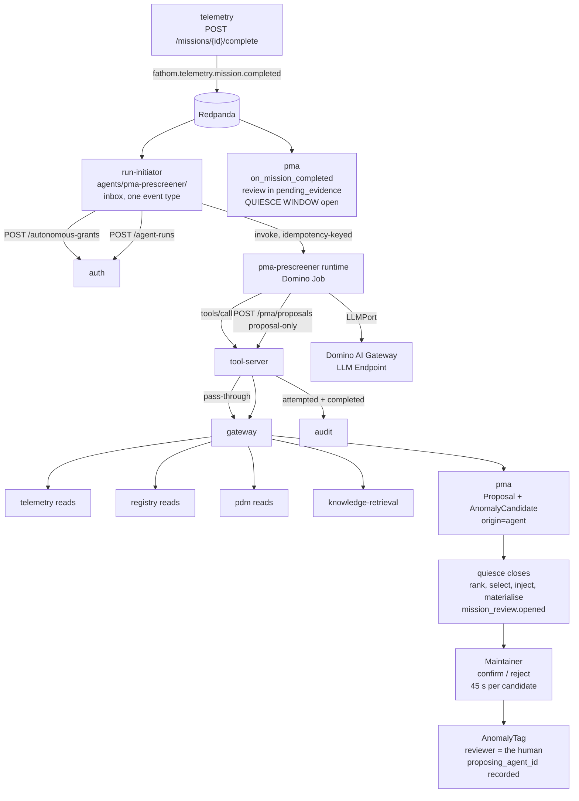

# Build Framework 41 — PMA Pre-Screener Agent Runtime (`pma-prescreener`)

| | |
|---|---|
| **Status** | Draft rev 1. Wave 5, the second of three agent runtimes. To be reconciled against `40` (Maintainer Copilot) and `42` (Redesign Case Builder) after all three land |
| **Artifact** | `agents/pma-prescreener/` (01 §11, 09 §3.1). `agent_id` = `pma-prescreener`; workload subject `svc:agents/pma-prescreener` (31 §3.3) |
| **Purpose** | Build specification for the event-triggered agent runtime that reviews a completed mission and proposes a bounded set of candidate anomalies for human confirmation — the mechanism 01 §8.2 identifies as what "renders the causal pipeline feasible at fleet scale" |
| **What it is not** | A service. It owns no database, no aggregate, no topic, and no domain state. It is a versioned Domino artifact (01 §8.6) whose entire output is a `Proposal` (03 §7.2) |
| **Resolves / implements** | **D12** (delegated authority unsatisfiable for event-triggered work — this agent is D12's first named instance), **D18** (no afloat candidate source — the enterprise/edge division is settled here for the agent half), and the pre-screener half of **D17**'s capacity model |
| **Binding contracts** | [01 §8.0–§8.8](../architecture/01-system-architecture.md) (§8.2 is the central design constraint), [01 §9](../architecture/01-system-architecture.md), [01 §12](../architecture/01-system-architecture.md) · [03 §4](../architecture/03-integration-contracts.md), [03 §5.4](../architecture/03-integration-contracts.md), [03 §6](../architecture/03-integration-contracts.md), [03 §7.2 and §7.2.1](../architecture/03-integration-contracts.md), [03 §8](../architecture/03-integration-contracts.md), [03 §9](../architecture/03-integration-contracts.md), [03 §11](../architecture/03-integration-contracts.md), [03 §12](../architecture/03-integration-contracts.md) · [04 §3](../architecture/04-subapplication-architectures.md), [04 §8](../architecture/04-subapplication-architectures.md) |
| **Binding build documents** | [09](09-monorepo-and-conventions.md) (layout, conventions, the shared Definition of Done) · [10](10-shared-packages.md) §4.7, §7 · [11](11-outbox-sync-library.md) §1.2, §9.3 · [13](13-synthetic-data-generator.md) §8.6, §10, §13 · [21](21-telemetry.md) §3.7, §5, §7, §9 · [23](23-pma.md) **in full — this agent's output is adjudicated through PMA's queue** · [31](31-auth.md) §3.3, §4 · [32](32-audit.md) §4.3 · [34](34-tool-server.md) in full |
| **Quantities** | Every figure is cited from [06 §6](../architecture/06-demo-decisions-and-assumptions.md) or [06 §7](../architecture/06-demo-decisions-and-assumptions.md), or is a **derivation from them with the arithmetic shown** (§6.2). No quantity is invented (09 DO-NOT 31, **D37**) |
| **Classification** | Internal. The runtime operates at U for the synthetic demonstration (03 §12, 06 §5) |
| **Precedence** | Documents 01 and 03 prevail over this document on any architectural or contract surface; 09 prevails on layout and conventions; **23 prevails on every PMA-owned mechanism**. Where this document appears to disagree with any of them, this document is defective and §20 is where the disagreement should already be recorded |

---

## 0. Read this first

### 0.1 Four facts govern every decision below

**First: this is the highest-stakes agent in the inventory, and the reason is stated in the architecture rather than inferred.** 01 §8.2:

> *"The design depends on maintainers tagging anomalies, and that labeling burden represents the most probable single point of failure in the concept. Voluntary annotation of telemetry by crews following an extended underway period is not a reliable assumption. An agent that pre-screens a completed mission and presents a bounded set of candidate anomalies for confirmation or rejection converts an open-ended authoring task into a bounded review task. Human confirmation remains the label of record; the agent only proposes. This mechanism is what renders the causal pipeline feasible at fleet scale, and it therefore belongs in the demonstration scope."*

Every closed loop in 01 §10 except the sustainment loop runs through the tag stream this agent feeds. Failure Intelligence has no input without it; tier-3 models have no causal features without Failure Intelligence; the design loop in 01 §10 item 2 begins with "mission anomaly to human tag."

**Second: the scarce resource this agent protects is human attention, not compute.** 06 §6 prices it exactly: candidate cap **12** per review, target review duration **≤ 10 minutes**, **45 s per candidate including evidence inspection**, ~**840** candidates per month, ~**10.5 reviewer-hours per month**. Every proposal this agent emits spends 45 seconds of a maintainer's time whether it is confirmed or rejected. A proposal is therefore a **withdrawal from a budget**, and §6 and §8 are about respecting a budget rather than about model quality.

**Third: this agent can improve its own apparent metrics while destroying the capability, and the mechanism is already documented.** D17, quoted in full by 23 §0:

> *"The metric trap: precision is measured against human adjudication, rejections train detectors to be quieter, volume drops, precision rises and review duration falls — **both governing metrics improve monotonically** — while recall collapses and nothing measures recall, because there is no independent ground truth."*

The consequence for **this** document, which is different from the consequence for 23: PMA's job is to *measure* the trap (canary recall, admission control, the joint quality report of 23 §5.5). This agent's job is **not to be the thing that walks into it**. §8.3 therefore forbids the single most natural feature an implementer would add — an online controller that lowers candidate volume when the rejection rate rises.

**Fourth: the agent is a proposer, and that is the whole of its authority.** 01 principle 7, 01 §8.4, 03 §7.2. Its entire output is a `Proposal` with `kind: anomaly_tag`. It writes no tag, adjudicates nothing, touches no domain state, and consumes no topic. 23 DO-NOT-28 states the boundary from PMA's side: *"Do not let an agent write a tag. Every agent-originated candidate is a `Proposal`; the human adjudicator is the reviewer of record."*

### 0.2 Read these first, in this order

| # | Source | Why |
|---|---|---|
| 1 | **01 §8 in full** | §8.0 (sub-applications are the tool surface), §8.2 (the criticality argument above), §8.3 (grounding), §8.4 (proposal/adjudication), §8.5 (authority classes), §8.8 (evaluation, and why recall carries equal standing) |
| 2 | **23 in full** | The receiving sub-application. Its §2.8, §3.1, §3.4, §3.7, §5.2–§5.6, §7.5 are all binding on this agent's behaviour |
| 3 | **31 §3.3, §4.3–§4.6** | The `accountable_autonomous` token, the grant, the run record, mid-run lapse, revocation |
| 4 | **34 §4** | The nine invocation-time gates every tool call passes |
| 5 | **21 §3.7, §5, §7, §9** | What Telemetry actually serves, what it refuses, and what is not agent-selectable |
| 6 | **06 §6 and §7** | Every quantity. Nothing here may exceed them |

### 0.3 Markers

Following 09 §1.3 and 31 §0:

- **[01 §n] / [03 §n] / [23 §n]** — dictated by a binding document. Not negotiable at implementation time.
- **[ESTABLISHED HERE]** — no source document specifies it. This document decides, states the reasoning, and records it so the Wave-5 reconciliation has one call to review rather than three.
- **[DERIVED]** — a value computed from cited figures, with the arithmetic shown. Not an invented quantity (D37), and not a researched one either: it is a consequence of numbers 06 owns.
- **[VERIFY]** — a factual claim about an external product that this document does not assert as verified. 08 §8's discipline applies.
- **[OPEN]** — genuinely undecided, listed in §21, resolved centrally and not locally.

### 0.4 Traceability

Every mechanism below traces to a line of a binding document. A mechanism with no citation is a defect in this document.

| Mechanism | Source | Findings enforced |
|---|---|---|
| The agent exists at all, and is in demonstration scope | 01 §8.1, §8.2; 06 §7 (three agents) | — |
| Entire output is a `Proposal`, `kind: anomaly_tag` | 01 principle 7, §8.4; 03 §7.2 | — |
| `authority_class: maintainer`, `blast_radius: item`, no class/fleet radius | 03 §7.2.1; 23 §2.8 | **D16** |
| Authority class is `accountable_autonomous`, with a named accountable owner and a declared scope | 01 §8.5; 03 §8.3; 31 §3.3 | **D12** |
| Event-triggered on `mission.completed`; no requesting human | 01 §8.5; 03 §8.3; 03 §6 Telemetry rows | **D12** |
| Restricted to `x-side-effects: none` and `proposal-only` | 03 §8.1, §8.3, §15 obligation 8; 31 §3.4 | **C1**, **D11** |
| Structured state through tools only; never parametric memory, never the vector store | 01 §8.3 | — |
| Never a direct topic consumer | 03 §6; 09 DO-NOT 15 | **C19** |
| Bounded candidate set; the cap is PMA's and the budget is the agent's | 01 §8.2; 06 §6; 23 §3.4, §3.6 | **D17** |
| No online threshold adaptation from rejection rate | 01 §8.8; 06 §6 | **D17** |
| Detector attribution copied, never synthesised | 23 §5.2; 13 §13.1 | **D17** |
| Enterprise-only LLM runtime; the afloat pre-screen is deterministic | 01 §12; 11 §1.2; 31 §11; 21 §7.1 | **D18** |
| Enterprise proposals **add** at reconnect; never replace the edge set | 03 §11; 21 §7.4; 23 §7.5 | **D18** |
| Retrieved and reviewer-authored text is data, never instruction | 01 principle 11; 03 §9 | **D14** |
| Evidence carries `source_trust`; non-program-only evidence is flagged | 03 §7.2, §9 item 3 | **D14** |
| Every tool invocation recorded to Audit with full request and response | 03 §8.5; 32 §4.3 | — |
| Mid-run authority lapse terminates with a checkpoint; no proposal after lapse | 01 §8.5; 03 §8.3; 31 §4.4 | **D12** |
| Prompt, manifest, API major, and model pinned and promoted as one unit | 01 §8.6; 03 §8.4 | — |
| Evaluation set construction respects the generator's truth veil and the policy-frozen holdout | 13 §8.6, §10.3; 06 §2 | **D1** |
| Recall measurement depends on the canary mechanism, whose production sourcing is unresolved | 01 §8.8; 06 §6; 05 **D39** | **D39** |
| No invented quantity | 06 §6, §7; 09 DO-NOT 31 | **D37** |

---

## 1. Purpose, scope, and ownership

### 1.1 Purpose

Per 01 §8.1: *"PMA Pre-Screener | Ship's force | Reviews mission telemetry and proposes candidate anomalies for human tagging (§8.2)."*

Stated as a build objective: **on completion of a mission, assemble grounded evidence for a bounded set of candidate anomalies on that mission's installed items, and submit each as a `Proposal` to Post-Mission Analysis, such that a maintainer can confirm or reject it inside 45 seconds without leaving the review.**

The last clause is the operative one. The agent's product is not a detection — Telemetry's detector ensemble already produces detections (04 §3, 21 §7). The agent's product is a **reviewable** candidate: a window, a cited rationale, and an evidence set assembled from sources the detector never consulted. 06 §6's 45-second budget is only achievable if the reviewer is not required to reconstruct context, and 23 §3.6 makes that an API obligation on PMA. This document makes the corresponding content obligation on the agent.

### 1.2 What this agent is not

Each row is a boundary a reader will otherwise cross, with the document that owns the other side.

| Not this | Owner | Consequence for this build |
|---|---|---|
| A detector | `telemetry` (04 §3, 21 §7) | The agent runs no anomaly-detection model, holds no detector artifact, and never writes `POST /telemetry/anomaly-candidates` — that operation is `state-changing` and not agent-eligible (21 §9.3) |
| A labeler | `pma` + the human reviewer (04 §8) | *"Only human confirmation produces a label"* (04 §3). The agent's proposal is an input to adjudication, never a label |
| The review workflow | `pma` (23 §3) | The agent does not create, open, rank, cap, or complete a review. It does not select which candidates a reviewer sees; PMA's ranker and selector do (23 §3.3, §3.4) |
| The candidate ranker | `pma` (23 §3.3) | The agent supplies a `confidence` and evidence; `rank_score` is PMA's, computed from its own weights, and the agent must not attempt to influence presentation order |
| An adjudicator | The human, via PMA (03 §7.2.1, 23 §2.8) | Both agent authority classes are denied on adjudication *regardless of roles* (31 §3.3 rule 6, 31 T-6) |
| A taxonomy authority | `reference-data`, with `failure-intel` as sole approver (03 §14, 12 §3.3) | The agent may cite a signature from PMA's published projection; it may never mint one, and it may never select the `is_novel_escape` row (§7.3) |
| A canary injector | `pma` (23 §5.3) | The agent has no visibility of canary status in any channel, does not know the plant pool exists, and its own candidates are bindable to plants only by PMA (§12.4) |
| A topic consumer | — | 03 §6: *"Agents are never direct topic consumers."* The trigger bridge of §2.2 is not the agent |

### 1.3 What this document owns

1. The trigger mechanism and the end-to-end flow from `mission.completed` to a confirmable proposal in a reviewer's bounded set (§2).
2. The authority class, the exact token shape, the grant lifecycle, and the lapse protocol (§3).
3. The tool manifests, their pins, and the exact operation set — including the operations deliberately **not** selected (§4).
4. Evidence assembly: which calls, in which order, with which bitemporal selectors, and what may never be synthesised (§5).
5. How the agent bounds its own output, and why the bound is a budget rather than a threshold (§6).
6. The exact `Proposal` it emits (§7).
7. The false-positive/false-negative cost model and the prohibition on online adaptation (§8).
8. The edge/DDIL position, and the reconciliation of enterprise proposals against an afloat-completed review (§9).
9. Untrusted content (§10), classification (§11), evaluation (§12), artifact layout and pinning (§13), deployment (§14), observability (§15), testing (§16).
10. The prohibitions (§17), the requirements this agent places on other components (§18), the Definition of Done (§19), corrections to source documents (§20), and open questions (§21).

### 1.4 What this document does not cover

| Out of scope | Governed by |
|---|---|
| PMA's review orchestration, ranking, selection, canary injection, admission control, evidence materialisation, reviewer weighting | 23 §3, §5, §6 |
| Detector implementation, detector versioning, the channel registry, indicator definitions, the bitemporal feature resolver's internals | 21 §3, §5, §6, §7 |
| Token issuance, exchange, introspection, revocation, the OPA bundle | 31 |
| Descriptor generation, the manifest schema, eligibility assessment | 10 §7 |
| Descriptor hosting, discovery scoping, the nine invocation gates, proxying | 34 |
| Audit record storage, retention, integrity, purge | 32 |
| The reviewer interface | Deferred to the look-and-feel wave (09 §1.2). §7.8 states only the API-visible properties this agent's output requires |
| The unstructured corpus's existence | **D38** — no generation plan exists. §4.7 gates the narrative manifest on it |

### 1.5 Substitution posture

None. An agent is not a discipline (03 §10; 34 §8.1 takes the same position for the tool server). No operation is exposed by this artifact, so `x-substitution` does not apply to it. Its manifests, however, **are** subject to the manifest conformance tests that run inside each target sub-application's suite (03 §8.4, 10 §6.8), which is the mechanism by which a conformant substitution of Telemetry or PMA is automatically a conformant tool surface for this agent (01 §8.0).

---

## 2. The trigger and the end-to-end flow

### 2.1 The trigger event

**`fathom.telemetry.mission.completed`.** 03 §6's Telemetry row: *"`mission.completed` | mission_id, asset, type, period, data completeness | `pma`, `failure-intel`, `audit`."* 03 §8.3 names the agent as its trigger case: *"The requirement that agents act as the requesting user is unsatisfiable for event-triggered and scheduled work… the PMA Pre-Screener fires on mission completion."* 31 §3.3's worked token carries exactly this trigger:

```json
"trigger": { "kind": "event", "event_type": "fathom.telemetry.mission.completed",
             "event_id": "…", "correlation_id": "…" }
```

The event is produced by `POST /telemetry/missions/{mission_id}/complete`, which *"finalizes completeness, emits `mission.completed`"* (21 §9.3). Two properties of that make it the correct trigger and no other event does:

- **It is the point at which the mission's data is declared complete.** 04 §3: completeness *"recorded per batch and per mission so that downstream consumers can distinguish 'no fault observed' from 'not observed.'"* Pre-screening before completion would assemble evidence over a window still being filled — for a submarine, weeks before the data exists.
- **It is the same event PMA uses to create the review** (23 §3.1 stage 2). Firing on anything later means the agent's candidates arrive after PMA has already assembled the bounded set. §2.3 is the whole of that problem.

`anomaly.detected` is **not** a trigger. It fires per detection, at unbounded multiplicity per mission, and 03 §6 lists its consumers as `pma`, `fleet-status`, `audit`. An agent run per detection would multiply runs by the detection count and produce one proposal per detection — which is the detector's output re-emitted with a rationale, not a pre-screen. The agent reads detections as evidence, through `GET /telemetry/anomalies?mission_id=` (§4.3), once per run.

### 2.2 The C19 bridge — how an event reaches an agent that may not consume events

This is the first genuine gap in the corpus that this document must close, and it is closed narrowly.

03 §6 states the constraint and names the remedy in the same breath: *"**Agents are never direct topic consumers.** Agents obtain state through tools (document 01 §8.3). Where a downstream capability is realized by an agent, the consumer named here is the platform component that bridges to it `[C19]`."*

**No platform component in the corpus consumes `mission.completed`.** Verified against every build document that declares a subscription: `gateway` consumes exactly the nine `fathom.<slug>.proposal.v1` topics and nothing else (30 §9.1, and 30 §9.3: *"The gateway holds no other read model of any kind"*); `notification` consumes six enumerated rows, of which `mission.completed` is not one (33 §2.1–§2.2); `tool-server` *"publishes no events and consumes no topic"* (34 §9); `audit` consumes it as a universal consumer but is explicitly not a query surface or an orchestrator (32 §1.3). So 03 §6's promised bridge does not exist for this agent.

**[ESTABLISHED HERE] — the bridge is the `run-initiator`, a non-LLM workload shipped from `agents/pma-prescreener/` as part of the agent artifact's deployment spec, and it is not the agent.**

01 §11 already puts a deployment spec inside each `agents/<name>/`: *"each: prompt, manifest pin, API version pin, evaluation set, deployment spec."* The initiator is part of that spec. It is the platform component C19 requires, and it satisfies C19's *intent* — that an agent obtain **state** through tools — because the initiator passes the agent nothing but the envelope's identifiers.

| Property | Rule |
|---|---|
| **What it is** | An ordinary Sustainment-Plane workload following 09 §4's scaffold, with no database, no aggregate, and no published event. It holds no prompt, calls no LLM, makes no tool call, and contains no model pin |
| **What it consumes** | `fathom.telemetry.mission.completed` **only**. One event type, explicitly named, no wildcard (C38, 09 DO-NOT 14) |
| **Inbox** | Full inbox semantics per 11 §3 — record and apply in one transaction, `processed_at` suppression only after processing (03 §5.2, **D2**). "Apply" here means "the run record exists," never "the run finished" |
| **What it passes to the agent** | `mission_id`, `asset_id`, `baseline_id`, `baseline_epoch`, `event_id`, `correlation_id`, and the envelope's `producer_node`. **No payload field is passed as content**, and no state is passed at all: the agent re-reads the mission through `GET /telemetry/missions/{mission_id}` as a tool call, which is what keeps 01 §8.3 true |
| **What it does before invoking** | Requests an `accountable_autonomous` grant from `auth` (`POST /autonomous-grants`, 31 §8) scoped to this mission's asset (§3.2); opens a run record (`POST /agent-runs`, 31 §8); then invokes the runtime (§14.2) |
| **Idempotency** | The run is keyed on `event_id`; a redelivery of the same `mission.completed` resolves to the existing run rather than a second one (§2.5) |
| **What it must never do** | Interpret the payload, filter on a domain condition, rank anything, retry a refused proposal, or invoke the agent under its own identity for a mission outside the grant's declared scope |

**Why not put the subscription in `gateway`.** 30's entire D32 resolution rests on the gateway holding exactly one read model and consuming exactly nine topics; 30 §9.3's sentence *"The gateway holds no other read model of any kind"* is asserted by `test_d32_...`. Adding a domain-event subscription there would break a resolved finding to close an unresolved one.

**Why not a new platform service.** 01 §5's platform inventory is canonical and *"reproduced identically in §11 and in document 04 §11."* A tenth platform service is a change to three places in the architecture of record, for a workload whose entire logic is "consume one event, mint one grant, start one run." That is deployment plumbing for an agent artifact, and 01 §11 already says the agent artifact carries a deployment spec.

**The consequence for the event catalog, which this document does not apply.** C19's rule is that the bridging component is *named in the catalog*. The initiator is therefore a declared consumer of `mission.completed` and 03 §6's Telemetry row should say so — otherwise `tools/check_event_catalog.py` reconciles a subscription against a catalog that does not declare it (09 §8.2, and the same reconciliation gate 23 §4.2 hits for the Reference Data topics as OD-7). §20 item 1 carries it; §21 **PS-OQ-1** records the interim.

### 2.3 The race with PMA's review assembly, and the quiesce window

23 §3.2's `on_mission_completed` runs the admission gate, epoch fence, grouping, ranking, bounded selection, canary injection, and evidence materialisation **in response to the same event that triggers this agent**, and 23 §3.1 stage 10 opens the review as soon as evidence has materialised. An agent run that involves several tool calls and an LLM turn cannot complete inside that window. Left alone, every agent proposal arrives after its mission's review has been assembled — and 23 §3.4's `select()` docstring is explicit about where a late candidate goes: *"A candidate that is neither admitted nor reserved returns to `queued_unadmitted` and is eligible for a later review of the same mission."*

That outcome is the failure mode dressed as correct behaviour: the agent's candidates would systematically miss the primary review, the reviewer would see only detector candidates, and 01 §8.2's mechanism would be present in the code and absent in the workflow.

**[ESTABLISHED HERE] — the resolution is a bounded pre-screen quiesce window inside PMA's `pending_evidence` state, and it is a requirement on 23 rather than a behaviour of this agent (PS→PMA-1, §18).**

| Element | Position |
|---|---|
| Where it sits | Between 23 §3.1 stage 3 (admission gate) and stage 5 (grouping). The review is created, the gate is evaluated, and the review then **waits** in `pending_evidence` for agent proposals bearing this `mission_id` |
| Duration | `app.config.prescreenQuiesceSeconds`, a Helm value with **no default** (09 §4.5's discipline, as 34 §12.2 applies it to its own safety parameters). No document publishes a value — **PS-OQ-2** |
| Expiry behaviour | On expiry, assembly proceeds **without** waiting further. `mission_review.opened` is published with whatever candidates exist. The review workflow is never blocked by the agent |
| Early completion | The window closes early on receipt of a run-completion signal for that mission — the agent's final `POST /proposals` carries a `run_complete` marker in its idempotency envelope, or the run terminates. Waiting the full window after the agent has finished is wasted latency on the critical path |
| Late proposals | A proposal arriving after the review has opened creates a candidate in `queued_unadmitted` (23 §3.1 stage 1), is grouped against any overlapping admitted candidate (23 §3.4), and is eligible for a later review or re-review. It is **never** injected into an open review's bounded set, because 23 §2.6 pins evidence immutability at review open and a reviewer's set must not change under them |
| Instrumentation | PMA records, per review, whether the quiesce window expired or closed early, and the count of proposals admitted from it. A rising expiry rate is the leading indicator that the agent is too slow to matter, and it is visible before precision moves |
| What it is not | It is **not** an unbounded wait, not a synchronous call from PMA to the agent, and not a dependency of review creation on the agent's availability. PMA never calls this agent; 03 principle 2 and the sanctioned-edge set (09 §4.4.2) both forbid it, and an agent outage must degrade the candidate set rather than stop the workflow |

### 2.4 The flow, end to end



The ordered sequence, with the failure disposition of every step. This table is the specification; the diagram is a convenience.

| # | Step | Actor | Refusal / failure disposition |
|---|---|---|---|
| 1 | `mission.completed` is emitted from the outbox | `telemetry` | — |
| 2 | Inbox records the event and creates a run intent in one transaction | run-initiator | Redelivery resolves to the same run (§2.5) |
| 3 | Grant requested: `POST /auth/autonomous-grants` with the accountable owner and a scope of exactly this asset | run-initiator | `422 accountable-owner-required` or a disabled owner ⇒ **no run**, audit record, alarm. There is no fallback identity (31 §3.3 rule 1) |
| 4 | Run record opened: `POST /auth/agent-runs` | run-initiator | Failure ⇒ no invocation. An unrecorded run is an unaccountable run |
| 5 | Runtime invoked with the identifiers of §2.2 and the grant token | run-initiator | Invocation failure is retried with monotonic backoff to a bounded deadline, then the run is terminated and recorded |
| 6 | Mission context read: `GET /telemetry/missions/{mission_id}` | runtime → tool-server → gateway | Completeness insufficient ⇒ the run **completes with zero proposals** and records the reason (§5.9). This is a correct outcome, not an error |
| 7 | Detections read: `GET /telemetry/anomalies?mission_id=` | runtime | Empty is legitimate. §6.5's uncorroborated class is the only path to a proposal in that case |
| 8 | Configuration read: `GET /registry/assets/{id}/installed-items`, `GET /registry/assets/{id}/current-baseline-epoch` | runtime | Epoch ahead of the event's epoch ⇒ re-read; still divergent ⇒ terminate the run rather than propose against an unknown configuration (§5.5) |
| 9 | Indicators, quality, features read per candidate item | runtime | `422 knowledge-precedes-data` and its siblings (21 §5.7) are **build defects in the agent**, not runtime conditions; they fail the run loudly |
| 10 | Prior tags and taxonomy projection read: `GET /pma/tags`, `GET /pma/taxonomy` | runtime | Unavailable ⇒ the run proceeds and omits any signature suggestion (§7.3) |
| 11 | Cached prediction and provenance read: `GET /pdm/predictions`, `…/provenance` | runtime | Unavailable ⇒ omitted from evidence. Never fabricated, never inferred |
| 12 | Narrative retrieval: `POST /knowledge-retrieval/retrievals`, `mode: asset_scoped` | runtime | Gated on corpus availability (**D38**, §4.7). Absent ⇒ no narrative evidence, and no proposal is weakened by its absence because narrative may never be a sole basis (§5.3) |
| 13 | LLM turn: rank, select within the budget, draft rationale, assemble evidence | runtime, `LLMPort` | Model unavailable ⇒ the run terminates; **no heuristic fallback is permitted to emit a proposal**, because a proposal carries `llm_version` and a fabricated one is unauditable (§17 item 9) |
| 14 | One `POST /api/v1/pma/proposals` per candidate, `Idempotency-Key` set, ordered, bounded by the budget | runtime | `429 admission-control-engaged` ⇒ stop immediately, do not retry within the run, record the deferral (§2.6) |
| 15 | PMA creates the `Proposal` and an `AnomalyCandidate` with `origin='agent'` and `source_proposal_id` set | `pma` (23 §2.2, §3.1 stage 1) | `422 blast-radius-not-permitted` and its siblings are agent build defects (§7.2) |
| 16 | Run completion recorded; the quiesce window closes early | runtime → `auth`, then PMA | — |
| 17 | PMA groups, ranks, selects to cap 12, injects canaries, materialises evidence, opens the review | `pma` (23 §3.1) | The agent has no visibility of, or influence over, any of it |
| 18 | The maintainer confirms or rejects. `AnomalyTag.reviewer_id` is the human; `proposing_agent_id` records the agent | human, via `pma` (23 §2.8) | — |

### 2.5 Idempotency and at-least-once delivery

Delivery is at-least-once (03 §5.2) and 01 §9's fallback row requires that *"agent invocation is idempotency-keyed."* Three keys, at three levels, each with a stated stability property.

| Level | Key | Stability requirement |
|---|---|---|
| Run | `event_id` of the triggering `mission.completed` | A redelivered event resolves to the existing run. Two runs for one mission is two withdrawals from the same reviewer budget |
| Proposal | `sha256(agent_id ‖ mission_id ‖ installed_item_id ‖ window_start ‖ window_end)` | **Deliberately excludes `agent_version`, `manifest_version`, and `llm_version`.** A re-run after an agent upgrade must not duplicate a candidate the previous version already proposed for the same window on the same item. The version fields still travel *in* the proposal (03 §7.2 requires them); they are excluded from the *key* |
| Tool call | Forwarded verbatim; never minted, never consumed by the tool server (34 §5.4) | The target owns idempotency for its own operation |

**An honest gap, recorded rather than papered over.** 09 §10 item 5 leaves idempotency retention unresolved, with a default assumption of 24 hours and the note that a disconnected hull's retry window is weeks; 21 OQ-12 sets 60 days on edge-reachable bulk paths. The pre-screener's retry interval after an admission-control deferral (§2.6) is *hours to days* — a gate clears when a backlog drains, and 23 §5.6.1's clearance requires `backlog ≤ 2 × throughput` sustained for one hour. A re-proposal after a multi-day deferral may therefore fall outside PMA's idempotency window. **Mitigation, and it is PMA's existing machinery rather than a new mechanism:** duplicate suppression must not rest on `Idempotency-Key` alone. 23 §3.4's `candidate_group_id` links near-duplicates over the same `(installed_item_id, window)` and 23 §3.1 stage 5 admits one representative per group, so a duplicate re-proposal is grouped rather than double-presented. Recorded as **PS-OQ-3**, and as a note against 09 §10 item 5 in §20.

### 2.6 Run outcomes, and the four refusals

The run has exactly six terminal outcomes. Each is recorded to Audit with the accountable owner (03 §8.3) and to the run record (31 §4.3). None is a silent success.

| Outcome | Cause | Behaviour |
|---|---|---|
| `completed_with_proposals` | Normal | 1..budget proposals submitted. The count is recorded, not just the fact |
| `completed_zero_proposals` | Insufficient completeness (§5.9), no eligible item, or nothing met the evidence rules | **A first-class success.** 23 §7.1 is explicit that *"a review with an empty eligible set is created, recorded, and closed as such."* An agent that manufactures a candidate to avoid an empty result has inverted the cost model of §8 |
| `deferred_admission_control` | `429 urn:fathom:problem:pma:admission-control-engaged` from `POST /proposals` (23 §5.6.2 layer 5) | Stop proposing immediately. Do **not** retry inside the run. Checkpoint the assembled candidate set so a later run can re-propose without re-reading, and record the `Retry-After`. Already-accepted proposals from this run stand |
| `terminated_authority_lapsed` | Token expiry or `401 …:authority-lapsed` (31 §4.4) | Terminate per 31 §4.4's five-step sequence. **No proposal is created after the lapse** (31 §4.5, §3.3) |
| `terminated_pod_restart` | Restart by platform maintenance or eviction (01 §9) | The restarted process finds a `running` run with no token in memory and terminates it. It does **not** re-authenticate as the workload (31 §4.4) |
| `terminated_error` | Tool gate rejection that indicates a build defect (§7.2), model unavailability, or configuration divergence (§5.5) | Fail loudly. A run that swallows a `409 side-effects-mismatch` and proposes anyway has defeated 34 §4.3 |

**Two notes on the admission-control path, because 23's wording is loose and an implementer will follow it literally.** 23 §5.6.2 layer 5 says the agent *"terminates with a resumable checkpoint rather than continuing; it does not create proposals after the refusal."* Taken literally alongside 31 §4.3, that would require a run status the enum does not contain: `agent_runs.status` is `running | completed | terminated_authority_lapsed | terminated_pod_restart | terminated_revoked`. A 429 is **not** an authority lapse — the token is valid and the grant is active; the target is protecting a human budget. Interim position: the run records `completed` with a run-outcome of `deferred_admission_control` in the agent's own record and in Audit, and it does checkpoint, because the checkpoint is genuinely useful here (the assembled evidence can be re-proposed after the gate clears without re-reading Telemetry). **No new `agent_runs.status` value is invented.** §20 item 6 flags 31 §4.3; §20 item 5 flags 23 §5.6.2's conflation.

### 2.7 Three things that must never block

Stated as prohibitions because each is a way this agent could damage the workflow it exists to enable.

1. **A review must never fail to open because the agent is unavailable.** The quiesce window has a bounded expiry (§2.3) and PMA proceeds without agent candidates. An outage degrades candidate quality; it does not stop labeling.
2. **A mission must never be un-reviewed because a run failed.** Detector candidates already exist independently (04 §3, 21 §7). The agent adds; it is not a prerequisite.
3. **The agent must never hold a reviewer waiting.** All evidence a reviewer sees is materialised by PMA at stage 9 (23 §3.6: *"No cross-service fetch during review"*). The agent contributes to a candidate's evidence *package* only through the references PMA materialises; it never serves a reviewer request.

---

## 3. Authority class and machine-to-machine identity

### 3.1 The class is `accountable_autonomous`, and the derivation is not a judgment call

03 §8.3's table assigns it by name: *"**Accountable autonomous** | Event-triggered and scheduled agents — **PMA Pre-Screener**, Readiness Narrative, scheduled evaluation | A scoped short-lived workload identity with a **named accountable human owner** | Restricted to `x-side-effects: none` and `proposal-only`. Cannot read outside its declared scope. Every run recorded to Audit with the accountable owner."*

01 §8.5 gives the reason the alternative is unavailable: *"Acting as the requesting user is the correct default but is unsatisfiable for event-triggered and scheduled work, which has no requesting user — the PMA Pre-Screener fires on mission completion."* D12 states it as a finding: *"Delegated user authority is unsatisfiable for autonomous work. Three of the design's own paths have no requesting user: the event-triggered PMA Pre-Screener…"*

So the class is fixed by three documents naming this agent explicitly. What remains is to state the contrast, because the sibling document in this wave takes the other branch.

### 3.2 Contrast with the Maintainer Copilot

| | **PMA Pre-Screener** (this document) | **Maintainer Copilot** (doc 40) |
|---|---|---|
| Class (03 §8.3) | `accountable_autonomous` | `delegated` |
| `fathom.agent.authority` (31 §2.5) | `accountable_autonomous` | `delegated` |
| Token `sub` (31 §3.2, §3.3) | `svc:agents/pma-prescreener` — **the workload** | The human's subject — never the agent's |
| `act` claim (RFC 8693) | Absent. There is no principal on whose behalf it acts | Present. Delegation, not impersonation |
| `fathom.identity.authority_classes` | **`[]`, always** (31 §3.3 rule 4) | The user's own |
| Clearance | `min(owner clearance, declared ceiling)` (31 §3.3 rule 3) | The user's own |
| `declared_scope` | **Required, non-empty** (31 §3.3 rule 2) | Not applicable; reach is the user's reach |
| `accountable_owner` | **Required** — issuance fails without it (31 §3.3 rule 1) | Not applicable |
| Invoked by | An event, through the run-initiator (§2.2) | A human turn, through `gateway` → `auth` `POST /delegations` (31 §4.1) |
| Token exchange | **None.** 30 §5.4: *"no exchange, because there is no subject"* | RFC 8693 exchange (31 §4.2) |
| Refresh token | None (31 §3.3) | None (31 §3.2) |
| May adjudicate | **No** — and neither may the Copilot. Adjudication requires the absence of `fathom.agent` entirely (31 §3.3 rule 6, T-6) | No |
| Side-effect ceiling | `none` + `proposal-only` | `none` + `proposal-only`. **The classes differ in whose authority they carry, not in whether they may write** (31 §3.2) |

The last row is the one most often misread. 31 §3.2 states it directly: *"Both agent classes are bound by this — the two classes differ in *whose authority* they carry, not in *whether they may write*."*

### 3.3 The token, with this agent's exact values

The shape is 31 §3.3's, transcribed with this agent's fields resolved. Nothing here varies it.

```json
{
  "iss": "https://keycloak.internal/realms/fathom",
  "sub": "svc:agents/pma-prescreener",
  "aud": ["telemetry", "registry", "pdm", "pma", "knowledge-retrieval"],
  "azp": "fathom-agent-pma-prescreener",
  "exp": 1770003600, "iat": 1770000000,
  "jti": "…",
  "scope": "fathom.agent.autonomous sfx:none sfx:proposal-only",

  "fathom": {
    "identity": {
      "subject_id": "svc:agents/pma-prescreener",
      "authority_classes": [],
      "clearance": { "level": "U", "caveats": [], "compartments": [],
                     "cui_categories_authorized": [] }
    },
    "agent": {
      "authority": "accountable_autonomous",
      "run_id": "…",
      "grant_id": "…",
      "manifest": "pma-prescreen",
      "manifest_version": 1,
      "api_major": 1,
      "trigger": { "kind": "event",
                   "event_type": "fathom.telemetry.mission.completed",
                   "event_id": "…", "correlation_id": "…" },
      "trace_ref": "mlflow://…"
    },
    "accountable_owner": {
      "subject_id": "…", "display_name": "…", "billet": "…", "unit_uic": "…",
      "authority_classes": ["maintainer"]
    },
    "declared_scope": {
      "assets": ["<the one asset_id from the triggering event>"],
      "class_ids": [],
      "fleet": false,
      "aggregates": ["mission", "telemetry_batch", "anomaly_candidate",
                     "health_indicator", "usage_counter", "installed_item",
                     "configuration_baseline", "prediction", "anomaly_tag",
                     "document_chunk"],
      "clearance_ceiling": { "level": "U", "compartments": [] }
    }
  }
}
```

Six properties of this token that are decisions rather than transcription:

1. **`aud` is exactly five slugs**, derived from the manifest targets (31 §4.1 step 4d, §4.2). `gateway` is **not** in the audience: 31 §4.1 step 4d adds it *"iff any selected operation declares `x-domino-endpoint`"*, and no operation this agent selects does — `POST /pdm/what-if` is Endpoint-backed and is deliberately not selected (§4.8). A receiving service requires its own slug in `aud` and rejects otherwise (31 §3.5 step 4), so this list is the reach ceiling.
2. **`declared_scope.assets` holds exactly one asset**, the one from the triggering event. Not the fleet, not the class, not the hull's sister ships. 31 §6.6's `scope_contains_subject` rule denies any request whose subject asset is not in the list, so a per-mission grant makes cross-asset reads structurally impossible rather than merely unnecessary. `fleet: false`, which matters because 31 §3.3 rule 2 requires an explicit dual-signature grant for `fleet: true` and there is no case in which pre-screening one mission needs it.
3. **`declared_scope.aggregates` is the read ceiling by resource type**, enforced by 31 §6.6's `aggregate_not_in_declared_scope` rule. `anomaly_tag` appears because the agent reads prior confirmed tags for label-scarcity context (§5.1); `document_chunk` appears only while §4.7's narrative manifest is enabled and must be removed from the grant when it is not.
4. **`authority_classes` is empty even though the owner holds `maintainer`.** 31 §3.3 rule 4: encoding the owner's roles into the agent's identity block *"would make an autonomous agent capable of approving its own proposals through a policy path nobody intended, which is D16 arriving by the back door."* For **this** agent that is not hypothetical: its proposals are adjudicated by `maintainer` (03 §7.2.1), which is precisely the class its accountable owner is most likely to hold.
5. **Clearance is `U` for the demonstration** (03 §12, 06 §5) and is computed at issuance as the floor of the owner's clearance and the declared ceiling (31 §3.3 rule 3), re-derivable by any receiver.
6. **One grant per run, per mission, bounded by the run.** No refresh token (31 §3.3). A run needing longer than one token lifetime terminates and checkpoints — it does not renew.

### 3.4 The accountable owner

03 §8.3's *"named accountable human owner"* is not metadata; 31 §3.3 rule 1 makes issuance fail without it, with `422 urn:fathom:problem:auth:accountable-owner-required`, if the field is absent, the subject does not exist in the realm, or that subject is disabled.

| Question | Position |
|---|---|
| Who is it? | A named human in the `fathom` realm, recorded in `agents/pma-prescreener/agent.yaml` (§13) and resolved at grant time. 34 §2.2's `tool-pins.yaml` carries the same field, and the two must agree — asserted in CI (§16) |
| Which role should they hold? | **Not `maintainer`.** [ESTABLISHED HERE] The owner is accountable for the agent's *volume and behaviour*, which is a program-quality responsibility, not a deckplate one, and 33 §4 already treats the pre-screener's accountable owner as a **co-primary recipient of the admission-control alarm** (*"the person whose agent's output is filling the queue"*). Making the owner the same person who adjudicates its proposals creates the appearance of self-approval even though 31 §3.3 rule 4 makes it technically impossible. Interim: `planner`, matching 23 §5.7's requirement that an admission-control override needs two approvers holding at least `planner` |
| What happens when they change billet? | The grant is revoked when the owner is disabled (31 §4.6). Whether periodic re-attestation is required is 31 **OQ-31-7** and is not decided here |
| Is it recorded per run? | Yes — 03 §8.3: *"Every run recorded to Audit with the accountable owner"*, satisfied by 32 §4.3's `tool_invocation.accountable_owner`, whose `ti_authority_owner` CHECK makes an unattributed autonomous invocation unstorable |

### 3.5 Mid-run authority lapse

01 §8.5 and 03 §8.3 make this a defined condition, and 01 §9 makes it routine rather than exceptional for a Domino-hosted runtime: *"300 s timeout; restart by maintenance; eviction by consolidation."*

The protocol is 31 §4.4's, unmodified. Restating only what binds this agent:

- **Detection is proactive and monotonic.** `run_deadline_monotonic` is computed once at run start and compared only against `time.monotonic()` thereafter. No wall-clock arithmetic anywhere (**D29**, 03 §5.4, 09 DO-NOT 7). A guard band is checked **before every tool call and before every `POST /proposals`**.
- **A `401 …:authority-lapsed` or `401 …:token-expired` terminates the run.** No retry. No attempt to obtain another credential. 34 §8.2 gives `delegated-authority-lapsed` its own problem type *"so the runtime checkpoints instead of retrying."*
- **The checkpoint contains no token**, and is scanned for anything JWT-shaped by 31 T-2b.
- **No proposal after lapse.** The strong case fails at 31 §3.5 step 3; the subtle case — a still-unexpired token whose *run* was revoked — is closed by introspection, which 31 §4.6 requires on every `proposal-only` operation. `POST /pma/proposals` is `proposal-only` (23 §3.7), so **every proposal this agent submits pays for a fresh introspection**, bounded by `introspection_max_age`. That cost is the mechanism, not overhead.
- **Resume is a new run under a fresh grant from the same accountable owner** (31 §4.4). If that owner is no longer a valid principal the run is not resumable, which 31 calls *"the intended consequence of accountability being attached to a person."*

### 3.6 Where enforcement actually happens — four layers

The side-effect ceiling is enforced four times, deliberately. Listed so that no implementer treats any one of them as sufficient and removes the others.

| Layer | Mechanism | Source |
|---|---|---|
| **Issuer** | The Keycloak client for `fathom-agent-pma-prescreener` has no `sfx:state-changing` in its client-scope set, so the scope is **unmintable** rather than merely unrequested | 31 §3.4 layer 1 |
| **Tool server** | Gate 6 re-validates the *live* declared class and gate 7 caps the caller's class. A descriptor recording `none` for an operation the target now declares `state-changing` is a `409 side-effects-mismatch` in either direction | 34 §4.2, §4.3 |
| **Gateway** | Refuses an autonomous principal on a `state-changing` route, and refuses an absent `accountable_owner` | 30 §5.4 |
| **Receiving sub-application** | `require_authz` matches the route's `x-side-effects` against the token's `sfx:` scopes, positively; OPA denies on the same input | 31 §3.4 layers 2–3, 03 §15 obligation 7 |

**The authoritative layer is the last one.** 03 §15 obligation 7: authorization is *"enforced by the receiving sub-application… Never delegated to the gateway alone."* 31 T-1a proves it by presenting a *validly signed* token carrying the forbidden scope and asserting the receiver refuses.

---

## 4. Tool surface: manifests, pins, and the exact call set

### 4.1 The pin file

34 §2.2 fixes the shape and already carries this agent as its worked example. Resolved here, with the corrections §20 records:

```yaml
# agents/pma-prescreener/tool-pins.yaml
# Compiled into platform/tool-server's bundle (34 §2.1). Rules B1-B4 fail the build (34 §2.2).
agent_id: pma-prescreener
authority_class: accountable_autonomous        # 03 §8.3; snake_case wire value per 31 §2.5
accountable_owner: <named human, resolvable in auth>   # 03 §8.3; required for this class
manifests:
  - name: telemetry-mission-context
    version: 2                                  # §4.3; v1 is 21 §9.5's three-operation form
    target: { slug: telemetry, api_major: 1 }
  - name: registry-configuration-lookup
    version: 1                                  # 20 §6.1
    target: { slug: registry, api_major: 1 }
  - name: pdm-equipment-deepdive
    version: 1                                  # 03 §8.2 names it
    target: { slug: pdm, api_major: 1 }
  - name: pma-prescreen
    version: 1                                  # §4.6; the name 31 §3.3's token already uses
    target: { slug: pma, api_major: 1 }
  - name: kr-failure-signature-lookup
    version: 1                                  # §4.7; DISABLED until D38 is resolved
    target: { slug: knowledge-retrieval, api_major: 1 }
```

Two properties of this file that are load-bearing:

- **`agent_id` is never self-asserted at runtime.** 34 §2.3: it is derived only from the validated token, and a caller-supplied header naming the agent is *"ignored where it agrees and rejected where it disagrees."*
- **A pin is a promotion unit, not a configuration value.** 03 §8.4: manifest version, API major, prompt, and model version are *"promoted together as one registered unit."* §13 makes that mechanical.

### 4.2 Manifest inventory

Five manifests, one per target. Each declares a reviewed `purpose` (03 §8.2, §8.4) and is owned by this agent, except where a curated manifest already exists.

| Manifest | Target | Owner | Purpose | Status |
|---|---|---|---|---|
| `telemetry-mission-context.v2` | `telemetry` | `pma-prescreener` | Mission boundaries, completeness, detections, indicators, quality, and channel attribution for one mission's items | **v2 specified here.** 21 §9.5 defines v1 with three operations; §20 item 2 flags the reconciliation |
| `registry-configuration-lookup.v1` | `registry` | `curated` | What is installed where, at which baseline epoch | Exists (20 §6.1). Reused unchanged |
| `pdm-equipment-deepdive.v1` | `pdm` | `curated` | The cached prediction for an item, with provenance | Named by 03 §8.2. Reused; its operation subset is confirmed against 22 §10 in §4.5 |
| `pma-prescreen.v1` | `pma` | `pma-prescreener` | Prior tags, the reviewer's own vocabulary projection, and proposal submission | **Specified here.** The name is the one 31 §3.3's worked token already carries |
| `kr-failure-signature-lookup.v1` | `knowledge-retrieval` | `pma-prescreener` | Documented failure signatures for an installed item's configuration | **Specified, shipped disabled** (§4.7) |

Rule B3 from 34 §2.2 binds: no duplicate tool `name` within one binding, because `name` is `<slug>__<operation_id>` and MCP tool names must be unique in a session. Five manifests over five distinct slugs cannot collide, which is why the surface is partitioned this way rather than by task.

### 4.3 `telemetry-mission-context.v2`

21 §9.5 defines v1 as `GET /missions/{id}`, `GET /anomalies?mission_id=`, `GET /features`, with the purpose *"PMA Pre-Screener candidate context."* That subset cannot support §5: it has no indicator series, no data-quality surface, and no channel-to-item attribution. v2 adds four operations, all `x-side-effects: none` and all already `x-agent-eligible` in 21 §9.1.

| Operation | Parameter defaults set in the manifest | Why it is required |
|---|---|---|
| `GET /missions/{mission_id}` | — | Boundaries, completeness, `gap_intervals` (21 §9.1). §5.9 gates the whole run on this |
| `GET /anomalies?mission_id=&origin=&attributed_to=` | none set — **`origin` is deliberately unfiltered** | 21 §9.1: *"`origin` filter is how PMA sees both sets."* The agent must see edge and enterprise detections both, so it never defaults the filter (§9.4) |
| `GET /health-indicators?installed_item_id=&from=&to=&as_of=&as_known_at=` | `as_of=latest`, `as_known_at=latest` | 21 §5.8 requires `as_known_at` here on the same terms as `/features`. §5.4 justifies `latest` for this task |
| `GET /features?installed_item_id=&feature_set=&as_of=&as_known_at=` | `as_of=latest`, `as_known_at=latest` | Point-in-time-correct covariates. Both selectors are **required with no default in the API** (21 §5.1); the manifest supplies them explicitly and visibly |
| `GET /quality?asset_id=&channel_key=&from=&to=` | — | 21 §3.8. Distinguishes a dead sensor from degrading equipment, which is §5.8's whole subject |
| `GET /installed-items/{id}/channels` | — | 21 §9.1. The many-to-many map. Attribution ambiguity, exposed rather than resolved |
| `GET /channels/{channel_key}` | — | Definition and `score_scale` context so a raw score is never rendered as comparable (21 §3.7) |

**Two operations are deliberately absent, and both absences shape the design.**

- **`GET /missions/{mission_id}/telemetry` is not agent-selectable.** 21 §9.1 marks it `agent: no`, with the reason *"The replay source. PMA materializes evidence from it. Not agent-selected: response size."* **The agent therefore never sees a raw sample.** It reasons over indicators, quality assessments, features, and detections. This is correct and not a limitation to work around: raw-window materialisation is PMA's act, into PMA's own bucket, through the five operations 23 §2.6 enumerates. An agent that needed raw samples to justify a candidate would be duplicating the evidence package.
- **`POST /features/batch` is not selected.** 21 §9.2 marks it `agent: no` — *"Not agent-selected because of response size, not because of eligibility"* — and it is the training-set assembly path. Nothing in a pre-screen needs it.

### 4.4 `registry-configuration-lookup.v1`

Reused as-is. 20 §6.1 makes every read operation `x-agent-eligible`, and 20 §1822 names the manifest. The operations this agent calls:

| Operation | Use |
|---|---|
| `GET /assets/{asset_id}/installed-items` | The candidate population for the mission's asset |
| `GET /installed-items/{installed_item_id}` | `position_id`, `niin`, `installed_at`, `provisional` — the physical-item identity (03 §3.3) |
| `GET /assets/{asset_id}/current-baseline-epoch` | Epoch fencing (§5.5) |
| `GET /parts/{niin}` | `equipment_family`, which every downstream projection keys on (03 §3.3, **D35**) |

**`equipment_family` is read, never derived.** 03 §3.3 makes it *"a required attribute of every part"* owned by Reference Data. An agent inferring a family from a NIIN prefix would reintroduce the ownership defect D35 closes.

**`eic` is never a join key** (03 §3.3, 09 DO-NOT 5). It appears on `InstalledItemRef` for human reference; the agent's evidence references use `installed_item_id` and `position_id`, and never conflates them (**C10**, **D9**).

### 4.5 `pdm-equipment-deepdive.v1`

03 §8.2 names this manifest as one of PdM's three. Confirmed against 22 §10's operation table, all `x-agent-eligible`:

| Operation | Use |
|---|---|
| `GET /predictions?installed_item_id=&horizon_days=&reference_class=` | The cached prediction, as **disagreement evidence** (§5.1 stage 5) |
| `GET /predictions/{id}/provenance` | Feature observations with definition-time, the gate decision, and suppressed factors |

Four disciplines on this data, all inherited and all easy to violate in a rationale:

1. **Never branch on `tier`; branch on `reference_class`** (03 §7.1, 09 DO-NOT 21). A tier-0 population rate and a tier-3 item-conditional probability are incomparable.
2. **A missing `p_failure` means uncalibrated, never zero** (03 §7.1). Below `calibration_population = 50` (06 §3) no calibrated probability is published at all. A rationale reading absence as safety has inverted the field's meaning.
3. **`rul` is absent where the reference class is not item-conditional** (03 §7.1, **D19**). Its absence is the normal case, not an error — 34 §4.7 makes the same point for projection pointers.
4. **`contributing_factors` are never rendered in causal language**, and factors below the stability threshold are not rendered at all (03 §7.1, 09 DO-NOT 20). *"A causal statement must cite an adjudicated Failure Intelligence hypothesis."* This is the single most likely way a fluent rationale becomes a false claim.

**`POST /pdm/what-if` is not selected.** It is `x-side-effects: none` and agent-eligible (22 §10), so eligibility is not the reason. Three reasons it is excluded: it is Domino-Endpoint-backed, so selecting it would put `gateway` in this agent's audience (31 §4.1 step 4d) and drag the Endpoint proxy path (31 §5, 30 §5.6) into a pre-screen; it costs a 45 s monotonic deadline per call (22 §10) against a run that must finish inside a quiesce window; and a counterfactual is not evidence about what the mission *did*. It also returns `422` for a policy-frozen item, which §12.2 explains this agent must never probe.

### 4.6 `pma-prescreen.v1`

| Operation | `x-side-effects` | Use |
|---|---|---|
| `GET /tags?installed_item_id=&mission_id=&taxonomy=` | `none` | Prior confirmed tags for the item and family — label-scarcity and novelty context (23 §3.3's `label_scarcity` component uses the same signal) |
| `GET /rejections?installed_item_id=` | `none` | Prior rejections, **read with the discipline of §8.5**: a rejection with `is_negative_label = false` carries no information about equipment health (23 §2.5) |
| `GET /taxonomy?version=&equipment_class=` | `none` | The read-through view of Reference Data's PMA projection (23 §4.1). The only vocabulary source |
| `POST /proposals` | `proposal-only` | The agent's sole write. `Idempotency-Key` required (09 §8.1, 34 §4.2 gate 8) |

**`GET /reviews/{id}/candidates` is not selected, and 23 §3.7 already forbids making it eligible.** Its reasoning is quoted here because a manifest author will otherwise add it: *"It is the operation that returns candidate sets, and an agent with broad read access to candidate sets across many reviews is the one caller positioned to *learn* a canary tell from aggregate structure… The pre-screener has no need for it: it reads Telemetry and proposes."* This document adopts that as a prohibition on the *consumer* side too (§17 item 6), so the prohibition holds even if PMA's annotation were ever loosened.

**`GET /quality-metrics` is not selected.** 23 §3.7 marks it not agent-eligible and 23 §5.5 restricts it by ABAC to a program quality role. An agent that could read its own precision and canary recall could optimise against them, which is the D17 trap with a faster feedback loop than a human reviewer could produce.

### 4.7 `kr-failure-signature-lookup.v1` — specified, shipped disabled

01 §8.3 requires both grounding sources: *"Two retrieval sources, both required"* — structured through sub-application APIs, unstructured through Knowledge & Retrieval, *"filtered by the asset's as-maintained configuration."*

| Element | Position |
|---|---|
| Operation | `POST /knowledge-retrieval/retrievals`, `mode: asset_scoped` — 35 §4.1: *"the only `x-agent-eligible` mode."* Compute-only `POST`, sanctioned by 03 §4.1 |
| Citation resolution | `GET /chunks/{chunk_id}`, same predicate (35 §8) |
| Request fields the agent supplies | `asset_id`, `baseline_id`, `baseline_epoch` (**fencing only**), `query`, `source_types: ["ietm", "technical_manual"]`, `limit` |
| Fields it cannot supply | `class_id`, `installed_niins`, `applied_alterations`, `template_revision` — 35 §4.1: *"not in the schema… A caller cannot widen its own applicability envelope, because there is no field in which to widen it"* |
| Evidence kind | `document_chunk`, with `source_trust` from the corpus's ingest marking (03 §9 item 5), typically `program` for an IETM and `vendor` or `external` otherwise |
| **Ship state** | **Disabled.** `tool-pins.yaml` carries it; the grant omits `document_chunk` from `declared_scope.aggregates` until it is enabled |
| Why disabled | **D38**: *"No plan exists to generate the unstructured corpus Knowledge & Retrieval exists to serve."* There is nothing to retrieve in the demonstration, and D38 also notes that D14's adversarial golden sets *"have no source content to draw adversarial passages from"* — so the injection-resistance gate of §12.1 cannot be fully populated either |
| Consequence, stated plainly | The demonstration pre-screener is **structured-only**. That is a reduction against 01 §8.3's "both required," and it is recorded as such rather than presented as the design (**PS-OQ-4**) |

### 4.8 What is deliberately not reachable, and why

| Not selected | Reason |
|---|---|
| Any `state-changing` operation, anywhere | 03 §8.1, §8.3. Unmintable at the issuer and refused at four layers (§3.6) |
| `POST /telemetry/anomaly-candidates` | Telemetry's Domino-Job write-back path, `state-changing` (21 §9.3). The agent proposes to PMA; it does not write detections |
| `POST /telemetry/health-indicator-values`, `POST /telemetry/recomputations` | Same. Indicator computation is Telemetry's, executed as Domino Jobs (04 §3) |
| `GET /telemetry/missions/{id}/telemetry`, `POST /telemetry/features/batch` | Not agent-eligible: response size (21 §9.1, §9.2) |
| `POST /pdm/what-if`, `POST /pdm/scoring-runs` | §4.5. Both are `none` and eligible; both are excluded on scope and cost grounds |
| `GET /pdm/research/predictions` | `x-substitution: internal`, not agent-eligible, `research_analyst` role (22 §10) |
| `GET /pma/reviews/{id}/candidates`, `GET /pma/quality-metrics`, `GET /pma/labels/export` | §4.6. Canary-tell and self-optimisation surfaces |
| Any `audit` operation | 32 §14 item 9: **no audit operation is ever `x-agent-eligible`** — it is a D13 aggregation channel and a D14 amplifier |
| Any `auth` operation | 31 §8: *"no operation on `auth` is ever `x-agent-eligible`."* The run-initiator calls `auth`; the agent does not |
| `POST /notification/notifications/{id}/acknowledge` | 33 DO-NOT-4: never agent-eligible, permanently |
| Anything on `tool-server` | 34 §8.1: the tool server is not a tool, and `ToolManifest.target.slug` is typed `ToolTargetSlug` (10 §7.2) — **[AMENDMENT]** widened to admit `knowledge-retrieval`/`reference-data`, but `tool-server` remains deliberately excluded — so a manifest naming it is unrepresentable |

### 4.9 The invocation path, and the gates every call passes

The path is fixed by 34 §5.1 and 09 §4.4.2: **runtime → `tool-server` → `gateway` (pass-through) → target.** The tool server holds no direct edge to any sub-application, and neither does the runtime.

Every call passes 34 §4.2's nine gates in order. Three of them bind this agent specifically and are worth restating:

- **Gate 4 — the pin.** The tool `name` must be in *this* agent's binding, and the binding's `(manifest, version)` and `(slug, api_major)` must match the descriptor's. A superseded pin is `409 manifest-pin-superseded`.
- **Gate 6b — the live re-validation.** `409 side-effects-mismatch` in **either** direction, including relaxation. 34 §4.3: *"a mismatch is evidence about the whole descriptor, not about one field."* The correct agent response is to fail the run, not to retry or to fall back.
- **Gate 9 — the audit gate.** The `attempted` record is written **before** the target is contacted, and if `audit` will not accept it the call is refused `503` and *"the target is never contacted."* Rejections at gates 1–8 also produce a completed record, because 34 §4.6 makes the interesting question *"did an agent try to call something it should not have?"*

Every invocation lands in 32 §4.3's `tool_invocation` table with `agent_id`, `agent_version`, `manifest_name`, `manifest_version`, `llm_version`, `prompt_version`, `authority_class`, `accountable_owner`, and full request and response as encrypted payload. Its `ti_no_state_changing` CHECK is the last line of defence: *"If a `state-changing` invocation ever reaches audit, the insert fails and pages."*

---

## 5. Evidence assembly

### 5.1 The assembly order

Nine stages, strictly ordered. The order is part of the specification for the same reason 23 §3.1's is: it is what guarantees that no candidate is drafted before the configuration it is attributed against is known, and that no rationale is written before the evidence supporting it has been fetched.

| # | Stage | Calls | Output |
|---|---|---|---|
| 1 | **Mission gate** | `GET /telemetry/missions/{mission_id}` | Boundaries, `observation_state`, `gap_intervals`, completeness. §5.9 decides here whether the run proceeds at all |
| 2 | **Configuration resolution** | `GET /registry/assets/{id}/current-baseline-epoch`, `GET /registry/assets/{id}/installed-items`, `GET /registry/parts/{niin}` | The eligible item population with `position_id`, `niin`, `equipment_family`, `provisional`. Epoch fenced (§5.5) |
| 3 | **Detection intake** | `GET /telemetry/anomalies?mission_id=` (origin unfiltered) | Every detection on the mission, with `detector_version`, `score`, `score_scale`, `channels_implicated`, `attributed_to`, `candidate_group_id`, `evidence_ref` |
| 4 | **Condition read, per shortlisted item** | `GET /telemetry/health-indicators`, `GET /telemetry/features`, `GET /telemetry/quality`, `GET /telemetry/installed-items/{id}/channels` | Indicator series with `definition_version`, point-in-time covariates, per-channel quality, channel-to-item attribution |
| 5 | **Prediction read** | `GET /pdm/predictions`, `GET /pdm/predictions/{id}/provenance` | The cached prediction for disagreement evidence, with `reference_class` and `fallback_level` |
| 6 | **Label history read** | `GET /pma/tags`, `GET /pma/rejections`, `GET /pma/taxonomy` | Prior confirmed tags, prior rejections with their reason classes, and the signature projection |
| 7 | **Narrative read** *(gated)* | `POST /knowledge-retrieval/retrievals` | Documented failure signatures. Disabled per §4.7 |
| 8 | **Selection and drafting** | `LLMPort` | Candidate set within the budget (§6), one rationale and one evidence array per candidate |
| 9 | **Submission** | `POST /pma/proposals`, once per candidate | Proposals, ordered, each idempotency-keyed (§2.5) |

**Stage 4 operates on a shortlist, not on the whole item population.** 06 §7 puts ~1,200 tracked installed items on a surface asset and ~600 on a subsurface asset. Reading indicators for all of them per mission would be a fan-out with no purpose: the shortlist is the union of items carrying a detection from stage 3, items whose `equipment_family` is a spotlight family (06 §7: 6 families, ~250 items) with a channel bound to the mission's window, and items carrying a PdM prediction above the actionable projection's own filter. Everything else is unobservable to this agent by construction and is recorded as such (§5.9).

### 5.2 Two candidate classes, and why the distinction is structural

| Class | Definition | Share of the budget | Marking |
|---|---|---|---|
| **Corroborated** | The candidate window overlaps at least one `anomaly.detected` from stage 3 for the same `installed_item_id` | The majority (§6.5) | `payload.corroborating_detection_event_ids[]` is non-empty; `detector_version` and `detector_score` are **copied** from the detection |
| **Uncorroborated** | The candidate window is proposed by the agent with no detector overlap on that item | A bounded minority (§6.5) | `payload.corroborating_detection_event_ids[]` is empty; `detector_version` and `detector_score` are **null** |

The corroborated class is where the agent's value mostly sits, and it is not merely re-emission. A detection carries a score and a channel list; a corroborated proposal carries a window, a rationale grounded in indicator behaviour, the operating-condition covariates that distinguish degradation from a load change, the maintenance and prediction context, and — critically — a *reason a reviewer can evaluate in 45 seconds*. It may also **promote a sub-threshold detection** the ranker would have truncated, which is exactly the population 23 §5.3's `ADMITTED` canary provenance exists to measure recall on: *"the marginal candidates the cap drops — which is where recall collapse appears first."*

The uncorroborated class is the genuinely new capability and the genuinely dangerous one. It is the only class in which a hallucinated window can reach a reviewer, because there is no detector assertion behind it. Three controls, all mechanical:

1. **It is a bounded minority of the budget** (§6.5), so an ungrounded run cannot dominate a set.
2. **Its evidence must include at least one structured observation with a resolvable `ref`** — an indicator value, a feature observation, or a quality assessment — never narrative alone (§5.3 rule 3).
3. **Its precision is measured separately** and reported alongside the corroborated class (§12.3). A class that is measurably worse is a class to shrink or remove, and that decision is a promotion decision (§8.4), not a runtime one.

**Neither class ever synthesises a detector attribution.** 23 §5.2's mechanism table requires `detector_version` and `detector_score` to be *"as reported; never synthesised"*, and 23 §9.4's `pma-canary-no-synthesis` test asserts they equal the source event's values byte-for-byte. PMA's `anomaly_candidate` schema already permits both to be null (23 §2.2), which is what makes the uncorroborated class representable without lying.

### 5.3 Evidence array construction

03 §7.2: `evidence[]` is *"required, non-empty"* and *"rejected at the API boundary if absent"*, with `kind ∈ {record, document_chunk, prediction, trace}`, a `ref`, an optional `excerpt` and `relevance`, and `source_trust ∈ {program, vendor, external}`.

Six rules, each closing a specific defect.

1. **Every `ref` must be resolvable by the adjudicator through a published operation.** A reference into an agent's own working memory is not evidence. The permitted reference forms:

   | `kind` | `ref` form | Resolvable through |
   |---|---|---|
   | `record` | `telemetry:anomaly:{candidate_id}` | `GET /telemetry/anomalies?mission_id=` |
   | `record` | `telemetry:indicator:{installed_item_id}:{indicator_key}:{window_start}/{window_end}:{definition_version}` | `GET /telemetry/health-indicators` |
   | `record` | `telemetry:quality:{asset_id}:{channel_key}:{from}/{to}` | `GET /telemetry/quality` |
   | `record` | `telemetry:mission:{mission_id}` | `GET /telemetry/missions/{id}` |
   | `record` | `registry:installed_item:{installed_item_id}@{baseline_epoch}` | `GET /registry/installed-items/{id}` |
   | `record` | `pma:tag:{tag_id}` | `GET /pma/tags` |
   | `prediction` | `pdm:prediction:{prediction_id}` | `GET /pdm/predictions/{id}` |
   | `document_chunk` | `knowledge-retrieval:chunk:{chunk_id}` | `GET /knowledge-retrieval/chunks/{chunk_id}` |
   | `trace` | `mlflow://…` — the run's own trace | Audit, by `trace_ref` (03 §8.5) |

2. **The telemetry window and the detector version are cited explicitly, per candidate, not per proposal set.** 01 §8.2's "bounded set of candidate anomalies" is a set of *individually* confirmable items; a shared evidence blob would make the reviewer's confirm-or-reject act ambiguous. Every proposal therefore carries its own window bounds in `payload` and its own citations in `evidence[]`, and the corroborating detection's `candidate_id` and `detector_version` appear in both.

3. **At least one evidence item must be structured.** Narrative alone is never sufficient for either class. 03 §7.2 rule 1: *"a non-empty evidence list is not sufficient: evidence carries `source_trust`, and a proposal resting solely on non-program content is flagged to the adjudicator"* (**D14**). 10 §4.7 exposes `rests_solely_on_non_program_content` as a computed property for exactly that flag. This agent goes one step further and refuses to *emit* such a proposal, because a flag consumed by a reviewer under a 45-second budget is a weak control and D14's own reasoning says so: *"on its own it reduces the security posture to the attentiveness of a time-pressured reviewer."*

4. **`source_trust` is copied from the source's ingest marking, never assigned by the agent.** 03 §9 item 5: content from outside the program is *"marked at ingest rather than inferred later."* Telemetry, Registry, PdM, and PMA records are `program`. A retrieved chunk carries whatever the corpus recorded.

5. **`excerpt` is untrusted data.** 10 §4.7 marks the field *"UNTRUSTED DATA, NEVER INSTRUCTION."* An excerpt is carried for the adjudicator's benefit and is never re-consumed by the agent as an instruction (§10).

6. **Evidence is referenced, never inlined at volume.** No indicator series, sample array, or full document is embedded in a proposal. 09 DO-NOT 13 and **D27** are about events, but the reasoning transfers: PMA materialises the evidence package from Telemetry's replay API (23 §2.6), and a proposal that carried the window's data would be a second, weaker copy of it with no immutability guarantee.

### 5.4 Bitemporal selectors: what the pre-screen asks for, and why

21 §5.1 makes both `as_of` and `as_known_at` **required with no default**, with `latest` an explicit literal, and the reasoning is quoted there: *"a defaulted parameter is trust dressed as a signature."*

**[ESTABLISHED HERE] — the pre-screen is an operational read and uses `as_of=latest`, `as_known_at=latest`, set as visible manifest defaults.**

| Consideration | Position |
|---|---|
| Why `latest` is correct here | The pre-screen answers *"what does the best current understanding say about this completed mission?"* A reviewer confirming a tag today should see the best available indicator definitions, not the definitions that existed at mission end. 21 §9.5 takes the identical position for `telemetry-condition-lookup.v1`: *"an agent answering 'how is this pump doing' wants current condition… That is the correct default for that task and it is visible in the manifest, which is a versioned reviewed artifact — which is exactly the property that makes the `latest` literal safe"* |
| Why it is not a leak | **D22**'s leak is training on features containing post-outcome information. This agent trains nothing. It reads at review time to inform a human judgment, and the resulting *tag* carries `hindsight = true` (23 §2.4, 11 §5) so that no feature pipeline can key on its `occurred_at` |
| The one thing that must not happen | A **tag** created from this proposal must never inherit `as_known_at=latest` as though it were mission-time knowledge. 23 §2.4's `hindsight` marker and 03 §5.4's rule — *"feature computation must not use `occurred_at` for any value authored with hindsight"* — are what prevent it, and they are PMA's obligations, not this agent's. §17 item 14 restates the prohibition on the agent side |
| Recorded in the proposal | The resolved `as_of`, `as_known_at`, and each indicator's `definition_version` appear in the evidence `ref` forms of §5.3 rule 1, so the temporal basis of a candidate is auditable rather than assumed — the same discipline 23 §2.6 applies to `source_calls` |
| Refusals are build defects | `422 knowledge-precedes-data`, `422 knowledge-time-in-future`, `422 knowledge-time-before-epoch` (21 §5.7) cannot arise from a correct manifest. If one does, the run fails loudly rather than retrying with adjusted selectors |

### 5.5 Configuration and epoch fencing

Every proposal carries `baseline_id` and `baseline_epoch` (03 §7.2, 03 §3.3), and PMA re-validates the epoch at adjudication (23 §2.8 check 2).

| Rule | Mechanism |
|---|---|
| The epoch is read, not carried forward | Stage 2 reads `GET /registry/assets/{id}/current-baseline-epoch`. The triggering event's `baseline_epoch` is used only to detect divergence |
| Divergence terminates the run | If the Registry's epoch is **ahead** of the event's, the mission's configuration changed after completion. The agent re-reads once; if still divergent it terminates with `terminated_error` rather than proposing against a configuration it cannot pin. 03 §5.4's antecedent rule is a consumer obligation for read models; this agent has no read model, so its equivalent is to refuse |
| Provisional identity is legitimate | An `installed_item_id` with `provisional: true` (03 §3.3, 11 §8) is a valid subject. 23 §3.5: *"Provisional identities are resolved, not blocked… a legitimate subject for a candidate and a tag afloat."* PMA resolves through the alias table on confirmation or supersession (11 §8.4) and no tag is rewritten. The agent marks the identity as provisional in `payload` so the adjudicator sees it |
| `position_id` and `installed_item_id` are never interchanged | **C10**, **D9**, 09 DO-NOT 6. Both appear in `payload`; degradation attaches to the item, and the position is carried so a mis-attribution is visible to the reviewer — the same display rule 23 §2.7 rule 3 imposes for maintenance context |

### 5.6 Maintenance context: read through PMA, never re-derived

23 §2.7 gives PMA a `rm_maintenance_context` read model fed by `maintenance_action.recorded`, and 04 §8 calls it *"the single most useful context a reviewer can have."* The agent does **not** consume that event, does not read `maintenance`, and holds no equivalent model: `maintenance` is not in its audience (§3.3) and a direct sub-application read would violate 09 §4.4.2.

Consequence, stated as a limitation rather than smoothed over: **the agent does not see what was subsequently found and repaired.** PMA renders that context in the evidence package at review open; the agent's rationale is written without it. Two reasons this is the right division rather than a gap to close:

- At `mission.completed` the repair usually has not happened yet. The maintenance record that would corroborate a candidate is generated by the work the candidate leads to.
- PMA already ranks on `maintenance_corroboration` (23 §3.3) with the highest weight of any context component, so the corroboration signal is applied where it is available and current.

Recorded as **PS-OQ-5**: whether a later-arriving maintenance record should trigger a *re-pre-screen* of an already-reviewed mission is a genuine question, and the answer is not obviously yes — 23 §6.4's re-review mechanism already exists for tag-quality purposes and spends scarce capacity.

### 5.7 Sensor faults are surfaced, not silently absorbed

21 §3.7 assigns every detection an `attributed_to ∈ {equipment, sensor, operating_condition, unknown}`, and states the rule: a candidate whose only evidence is a stuck channel *"is raised with `attributed_to = 'sensor'`, is still surfaced (a dead sensor is a real maintenance finding), and is **excluded from the equipment-degradation candidate stream PMA ranks**."*

The agent's obligations follow directly:

- It **reads** `attributed_to` and never overrides it.
- It **does not propose** an equipment-degradation candidate whose supporting evidence is a channel that `GET /telemetry/quality` reports as stuck, clipped, or implausible over the candidate window. 13 §9.6's ground truth labels such a case a **sensor** fault, *"never as equipment degradation — a model that predicts equipment failure from a dead sensor is making the error this case exists to expose."*
- It **may** propose a candidate whose subject is the instrumentation, marked `attributed_to: sensor` in `payload`, when the quality record supports it — because a dead sensor on a monitored item is a genuine finding and the reviewer's rejection reason class `sensor_artifact` (23 §2.5) exists precisely to capture the case where it is not.
- 23 §9.5's cross-cutting assertion binds the receiving side: an evidence package over a stuck-at-value channel *"presents the channel as a sensor fault rather than as degradation."*

### 5.8 Attribution ambiguity on shared channels

21 §9.1 exposes `GET /channels/{key}/items` and `GET /installed-items/{id}/channels` as *"the many-to-many map… Attribution ambiguity, exposed"*, and 13 §8.7 records `causing_item_for_shared_channel` in ground truth because the ambiguity is real.

**The agent must not resolve an ambiguity the API declines to resolve.** Where a channel maps to more than one installed item, the agent has three permitted actions and one forbidden one:

| Permitted | Forbidden |
|---|---|
| Propose against the item the detection was raised for, citing the shared-channel map so the reviewer sees the ambiguity | Picking one item silently and omitting the map |
| Propose one candidate per plausible item, each inside the budget, each with its own evidence — PMA's grouping links them if their windows overlap (23 §3.4) | Emitting a candidate whose subject is a *set* of items. `blast_radius: item` and `subject.installed_item_id` are singular (03 §5.4, §7.2) |
| Decline to propose, and record the ambiguity in the run's coverage record | Widening `blast_radius` to `asset` to cover the ambiguity — 03 §7.2.1 gives `anomaly_tag` no class or fleet radius, and 23 §2.8 rejects a widened radius with `422` |

### 5.9 Absence, coverage, and the honest empty run

04 §3's rule is the one that makes an empty result meaningful: completeness is *"recorded per batch and per mission so that downstream consumers can distinguish 'no fault observed' from 'not observed.'"*

| Condition | Behaviour |
|---|---|
| Mission `observation_state` indicates the window was never observed | The run **completes with zero proposals** and records `insufficient_completeness` with the mission's own completeness figures. It does not propose from absence |
| A candidate window falls inside a `gap_interval` | No proposal. 23 §2.6 would hold such a candidate `held_no_evidence` anyway, and 23 §9.5 requires it be *"held with `held_no_evidence` rather than shown with an empty plot"* — proposing it manufactures a reflex rejection, which §8.1 prices as a false negative injected by the platform |
| An indicator is suppressed below `min_completeness` | Treated as **missing**, never as zero. 21 §5.3's `coverage.missing_indicators` distinguishes four reasons; the agent records which and reasons from none of them |
| A shortlisted item has no bound channel for the mission | Recorded in the run's coverage record as unobservable. It is not a candidate and is not a miss |
| `mnar_indicator` is non-zero for a channel | Carried into the rationale as a caveat, never corrected for. 21 §3.8: the service *"measures and publishes the correlation so a modeler can condition on it"* — and this agent conditions on nothing; it discloses |

**A zero-proposal run is recorded in full**, with its coverage record, in Audit and in the run record. 23 §7.1's position on the receiving side is identical: *"a review with an empty eligible set is created, recorded, and closed as such, never presented as an authoring surface."* An agent that treats an empty result as a failure to be avoided will manufacture candidates, and manufactured candidates spend the same 45 seconds as real ones.

---

## 6. Bounding the candidate set

### 6.1 What "bounded" means here — two stages, two owners

01 §8.2's phrase is *"a bounded set of candidate anomalies."* The bound is applied twice, by two different components, for two different reasons, and conflating them produces either a flood or a self-censoring agent.

| Stage | Owner | Bound | Purpose |
|---|---|---|---|
| **1 — the agent's budget** | This document | `PROPOSAL_BUDGET_PER_MISSION` proposals per run (§6.2) | Protects the *proposal* channel: the unified adjudication queue, the 06 §7 proposal rate, and PMA's admission-control backlog |
| **2 — PMA's cap** | 23 §3.4, §3.6 | `candidate_cap = 12` per review (06 §6), with `CAP_PER_INSTALLED_ITEM = 3`, `CAP_PER_EQUIPMENT_FAMILY = 6`, `CAP_PER_CANDIDATE_GROUP = 1` | Protects the *reviewer*: the 45-second-per-candidate, ≤10-minute review budget |

**The final bound on what a human sees is always PMA's.** The agent does not know, and must not attempt to infer, how many detector candidates exist for the mission, what the ranker's weights are, or which of its proposals will be admitted. It cannot: `GET /reviews/{id}/candidates` is not in its manifest (§4.6) and `GET /pma/quality-metrics` is not either. That opacity is deliberate and is the reason stage 1 is a *budget* rather than an attempt to fill the cap.

### 6.2 The per-mission proposal budget — a derivation, not an invention

No document publishes a per-mission agent proposal budget. Three cited figures constrain it, so the value is derived and the arithmetic is shown. **[DERIVED]**

| Input | Value | Source |
|---|---|---|
| Fleet-wide agent proposals per day, **all agents** | **< 20** | 06 §7, MEDIUM confidence |
| Missions per month, demonstration fleet | **~70** (5 surface underway periods, 1 submarine patrol, ~64 unmanned sorties) | 06 §6 |
| Agents in the demonstration | **3** (Maintainer Copilot, PMA Pre-Screener, Redesign Case Builder) | 06 §7 |
| PMA candidate cap per review | **12** | 06 §6 |
| PMA per-equipment-family cap | **6** = `ceil(cap / 2)` | 23 §3.4 |

Missions per day: `70 / 30.4 ≈ 2.3`.

| Budget | Pre-screener proposals/day | Share of 06 §7's `< 20` ceiling | Verdict |
|---|---|---|---|
| 4 | 9.2 | 46% | Under-uses the channel; needlessly narrows the agent's contribution |
| **6** | **13.8** | **69%** | **Adopted.** Leaves ~6/day for the Copilot and the Redesign Case Builder combined, and 6 is exactly 23 §3.4's per-equipment-family cap, so a single run can never make one family's slice entirely agent-originated *and* exceed it |
| 8 | 18.4 | 92% | Consumes essentially the whole fleet-wide ceiling; leaves no headroom for two other agents |
| 12 | 27.6 | 138% | **Exceeds the cited ceiling.** Also equals the review cap, so one run could theoretically occupy an entire reviewer's set |

**`PROPOSAL_BUDGET_PER_MISSION = 6`, as a Helm value, with the derivation recorded in the chart comment and in the README.** Two properties make the value safe to be wrong about:

- It is **configuration, not a constant** — the same discipline 23 §3.6 applies to `candidate_cap` (*"`candidate_cap` is therefore a Helm value, not a constant"*), for the same reason: 06 §6 marks the 45-second figure MEDIUM and states the consequence — *"if real inspection takes 2–3 minutes, the candidate cap drops to 4–5."* If the cap drops to 5, a budget of 6 is immediately wrong and must drop with it. §19 makes the coupling a Definition-of-Done item.
- It is **below** PMA's cap by construction, so the agent can never be the sole source of a review's bounded set. That preserves the detector stream's presence in every review, which matters because canary plants ride on real detections (23 §5.3, 13 §13.1) and a review with no detector candidates would be a review with no plants — recall, unmeasured (§12.4).

Recorded as **PS-OQ-6**: the budget belongs in 06 §7's capacity model alongside the proposal rate it is derived from, exactly as 21 §11.4 places the edge storage envelope there.

### 6.3 There is no confidence floor, and that is a decision

The obvious alternative bound is a confidence threshold: propose everything above `p`. It is rejected. **[ESTABLISHED HERE]**

| Reason | Detail |
|---|---|
| The confidence is uncalibrated at build time | 03 §7.2's `confidence` is a bounded scalar with no calibration contract behind it. PdM publishes no calibrated probability below `calibration_population = 50` (03 §7.1, 06 §3) precisely because *"a predicted probability that cannot be calibrated must not be emitted merely because the field exists."* An agent's self-reported confidence has no calibration population at all on day one |
| A floor makes volume unpredictable | A floor produces zero candidates on a quiet mission and thirty on a noisy one. The reviewer budget is fixed per review (06 §6), so an unbounded upper tail is a queue-growth mechanism — which is what 06 §6's admission control exists to catch, and catching it is worse than not causing it |
| A floor is the D17 adjustment surface | A single scalar that visibly reduces volume is the knob a well-meaning operator turns when the rejection rate rises, and turning it is exactly the trap: *"rejections train detectors to be quieter, volume drops, precision rises… while recall collapses"* (**D17**). §8.3 forbids the adjustment; not having the knob is stronger than forbidding its use |
| Rank-and-truncate is bounded in both directions | A fixed budget with an internal ranking produces a predictable volume and still orders by the agent's own belief. The confidence still travels on every proposal (03 §7.2 requires it) and is still measurable against adjudication outcomes (§12.3) — it just does not gate emission |

**One floor does exist, and it is a floor on evidence rather than on confidence:** a candidate with no resolvable structured evidence item is not emitted (§5.3 rule 3). That is a well-formedness rule, not a threshold, and it cannot be tuned.

### 6.4 Diversity constraints inside the budget

Rank-and-truncate on score alone fails the same way 23 §3.4 documents for PMA's selector: *"one degrading sensor or one noisy channel produces a dozen high-scoring candidates on one installed item and consumes the entire review."* The agent's selection is therefore greedy under caps, mirroring PMA's so the two do not fight.

```python
# agents/pma-prescreener/src/prescreener/selection.py
PROPOSAL_BUDGET_PER_MISSION      = <helm value; derivation in §6.2, interim 6>
MAX_PER_INSTALLED_ITEM           = 2      # [ESTABLISHED HERE] — below 23 §3.4's CAP_PER_INSTALLED_ITEM = 3,
                                          # so the agent alone can never exhaust an item's slice
MAX_PER_EQUIPMENT_FAMILY         = 3      # [ESTABLISHED HERE] — half of 23 §3.4's CAP_PER_EQUIPMENT_FAMILY = 6
MAX_UNCORROBORATED               = <helm value; interim 2 — §6.5>
MAX_PER_CANDIDATE_GROUP          = 1      # 23 §3.4: the group is linked, never merged away (11 §7.3)
```

Every value is strictly below its PMA counterpart, and that relationship is the invariant rather than the numbers: **the agent's per-dimension cap must be less than PMA's, so that a run cannot fill any one dimension of a reviewer's set on its own.** Asserted by a test that reads both values (§16).

`MAX_PER_CANDIDATE_GROUP = 1` matters for a non-obvious reason. Telemetry already assigns `candidate_group_id` to near-duplicate detections over the same `(installed_item_id, window)` (21 §3.7, §7.4), and PMA admits one representative per group (23 §3.1 stage 5). An agent proposing against two members of the same group has spent two of its six on one anomaly and PMA will discard one — so the cap is a budget-efficiency rule as much as a presentation rule.

### 6.5 The uncorroborated sub-budget

**[ESTABLISHED HERE] — `MAX_UNCORROBORATED` is a Helm value with an interim of 2, and it is additionally capped at the number of corroborated candidates the same run emits.**

| Rule | Reasoning |
|---|---|
| A minority of the budget | The uncorroborated class is the only one in which nothing but the agent asserts the anomaly exists (§5.2). A majority-uncorroborated run is a run in which the reviewer is mostly evaluating the model rather than the equipment |
| Never more than the corroborated count in the same run | A run that found nothing the detectors found, and yet proposes several windows of its own, is behaving anomalously — either the detectors are misconfigured or the agent is ungrounded, and both are conditions to surface rather than to act on. The clamp makes a fully-uncorroborated run impossible |
| Zero is a valid value | Setting it to `0` disables the class entirely, which is the correct deployment posture if §12.3's stratified precision shows it performing materially worse. That is a promotion decision (§8.4) |
| Recorded per run | `fathom_prescreener_proposals_total{class}` (§15) separates the two classes, so the mix is visible before precision moves |

The interim value of 2 is a **choice, not a derivation**, and is flagged as **PS-OQ-7**. No cited figure constrains it; what is defensible is the *relationship* (minority, clamped by the corroborated count), and that relationship is what the tests assert.

### 6.6 Interaction with PMA's admission control

06 §6: *"If unadjudicated candidates exceed 3× monthly throughput, candidate generation halts and an alarm raises."* 23 §5.6.1 makes the threshold `3.0 × observed 30-day adjudications`, with a warmup basis of 840/month and hysteresis clearing at `2.0 ×` sustained one monotonic hour.

23 §5.6.2 layer 5 is the agent's half: `POST /proposals` returns `429` with `Retry-After`. The agent's obligations:

1. **Stop on the first 429.** Do not attempt the remaining proposals in the run. The gate is a statement about the whole queue, not about one candidate.
2. **Do not retry inside the run**, and do not treat `Retry-After` as a sleep. 23 §5.6.2's stated purpose is that the refusal *"halts the enterprise pre-screener's contribution and, per 03 §8.3, gives its accountable owner a signal."* A run that sleeps and retries has removed the signal.
3. **Checkpoint and record `deferred_admission_control`** (§2.6), so the assembled evidence can be re-proposed after the gate clears without re-reading Telemetry.
4. **Alarm through the owner, not through a new channel.** 33 §4 already makes the pre-screener's accountable owner a co-primary recipient of the admission-control alarm. The agent adds `fathom_prescreener_admission_deferrals_total` and nothing else.
5. **Never route around the gate.** There is no second submission path. `POST /telemetry/anomaly-candidates` is `state-changing` and unreachable (§4.8); PMA's `POST /tags/bulk` is `internal` and `state-changing` (23 §3.7).

Note the asymmetry 23 §5.6.2 justifies: detections keep arriving and are persisted, because *"an event that has been delivered must be applied or the at-least-once contract is broken"*, while proposals are refused because *"an API call can be refused with a status its caller is required to handle."* The agent is on the refusable side, and that is the point: **the agent is the part of the candidate stream that can be turned off without losing data.**

### 6.7 Four things the agent must never do to bound its output

1. **Never suppress a candidate to improve its own precision.** The budget is a capacity constraint. Suppression aimed at the metric is the D17 trap enacted by the agent instead of by the reviewer.
2. **Never merge two anomalies into one proposal** to fit the budget. `subject.installed_item_id` is singular and a merged candidate is unconfirmable — a reviewer cannot confirm half of it.
3. **Never widen the window** to cover two events. The window is cited evidence (§5.3 rule 2) and a widened window misrepresents what was observed.
4. **Never re-propose a candidate that was rejected**, unless new evidence exists and the proposal cites it. `GET /pma/rejections` is in the manifest for exactly this check, and the same-window re-proposal of a rejected candidate is a memory test for the reviewer rather than a question — the same reasoning 23 §5.3.3 gives for never re-planting a canary to the same reviewer.

---

## 7. The `Proposal` it emits

### 7.1 The shape

Fixed by 03 §7.2 and implemented once in `packages/canonical-schemas` (10 §4.7). The agent constructs it; it invents no field and varies no type. A worked instance, with every agent-set field populated:

```json
{
  "kind": "anomaly_tag",
  "target_sub_app": "pma",
  "subject": { "installed_item_id": "8f21…" },
  "baseline_id": "b7c0…",
  "baseline_epoch": 41,

  "payload": {
    "mission_id": "m-4417…",
    "asset_id": "a1b2…",
    "installed_item_id": "8f21…",
    "position_id": "p-233-04-A…",
    "system_id": "s-0233…",
    "identity_provisional": false,
    "window_start": "2026-05-14T02:10:00+00:00",
    "window_end":   "2026-05-14T03:05:00+00:00",
    "channels_implicated": ["lo_press_disch", "lo_temp_out", "vib_rad_1x"],
    "indicators_implicated": [
      { "indicator_key": "lo_press_slope_6h", "definition_version": "3.1.0" }
    ],
    "corroborating_detection_event_ids": ["ev-9d1c…"],
    "detector_version": "trending-2.4.1",
    "detector_score": 0.71,
    "detector_score_scale": "trending_robust_z",
    "detection_origin": "enterprise",
    "attributed_to": "equipment",
    "candidate_class": "corroborated",
    "suggested_signature": {
      "signature_key": "SIG-LO-PRESS-DECAY",
      "taxonomy_version": "1.2.0",
      "is_suggestion_only": true
    },
    "operating_condition_context": {
      "load_band": "80-100%",
      "sea_state_band": "3-4",
      "covariate_refs": ["telemetry:indicator:8f21…:load_pct_mean_1h:…:2.0.0"]
    },
    "data_completeness": { "window_completeness": 0.98, "gap_intervals": [] },
    "prescreen_run_id": "r-77c1…"
  },

  "evidence": [
    { "kind": "record", "ref": "telemetry:anomaly:cand-9d1c…",
      "relevance": 0.9, "source_trust": "program" },
    { "kind": "record",
      "ref": "telemetry:indicator:8f21…:lo_press_slope_6h:2026-05-14T02:10:00Z/2026-05-14T03:05:00Z:3.1.0",
      "excerpt": "slope -0.42 bar/h against a family nominal of -0.05 bar/h",
      "relevance": 0.85, "source_trust": "program" },
    { "kind": "record", "ref": "telemetry:quality:a1b2…:lo_press_disch:2026-05-14/2026-05-15",
      "excerpt": "completeness 0.98; no stuck runs; not clipped",
      "relevance": 0.4, "source_trust": "program" },
    { "kind": "prediction", "ref": "pdm:prediction:pr-3310…",
      "excerpt": "reference_class=item; p_failure absent (calibration_population 31); fallback_level 2",
      "relevance": 0.5, "source_trust": "program" },
    { "kind": "record", "ref": "registry:installed_item:8f21…@41",
      "relevance": 0.3, "source_trust": "program" },
    { "kind": "trace", "ref": "mlflow://runs/77c1a2e4…", "source_trust": "program" }
  ],

  "rationale": "Discharge-pressure slope over the mission window is 8x the family nominal decay rate while load stayed in one band and the channel's quality record shows no gaps, no clipping, and no stuck runs; the trending detector raised the window at 0.71 on its own scale. PdM publishes no calibrated probability for this item (calibration population 31, below the n=50 gate), so the prediction neither corroborates nor contradicts. Recommend a maintainer confirm whether the pressure decay was observed.",

  "confidence": 0.62,
  "agent_id": "pma-prescreener",
  "agent_version": "1.0.0",
  "llm_version": "<pinned model identifier>",
  "trace_ref": "mlflow://runs/77c1a2e4…",

  "authority_class": "maintainer",
  "blast_radius": "item",
  "requires_dual_control": false,
  "valid_until": "2026-05-21T00:00:00+00:00",
  "status": "proposed",
  "classification": {
    "level": "U", "cui_categories": [], "dissemination": [],
    "distribution_statement": "A", "compartments": [],
    "derived_from": "…",
    "inherited_from": ["telemetry:anomaly:cand-9d1c…", "telemetry:indicator:8f21…",
                       "pdm:prediction:pr-3310…", "registry:installed_item:8f21…@41"]
  }
}
```

### 7.2 The four authority fields

23 §2.8 states that **PMA sets these four at creation from 03 §7.2.1's table rather than accepting them from the proposer.** The agent nonetheless sends the values it believes correct, for two reasons: 03 §7.2 makes them required members of the shape, and a mismatch between what the agent sent and what PMA computes is a detectable defect rather than a silent correction.

| Field | Value | Authority |
|---|---|---|
| `authority_class` | **`maintainer`** | 03 §7.2.1's minimum-authority table: `anomaly_tag` at `item`/`asset` radius requires `maintainer` — *"Ship's Force Maintainer… Confirms anomaly tags, item-scoped work candidates."* 23 §2.8 asserts it for every proposal PMA owns |
| `blast_radius` | **`item`** | 23 §2.8: *"An anomaly tag is a statement about one installed item's one window."* The table marks `class` and `fleet` *"— (not applicable at this scope)"*, and PMA rejects a widened radius with `422 urn:fathom:problem:pma:blast-radius-not-permitted` |
| `requires_dual_control` | **`false`** | Item scope, no external legal effect (03 §7.2). 10 §4.7's `_dual_control_required_at_scope` validator would raise if `blast_radius` were `class`/`fleet` with this false, which is a second guard. 23 §2.8 permits a deployment to *strengthen* it for safety-class signatures; the agent never weakens it |
| `valid_until` | Review deadline plus a configured margin | 23 §2.8. 03 §7.2's *"absent means no expiry is permitted"* is read by 10 §4.7 as making the field mandatory. The agent supplies a value; PMA's is authoritative |

**No implicit hierarchy.** 03 §7.2.1 and 31 §2.4 both state it: a `fleet_authority` does **not** automatically satisfy a `maintainer` requirement, and 31 T-7 asserts *"`fleet_authority` is denied on `anomaly_tag`."* An agent must never reason that a higher-ranked adjudicator is available.

**`purge` and `rewrap` are unreachable.** 03 §7.2 and §7.2.1: those kinds *"may never be created or adjudicated by an agent principal or an `accountable-autonomous` identity, with no exception."* 32 §6.1 adds a coordinator-side refusal of any proposal carrying an `agent_id`. This agent emits exactly one kind and could not reach them, but §17 item 4 states the prohibition so no future version acquires a second kind by convenience.

### 7.3 The payload, and the limits on a suggested signature

`payload` is *"the domain object, validated by the owning sub-application"* (03 §7.2) and is deliberately opaque in the shared package (10 §4.7). PMA validates it; 03 §9 item 2 places domain policy in the receiving operation *"regardless of what an agent proposes or why."*

**`suggested_signature` carries three constraints, and they exist because PMA's own rules for maintenance findings apply identically to an agent's suggestion.**

1. **It is a suggestion, never a default.** 23 §4.5 and §9.5 require that PMA *"never adjusts, pre-fills, or defaults a signature choice from a findings code."* The same logic binds an agent-proposed signature: the reviewer's signature is an observation in the PMA projection, and a pre-selected value converts a judgment into a confirmation. `is_suggestion_only: true` is on the wire so the receiving side cannot lose the distinction, and §18's **PS→PMA-5** makes it a requirement on PMA's presentation.
2. **It must exist at the pinned `taxonomy_version`.** The agent reads `GET /pma/taxonomy?version=&equipment_class=` and quotes a `signature_key` from that response — never a literal, never a code it constructs. 23 §2.8's re-validation check 5 rejects a proposal whose signature no longer exists and requires the adjudicator to *"re-select from the resolved set rather than having a substitution applied on their behalf."*
3. **The agent may never select the `is_novel_escape` row.** 12 §2.8 requires the projection to carry an explicit `unclassified/novel` escape, and 23 §4.4 makes selecting it the trigger for a novel-signature proposal to Reference Data — adjudicated by Failure Intelligence, which *"PMA cannot"* do and an agent certainly cannot. Choosing the escape is a human judgment that the vocabulary is insufficient. An agent choosing it would be proposing a vocabulary extension through the back door.

**Omitting `suggested_signature` entirely is valid and is the correct behaviour when the crosswalk is ambiguous.** 12 DO-NOT-2 forbids collapsing a many-to-many crosswalk, and 23 §9.5's `pma-corrupt-3m-set-valued` fails on any scalar collapse. If a candidate's channel signature resolves to more than one entry, the agent either omits the suggestion or carries the full set — never a `LIMIT 1`.

### 7.4 Confidence semantics

`confidence` is required (03 §7.2, bounded `[0, 1]` by 10 §4.7). What it means here, stated so that §12.3 can measure it:

| It is | It is not |
|---|---|
| The agent's belief that a maintainer, given this evidence, will **confirm** the candidate | A calibrated probability of equipment failure — that is PdM's `p_failure`, gated at `calibration_population = 50` (03 §7.1) |
| Comparable **within** an `(agent_version, llm_version, prompt_version)` triple | Comparable across agent versions. A version bump re-baselines it, exactly as 23 §3.3 normalises `detector_confidence` *"within `detector_version`"* because *"a raw score is not comparable across detector versions"* |
| An input to the agent's own rank-and-truncate (§6.3) | An input to PMA's `rank_score`. PMA computes its own components (23 §3.3) |
| Measured against adjudication outcomes, stratified by candidate class (§12.3) | A gate on emission (§6.3) |

### 7.5 Classification

03 §7.2 requires a `classification` on every proposal; 03 §7.3 and principle 10 require every derived value to carry *"the union of its inputs' labels,"* recorded in `inherited_from`. §11 gives the mechanism. The agent computes the union with `ClassificationLabel.union()` from 10 §4.8 — it never assigns a level directly — and populates `inherited_from` with the same `ref` strings its `evidence[]` carries, so that 32 §4.5's `label_inheritance` provenance edges resolve.

### 7.6 What PMA does with it, and the one-human-act rule

On receipt (23 §3.1 stage 1, §2.2) PMA creates both a `Proposal` and an `AnomalyCandidate` with `origin = 'agent'` and `source_proposal_id` set, enforced by the `agent_origin_has_proposal` CHECK. The candidate then competes in the ordinary pipeline: grouped (stage 5), ranked (6), selected under the cap (7), possibly canary-adjusted (8), evidence-materialised (9), and presented (10).

**This creates a genuine ambiguity in 23 that must be resolved before implementation, because getting it wrong doubles the cost of every agent proposal.**

23 gives two adjudication surfaces that both terminate in an `AnomalyTag`:

- `POST /reviews/{id}/candidates/{cid}/confirm` and `…/reject` — the reviewer's per-candidate path (23 §3.7), plus the batch `POST /reviews/{id}/adjudications` (23 §3.6).
- `POST /proposals/{id}/claim` and `POST /proposals/{id}/adjudicate` — the proposal path, whose approval *"creates an `AnomalyTag` whose `reviewer_id` is the human adjudicator"* (23 §2.8).

An agent-originated candidate is reachable through **both**. It appears in the reviewer's bounded set *and* in the gateway's unified adjudication queue, which is built from a topic pattern over `fathom.pma.proposal.v1` (03 §6, 30 §4.1). If both paths are live and independent, the same candidate is presented twice to two surfaces, and 06 §6's 10.5 reviewer-hours per month are being double-counted — which corrupts the capacity model D17 exists to protect.

**[ESTABLISHED HERE] — the interim reading, recorded as requirement PS→PMA-6 and correction §20 item 4:**

> **There is one human act per agent-originated candidate. The reviewer's `confirm` or `reject` on the candidate inside the review **is** the adjudication of its proposal, and PMA transitions the `Proposal` to `approved`/`rejected` and publishes `proposal.adjudicated` in the same transaction as the resulting `AnomalyTag` or `TagRejection`.** The `POST /proposals/{id}/adjudicate` operation remains — it is `x-substitution: required` and 03 §7.2's claim-and-`If-Match` machinery is what makes a concurrent second adjudication impossible — but for `kind: anomaly_tag` it is reached only where a proposal was **never admitted to a review** (held on antecedent, held for evidence, or displaced past the cap and never re-presented). The gateway's queue therefore renders an admitted agent proposal as *claimed by the review*, not as an independently actionable row.

23 §8.5 already requires the same-transaction discipline in the other direction — *"`proposal.adjudicated` for an approved `anomaly_tag` is published in the **same transaction** as the resulting `AnomalyTag` and its `anomaly_tag.confirmed` event"* — so the mechanism exists and only the entry point needs settling.

### 7.7 The tag that results

23 §2.8: approval *"creates an `AnomalyTag` whose `reviewer_id` is **the human adjudicator**, with the agent recorded in `proposing_agent_id`/`proposing_agent_version`/`proposing_llm_version`/`proposing_trace_ref`."* 01 §8.2: *"Human confirmation remains the label of record; the agent only proposes."*

Two consequences for this agent:

- **The label carries the agent's identity but not its authority.** `proposing_agent_id` is provenance. `label_weight` derives from the *reviewer's* qualification snapshot (23 §6.2), not from the agent's confidence, and no version of the weighting function may take an agent field as an input. §17 item 12.
- **A rejection is retained and is a negative label only if its reason class says so.** 23 §2.5's `is_negative_label` is derived from `reason_class`, and only `normal_for_this_equipment` and `normal_for_this_condition` qualify. §8.5 is the whole of what the agent may conclude from a rejection.

---

## 8. False-positive and false-negative cost model

### 8.1 The asymmetry, priced

01 §8.2 makes crew review time the resource the mechanism protects, and 06 §6 prices it: 45 s per candidate, ~10.5 reviewer-hours per month for the whole demonstration fleet. The two error classes are not symmetric, and neither is cheap.

| Error | Immediate cost | Second-order cost — the one that matters |
|---|---|---|
| **False positive** (a proposal a reviewer rejects) | 45 s of a maintainer's time; one slot of 12 in that review; one unit toward the admission-control backlog | **Reviewer trust, then reject-to-finish.** D17's mechanism starts here: a reviewer who learns that agent candidates are usually wrong rejects them faster, and 23 §6.3's `low_dwell` flag catches it only after it is established. A rejection is also a *retained negative label* (23 §2.5), so a false positive that lands in `normal_for_this_equipment` teaches a detector that a genuine signature is normal |
| **False negative** (an anomaly the agent never proposes) | Nothing observable | **Nothing observable — which is the problem.** No metric moves. The mission is reviewed, the review completes, precision is unaffected, and the label never exists. 01 §8.8: *"recall collapses toward zero and nothing measures it, because no independent ground truth exists."* The only instruments that see it are canary recall and end-to-end recall on the reference sample (23 §5.1), and both are PMA's |

**The asymmetry that matters is not in cost but in observability.** A false positive is expensive and visible; a false negative is free and invisible. Any control loop built on the visible signal alone therefore drives toward silence. §8.3 is the consequence.

### 8.2 The threshold is the budget, and the budget is a promotion decision

There is no runtime threshold (§6.3). The agent's operating point is set by three pinned, versioned values, and changing any of them is a promotion:

| Knob | Where it lives | Changing it |
|---|---|---|
| `PROPOSAL_BUDGET_PER_MISSION` | Helm value, derivation in §6.2 | A values change, reviewed against the joint quality report (§8.4). Coupled to `candidate_cap`: if PMA's cap moves, this moves |
| `MAX_UNCORROBORATED` | Helm value, §6.5 | Same, and the natural first reduction when stratified precision (§12.3) shows the class underperforming |
| The prompt, the manifest versions, the model pin | `agents/pma-prescreener/` (§13) | A promotion through the pipeline of §13.3, with the regression gates of §12.6 |

01 §8.6 makes this structural: *"Prompts, tool manifests, and model pins are promoted together as a single registered unit; an agent whose prompt changed without a version record is not auditable."* 01 §9 records that Domino does not enforce prompt governance and that *"pin enforcement is implemented in the program's own promotion pipeline."*

### 8.3 No online adaptation from the rejection rate — the central prohibition of this section

The natural feature is a controller: watch the rejection rate, and when it rises, propose less. **It is forbidden, and the reasoning is D17 in the agent's own voice.** [ESTABLISHED HERE]

Trace the loop. Reviewers are under a 45-second budget (06 §6). Under time pressure they reject to finish (D17). The rejection rate rises. A controller reduces volume. Precision rises — fewer, safer candidates. Review duration falls — fewer candidates per review. **Both governing metrics improve.** Recall falls, and nothing in the agent's own instrumentation can see it: the agent cannot read `GET /pma/quality-metrics` (§4.6), so it cannot even condition on the one signal that would contradict the loop. The controller would therefore be optimising a proxy in the exact direction D17 predicts, at machine speed, with no counter-signal available to it.

Three properties follow, all mechanical:

| Property | Mechanism |
|---|---|
| **The agent reads no aggregate rejection rate** | `GET /pma/rejections?installed_item_id=` is in the manifest for the per-item check of §6.7 item 4 only. There is no fleet-level or per-family rejection-rate query in the manifest, and adding one is a manifest change requiring the overlap review of 03 §8.4 |
| **No configuration value is written by the runtime** | The budget and the uncorroborated cap are read from configuration at startup and never mutated. There is no persisted controller state, because the agent owns no database (§1.2) |
| **The only automatic response to load is PMA's gate** | 23 §5.6's admission control halts *review admission* and refuses proposals with `429`. That control is owned by the component that can measure both halves of the trade — 23 §5.5's `QualityMetrics` makes `canary_recall` a required member so *"there is no operation that returns precision alone"* |

**The contrast with 23 §5.3.1 is deliberate and worth stating.** PMA *does* run a bounded proportional controller — over canary *density*, clamped to `(0.08, 0.25)`, with saturation treated as a pool-depletion alarm rather than something to compensate away. That controller is safe because its target is a *measurement* parameter and its objective is a known constant (15%, 06 §6). A controller over candidate volume has neither property: its objective is unknown and its feedback signal is corrupted by the behaviour it would be responding to.

### 8.4 The promotion gate: what actually adjusts the operating point

A rising rejection rate is a **signal to review the agent**, not a signal for the agent to act. The review is a human decision taken against the joint report, and its inputs are enumerated so it cannot be taken on precision alone.

| Input | Source | Why it is required |
|---|---|---|
| Precision, with denominator | 23 §5.5 `QualityMetrics.precision`, `precision_denominator` | The visible half |
| **Canary recall, with its Wilson interval and `coverage`** | 23 §5.4, §5.5 | The invisible half. Gated below 30 adjudicated plants — a gated value is not a licence to proceed on precision alone |
| `quality_divergence` | 23 §5.5 | True when precision rose and canary recall fell with non-overlapping intervals. **A divergence flag blocks any change that reduces volume**, because reducing volume is what the flag says is already happening |
| End-to-end recall on the reference sample | 23 §5.1, 13 §13.3 | The only composite figure, including cap truncation and detector recall |
| Stratified agent precision, corroborated vs uncorroborated | §12.3 | Locates the problem in a class rather than in the agent |
| `low_dwell` rates and per-reviewer rejection drift | 23 §6.3, 06 §6 | Distinguishes "the candidates got worse" from "the reviewer started skimming." These have opposite remedies and the same precision signature |
| Severity distribution of confirmed tags | 23 §3.3, §5.5 | Guards the consequence-bias 23 §3.3 caps its `consequence` weight to avoid |

**Two asymmetric rules.** A change that *increases* volume requires only that admission control is clear and the queue has headroom. A change that *decreases* volume requires canary recall to be **published** (not gated) and **not falling** — because a volume reduction taken while recall is unmeasurable is indistinguishable from the failure mode, and 23 §5.8's `PmaCanaryRecallUnmeasurable` alert exists to make a long unmeasurable stretch as visible as a declining figure.

### 8.5 What the agent may and may not conclude from a rejection

23 §2.5's `is_negative_label` is derived from `reason_class` in one versioned place, and only two of nine classes qualify. The agent reads rejections (§4.6) and is bound by the same distinction:

| `reason_class` | `is_negative_label` | What the agent may conclude |
|---|---|---|
| `normal_for_this_equipment` | true | This signature is normal for this equipment. Suppressing a re-proposal of the same window is justified |
| `normal_for_this_condition` | true | Same, conditioned on the operating condition. The condition must be cited if used |
| `already_known_and_repaired` | false | **A positive about the equipment**, a negative about novelty. Never treated as evidence of health |
| `sensor_artifact` | false | Evidence about the **instrumentation**. Feeds §5.7's sensor path, never the equipment conclusion |
| `wrong_installed_item` | false | An attribution error. The anomaly may be entirely real on another item (**C10**, **D9**) |
| `duplicate_of_candidate` | false | Bookkeeping. Carries no label information |
| `insufficient_evidence` | false | **The reviewer could not tell.** The strongest available signal that the *evidence package* was inadequate, and therefore a signal about §5, not about the equipment |
| `out_of_scope_window`, `other` | false | No conclusion |

23 §11.1 item 2 states the consequence at program level: training on all rejections indiscriminately *"teaches it to be quiet about exactly the cases humans found hard, which raises precision, shortens reviews, and collapses recall."* For this agent the operative rule is narrower and mechanical: **only the two `is_negative_label = true` classes may ever justify not proposing something.**

### 8.6 What the agent measures about itself

The agent emits its own metrics (§15) and derives nothing about quality — quality is measured by PMA against adjudication outcomes, which is the only place both halves are available.

| The agent measures | PMA measures (23 §5) |
|---|---|
| Proposals emitted, by class and outcome of the `POST` | Precision, canary recall, end-to-end recall, `quality_divergence` |
| Run duration, tool-call count, tool-call latency | Review duration, per-candidate dwell, `low_dwell` rate |
| Budget utilisation, uncorroborated share | Candidate mix, severity distribution, inter-reviewer κ |
| Deferrals, refusals, terminations by cause | Admission-control state, backlog ratio |
| Coverage: items shortlisted, items unobservable, missions skipped | `coverage` on the canary estimator (adjudicated / planted) |

---

## 9. Edge and DDIL

### 9.1 The corpus disagrees about who owns the afloat pre-screener, and the disagreement must be resolved before anyone builds it

01 §12 makes edge-resident candidate generation part of the grown afloat subset: *"**Anomaly candidate generation is edge-resident.** The detector ensemble and a small pre-screener run afloat against exported artifacts, with the enterprise *adding* candidates on reconnect rather than being the sole source. Otherwise a returning submarine's reviews had empty candidate sets and review degraded to the open-ended authoring the design declares unreliable."* 06 §4 says the same: *"The detector ensemble and a small pre-screener run in the edge inference runtime against exported artifacts."*

Four documents then place the pre-screener in three different homes:

| Document | Placement |
|---|---|
| **04 §8** (PMA's plane placement) | *"The PMA Pre-Screener agent runs in Domino for enterprise candidate generation… **A reduced pre-screener and the detector ensemble are additionally edge-resident**"* — in PMA's own section |
| **11 §1.2** (deployment profiles) | `pma` row: *"Afloat mission review and anomaly tagging; **small edge pre-screener** `[D18]`."* `telemetry` row: *"edge-resident **detector ensemble** producing anomaly candidates."* The two are split across two rows, deliberately |
| **21 §7** (Telemetry's build) | *"Detector *execution* is this service's responsibility. Candidate *review* is PMA's. **The reduced pre-screener agent is PMA's edge component (04 §8)**; what this service owes it is a populated candidate stream afloat"* |
| **23 §7.1 + DO-NOT-10** (PMA's build) | *"**The detector ensemble / pre-screener** | Yes — but it is **`telemetry`'s**, not PMA's | 11 §1.2 places the 'edge-resident detector ensemble producing anomaly candidates `[D18]`' **and the small pre-screener** under `telemetry`"* |

**23 is the outlier, and its citation of 11 §1.2 is a misreading.** 11 §1.2's table assigns the detector ensemble to the `telemetry` row and the small edge pre-screener to the `pma` row; it does not place both under `telemetry`. Three documents (04 §8, 11 §1.2, 21 §7) agree that the reduced afloat pre-screener belongs with PMA; one (23 §7.1) reads 11 §1.2 as saying the opposite and then builds a DO-NOT on it. §20 item 3 carries the correction.

**[ESTABLISHED HERE] — this document adopts the three-document reading: the reduced afloat pre-screen function is PMA's, deployed with PMA's edge release. What §9.2 then establishes is that it cannot be *this* agent.**

### 9.2 The LLM-backed agent cannot run afloat, and there are five independent reasons

Each is sufficient on its own. Together they settle it.

| # | Reason | Source |
|---|---|---|
| 1 | **No authority can be minted afloat.** `auth` is enterprise-only: *"An edge deployment caches a **signed bundle** and a **short-lived token set**; it does not run an authority"* (31 §11). An `accountable_autonomous` grant is bounded by the run, carries no refresh token (31 §3.3), and is issued by `POST /autonomous-grants` against the realm. Across 06 §4's simulated six-week disconnect there is no path to a valid grant for a run starting on patrol day 30 |
| 2 | **No tool surface is reachable.** 11 §1.2 gives `tool-server` no edge profile, and `gateway` none either. 34 §5.1 routes every tool call through the gateway, and 34 §2.5 makes the service *"not ready until every target reachable through a binding has been fetched once."* Afloat there is no tool server, no gateway, and no live-spec cache — so 01 §8.3's rule that structured state arrives only through tools has no implementation afloat |
| 3 | **No Domino component is resident or reachable.** 01 §12: *"a program-operated lightweight Kubernetes deployment runs a subset of Sustainment Plane services. **No Domino component is required to be resident or reachable afloat.**"* The runtime, its tracing, and its evaluation export all live in Domino (01 §3, §8.6) |
| 4 | **No inference substrate is established.** 01 §9 records LLM Endpoints as *"**not yet supported on remote data planes**"* and air-gapped agent hosting as a **platform blocker** (D13), *"not assumed until it is resolved."* 01 §12 contemplates *"a small local model"* for graceful degradation, but no hull GPU allocation appears in 06 §7's capacity model and none is invented here |
| 5 | **The evidence sources it needs are thinner afloat than its design assumes.** 21 §7.1 runs only `threshold` and `trending` detectors afloat with `residual` conditional on artifact export (**OQ-9**), and the enterprise-only detector classes — `multivariate`, `spectral`, `reconstruction`, cross-hull population comparison — are the ones that give the corroborated class its disagreement signal. 21 §7.1 states the consequence directly: *"the edge candidate stream is genuinely of lower recall than the enterprise stream"* |

### 9.3 What discharges the afloat pre-screen function, then

**[ESTABLISHED HERE] — afloat, the pre-screen is deterministic and contains no language model.** It is the *bounding and shaping* half of this document's contract, applied to Telemetry's edge detector output, and it ships as a reduced mode of this artifact deployed inside PMA's edge release.

| Property | Enterprise (this document's subject) | Afloat (reduced mode) |
|---|---|---|
| Language model | Yes, via `LLMPort` (01 §8.6) | **None.** No prompt, no `llm_version`, no `trace_ref` to an LLM run |
| Tool calls | Through `tool-server` → `gateway` (§4.9) | **None.** In-process reads against the edge PMA and edge Telemetry instances, on the local network, as PMA's own edge components already do (23 §7.1) |
| Authority | `accountable_autonomous` grant per run (§3) | **Not an agent principal.** It is PMA's own edge workload, operating under PMA's edge service identity |
| Output | `Proposal`, `kind: anomaly_tag` (§7) | **Candidates admitted directly by PMA's own pipeline.** No proposal is created, because a proposal needs an agent principal, a `trace_ref`, and an adjudication surface, and afloat adjudication is server-authoritative anyway (03 §11, 23 §7.1) |
| What it actually does | Everything in §5–§7 | Ranks and bounds the local detector output for the review, applies the diversity caps of §6.4, and assembles the *structured* evidence references PMA's edge materialiser resolves |
| Candidate class | Both (§5.2) | **Corroborated only.** With no model there is no uncorroborated class, and inventing a window from a deterministic rule would be a detector — which is `telemetry`'s (§1.2) |

This reading reconciles every source. 06 §4's *"exported artifacts"* are detector artifacts, digest-pinned and delivered shore-to-ship (21 §7.3, §7.5) — not a frontier model. 01 §12's *"small local model"* remains available as a future upgrade if a hull GPU is provisioned, and §21 **PS-OQ-8** records exactly what would have to be true first.

**What is asserted, and what is not.** Asserted: the LLM-backed runtime is enterprise-only in the demonstration, and the afloat candidate set is non-empty because Telemetry's detectors run afloat (21 §7.1) and PMA's review workflow functions fully disconnected (23 §7.1). Not asserted: that a reduced *language-model* pre-screener is impossible afloat in production. Five conditions would have to change, and four of them are platform positions the program does not control.

### 9.4 Reconnect: how an enterprise proposal meets an afloat-completed review

This is the case the design must get right, and 03 §11's conflict policy already fixes the shape: *"Anomaly candidates | **Edge-generatable**; enterprise adds further candidates on reconnect | Afloat review requires a local candidate source `[D18]`."* 21 §7.4's `EdgeGeneratable.merge()` has *"no branch that sets `superseded_by` on a record of the other origin, and no branch that deletes."*

The pre-screener's obligations at and after reconnect:

| # | Obligation | Source |
|---|---|---|
| 1 | **The enterprise run happens after reconnect, on the mission's now-complete data**, triggered by the enterprise `mission.completed` — or, where the mission was completed afloat, by the same event arriving from the edge outbox as a **live fact arriving late**, never as replay (11 §9.3, 23 §7.5: *"a six-week-old maintenance action from a submarine is a first emission of a real fact"*) | 03 §5.3, 11 §9.3 |
| 2 | **It adds; it never replaces.** The agent has no operation that could delete, supersede, or re-rank an edge candidate. Its only write is `POST /proposals` | 03 §11, 21 §7.4, 23 §7.5 |
| 3 | **Overlaps become candidate groups, not duplicates.** A proposal whose window overlaps an existing edge candidate on the same item is grouped by PMA on `(installed_item_id, window)` with both origins preserved (23 §3.4). PMA prefers the **edge** representative where a group spans both origins, *"because the edge candidate is the one a reviewer afloat may already have seen"* | 23 §3.4, 21 §7.4 |
| 4 | **An already-adjudicated edge candidate is never re-presented.** PMA records an `inherited_adjudication` referencing the edge tag or rejection (23 §7.5). The agent must therefore check `GET /pma/tags?mission_id=` **and** `GET /pma/rejections` before proposing on a mission that was reviewed afloat, and skip a window already decided — spending reviewer capacity re-deciding a decided question is the failure this rule exists to prevent |
| 5 | **Inherited adjudications count toward neither throughput nor canary denominators** (23 §5.6.1, §7.5). The agent neither computes nor consumes those figures, and must not treat an inherited adjudication as evidence about its own precision |
| 6 | **A late enterprise proposal for a completed review goes to a later review or a re-review.** It is never injected into a completed review (§2.3), and the resulting tag, if any, is a **new** tag — a shore reviewer who disagrees with an afloat judgment creates a new tag with `supersedes_tag_id` set, and *"both survive with both reviewers and both timestamps"* (23 §7.5, 11 §7.3) | 03 §11, 23 §2.4 |
| 7 | **Provisional identities resolve; nothing is rewritten.** A proposal against an edge-minted `installed_item_id` with `provisional: true` resolves through the alias table on confirmation or supersession (11 §8.4, 03 §3.3). The agent marks the identity provisional in `payload` (§5.5) and takes no other action | 03 §3.3, 23 §3.5 |
| 8 | **No wall clock arbitrates anything.** A backward step fires at reconnect by mandate (STIG V-260520, 03 §5.4) and `dispersion_ms` grown over six weeks exceeds the inter-write interval, which *"forbids timestamp arbitration entirely and forces causal-only ordering"* (13 §15.3). The agent orders nothing across nodes; where it needs an ordering it uses `(producer, producer_node, monotonic_seq)` from the envelopes it is given, and it measures every duration monotonically | **D29**, 03 §5.4, 09 DO-NOT 7 |

**Sync priority: the agent's own traffic has no class, and that is correct.** 11 §9.3's drain classes cover aggregates, not agent runs: class **0-R** is remediation commands and purge receipts (amendment 11-2), **0** provisional identity submissions, **1** *"maintenance action records, anomaly tags, mission records — the label stream `[D8, D18]`"*, **2** requisition and work-order requests, **3** *"usage counters, health indicators, anomaly candidates"*, **4** bulk telemetry, last and interruptible. An enterprise proposal never traverses the ship-to-shore link — it is created ashore, after reconnect — so it needs no class. What matters to this agent is class 1: the afloat tags it will eventually be measured against drain ahead of six weeks of burst telemetry, and class 3 carries the edge candidates it must not duplicate. Both are already ordered correctly, and neither is this document's to change.

### 9.5 A note on the demonstration scenario

13 §15.2 case 3 generates exactly this situation deliberately: edge-generated candidates from two while-dark missions, *"Enterprise-generated candidates on the same missions after reconnect, **deliberately overlapping** the edge set"*, and *"Candidates the edge found and the enterprise did not, which must **survive** reconnection — the failure mode being an enterprise recomputation that quietly discards them."* 23 §9.6's `pma-edge-six-week` asserts the outcome against the golden file, and 13 §15.4 makes a golden-file regeneration *"a contract change [requiring] the same review as an edit to 03 §11."*

**The enterprise pre-screener is the component that produces the overlapping candidates that test asserts on.** Its Definition of Done therefore includes contributing to that scenario's fixtures (§19), and a run against `edge-ssn-6wk-*` that produced *no* overlap would make the test vacuous.

---

## 10. Untrusted content

01 principle 11 and 03 §9 item 1: *"Retrieved and user-supplied content is untrusted data, never instruction."* 03 §9 enumerates the corpus as *"free text authored by thousands of people, including parties outside the program."*

### 10.1 Everything on this list is data

| Source | Why it is untrusted | Where it enters |
|---|---|---|
| Retrieved document chunks and excerpts | 03 §9's core case | §4.7, `POST /retrievals` |
| **Reviewer free text on prior tags** — `novel_description` | 23 §4.4 marks it *"**untrusted content** in the 03 §9 sense the moment it can reach an agent prompt or the retrieval corpus"*. It is authored by a human under time pressure and read back by this agent through `GET /pma/tags` | §4.6 |
| Prior rejection `reason_text` | Same category, same operation family | §4.6 |
| Maintenance narrative text, wherever it becomes visible | 23 §2.7 rule 3: the generator emits narrative–code inconsistency deliberately (13 §9.10). Not currently reachable by this agent (§5.6), and this row exists so it does not become reachable without the rule |
| Channel names, mission names, free-text identifiers in telemetry metadata | 21 §2.5 makes channel keys opaque program-defined values, but a name is still a string authored elsewhere |
| Tool **results**, in general | 34 §4.7: the tool server *"does not reshape, summarize, rank, or annotate a result"* because *"a proxy that editorializes is inserting instruction into a result channel."* The same rule binds the consumer |

### 10.2 The five mechanisms

1. **Structural separation in the prompt.** Retrieved and record-derived text is placed in a delimited, typed data region that the system instruction declares non-authoritative for behaviour. 03 §9 item 1: *"No retrieved text can alter an agent's tool selection or authority."* The prompt template lives in `agents/pma-prescreener/prompt/` and is version-pinned (§13), so the separation is a reviewable artifact rather than a runtime property.
2. **Tool selection is not text-derived.** The callable set is the compiled binding (34 §2.2, §3.2), scoped by pin, re-validated at every call by nine gates. There is no path by which corpus text expands the surface: 34 §13 forbids deriving `agent_id` from anything a caller can set, and the binding is keyed on the validated token.
3. **Domain policy is enforced in the receiving operation.** 03 §9 item 2 is the load-bearing control: PMA validates the payload, rejects a class or fleet blast radius (23 §2.8), rejects a signature absent at the pinned taxonomy version, and re-validates the epoch, the evidence hash, and `valid_until` at adjudication *"regardless of what an agent proposes or why."*
4. **Evidence provenance is surfaced, and this agent goes further than the flag.** `source_trust` on every item; a proposal resting solely on non-program content is flagged by 10 §4.7's `rests_solely_on_non_program_content`; and §5.3 rule 3 refuses to emit one at all.
5. **Injection cases are in the evaluation gate.** 03 §9 item 4 and 01 §8.8: golden question sets include adversarial corpus content and *"agent promotion is blocked on failure."* §12.1 carries it, and §12.1 also records the honest problem: **D38** leaves no corpus from which to draw adversarial passages, so the gate is populated with synthesised adversarial content and is weaker than 03 §9 item 4 intends.

### 10.3 The specific injection this agent must survive

The concrete attack is not abstract, and it is worth naming so the golden set targets it. A crafted or careless passage — in an IETM revision, in a prior reviewer's `novel_description`, in a maintenance narrative — that instructs the reader to disregard a signature, to attribute a window to a sensor, or to propose a window on an unrelated item. Its effect would be a **false negative on a real anomaly**, which §8.1 prices as free and invisible. D14's own worked example is the requisition analogue: *"A crafted or careless passage produces a requisition proposal with a substituted NIIN, a fluent rationale, and genuine citations that satisfy the non-empty-evidence gate mechanically."*

Two structural defences beyond the prompt: a proposal's `subject.installed_item_id` must appear in the configuration read of stage 2 (§5.1), so a substituted item is unrepresentable; and a suppression decision may rest only on the two `is_negative_label = true` rejection classes (§8.5), so *"disregard this signature"* in free text has no channel through which to become a suppression.

---

## 11. Classification handling

### 11.1 Posture

Single-level, unclassified, for the demonstration — stated rather than implied to be multi-level capable (03 §12, 06 §5). Every value in §7.1's example carries `level: "U"`.

### 11.2 The four rules that bind this agent

| # | Rule | Source |
|---|---|---|
| 1 | **The proposal's label is the union of its evidence's labels**, computed with `ClassificationLabel.union()` (10 §4.8) and never assigned directly, with `inherited_from` populated from the same refs `evidence[]` carries | 03 §7.3, principle 10; 09 DO-NOT 23 |
| 2 | **The agent never widens or narrows a label.** A tool result's `X-Classification` is propagated unchanged by the tool server (34 §4.7) and consumed as authoritative. Redaction is the target's act (03 §4, §7.3) | 03 §7.3 |
| 3 | **Enforcement is at query time, never after the fact.** The agent cannot post-filter, and must not attempt to: the retrieval predicate is applied inside Knowledge & Retrieval's query (35 §4.2), and 09 DO-NOT 22 and **D13** make post-filtering a defect because *"post-filtering leaks the existence of records"* | 03 §7.3, **D13** |
| 4 | **Reach is bounded by the token's derived clearance**, which is the floor of the accountable owner's clearance and the declared ceiling (31 §3.3 rule 3), re-derived by OPA rather than trusted (31 §6.6's `clearance_exceeds_accountable_owner`) | 03 §8.3, 31 §3.3 |

### 11.3 Two consequences a production deployment would face, recorded now

Both are out of demonstration scope and neither is invented here.

- **Aggregation.** 03 §7.3: *"Aggregation is a classification event."* A pre-screener reading across an asset's items and summarising in a rationale is performing an aggregation. At a single level this is inert. Multi-level, the rationale would need the union label and the `restricted_contributors_present` treatment 06 §5 specifies for readiness rollups. Flagged as **PS-OQ-9**.
- **Compartmented items.** A compartmented installed item on an otherwise low-side asset would make the agent's own reach the disclosure channel — the presence of a candidate discloses the item's existence. 06 §5's default is exclusion with a count. This agent's declared scope would have to carry the compartment set, and it does not today because there is none.

---

## 12. Evaluation

### 12.1 The gate set

01 §8.8 fixes it: *"golden question sets per agent including adversarial corpus content, groundedness and citation-accuracy scoring, proposal precision measured against human adjudication outcomes, and regression gates preceding promotion. All are tracked in Domino's Experiment Manager alongside model experiments, using the agent tracing SDK and trace-diff tooling."*

| Gate | What it asserts | Blocking |
|---|---|---|
| **G1 — Golden mission set** | Over a fixed set of missions with known outcomes (§12.2), the run produces candidates within budget, with well-formed proposals, and does not regress on the reference candidates | Yes |
| **G2 — Groundedness** | Every claim in every `rationale` is supported by a cited evidence item. An unsupported clause is a defect, not a style issue: 01 principle 8 — *"Output that cannot be cited is treated as a defect"* | Yes |
| **G3 — Citation accuracy** | Every `evidence[].ref` resolves through the operation §5.3 rule 1 names, and the resolved content supports the `excerpt` and `relevance` claimed | Yes |
| **G4 — Adversarial corpus** | Injection cases (§10.3) produce no change in tool selection, no suppression, and no substituted subject. **Weakened by D38** (§12.1 note) | Yes |
| **G5 — Prohibited-language** | No `rationale` renders `contributing_factors` in causal language (03 §7.1, 09 DO-NOT 20), states a calibrated probability where PdM published none (03 §7.1), or asserts a failure mode as attributed rather than suggested (03 §14) | Yes |
| **G6 — Stratified precision** | Proposal precision against adjudication, by candidate class (§12.3), not regressed beyond a declared margin | Yes |
| **G7 — Budget and bound conformance** | No run exceeds `PROPOSAL_BUDGET_PER_MISSION`, any diversity cap, or `MAX_UNCORROBORATED`; and every cap is strictly below PMA's counterpart (§6.4) | Yes |
| **G8 — Refusal behaviour** | The six run outcomes of §2.6 each occur under their trigger, with no proposal after an authority lapse and no retry after a 429 | Yes |
| **G9 — Holdout boundary** | No evaluation artifact reads the truth partition outside an evaluation credential, and no policy-frozen item is treated differently (§12.2) | Yes |

**The D38 note, stated where it does damage rather than only in §4.7.** G4 is the gate 03 §9 item 4 requires and D14 depends on. D38 records that no plan exists to generate IETMs, 3-M narratives, CASREP text, test reports, or ECPs as free text, and draws the consequence explicitly: D14's *"adversarial golden-question sets… have no source content to draw adversarial passages from."* Interim position: G4 is populated with **synthesised** adversarial passages authored for the gate and stored in the evaluation set, marked as such, and the gate is recorded as **partial** rather than passed until a corpus exists. A gate that reports itself weaker than intended is honest; one that reports green on synthetic content alone is not.

### 12.2 Constructing the evaluation set without breaching the holdout boundary

This is where an evaluation-set author can silently destroy the program's central methodological claim, so the constraints are stated as prohibitions.

**The generator's truth partition is withheld, structurally** (13 §8.6): a separate prefix with its own bucket policy; a **separate credential** where *"training, scoring, and feature pipelines run under a role with **no read permission** on `truth/`"* while evaluation runs under a role that can read `truth/` and **cannot write** any observed partition; `*.truth.parquet` naming so a glob does not pick it up; a schema-level `withheld: true` annotation that readers refuse to load without an explicit `EvaluationContext`; and a repository-wide CI scan that *"fails the build if any file outside `harness/` or an evaluation notebook references a `*.truth.parquet` path or the truth prefix."*

| # | Rule | Reason |
|---|---|---|
| 1 | **The runtime holds no truth credential, ever.** Only the evaluation harness does, and only under `EvaluationContext` | 13 §8.6. A runtime that could read truth would score perfectly and measure nothing |
| 2 | **The agent's prompt, few-shot content, and manifests contain no truth-derived value.** No `true_failure_mode`, no `degradation_onset_time`, no `pf_interval_days`, no `canary` flag, no `residual_life_at_censoring` | 13 §8.7's schema is the list of things that must not appear |
| 3 | **Ground truth is used to *score*, never to *select*.** Golden missions are chosen by observable stratification — domain, mission type, completeness band, detector-density band, equipment family — and the truth labels are joined only after the run, inside the harness | 13 §8.3's veil discipline, applied to evaluation: *"Exposes what a real maintenance system could see at time t and nothing else"* |
| 4 | **Policy-frozen items are not excluded from the agent's reach, and are not treated specially by it.** 13 §10.2 makes `policy_frozen` visible in `configuration/positions` and `configuration/installed_items` deliberately, because *"a hidden holdout is not implementable in production."* The agent may therefore see the flag through Registry, and must **ignore** it | 13 §10.2 |
| 5 | **The agent must never let the flag change its behaviour.** 13 §10.3's mechanism is an *admission filter on the intervention policy's input*, not a ranking branch: `visible_predictions` returns `[]` for a frozen item so *"the prediction stream for holdout items is not merely unused — it is unreachable by the policy."* An agent that proposed *less* on frozen items would suppress candidates on the one stratum whose failure-time distribution must remain uninfluenced; an agent that proposed *more* would make the stratum's review burden unrepresentative. **Either direction is informative censoring reintroduced through the labeling path — D1's defect arriving where nobody is looking for it** | **D1**, 06 §2, 13 §10.3 |
| 6 | **Golden missions are drawn from both strata in proportion.** A golden set drawn only from treated items would measure the agent on a population whose failures were mostly intervened before they matured | 06 §2 |
| 7 | **The exhaustively-labelled reference sample is an evaluation input, not a training input.** 13 §13.3 emits missions in which *"**every** anomaly, whether or not it was surfaced as a candidate, is enumerated in `truth/`."* That is the denominator for the agent's own recall (§12.3) and it is read only by the harness | 13 §13.3, 23 §5.1 |
| 8 | **Rejections are not the sole training signal, and for this agent they are not a training signal at all in v1.** 01 §8.4: *"A rejected proposal with a reason is a labeled negative and is retained. It must not be the *sole* training signal."* 23 §6.5's export gate refuses a `detector_training` extract without the reference sample. This agent is prompt-and-pin-versioned, not trained (01 §8.6), so the operative rule is §8.5's: only two rejection classes may justify suppression | 01 §8.4, §8.8; 23 §6.5 |

### 12.3 The agent's own precision and recall

PMA measures precision over **all** adjudicated candidates (23 §5.1). That figure mixes detector-origin and agent-origin candidates and cannot answer whether *this agent* is worth its budget.

| Metric | Definition | Where computed |
|---|---|---|
| **Agent proposal precision** | confirmed tags whose `source_proposal_id` is non-null / adjudicated agent-origin candidates | The harness, and PMA's quality metrics if PS→PMA-7 (§18) is adopted |
| **Stratified by class** | The same, separately for `corroborated` and `uncorroborated` (§5.2) | The harness |
| **Promotion recall** | Of the confirmed agent-origin candidates, the share that were **sub-cap detections the agent promoted** — the population 23 §5.3's `ADMITTED` canary provenance measures reviewer recall on | The harness, joined on 23's rank stratum |
| **Agent contribution to end-to-end recall** | Truth anomalies in a reference-sample mission recovered by an agent-origin confirmed tag and by no detector-origin one | The harness, against 13 §13.3 |
| **Novel-window yield** | Confirmed uncorroborated candidates / emitted uncorroborated candidates. The direct measure of whether §6.5's class earns its share | The harness |

**Precision is never reported without a recall figure beside it.** 23 §5.5 makes that structural for PMA — *"there is no operation that returns precision alone"* — and the same rule is applied to this agent's evaluation report: G6 fails if the report renders precision without the corresponding recall contribution or an explicit statement that it is unmeasurable in that window.

### 12.4 The canary interaction, and a leak this document found

Canary recall (23 §5.4) is the fast signal that closes D17, and 23 §5.2's rule is that *"a canary candidate must be indistinguishable from an ordinary candidate in every field, artefact, and timing observable by a reviewer."*

**Two structural problems arise once agent-origin candidates exist, and both are PMA-side fixes this agent depends on.**

**Problem 1 — `source_proposal_id` is a partial canary oracle.** 23 §2.2 withholds `origin` (`detector | agent | canary`) from every reviewer-facing projection, and explains why: *"If `origin` appeared in the reviewer-facing projection it would be a one-field oracle."* But `source_proposal_id` sits in the **non-withheld** block of the same table, and the `agent_origin_has_proposal` CHECK makes `origin = 'agent'` ⟺ `source_proposal_id IS NOT NULL`. A reviewer who can see `source_proposal_id` can therefore partition every set into agent-origin and not-agent-origin. Since 23 §2.3 binds every plant to a real `anomaly.detected` and 23 §5.3's injector searches `selected`/`reserve` for the plant's `source_event_id`, plants in practice ride detector-origin candidates — so a reviewer who knows which candidates are agent-origin knows those are **not** plants. The plant pool is effectively narrowed to the complement, and canary recall becomes an estimate of reviewer recall on detector-origin candidates only.

**Problem 2 — the agent's own recall is therefore unmeasured by the canary mechanism.** Which is precisely the quantity D17 says nothing measures, for precisely the component 01 §8.2 calls the critical path.

**The two fixes, stated as requirements on 23 (PS→PMA-4, §18):**

1. **`source_proposal_id` joins the withheld set of 23's invariant I3**, absent from `AnomalyCandidateView` and from every reviewer-facing repository method, and covered by 23 §9.4's `pma-canary-schema-clean` and `pma-canary-no-leak-fuzz`. It is operationally useless to a reviewer — nothing about the reviewer's judgment depends on who assembled the row — and its presence is a tell.
2. **A plant may be bound to an agent-origin candidate**, where that candidate corroborates the plant's underlying real detection (`payload.corroborating_detection_event_ids` contains the plant's `source_event_id`). Provenance is `designated` (23 §5.3) — the candidate was going to be in the set anyway — so nothing is fabricated, 13 §13.1's rule is intact, and canary recall covers both origins. 23 §9.4's `pma-canary-indistinguishable` monitor then has to hold across the origin split as well, which is a strictly stronger and correct requirement.

**What this agent must do regardless, and it is a hard prohibition.** It has no visibility of canary status in any channel, does not read `GET /reviews/{id}/candidates` (§4.6), does not read `GET /quality-metrics` (§4.6), and its proposals carry no field that could correlate with plant status. 23 §5.2's fourth mechanism — a runtime two-sample monitor over every field of the reviewer-facing projection, canary versus non-canary, *"within mission type and rank stratum"* — is the instrument that would catch it if a future version introduced one. §17 item 8.

### 12.5 The dependency on D39, described and not resolved

**D39** (05 §2.8, disposition **DECIDE**): *"Canary-based recall measurement has no production sourcing story… Nothing addresses where a fielded system — with no generator and no planted ground truth — draws canaries from. The demonstration's recall-measurement story does not transfer to production as designed."*

The dependency chain, stated so the exposure is visible rather than implied:

```
this agent's recall  ──measured by──▶  canary recall (23 §5.4)
                                             │
                                    depends on ▼
                              planted ground truth (23 §5.3.3)
                                             │
                                    sourced from ▼
                     the synthetic generator's canary designation (13 §13.1)
                                             │
                                 which does not exist ▼
                                        in production  ⇒  D39
```

05 §2.8 lists the candidate mechanisms, none evaluated: a curated gold set of historically confirmed anomalies replayed as regression canaries; a periodic SME-authored injection set maintained outside the generator; or accepting that production recall can only be *estimated* through the double-blind re-review sampling of 06 §6, *"with canary-based measurement understood as a demonstration-only validation of the mechanism rather than a fielded capability."* 23 **PMA-OD-2** carries the same item and proposes the first of those, noting it *"introduces a distribution-shift question the demonstration does not have to answer."*

**This document resolves nothing about D39 and must not.** It records three consequences that bind the agent's design:

1. **The agent's recall is measured in the demonstration and unmeasured in production, on current plans.** That is a program exposure, not an implementation gap, and 06 §9's Tier-B framing is where 05 §2.8 says it belongs.
2. **The design must not acquire a dependency on canary recall being available.** §8.4's promotion gate requires canary recall to be *published and not falling* before a volume reduction. If canary recall is permanently unavailable in production, that rule becomes *no volume reduction is approvable on precision alone*, which is the correct fallback and is why the rule is written as a condition on the evidence rather than on the number.
3. **The re-review path is the surviving production instrument**, and it is small: 23 §6.4 computes 5% of ~70 reviews per month as *"~3.5 re-reviews per month,"* with per-reviewer κ *"unstable by construction"* and published as an empirical-Bayes shrinkage. An agent whose recall rests on that alone is an agent whose recall is barely observed, and §21 **PS-OQ-10** records it.

### 12.6 Promotion

01 §8.6: agents are versioned Domino artifacts; prompt, manifests, and model pin are promoted together. 01 §9 records the platform gap and the fallback: prompt governance was not found in Domino, gates act on creation only, so *"pin enforcement is implemented in the program's own promotion pipeline, with the Domino registry as the record rather than the gate."*

| Step | Requirement |
|---|---|
| 1 | All nine gates of §12.1 green on the golden set, with G4 marked partial-until-D38 |
| 2 | Trace-diff against the incumbent version over the same golden missions, in Domino's Experiment Manager (01 §8.8) |
| 3 | The manifest conformance tests for all five manifests green **inside each target's own suite** (03 §8.4, 10 §6.8) — so a conformant Telemetry or PMA is automatically a conformant tool surface |
| 4 | `make check-bundle` clean in `platform/tool-server` — a manifest change that did not rebuild the bundle produces *"a green pipeline and a stale deployment"* (34 §15 item 7) |
| 5 | The pin file, the prompt hash, the model pin, and the budget values recorded as one registered unit with one version (§13.3) |
| 6 | The joint quality report reviewed where the change reduces volume (§8.4) |

---

## 13. Artifact layout, pinning, and promotion mechanics

### 13.1 The directory

01 §11 fixes the contents: *"each: prompt, manifest pin, API version pin, evaluation set, deployment spec."* 09 §3.2 assigns governance of `agents/<name>` to 01 §8 and 03 §8 — *"Not this document"* — so the tree below is this document's to specify.

```
agents/pma-prescreener/
├── agent.yaml                     # identity, accountable owner, LLM pin, budget defaults. §13.2
├── tool-pins.yaml                 # 34 §2.2. Compiled into the tool-server bundle
├── prompt/
│   ├── system.md                  # The instruction region. Version-hashed
│   ├── data-regions.md            # The structural separation of §10.2 item 1, as a template
│   └── prompt.lock                # sha256 of every file above, in sorted order. CI-gated
├── src/prescreener/
│   ├── run.py                     # The run loop: stages 1-9 of §5.1, in order
│   ├── initiator/                 # §2.2 — the run-initiator. NO prompt, NO LLM, NO tool call
│   │   ├── consumer.py            #   inbox over fathom.telemetry.mission.completed only
│   │   └── grants.py              #   POST /auth/autonomous-grants, POST /auth/agent-runs
│   ├── evidence.py                # §5.1 stages 1-7; the only module that calls tools
│   ├── selection.py               # §6.4's caps. Pure function of (candidates, config)
│   ├── proposal.py                # §7 construction. Imports Proposal from canonical-schemas
│   ├── llm.py                     # LLMPort adapter. The only module that reaches a model
│   ├── reduced/                   # §9.3's deterministic afloat mode. NO import of llm.py
│   └── observability/             # §15
├── eval/
│   ├── golden-missions.yaml       # §12.2's observably-stratified selection
│   ├── adversarial/               # §12.1 G4. Synthesised; marked as such (D38)
│   ├── prohibited-language.yaml   # §12.1 G5's assertions
│   └── expected/                  # Per-mission expected candidate references
├── deploy/
│   ├── domino-job.yaml            # §14.1 — the enterprise runtime
│   ├── helm/                      # §14.3 — the run-initiator, and the reduced mode
│   └── argocd/
├── tests/
└── README.md                      # Definition of Done, ticked here (§19)
```

Two structural rules asserted by `import-linter`, following 34 §11.3's precedent:

- **`reduced/` may not import `llm.py`.** §9.3's afloat mode contains no language model, and a contract makes it true rather than intended.
- **`initiator/` may not import `evidence.py`, `llm.py`, `proposal.py`, or `selection.py`.** The bridge of §2.2 is not the agent, and the only way to keep that claim honest is to make the agent's modules unreachable from it.

### 13.2 `agent.yaml`

```yaml
# agents/pma-prescreener/agent.yaml
agent_id: pma-prescreener
agent_version: 1.0.0                      # SemVer. Travels on every Proposal (03 §7.2)
authority:
  class: accountable_autonomous            # 03 §8.3; snake_case per 31 §2.5
  accountable_owner: <realm subject>       # 03 §8.3; must equal tool-pins.yaml. CI-asserted
  declared_scope_template:                 # §3.3. `assets` is filled per run from the trigger
    aggregates: [mission, telemetry_batch, anomaly_candidate, health_indicator,
                 usage_counter, installed_item, configuration_baseline,
                 prediction, anomaly_tag]  # document_chunk added only when §4.7 is enabled
    fleet: false
    clearance_ceiling: { level: U, compartments: [] }
llm:
  port: LLMPort                            # 01 §8.6
  pin: <model identifier + version>        # travels as `llm_version` on every Proposal
  provider_profile: domino-ai-gateway      # 01 §8.6 demonstration row
prompt:
  lock: prompt/prompt.lock                 # sha256 set; CI fails on drift
trigger:
  event_type: fathom.telemetry.mission.completed     # 03 §6, Telemetry row
budget:
  proposal_budget_per_mission: null        # NO DEFAULT. Helm value; derivation in §6.2
  max_uncorroborated: null                 # NO DEFAULT. §6.5
  max_per_installed_item: 2                # §6.4; must be < 23 §3.4's 3. CI-asserted
  max_per_equipment_family: 3              # §6.4; must be < 23 §3.4's 6. CI-asserted
evaluation:
  golden_set: eval/golden-missions.yaml
  gates: [G1, G2, G3, G4, G5, G6, G7, G8, G9]        # §12.1; all blocking
```

**The two budget values have no defaults.** 09 §4.5's discipline, applied as 34 §12.2 applies it to its safety parameters: *"A defaulted freshness bound is the mechanism by which §4.3's fail-closed rule would quietly become fail-open in one environment."* A defaulted proposal budget is the mechanism by which a reviewer's set is quietly flooded in one environment. Startup fails without them.

### 13.3 One promotion unit

03 §8.4: *"An agent artifact pins **both** [manifest version and API major], plus its prompt and model version, promoted together as one registered unit. Manifest changes are subject to the same regression gates as prompt changes."*

The registered unit is the tuple, and CI asserts it is internally consistent before any of it ships:

```
(agent_version, prompt.lock, llm.pin,
 [(manifest_name, manifest_version, target_slug, api_major) × 5],
 proposal_budget_per_mission, max_uncorroborated)
```

| Gate | Assertion |
|---|---|
| `ps-prompt-lock` | Every file in `prompt/` hashes to `prompt.lock`. A prompt edit without a version record is *"not auditable"* (01 §8.6) |
| `ps-pin-resolves` | Every `(name, version, slug, api_major)` in `tool-pins.yaml` resolves to a committed descriptor — 34 §2.2 rule B1, enforced in the tool-server compiler, re-asserted here so a broken pin fails in this artifact's own CI too |
| `ps-owner-agrees` | `agent.yaml`'s `accountable_owner` equals `tool-pins.yaml`'s, and resolves in the realm |
| `ps-caps-below-pma` | `max_per_installed_item < 3` and `max_per_equipment_family < 6`, read from 23 §3.4's declared constants rather than duplicated |
| `ps-budget-under-ceiling` | `proposal_budget_per_mission × (missions_per_month / 30.4) < 20`, using 06 §6's mission count and 06 §7's proposal ceiling. §6.2's derivation, as a test |
| `ps-no-truth-reference` | No file in `agents/pma-prescreener/` outside `eval/` references a `*.truth.parquet` path or the truth prefix — 13 §8.6's repository scan, applied to this directory |
| `ps-version-bumped` | Any change to `prompt/`, `tool-pins.yaml`, or `llm.pin` requires an `agent_version` bump in the same commit |

---

## 14. Deployment

### 14.1 Where the runtime runs: Domino, as a Job

01 §3 puts agent runtimes in the Intelligence Plane, Domino-hosted and Domino-governed. Two documented constraints then decide the *form*.

**Constraint 1 — the M2M dependency binds this agent hardest.** 01 §8.7: *"Agent runtimes hosted as Domino applications must be invocable programmatically by the Sustainment Plane API gateway. Domino's application authorization model currently offers public access or interactive session authentication, with no documented token-based intermediate suitable for programmatic callers."* 01 §8.7 calls this *"the single open dependency capable of altering the agentic design."* For an interactive agent there is a human session to lean on. **This agent has no human session by definition** (03 §8.3), so an app-hosted pre-screener depends entirely on the unresolved capability.

**Constraint 2 — the workload shape is a Job's, not an app's.** 01 §9's capabilities-verified table gives the fallback directly: *"long-running assembly work runs as a **Job** with a polled result rather than a synchronous request; agent invocation is idempotency-keyed."* It also records the app constraints that make an app the wrong vehicle: *"Ten apps and four active runs per project by default; 300 s timeout; restart by maintenance; eviction by consolidation."* A pre-screen run performs a dozen tool calls and an LLM turn; a 300-second synchronous ceiling with restart-by-maintenance is a poor fit, and §2.3's quiesce window already makes the result polled rather than awaited.

**Decision: the enterprise runtime is a Domino Job, triggered programmatically by the run-initiator. [ESTABLISHED HERE], with one [VERIFY].**

| Element | Position |
|---|---|
| Vehicle | Domino Job. 01 §9 lists Jobs and Flows as GA |
| Trigger | Programmatic start by the run-initiator (§2.2), idempotency-keyed on `event_id` (01 §9) |
| Result | Polled. The initiator records the run's terminal outcome; PMA learns of completion through the quiesce signal (§2.3), never by calling the agent |
| **[VERIFY]** | That the pinned Domino version exposes a programmatic Job-start API usable by an in-cluster workload holding a program identity. 01 §8.7's documented gap is about **application** invocation; this document does not assert that the Job surface has the same gap, and it does not assert that it does not. Following 08 §8's discipline, it is marked and routed to the program. **PS-OQ-11** |
| Fallback if [VERIFY] fails | 01 §8.7's own contingency, which it calls *"architecturally acceptable"*: relocate the orchestration runtime to the Sustainment Plane while continuing to consume Domino LLM Endpoints and AI Gateway for inference and continuing to emit MLflow traces for evaluation and governance. Under the contingency the program *"retains governed inference, tracing, and evaluation, and forgoes only Domino-managed agent hosting"* |
| Why the fallback is cheap **for this agent specifically** | 34 §2.3: the tool server *"is indifferent to which one applies"* — *"Same binding key, different issuer path, **no change to this service**."* And 31 §2.2 keeps the identity in the `fathom` realm regardless, so a relocation is not an identity migration |

**Air gap.** 01 §9 records air-gapped agent hosting as a **platform blocker**, not a program discipline: the Domino application runtime installs packages at container start, which *"internal engineering describes as categorically incompatible with air gap, with no workaround,"* recorded as platform request D13, and *"air-gapped agent hosting is not assumed until it is resolved."* This document therefore asserts nothing about air-gapped operation of the runtime. All dependencies are baked at build time (01 §12, 09 DO-NOT 25, **D26**), which is necessary and — per D13 — not sufficient on the Domino app path.

### 14.2 Inference

`LLMPort` (01 §8.6), with the three profiles 01 §8.6 names and no fourth:

| Profile | Position |
|---|---|
| Demonstration | Domino AI Gateway fronting a hosted frontier model. Governed access, centralized key custody, six-month audit retention (01 §9) |
| Production path | Claude via AWS Bedrock in GovCloud — *"the realistic accredited route at IL4 and IL5"* |
| Air-gapped | Self-hosted open-weight models on in-cluster GPU through Domino's vLLM-based LLM Endpoints. GA, GPU required, no autoscaling, **not supported on remote data planes** (01 §9) |

Two prohibitions: **no public-internet model call at runtime** (01 principle 5, 09 DO-NOT 26), and **no fallback model that is not pinned** — a proposal carries `llm_version` (03 §7.2), so an unpinned fallback produces an unauditable proposal (§17 item 9).

### 14.3 The Sustainment-Plane pieces

Two workloads deploy from `agents/pma-prescreener/deploy/helm/`, both following 09 §4's scaffold and 09 §4.4's mandatory `values.yaml` shape.

| Workload | Profile | Notes |
|---|---|---|
| **run-initiator** | Enterprise only | One replica is sufficient — the trigger rate is ~2.3 missions/day (06 §6). KEDA on consumer lag is available but unnecessary at that rate; HPA is disabled |
| **reduced mode** (§9.3) | Edge only, deployed inside PMA's edge release | No model, no tool server, no grant. Deployed with `values-edge.yaml`, alongside `pma`'s own edge workloads |

NetworkPolicy, default-deny plus explicit allow, rendered from values only (09 §4.4.2):

| Workload | Egress peers | Sanctioned by |
|---|---|---|
| run-initiator | `kube-dns`, Redpanda (brokers + schema registry), `auth`, `audit` | All four are existing rows in 09 §4.4.2 — *any service → `auth`*, *any service → `audit`*, *any service → Redpanda*, *any service → `kube-dns`*. **No new edge is required** |
| run-initiator | **No database peer** | It owns no database (§13.1). The helm-unittest egress-equality assertion (09 §4.4.2) therefore also asserts that it reaches no datastore — the same deliberately strong statement 34 §12.1 makes |
| reduced mode | Its host release's peers only | It is a component of PMA's edge deployment, not an independent service |
| **Domino runtime → program services** | `domino-compute → gateway`, already sanctioned | 09 §4.4.2's existing row. Tool calls route runtime → `tool-server` → `gateway` (34 §5.1), and `tool-server → gateway` is also an existing row |

**Two things this deployment does *not* need, recorded so nobody adds them.** No `tool-server → telemetry` or `→ pma` edge: 34 §5.1 routes through the gateway precisely to avoid *"nine direct edges… a second ingress to every sub-application."* And no `agents/* → auth` row beyond the existing *any service → `auth`*: the initiator's grant call is an ordinary `auth` call.

### 14.4 Configuration

```dotenv
# agents/pma-prescreener/.env.example — every variable, no real values (09 §4.5)
FATHOM_APP__LOG_LEVEL=INFO
FATHOM_AUTH__ISSUER=https://keycloak.internal/realms/fathom
FATHOM_AUTH__JWKS_URL=https://keycloak.internal/realms/fathom/protocol/openid-connect/certs
FATHOM_AUDIT__BASE_URL=http://audit.fathom-sustainment.svc.cluster.local:8000
FATHOM_TOOL_SERVER__BASE_URL=http://tool-server.fathom-sustainment.svc.cluster.local:8000
FATHOM_PRESCREENER__PROPOSAL_BUDGET_PER_MISSION=      # NO DEFAULT — §6.2, §13.2
FATHOM_PRESCREENER__MAX_UNCORROBORATED=               # NO DEFAULT — §6.5
FATHOM_PRESCREENER__RUN_DEADLINE_SECONDS=             # NO DEFAULT — must be < the grant TTL
FATHOM_PRESCREENER__TOOL_DEADLINE_SECONDS=            # NO DEFAULT — monotonic, per call
FATHOM_PRESCREENER__NARRATIVE_ENABLED=false           # §4.7, gated on D38
FATHOM_LLM__PIN=                                      # NO DEFAULT. Travels as llm_version
FATHOM_OTEL__ENABLED=false
```

`RUN_DEADLINE_SECONDS` must be **strictly less than** the grant TTL, so the run finishes inside its own authority rather than lapsing (§3.5). Asserted at startup, not documented and hoped for.

---

## 15. Observability

### 15.1 Metrics

Following 09 §5.6's fixed naming and 34 §10.1's precedent. All durations monotonic-measured (09 §4.8, **D29**).

```
fathom_prescreener_runs_total{outcome}                       # the six outcomes of §2.6
fathom_prescreener_run_duration_seconds                      # histogram, monotonic
fathom_prescreener_proposals_total{class,outcome}             # class=corroborated|uncorroborated
                                                             # outcome=accepted|refused_429|refused_422|error
fathom_prescreener_budget_utilisation                        # emitted / budget, per run
fathom_prescreener_uncorroborated_share                      # per run
fathom_prescreener_admission_deferrals_total
fathom_prescreener_authority_lapses_total{cause}
fathom_prescreener_tool_calls_total{slug,operation_id,outcome}
fathom_prescreener_tool_call_duration_seconds{slug,operation_id}
fathom_prescreener_items_shortlisted                         # per run
fathom_prescreener_items_unobservable_total{reason}           # §5.9's four reasons
fathom_prescreener_missions_skipped_total{reason}
fathom_prescreener_evidence_items_per_proposal               # histogram
fathom_prescreener_quiesce_signal_latency_seconds            # trigger -> run complete
```

Three alerting conditions, each with a stated reason:

| Alert | Condition | Why it is not a dashboard curiosity |
|---|---|---|
| `PrescreenerRunsFailing` | `outcome="terminated_error"` rate above a bound for 30 m | A failing pre-screener is invisible in PMA's metrics — reviews still open, precision is unaffected, and the candidate set is quietly thinner |
| `PrescreenerAllRunsZeroProposals` | `outcome="completed_zero_proposals"` at 100% over 7 days | A zero-proposal run is legitimate; *every* run producing zero is either a broken shortlist or a broken model, and it is exactly the D18-shaped failure — candidate sets that are empty for a reason nobody notices |
| `PrescreenerQuiesceLatencyExceedsWindow` | p95 of `quiesce_signal_latency_seconds` above the configured quiesce window | The agent has become too slow to contribute to the primary review. Its proposals are landing in `queued_unadmitted` and it is doing work that reaches no reviewer |

**One metric deliberately absent: there is no agent-side precision or recall gauge.** Quality is measured against adjudication, by PMA, in one operation that cannot serve precision alone (23 §5.5). An agent-side precision gauge would be exactly the self-optimisation surface §8.3 forbids, and §4.6 already withholds the operation that would populate it.

### 15.2 Tracing and the Audit record

| Channel | Content |
|---|---|
| MLflow trace, via Domino's agent tracing SDK (01 §8.8, §9) | The run: tool calls, the LLM turn, the selection decision. `trace_ref` travels on every proposal (03 §7.2) and correlates the Domino trace to the Audit record (03 §8.5) |
| `audit.tool_invocation` (32 §4.3) | Per tool call: `agent_id`, `agent_version`, `manifest_name`, `manifest_version`, `llm_version`, `prompt_version`, `target_slug`, `operation_id`, `api_major`, `declared_side_effects`, `authority_class`, `accountable_owner`, `http_status`, `duration_ms`, `outcome`, and full request and response as encrypted payload. Written two-phase by the tool server (34 §4.6) |
| `audit` delegation/run records (31 §4.6) | `autonomous_grant.issued`, `agent_run.started`, `agent_run.terminated_*`, with the accountable owner and the declared scope |
| `X-Correlation-Id` | Minted from the triggering event's `correlation_id` and propagated to every tool call, every log line, and into the proposal's own correlation chain (03 §4) |

**Structured JSON logging with `correlation_id` on every line** (09 §4.8, obligation 15), and two content prohibitions: **no bearer token** anywhere (09 §4.8, 31 DO-NOT 5) and **no retrieved corpus text** in a log line (09 §4.8, which lists retrieved corpus text among the things never logged; 35 §8 gives the same reasoning for using `POST` rather than `GET` for retrieval).

### 15.3 Readiness

The run-initiator exposes `/healthz`, `/readyz`, `/metrics` per 09 §5.6. `/readyz` aggregates the mandatory checks that apply — `broker`, `inbox_lag`, and reachability of `auth` — plus two of its own:

| Check | Fails or degrades when |
|---|---|
| `grant_issuance` | `POST /auth/autonomous-grants` has failed for longer than a bound, or the accountable owner no longer resolves. **Fails**, because an initiator that cannot mint a grant will silently stop pre-screening every mission |
| `tool_server_reachable` | `tool-server` has been unreachable beyond a bound. **Degrades**, not fails: the initiator's own job is to consume and invoke, and a run that cannot make tool calls terminates with a recorded error rather than being prevented |

There is no `migrations` check and no `database` check: no database (§13.1). Their absence is asserted by test, following 34 §12's precedent, so a later contributor adding one has to argue for it.

---

## 16. Testing

Four tiers per 09 §4.7, plus this agent's own evaluation tier. Test IDs are stable suite names.

### 16.1 The five tests the design turns on

A review that finds these missing should stop there.

| ID | Test | Asserts |
|---|---|---|
| **PS-T1** | **No proposal after authority lapse.** Issue a grant with a very short TTL, start a run, let it lapse mid-assembly, then let the run attempt `POST /proposals` | `401 …:authority-lapsed`; run terminated with a checkpoint; **no proposal exists created after `exp`**; no retry attempted; no other credential requested. The mirror of 31 T-2a, from the agent's side (**D12**) |
| **PS-T2** | **The 429 path stops the run and does not retry.** Drive PMA into admission control (23 §5.6.1's exact boundary), then run the agent | First `POST /proposals` returns `429` with `Retry-After`; **zero further proposals are attempted in that run**; outcome is `deferred_admission_control`; the checkpoint holds the assembled set; already-accepted proposals stand |
| **PS-T3** | **No detector attribution is ever synthesised.** Run over a mission whose detections are known, including an uncorroborated candidate | Every corroborated proposal's `detector_version` and `detector_score` equal the source `anomaly.detected`'s **byte-for-byte**; every uncorroborated proposal has both **null**; no code path writes a detector version the agent produced. The agent-side twin of 23 §9.4's `pma-canary-no-synthesis` (13 §13.1) |
| **PS-T4** | **The budget and every cap hold, and every cap is below PMA's.** Property test over generated missions with up to 200 detections | No run exceeds `PROPOSAL_BUDGET_PER_MISSION`; no item exceeds 2; no family exceeds 3; uncorroborated never exceeds its cap **or** the corroborated count; and the caps are read from 23 §3.4's constants and asserted strictly less than them |
| **PS-T5** | **Holdout neutrality.** Run over paired missions differing only in `policy_frozen` on otherwise matched items (13 §10.2 makes the flag visible through Registry) | The proposal count, the class mix, and the candidate windows are statistically indistinguishable across the pair, and no module reads `policy_frozen` for any purpose. **A behavioural difference here is D1 reintroduced through the labeling path** (§12.2 rule 5) |

### 16.2 Authority and surface tests

| ID | Asserts |
|---|---|
| PS-T6 | The runtime's token carries `fathom.agent.authority = "accountable_autonomous"`, `authority_classes = []`, a non-empty `declared_scope` with exactly one asset, and `fleet: false` (31 §3.3) |
| PS-T7 | A read for an asset outside `declared_scope` is refused `403 …:outside-declared-scope`, and a read of an aggregate outside `declared_scope.aggregates` likewise (31 §6.6, T-12) |
| PS-T8 | Every attempt to call a `state-changing` operation is refused, with a **validly signed** token carrying `sfx:state-changing` injected — proving the *receiver* refuses (31 T-1a's discipline applied to this agent's manifests) |
| PS-T9 | No adjudication operation is reachable: `POST /pma/proposals/{id}/adjudicate` and `…/claim` are refused for both agent classes regardless of roles (31 T-6) |
| PS-T10 | The compiled binding contains exactly the five manifests of §4.2 and no other tool; a call to a tool outside the pin is `403 tool-not-in-pinned-manifest` (34 gate 4) |
| PS-T11 | `GET /pma/reviews/{id}/candidates`, `GET /pma/quality-metrics`, `GET /pma/labels/export`, every `audit` operation, and every `auth` operation are **absent from the binding**, asserted from the committed descriptors rather than from intent (§4.6, §4.8) |
| PS-T12 | `agent_id` is never taken from a request-supplied field (34 §2.3's `test_agent_id_is_never_taken_from_the_request`, from the caller's side: the runtime asserts no header it sets is honoured as identity) |
| PS-T13 | A live `x-side-effects` change on a target produces `409 side-effects-mismatch` and the run **fails** rather than proceeding on the cached descriptor (34 §4.3) |

### 16.3 Proposal well-formedness tests

| ID | Asserts |
|---|---|
| PS-T14 | Every emitted proposal validates against `packages/canonical-schemas`' `Proposal`, with `kind = anomaly_tag`, `target_sub_app = pma`, `blast_radius = item`, `authority_class = maintainer`, `requires_dual_control = false`, a non-null `valid_until` (10 §4.7) |
| PS-T15 | A proposal with `blast_radius` of `class` or `fleet` is never constructed, and one injected into the submission path is rejected `422 …:blast-radius-not-permitted` by PMA (23 §2.8) |
| PS-T16 | `evidence[]` is non-empty, every `ref` resolves through the operation §5.3 rule 1 names, and at least one item is structured with `source_trust: program` |
| PS-T17 | A proposal whose evidence is narrative-only is **never emitted** (§5.3 rule 3), and the run records the suppression |
| PS-T18 | `classification` equals `ClassificationLabel.union()` over its inputs, with `inherited_from` matching the evidence refs (03 §7.3; 10 §4.8) |
| PS-T19 | `suggested_signature`, where present, quotes a key from `GET /pma/taxonomy` at the pinned version, carries `is_suggestion_only: true`, and is **never** the `is_novel_escape` row (§7.3) |
| PS-T20 | An ambiguous crosswalk yields either an omitted suggestion or the full set — never a scalar collapse or a `LIMIT 1` (12 DO-NOT-2, 23 §9.5's `pma-corrupt-3m-set-valued`) |
| PS-T21 | `position_id` and `installed_item_id` are distinct fields in every payload, and no proposal attributes an anomaly to a position (**C10**, **D9**) |
| PS-T22 | Idempotency keys are stable across an `agent_version` bump for the same `(mission_id, installed_item_id, window)` and differ for a different window (§2.5) |

### 16.4 Evidence-assembly tests, against the generator's corruptions

13 §9.10 emits eight label-corruption classes and 13 §9.2–§9.11 ten noise stages. 23 §9.5 tests PMA's behaviour under them; these test the agent's.

| ID | Generator condition | Required behaviour |
|---|---|---|
| PS-T23 | **Stuck-at-value channel** (13 §9.6) | No equipment-degradation candidate rests on it. A candidate may be raised with `attributed_to: sensor` where the quality record supports it (§5.7) |
| PS-T24 | **Recalibration step** (13 §9.4) | A step at recalibration is not proposed as an event. 21 §7.2 excludes it as a shared input filter; the agent must not reintroduce it from the indicator series |
| PS-T25 | **Structural gap** — subsurface channels delivering nothing until reconnect (13 §9.6) | No proposal on a window inside a `gap_interval`; recorded as unobservable, not as a miss (§5.9) |
| PS-T26 | **Operating-condition confounding** (13 §9.5) | A load-change-explained excursion is either not proposed or proposed with the covariate cited so the reviewer can see the confound. **A rationale that attributes a load change to degradation fails G5** |
| PS-T27 | **Missing-not-at-random dropout** (13 §9.11) | `mnar_indicator` is disclosed as a caveat, never corrected for (21 §3.8) |
| PS-T28 | **Timebase corruption / clock step** (13 §9.8, §15.3) | No ordering decision consults a wall clock; every duration is monotonic (**D29**) |
| PS-T29 | **Shared-channel attribution ambiguity** (13 §8.7, 21 §9.1) | One of §5.8's three permitted actions; never a silent single-item pick, never a widened radius |
| PS-T30 | **Provisional identity** (13 §15.2 case 1, sub-cases 1a/1b/1c) | A proposal against a provisional `installed_item_id` is well-formed, marked provisional, and resolves through the alias table without rewriting (11 §8.4) |

### 16.5 The edge and reconnect test

`ps-edge-six-week`, consuming 13 §15's scenario fixtures directly — primarily `edge-ssn-6wk-*`, case 3 (13 §15.2), with 13 §15.3's cross-cutting mechanics layered on. 13 §15.4 fixes the protocol and the golden-file rule.

| Assertion | Source |
|---|---|
| The LLM-backed runtime does not run afloat: no grant is minted, no tool server is reached, no model is called during the 42-day partition | §9.2 |
| The reduced mode (§9.3) runs afloat, imports no LLM module, creates **no proposal**, and shapes candidates for the two while-dark reviews | §9.3, 06 §4 |
| After reconnect the enterprise run produces candidates that **deliberately overlap** the edge set, and edge-only candidates **survive** | 13 §15.2 case 3, 03 §11, 21 §7.4 |
| Overlaps form candidate groups with both origins preserved; the edge representative is preferred | 23 §3.4, §7.5 |
| An already-adjudicated edge candidate is **not re-proposed** | §9.4 obligation 4 |
| A shore disagreement produces a **new** tag with `supersedes_tag_id`; the afloat tag survives unmodified | 23 §2.4, §7.5 |
| Enterprise proposals never traverse the ship-to-shore link, and the agent asserts no drain priority | 11 §9.3, §9.4 |
| The backward clock step at reconnect changes no outcome; `dispersion_ms` exceeding the inter-write interval forces causal-only ordering | 13 §15.3, 03 §5.4 |
| No PMA divergence budget is breached, and the edge admission gate does not engage, during the scripted scenario | 23 §7.4, §7.6 |

### 16.6 Manifest conformance

Per 03 §8.4 and 10 §6.8, contributed into each target's suite so that a conformant substitution is automatically a conformant tool surface (01 §8.0):

| Contributed into | Asserts |
|---|---|
| `conformance/telemetry/manifests/telemetry-mission-context/` | Every selected operation exists at `api_major: 1`, is `x-agent-eligible`, has a task-scoped description; `as_of` and `as_known_at` defaults are valid; **`GET /missions/{id}/telemetry` is absent from the selection** (§4.3) |
| `conformance/registry/manifests/registry-configuration-lookup/` | Same, over §4.4's four operations |
| `conformance/pdm/manifests/pdm-equipment-deepdive/` | Same; and that `rul`'s absence in a response instance is not an error (34 §4.7, **D19**) |
| `conformance/pma/manifests/pma-prescreen/` | Same; and that `GET /reviews/{id}/candidates`, `GET /quality-metrics`, and `GET /labels/export` are **not** selected and not eligible (§4.6, 23 §3.7) |
| `conformance/knowledge-retrieval/manifests/kr-failure-signature-lookup/` | Same; `mode: asset_scoped` only; no field exists in which the applicability envelope could be widened (35 §4.1) |

### 16.7 Evaluation tier

`tests/evaluation/` runs the nine gates of §12.1 as its own blocking CI job, following 21 §10.1's precedent of a fifth tier that *"must not be selectable away."* Two properties:

- **G9 (holdout boundary) runs first**, because a leak invalidates every figure the other gates produce.
- **A vacuous gate is a failing gate.** G4 with an empty adversarial set fails; G2 with no rationale to score fails; G6 with fewer adjudicated proposals than its declared minimum reports `insufficient_data` and blocks promotion rather than passing. 21 §14.1 states the same rule for its leakage suite: *"a vacuous test is a failing test."*

---

## 17. Explicit DO-NOT list

Each item carries the finding or citation that makes it a defect rather than a preference. A reviewer may cite the number and stop reading.

### 17.1 The proposal boundary

1. **Do not write a tag, a candidate, a detection, or any other domain state.** The entire output is a `Proposal` with `kind: anomaly_tag`. There is no second write path, and `POST /telemetry/anomaly-candidates` and `POST /pma/tags/bulk` are both unreachable by construction. *(01 principle 7, §8.2; 03 §7.2; 09 DO-NOT 17; 23 DO-NOT-28)*
2. **Do not adjudicate anything, and do not build a surface that could.** Adjudication requires the absence of `fathom.agent` entirely, regardless of the accountable owner's roles. *(31 §3.3 rule 6, T-6; 03 §7.2.1)*
3. **Do not emit a proposal at `class` or `fleet` blast radius, and do not set an `authority_class` other than `maintainer`.** 03 §7.2.1 marks both cells not applicable; widening the radius would recreate the ambiguity D16's table removes. *(**D16**; 03 §7.2.1; 23 §2.8, DO-NOT-30)*
4. **Do not acquire a second `kind`.** `purge` and `rewrap` may never be created by an agent principal *"with no exception"*, and a new kind is a change to 03 §7.2, not a convenience. *(03 §7.2, §7.2.1; 32 §6.1)*
5. **Do not emit a proposal after authority has lapsed.** Terminate with a resumable checkpoint. Do not retry, do not re-authenticate as the workload, do not resume under any credential the runtime can mint for itself. *(**D12**; 01 §8.5; 03 §8.3; 31 §4.4, §4.5)*

### 17.2 The metric trap

6. **Do not read candidate sets, quality metrics, or label exports.** `GET /pma/reviews/{id}/candidates` is the one caller position from which a canary tell is learnable from aggregate structure; `GET /pma/quality-metrics` is a self-optimisation surface; `GET /pma/labels/export` is both. None is in the manifest and none may be added. *(23 §3.7, §5.5, §6.5; 06 §6)*
7. **Do not adapt candidate volume from the rejection rate, online, in any form.** No controller, no persisted state, no heuristic decay. The rejection rate rises when reviewers reject to finish, and reducing volume in response is D17's collapse executed at machine speed with no counter-signal available. Volume changes are promotions, gated on the joint precision-and-recall report. *(**D17**; 01 §8.8; 06 §6; §8.3, §8.4)*
8. **Do not carry, infer, or correlate canary status in any field, channel, or timing.** Not in a proposal, not in a metric, not in a log line, not in a latency difference. A reviewer who can identify plants makes recall a measurement of nothing. *(06 §6; 13 §13.2; 23 §5.2, DO-NOT-4)*
9. **Do not synthesise a detector version, a detector score, a score scale, or a detection identifier.** Copy them from the real `anomaly.detected` or leave them null. *(13 §13.1; 23 §5.2, §9.4, DO-NOT-5)*
10. **Do not emit a proposal without a pinned `llm_version`, and do not fall back to a heuristic proposer when the model is unavailable.** A proposal whose model cannot be named is unauditable, and 01 §8.6 makes the pin part of the promoted unit. Terminate the run instead. *(01 §8.6; 03 §7.2)*
11. **Do not suppress a candidate to improve precision, merge two anomalies into one proposal, widen a window to cover two events, or re-propose a rejected window without new cited evidence.** *(§6.7; **D17**)*
12. **Do not let any agent field influence `label_weight`.** Label weight derives from the reviewer's qualification snapshot; an agent input would make the corpus's weighting a function of the thing being evaluated. *(23 §6.2; 01 §8.8)*
13. **Do not conclude equipment health from a rejection whose `is_negative_label` is false.** `insufficient_evidence`, `sensor_artifact`, `wrong_installed_item`, `already_known_and_repaired`, and `duplicate_of_candidate` are not evidence that the equipment was healthy. *(**D34** by direct analogy; 23 §2.5, §11.1 item 2; §8.5)*

### 17.3 Evidence, time, and identity

14. **Do not let a hindsight read become a mission-time claim.** The pre-screen reads at `as_known_at=latest` and the resulting tag is hindsight-authored; a rationale that presents current-definition knowledge as having been available at mission end is a leak stated in prose. *(**D22**; 03 §5.4; 23 §2.4; §5.4)*
15. **Do not default, omit, or infer `as_of` or `as_known_at`.** Both are required with no default and `latest` is an explicit literal, visible in the manifest. *(**D22**; 21 §5.1, §5.8)*
16. **Do not read a raw telemetry sample, and do not seek a path to one.** `GET /missions/{id}/telemetry` is not agent-eligible; raw-window materialisation is PMA's act into PMA's own bucket. *(21 §9.1; 23 §2.6; **C36**)*
17. **Do not treat a suppressed, missing, or below-completeness value as zero.** Absence renders as absence. *(21 §5.3; 23 §9.5; §5.9)*
18. **Do not propose an equipment-degradation candidate whose only support is a stuck, clipped, or implausible channel.** *(13 §9.6; 21 §3.7; §5.7)*
19. **Do not resolve a shared-channel attribution ambiguity the API declines to resolve**, and do not widen `blast_radius` to cover one. *(21 §9.1; 13 §8.7; §5.8)*
20. **Do not conflate `position_id` with `installed_item_id`**, and do not use `eic`, `hull_or_tail`, `eswbs`, `position_code`, or `nsn` as a join key. *(**C10**, **D9**; 03 §3.3; 09 DO-NOT 5, 6)*
21. **Do not derive `equipment_family` from a NIIN, a channel name, or anything else.** Read it from Reference Data through Registry. *(**D35**; 03 §3.3)*
22. **Do not let a wall clock arbitrate, measure, or bound anything** — not a run deadline, not a tool timeout, not a backoff, not an ordering. *(**D29**; 03 §5.4; 09 DO-NOT 7)*
23. **Do not propose against a configuration you could not pin.** An epoch ahead of the triggering event's terminates the run; it does not produce a best-effort proposal. *(03 §5.4; §5.5)*
24. **Do not render `contributing_factors` in causal language, do not display factors below the stability threshold, and do not read a missing `p_failure` as zero.** A causal statement must cite an adjudicated Failure Intelligence hypothesis. *(**D7**, **D19**, **D23**; 03 §7.1; 09 DO-NOT 20, 21)*

### 17.4 Untrusted content and the taxonomy

25. **Do not treat retrieved text, a reviewer's `novel_description`, a rejection's `reason_text`, or any tool result as instruction.** Structural separation in the prompt, and no retrieved text may alter tool selection or authority. *(**D14**; 01 principle 11; 03 §9; 23 §4.4)*
26. **Do not emit a proposal resting solely on non-program evidence.** The adjudicator's flag exists, and it is not enough when the adjudicator has 45 seconds. *(**D14**; 03 §7.2 rule 1, §9 item 3)*
27. **Do not mint, invent, or extend a signature key, and do not select the `is_novel_escape` row.** PMA proposes novel signatures; Failure Intelligence approves; an agent does neither. *(03 §14; 12 §2.8, §3.3, DO-NOT-3; 23 §4.4)*
28. **Do not collapse a many-to-many crosswalk.** No `LIMIT 1`, no primary-mode selection, no scalar where the data holds a set. *(12 DO-NOT-2; 23 §9.5)*
29. **Do not pre-fill or default a reviewer's signature choice.** A suggestion is carried as a suggestion; the disagreement between an agent's suggestion and a reviewer's judgment is signal, not error. *(12 §9.3; 23 §4.5, §9.5; §7.3)*

### 17.5 Platform, edge, and evaluation

30. **Do not consume an event topic in the agent.** The run-initiator is the C19 bridge and is not the agent; its modules are unreachable from the agent's by an `import-linter` contract. *(**C19**; 03 §6; 09 DO-NOT 15; §2.2, §13.1)*
31. **Do not call a sub-application directly, or hold a database, broker, or object-store credential.** Tool calls route runtime → `tool-server` → `gateway` → target. *(01 principle 1; 03 principle 2; 09 §4.4.2; 34 §5.1)*
32. **Do not call a Domino Endpoint, and do not select an operation annotated `x-domino-endpoint`.** Doing so drags `gateway` into the audience and the Endpoint proxy path into a pre-screen. *(02 §4.3; 03 §8.3; 31 §5, §4.1 step 4d; §4.5)*
33. **Do not block a review.** The quiesce window expires and PMA proceeds. An agent outage degrades the candidate set; it never stops labeling. *(§2.3, §2.7; 04 §8)*
34. **Do not run the LLM-backed runtime afloat, and do not build a path by which it could try.** No authority can be minted, no tool surface is reachable, no Domino component is resident, and no inference substrate is established. *(01 §12; 11 §1.2; 31 §11; 21 §7.1; §9.2)*
35. **Do not replace, prune, supersede, or re-rank an edge candidate.** Enterprise adds. *(**D18**; 03 §11; 21 §7.4; 23 §7.5, DO-NOT-9)*
36. **Do not re-propose a window already adjudicated afloat.** *(§9.4 obligation 4; 23 §7.5)*
37. **Do not read the generator's truth partition from the runtime, and do not let any truth-derived value into a prompt, a manifest, or a few-shot example.** *(13 §8.6; §12.2)*
38. **Do not treat a policy-frozen item differently, in either direction.** Proposing less suppresses the stratum's labels; proposing more makes its burden unrepresentative. Both are D1 reintroduced through the labeling path. *(**D1**; 06 §2; 13 §10.2, §10.3; §12.2 rule 5)*
39. **Do not install anything at container start, and do not call a public-internet service at runtime** — including for a model, a JWKS, or a policy bundle. *(**D26**; 01 principle 5, §12; 09 DO-NOT 25, 26)*
40. **Do not invent a quantity.** The budget is derived from 06 §6 and §7 with the arithmetic shown; the caps are relationships to 23 §3.4's constants; the quiesce window and the uncorroborated cap have no cited value and are recorded as open. *(**D37**; 09 DO-NOT 31)*

---

## 18. Requirements this agent places on other components

Stated in the form 28 §7.4 uses for `DA→PDM-1`, so each is a reviewable obligation on a named document rather than an assumption embedded here. Items marked **blocking** must be resolved before this agent's proposals can reach a reviewer at all.

| ID | On | Requirement | Status |
|---|---|---|---|
| **PS→PMA-1** | 23 §3.1, §3.2 | **A bounded pre-screen quiesce window** between review creation and candidate grouping, during which agent proposals for that mission are admitted; with a configured duration, expiry that proceeds without waiting, early close on run completion, and instrumentation of the expiry rate (§2.3) | **Blocking.** Without it every agent proposal misses its mission's primary review |
| **PS→PMA-2** | 23 §3.3 | **The ranker must handle a null `detector_confidence`.** An uncorroborated agent candidate has no detector score by construction (§5.2), and 23 §3.3's `detector_confidence` component is *"normalised within `detector_version`"* — undefined when there is none. Substitute the agent's `confidence`, normalised within `(agent_version, llm_version)`, and record which was used in `rank_components` | **Blocking** for the uncorroborated class |
| **PS→PMA-3** | 23 §2.2, §3.3 | **`candidate_class` (corroborated / uncorroborated) must be persisted on `anomaly_candidate` and carried in `rank_components`**, so §12.3's stratified precision is computable and so a class-level regression is locatable | Required for §12.3 |
| **PS→PMA-4** | 23 §2.2, §5.3, invariant I3 | **(a) `source_proposal_id` joins the withheld set**, absent from `AnomalyCandidateView` and from every reviewer-facing repository method, covered by `pma-canary-schema-clean` and `pma-canary-no-leak-fuzz`. **(b) A plant may be bound to an agent-origin candidate** that corroborates the plant's underlying real detection, with provenance `designated`, so canary recall covers both origins (§12.4) | **Blocking for recall validity.** Without (a) a reviewer can partition plants out of the agent-origin set; without (b) the agent's own recall is unmeasured — the exact quantity D17 says nothing measures |
| **PS→PMA-5** | 23 §4.5, §9.5 | **A `suggested_signature` is never pre-filled, defaulted, or highlighted as a selection.** The same rule 23 already applies to a maintenance findings code applies to an agent suggestion, for the same reason: a pre-selected value converts a judgment into a confirmation | Required |
| **PS→PMA-6** | 23 §2.8, §3.7, §8.5 | **One human act per agent-originated candidate.** The reviewer's `confirm`/`reject` on an admitted agent candidate adjudicates its proposal, transitioning the `Proposal` and publishing `proposal.adjudicated` in the same transaction as the tag or rejection. `POST /proposals/{id}/adjudicate` remains for never-admitted proposals (§7.6) | **Blocking.** Two independent surfaces double-count the reviewer budget D17 exists to protect |
| **PS→PMA-7** | 23 §5.5 | **`QualityMetrics` should stratify precision by candidate class**, alongside the existing joint report. Optional but strongly indicated: §12.3's figures are otherwise computable only in the evaluation harness, which runs at promotion cadence rather than continuously | Recommended |
| **PS→TEL-1** | 21 §9.5 | **`telemetry-mission-context` at v2**, adding `GET /health-indicators`, `GET /quality`, `GET /installed-items/{id}/channels`, and `GET /channels/{key}` to 21 §9.5's three-operation v1, with `as_of`/`as_known_at` defaults visible in the manifest (§4.3) | **Blocking.** v1 cannot support §5 |
| **PS→AUTH-1** | 31 §4.3 | **A run-status value for a target refusal.** `agent_runs.status` has no member for "the target refused with 429 and the run stopped." Either add one, or state that such a run records `completed` with the outcome carried in the audit record — the interim this document adopts (§2.6) | Required before the run record is implemented |
| **PS→ARCH-1** | 03 §6, Telemetry rows | **Name the bridging consumer of `mission.completed`.** C19 requires the platform component that bridges to an agent to be the consumer named in the catalog. The run-initiator is that component and the row does not list it, so the catalog-reconciliation gate (09 §8.2) has nothing to reconcile against (§2.2) | Required for CI parity |
| **PS→09-1** | 09 §10 item 5 | **Idempotency retention must exceed the admission-control deferral interval** for proposal-only operations, or duplicate suppression must rest on content grouping rather than on `Idempotency-Key`. A deferral lasts hours to days; the assumed retention is 24 hours (§2.5) | Required; interim is PMA's candidate grouping |

---

## 19. Definition of Done

The shared Definition of Done in [09 §8](09-monorepo-and-conventions.md) applies **in full**, and the items that are genuinely inapplicable to an artifact that owns no API and no database are enumerated below with justification rather than removed — the discipline 34 §16 establishes, because 09 §8 *"permits additions but not silent removals."* Copy the whole set into `agents/pma-prescreener/README.md` and tick it there.

### 19.1 The four items this document exists to add

- [ ] **The trigger path is complete and idempotent.** The run-initiator consumes `fathom.telemetry.mission.completed` and nothing else, with full inbox semantics (`processed_at` after processing, **D2**); mints a per-run `accountable_autonomous` grant scoped to one asset; opens a run record; and invokes the runtime idempotency-keyed on `event_id`. `PS-T1`, `PS-T6`, `PS-T7` green. *(§2.2, §3; **D12**)*
- [ ] **The quiesce window is agreed and implemented on PMA's side, and the agent's proposals reach the primary review.** `PS→PMA-1` is merged, and a golden-mission run shows agent candidates admitted to the review that mission opened — not to a later one. *(§2.3, §18)*
- [ ] **The bound holds at both stages, and the agent's caps are provably below PMA's.** `PS-T4` green, reading 23 §3.4's constants rather than duplicating them; `ps-budget-under-ceiling` green against 06 §6 and §7. *(§6; **D17**, **D37**)*
- [ ] **No online adaptation exists.** No controller, no persisted operating-point state, no aggregate rejection-rate query in any manifest. Asserted by a static check over the manifests and by the absence of any writable configuration path in the runtime. *(§8.3; **D17**)*

### 19.2 Authority

- [ ] The token carries `fathom.agent.authority = "accountable_autonomous"`, `authority_classes = []`, a non-empty `declared_scope` with exactly one asset and `fleet: false`, and a resolvable `accountable_owner`. *(31 §3.3)*
- [ ] `sfx:state-changing` is unmintable for this client, and `PS-T8` proves the **receiver** refuses a validly signed token that carries it anyway. *(31 §3.4, T-1a)*
- [ ] `PS-T9` green: neither agent class can adjudicate, regardless of roles. *(31 T-6)*
- [ ] Mid-run lapse terminates with a checkpoint containing **no token**; no proposal exists created after `exp`; no retry and no alternative credential is attempted. *(31 §4.4, §4.5)*
- [ ] `RUN_DEADLINE_SECONDS < grant TTL`, asserted at startup. *(§14.4)*
- [ ] Every run appears in Audit with the accountable owner; every tool call appears in `audit.tool_invocation` with full request and response and `declared_side_effects ∈ {none, proposal-only}`. *(03 §8.3, §8.5; 32 §4.3)*

### 19.3 Tool surface

- [ ] `tool-pins.yaml` resolves; rules B1–B4 pass in the tool-server compiler; `make check-bundle` clean. *(34 §2.2, §15 item 7)*
- [ ] All five manifests ship conformance tests **inside their target's suite**, all green. *(03 §8.4; 10 §6.8; §16.6)*
- [ ] `PS-T11` green: the withheld operations of §4.6 and §4.8 are absent from the committed descriptors, not merely unused.
- [ ] `PS-T13` green: a live side-effect-class change fails the run rather than proceeding on the cached descriptor. *(34 §4.3)*
- [ ] Every manifest declares a reviewed `purpose`; no unowned manifest exists. *(03 §8.2, §8.4; 09 §8.7)*

### 19.4 Proposals and evidence

- [ ] `PS-T14` through `PS-T22` green. Every proposal validates against `packages/canonical-schemas`, at `blast_radius: item` with `authority_class: maintainer`, with non-empty resolvable evidence including at least one structured `program`-trust item. *(03 §7.2, §7.2.1; 10 §4.7)*
- [ ] `PS-T3` green: detector attribution is copied byte-for-byte or null. There is no code path that writes a detector version the agent produced. *(13 §13.1; 23 §5.2)*
- [ ] Every proposal's `classification` is the union of its inputs with `inherited_from` populated, so 32 §4.5's `label_inheritance` edges resolve. *(03 §7.3; 09 §8.4)*
- [ ] `PS-T23` through `PS-T30` green over the generator's corruption and noise classes. *(13 §9, §15)*

### 19.5 Edge

- [ ] `ps-edge-six-week` green against `edge-ssn-6wk-*`, with every row of §16.5's table asserted, and the golden files unmodified — a regeneration is *"a contract change [requiring] the same review as an edit to 03 §11."* *(13 §15.4)*
- [ ] The `import-linter` contract proving `reduced/` cannot import `llm.py` is green, and the afloat mode creates no proposal and mints no grant. *(§9.3, §13.1)*
- [ ] The enterprise run after reconnect produces overlapping candidates deliberately, so 23 §9.6's overlap assertions are not vacuous. *(13 §15.2 case 3; §9.5)*
- [ ] The three-way ownership conflict of §9.1 is resolved in the Wave-5 reconciliation, and `23 §7.1`/`DO-NOT-10` is corrected or this document is. *(§20 item 3)*

### 19.6 Evaluation and promotion

- [ ] All nine gates of §12.1 green, with **G4 recorded as partial** and its D38 dependency stated in the README rather than only here. *(01 §8.8; **D38**)*
- [ ] `PS-T5` green: holdout neutrality, over matched pairs. **This is the gate that protects D1's fix from the labeling path.** *(**D1**; 13 §10.3)*
- [ ] `ps-no-truth-reference` green: no truth-partition reference anywhere outside `eval/`. *(13 §8.6)*
- [ ] §12.3's stratified figures are computed and reported; precision is never reported without a recall figure or an explicit statement that recall is unmeasurable. *(23 §5.5's discipline)*
- [ ] The registered promotion unit of §13.3 is asserted internally consistent by all seven gates, and `ps-version-bumped` prevents a prompt or pin change without a version. *(01 §8.6; 03 §8.4)*
- [ ] The evaluation tier runs as its own blocking CI job and cannot be selected away. *(21 §10.1's precedent)*

### 19.7 Deployment and governance

- [ ] The run-initiator's rendered NetworkPolicy egress set **equals** its declared set, contains no database or object-store peer, and every peer maps to an existing 09 §4.4.2 row — **no new sanctioned edge is required by this artifact**. *(09 §4.4.2, §8.6)*
- [ ] Both budget values and both deadline values have **no defaults** and fail startup when absent. *(09 §4.5; §13.2, §14.4)*
- [ ] Nothing is installed at container start; images are digest-pinned; the runtime stage is non-root with a read-only root filesystem. *(**D26**; 09 §8.6)*
- [ ] `README.md` records: purpose, authority class and accountable owner, the five manifests and their pins, the budget and its derivation, the run outcomes, the sanctioned peers, and the local resolution of every open item in §21.
- [ ] Every `[ESTABLISHED HERE]` decision in this document is either ratified in the Wave-5 reconciliation or carries an ADR under `docs/adr/`. *(09 §7.5, §8.7)*

### 19.8 Shared items explicitly not applicable, with justification

09 §8 permits additions, not silent removals, so each row states why it does not apply and what replaces it.

| 09 §8 item | Disposition | Justification |
|---|---|---|
| §8.1 OpenAPI document, base path, `x-substitution`/`x-side-effects` on every operation, `changed_since` reads, pagination, problem details, `ETag`/`If-Match` | **Not applicable to the agent**; applies to the run-initiator only for its `/healthz`, `/readyz`, `/metrics` routes | An agent artifact exposes no API and is not a sub-application. It is a *client* of surfaces that carry all of these |
| §8.1 `Idempotency-Key` | **Applies, inverted** | The agent *sends* it on every proposal (§2.5); it operates no idempotency cache |
| §8.2 Events published, envelope, topics, partition keys, AsyncAPI, `catalog.py` parity | **Not applicable to the agent.** Applies to the run-initiator's `CONSUMES` only, which is one explicitly named type | The agent publishes nothing. 03 §6 assigns it no aggregate, and inventing a topic would add a contract term to a document-03-owned catalog — 34 §9 declines the same thing for the same reason |
| §8.3 Transactional outbox | **Not wired.** ADR required | 11 §1.1 scopes the outbox to *"every program-built service that publishes any event."* Neither the agent nor the initiator publishes one. 34 §2.4 records the identical deviation |
| §8.3 Consumer inbox, antecedent rule, monotonic clock discipline | **Applies to the run-initiator in full** | It consumes an event; 03 §5.2's inbox rule and **D2** bind it. Clock discipline binds both |
| §8.3 Read models, `changed_since` rebuild, read-model lag | **Not applicable** | Neither component maintains a read model. The agent's state comes from tool calls, per run, and is discarded |
| §8.3 Conflict policy per aggregate | **Not applicable to the agent; declared by PMA for the reduced mode's host aggregates** | The agent owns no aggregate. 23 §7.3 declares PMA's |
| §8.4 One logical database, migrations, `migrations` readiness check | **Absent.** ADR required | No aggregate, no state. Asserted by a test, so a later contributor adding a database has to argue for it (34 §12's precedent) |
| §8.4 Provenance for every derived value | **Applies** | A proposal is a derived value: `evidence[]`, `inherited_from`, `trace_ref`, and the pinned versions are its provenance (obligation 9) |
| §8.4 Declared purge path | **Applies indirectly** | The agent stores nothing. Its records live in `audit` (32 §4.1, §4.3) and in PMA's proposal store (23 §10.5), each with its own declared purge class |
| §8.5 Conformance suite for a slug | **Not applicable**; replaced by the manifest conformance of §16.6 plus the evaluation tier of §16.7 | An agent is not a discipline and has no substitution protocol (03 §10; §1.5) |

---

## 20. Corrections to source documents

Found while reconciling. Each is a **defect or gap in the cited document**, not a decision of this one. Following the convention 26 §13 uses. Items 1–4 block clean implementation.

| # | Document | Defect | Correction | Status |
|---|---|---|---|---|
| 1 | **03 §6, Telemetry rows** | `mission.completed` lists consumers `pma`, `failure-intel`, `audit`. This agent is event-triggered on it (03 §8.3 names the trigger), but C19 requires that *"where a downstream capability is realized by an agent, the consumer named here is the platform component that bridges to it"* — **and no platform component in the corpus consumes this event.** Verified against 30 §9.1 (nine proposal topics only), 33 §2.1 (six rows, not this one), 34 §9 (consumes nothing), 32 §1.3 (not an orchestrator). The bridge C19 promises does not exist for the one agent 03 §8.3 names as event-triggered | Add the bridging consumer to the `mission.completed` row. §2.2 specifies it as the `run-initiator` shipped from `agents/pma-prescreener/`; if the architecture prefers a platform service, 01 §5's inventory needs a tenth row and this document's §2.2 changes | **Not applied — flagged.** Interim in §2.2; the catalog-reconciliation gate (09 §8.2) has nothing to reconcile against until it lands. **PS-OQ-1** |
| 2 | **21 §9.5** | `telemetry-mission-context.v1` is defined with three operations — `GET /missions/{id}`, `GET /anomalies?mission_id=`, `GET /features` — and the purpose *"PMA Pre-Screener candidate context."* That subset has no indicator series, no data-quality surface, and no channel-to-item attribution, so the pre-screener cannot distinguish degradation from a sensor fault (§5.7) or from a load change (§5.8) — the two discriminations 13 §9.5 and §9.6 generate deliberately | Extend to v2 with `GET /health-indicators`, `GET /quality`, `GET /installed-items/{id}/channels`, `GET /channels/{key}`, all already `x-agent-eligible` in 21 §9.1, with `as_of`/`as_known_at` defaults visible in the manifest | **Not applied — flagged as PS→TEL-1.** §4.3 specifies v2. Blocking |
| 3 | **23 §7.1 and DO-NOT-10** | States that *"the detector ensemble / pre-screener… is **`telemetry`'s**, not PMA's"* and cites 11 §1.2 as placing *"the edge-resident detector ensemble… **and the small pre-screener** under `telemetry`."* **11 §1.2 does not say that.** Its table gives the `telemetry` row *"edge-resident detector ensemble producing anomaly candidates `[D18]`"* and the `pma` row *"Afloat mission review and anomaly tagging; **small edge pre-screener** `[D18]`."* 04 §8 and 21 §7 both agree with 11 §1.2 and against 23. 23 §7.1 additionally calls this *"the single most misread line in this design"*, which is accurate for a different reason than it intends | Correct 23 §7.1's table row and DO-NOT-10 to place the reduced afloat pre-screener with PMA, retaining the detector ensemble with `telemetry`. §9.3 specifies what the PMA-side component actually is — deterministic, no model, no proposal | **Not applied — flagged.** Three documents against one; §9.1 adopts the majority reading. Blocking for §9.3's deployment |
| 4 | **23 §2.8, §3.7, §8.5** | An agent-originated candidate is adjudicable through **two** independent surfaces: the reviewer's `POST /reviews/{id}/candidates/{cid}/confirm` and the proposal's `POST /proposals/{id}/adjudicate`, both of which 23 says terminate in an `AnomalyTag`. It also appears in the gateway's unified queue, built from a topic pattern over `fathom.pma.proposal.v1` (30 §4.1). If both are live and independent, one candidate costs two human acts and 06 §6's 10.5 reviewer-hours are double-counted | State that the reviewer's confirm/reject on an admitted agent candidate **is** the adjudication of its proposal, transitioned in the same transaction (23 §8.5 already requires that transaction for the events); reserve `POST /proposals/{id}/adjudicate` for never-admitted proposals; and render an admitted agent proposal in the gateway queue as claimed-by-review | **Not applied — flagged as PS→PMA-6.** §7.6 states the interim. Blocking, because the alternative corrupts the capacity model D17 exists to protect |
| 5 | **23 §5.6.2 layer 5** | Says the enterprise pre-screener *"terminates with a resumable checkpoint rather than continuing"* on a `429`, and cites 03 §8.3. But 03 §8.3's checkpoint-and-terminate protocol is the **authority-lapse** condition; a 429 is a target refusal with a valid token and an active grant. Conflating them means an implementer looks for an `agent_runs.status` value that does not exist (31 §4.3) | Distinguish the two: a `429` is a target refusal recorded as a run outcome; an authority lapse is 31 §4.4's protocol. Both stop the run; only one is an authority event | Not applied; flagged. §2.6 records the interim |
| 6 | **31 §4.3** | `agent_runs.status` is `running \| completed \| terminated_authority_lapsed \| terminated_pod_restart \| terminated_revoked`. There is no value for a run stopped by a **target refusal** — the admission-control case 23 §5.6.2 requires and which is a routine, designed condition for this agent | Add `terminated_target_refused`, or state that such a run records `completed` with the cause carried in the audit record and the agent's own run record | **Not applied — flagged as PS→AUTH-1.** §2.6 adopts the second reading and invents no enum value |
| 7 | **32 §4.3** | `tool_invocation.authority_class` is commented `-- delegated \| accountable-autonomous [03 §8.3]` — **hyphenated**. 31 §2.5 fixes the wire value as `accountable_autonomous`, `snake_case`, *"because 03 §4 fixes `snake_case` for JSON field *and* enumeration values."* A CHECK or an insert built on the hyphenated literal will reject every autonomous invocation this agent makes | Use `accountable_autonomous` in 32 §4.3, and in any constraint or index built on it | Not applied; flagged. Same defect class as 31's amendment A-2 |
| 8 | **30 §5.4** | Asserts on the claim `fathom:authority_class == "accountable_autonomous"`. 31 §2.5 resolves the one-name-two-meanings collision by renaming this claim to **`fathom.agent.authority`**, reserving `authority_classes` for 03 §7.2.1's organizational roles. The gateway reading `fathom:authority_class` would read the wrong field, or nothing | Read `fathom.agent.authority`, per 31 §2.5 and its amendment A-2 | Not applied; flagged |
| 9 | **34 §2.2** | The worked `tool-pins.yaml` — which is this agent's — writes `authority_class: accountable-autonomous`, hyphenated, and names the field `authority_class`, colliding with 03 §7.2.1's vocabulary exactly as 31 §2.5 describes | `authority_class: accountable_autonomous` at minimum; preferably rename the pin-file field to `agent_authority` to match 31 §2.5's resolution | Not applied; flagged. §4.1 uses the snake_case value |
| 10 | **01 §8.1** | The agent inventory row gives the PMA Pre-Screener's primary user as *"Ship's force"*, which is correct for the *consumer of its output* but misleading for an **event-triggered** agent with no interactive user — the same row shape is used for the Maintainer Copilot, which genuinely has one. 03 §8.3 and 01 §8.5 both establish that this agent has no requesting user | Annotate the row: primary user is the reviewer who adjudicates its proposals; the agent itself is event-triggered with no interactive user | Cosmetic; flagged because the row is the first thing a reader of 01 §8 sees, and it is where the delegated-versus-autonomous distinction is most easily missed |
| 11 | **09 §10 item 5** | Idempotency retention is unresolved with an assumed 24 hours, and 21 OQ-12 sets 60 days on edge-reachable bulk paths. Neither covers a **proposal-only** operation whose caller may legitimately retry days later, after an admission-control gate clears (23 §5.6.1's hysteresis alone is one hour of sustained clearance) | Set retention for `proposal-only` operations to exceed the maximum admission-control deferral, or state that duplicate suppression for agent proposals rests on content grouping (23 §3.4) rather than on `Idempotency-Key` | Not applied; flagged as **PS→09-1**. §2.5 adopts the second reading |
| 12 | **04 §8, Phase 3 questions** | Lists *"Candidate cap per review and the ranking function"* as open. 23 §3.3 and §3.6 closed both (cap 12 from 06 §6, `pma-ranker-1.0.0`). 04 §8's list is stale in a way that matters here, because a reader arriving at 04 §8 for the agent's constraints would conclude the cap is undecided and size the agent's budget freely | Mark the two as resolved by 06 §6 and 23 §3.3 | Cosmetic; flagged |

---

## 21. Open questions

Recorded rather than resolved with an invented value, in the form 21 §13 and 26 §14 use. Each names the reading adopted so behaviour is deterministic in the meantime, and each is resolved centrally — a local resolution is recorded in the README and is not treated as settled (09 §8.7).

| ID | Question | Blocks | Interim position | Owner |
|---|---|---|---|---|
| **PS-OQ-1** | **Who is the catalogued bridging consumer of `mission.completed`?** C19 requires one; the corpus has none (§20 item 1) | The catalog-parity gate (09 §8.2), and the consumer-driven conformance test for the trigger | The `run-initiator` shipped from `agents/pma-prescreener/`, with full inbox semantics and no domain logic (§2.2). If the architecture prefers a platform service, 01 §5's inventory grows and §2.2 changes | Architecture |
| **PS-OQ-2** | **The pre-screen quiesce window's duration.** No document publishes a value, and it trades review latency against agent contribution directly | Nothing hard — the expiry behaviour is fully specified and never blocks a review | Helm value, **no default**, startup fails without it (§2.3). The *behaviour* at expiry is fixed here and is not configurable. Instrument the expiry rate and set the value from it | Program, with PMA |
| **PS-OQ-3** | **Idempotency retention versus the admission-control deferral interval** (§20 item 11) | Duplicate suppression after a multi-day deferral | Rely on PMA's `candidate_group_id` content grouping (23 §3.4), not on `Idempotency-Key` alone | 09's owner, per 09 §10 item 5 |
| **PS-OQ-4** | **Does the demonstration have an unstructured corpus at all?** **D38** records no generation plan, and 05 §2.8 leaves the depth question open | 01 §8.3's *"two retrieval sources, both required"*, and D14's adversarial golden sets (§12.1 G4) | The narrative manifest is specified and **shipped disabled** (§4.7); the demonstration pre-screener is structured-only, stated as a reduction rather than presented as the design; G4 runs on synthesised adversarial content and reports **partial** | Program, per **D38** |
| **PS-OQ-5** | **Should a later-arriving maintenance record trigger a re-pre-screen of an already-reviewed mission?** The record is the highest-value corroboration signal (04 §8) and arrives after the review | Nothing. The corroboration signal is already applied where available, by PMA's ranker | No re-pre-screen. 23 §6.4's re-review mechanism exists and spends scarce capacity; spending it on re-pre-screening is a capacity decision, not an implementation one | Program, with PMA |
| **PS-OQ-6** | **`PROPOSAL_BUDGET_PER_MISSION`'s value.** §6.2 derives 6 from 06 §6 and §7 with the arithmetic shown; the derivation rests on the pre-screener taking the majority share of a *"< 20 proposals per day"* ceiling marked MEDIUM confidence | Nothing — the value is configuration | 6, as a Helm value, with the derivation in the chart comment and coupled to `candidate_cap`: if 06 §6's 45 s figure moves and the cap drops to 4–5, the budget drops with it (23 §3.6) | Capacity model, 06 §7 |
| **PS-OQ-7** | **`MAX_UNCORROBORATED`'s value.** No cited figure constrains it. What is defensible is the *relationship* — a minority of the budget, clamped by the corroborated count | Nothing; the class can be disabled with `0` | 2, as a Helm value, with the relationship asserted by test rather than the number (§6.5). First candidate for reduction if §12.3's stratified precision is materially worse | Program, informed by §12.3 |
| **PS-OQ-8** | **Could a language-model pre-screener ever run afloat?** §9.2 gives five independent blockers, four of which are platform positions | Nothing today. The afloat pre-screen is deterministic (§9.3) | Not in this design. It would require, at minimum: an edge-resident authority or a long-lived scoped credential (31 §11, and 31 OQ-31-6); an edge tool surface (11 §1.2 gives `tool-server` and `gateway` no edge profile); a hull GPU allocation absent from 06 §7; and D13's air-gap blocker resolved (01 §9) | Architecture + program |
| **PS-OQ-9** | **Multi-level posture: is a rationale spanning several items an aggregation event?** 03 §7.3 makes aggregation a classification event | Nothing in the single-level demonstration (03 §12, 06 §5) | Single-level. Production would need the union label and 06 §5's `restricted_contributors_present` treatment applied to a rationale, which is a Fleet-Status-shaped problem this document does not solve | Architecture |
| **PS-OQ-10** | **How is this agent's recall measured in production?** **D39** leaves canary sourcing unresolved, and the surviving instrument — 5% double-blind re-review — is ~3.5 re-reviews per month (23 §6.4) | Production recall measurement for the component 01 §8.2 calls the critical path | Nothing is resolved here. §12.5 records the dependency and §8.4 is written so that the promotion gate degrades safely to *"no volume reduction is approvable on precision alone"* if canary recall is permanently unavailable | Program, per **D39** and 23 PMA-OD-2 |
| **PS-OQ-11** | **Can a Domino Job be started programmatically by an in-cluster workload holding a program identity?** 01 §8.7's documented gap concerns **application** invocation; this document asserts nothing either way about the Job surface | The enterprise runtime's vehicle (§14.1) | Domino Job, triggered by the initiator, marked **[VERIFY]**. If it fails, 01 §8.7's own contingency applies — relocate orchestration to the Sustainment Plane, retain Domino inference, tracing, and evaluation — and 34 §2.3 confirms no tool-governance change follows | Program, against primary Domino documentation |
| **PS-OQ-12** | **Which role should the accountable owner hold?** 03 §8.3 requires a named human and says nothing about their role. 33 §4 already makes them a co-primary recipient of the admission-control alarm | Nothing hard | `planner`, not `maintainer` (§3.4): the owner is accountable for the agent's volume and behaviour, and making them the same person who adjudicates its proposals creates an appearance of self-approval even though 31 §3.3 rule 4 makes it technically impossible | Program |
| **PS-OQ-13** | **Should the agent's `confidence` ever be calibrated, and against what?** §7.4 defines it as belief-in-confirmation, comparable only within a version triple | Nothing. It gates nothing (§6.3) | Uncalibrated and explicitly so, following 03 §7.1's discipline that an uncalibratable figure should not be dressed as a calibrated one. Revisit once §12.3 has enough adjudicated volume to fit a reliability curve per version | Program + Failure Intelligence |

---

*End of build framework 41.*
